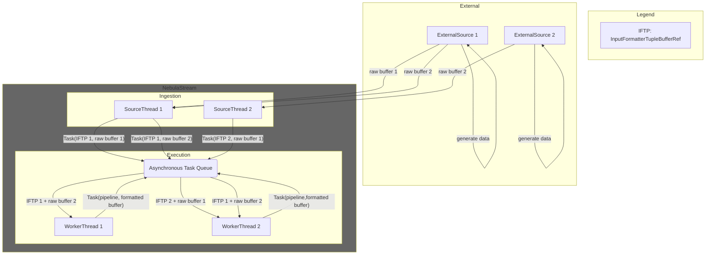
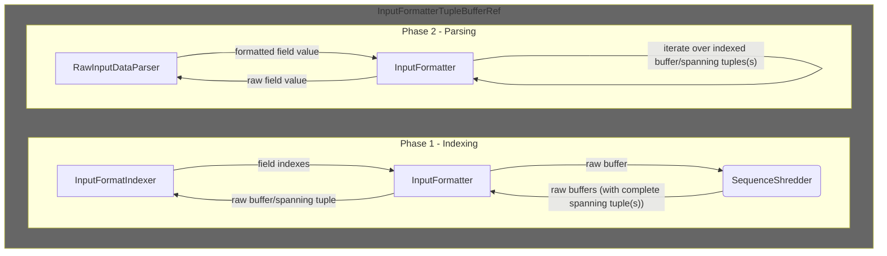
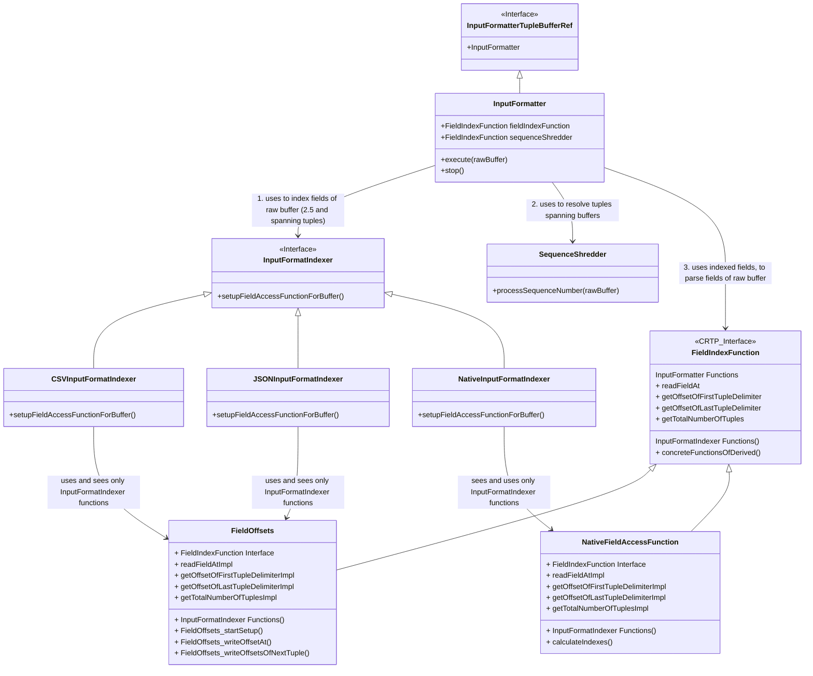

# Input Formatters

Input formatters take raw buffers from sources and convert the raw tuples of these buffers into a format that all
subsequent operators can work with. Usually this is our native format.

## List of Sections

- [Assumptions](#assumptions)
- [Design Goals](#design-goals)
- [Architecture](#architecture)
- [Nautilus Compilation](#nautilus-compilation)
- [Open Challenges](#open-challenges)
- [Important Classes](#important-classes)

## Assumptions

- **A1**: The vast majority of data that NebulaStream processes is raw (often text) data from external sources. This is
  in-line with [industry observations](https://www.vldb.org/pvldb/vol17/p3694-saxena.pdf) and even more so true, since
  NebulaStream aims to process data close to sources.
- **A2**: The vast majority of data must pass through the input formatter before we can apply other operators to it (
  follows from **A1**).
- **A3**: Different formats share value-specific parsing functions. For example, different formats parse integer values
  in the same way. Additionally, different formats share the need for functionality, such as how to determine tuple
  delimiters in random chunks of raw data.
- **A4**: All buffers arriving at a specific input formatter have sequence numbers that determine the correct position
  of the specific buffer in the total order of buffers produced by their respective sources

## Design Goals

### Scale-In

In contrast to cloud-oriented systems, NebulaStream aims to scale with a large number of sources without adding
resources. A single machine must suffice to handle a large number of sources and queries.

To that end, we plan to implement a source runtime that uses *epoll/io_uring* to asynchronously ingest data from many
sources using minimal resources, similar to a webserver. If sources only do (fast) IO, a source runtime with a single
thread can efficiently handle a large number of sources. This opens up resources to query processing.\
(**Note:** We plan to provide dedicated source/formatter threads for sources that only support synchronous I/O, for
high-priority sources and if there are enough resources available. See the [open challenges](#open-challenges) section.)

#### Asynchronous Execution

Slow sources and queries with light-weight formatting should not hog resources that we can use for more demanding
processing tasks.

NebulaStream's query engine operates on an (internal) task queue. Each 'Task' is a pair of a buffer (data) and work (
pipeline) to apply to the buffer. Worker threads asynchronously pick tasks from the task queue, executing them in
non-deterministic order (see [architecture](#architecture)).\
Asynchronous sources that only do I/O don't format the data. Instead, they put the (raw) buffers in the (admission) task
queue. Ultimately, worker threads pick up and execute the format-tasks(InputFormatterTupleBufferRef) only if there is data
that requires formatting. Otherwise, worker threads are free to process other tasks.

### Simple Sources

We aim to make implementing sources as simple as possible, shifting complexity towards input formatters.

We expect that there are more sources than formats, i.e., a higher number of (different) ways to ingest data into
NebulaStream than formats in which the data arrives. Looking at
the [plugins of Influx Telegraf](https://github.com/influxdata/telegraf/tree/master/plugins), an open source system
similar to NebulaStream, there are roughly 20 parsers(formats) and 230+ inputs(sources).

### Efficient (Asynchronous) Input Formatting

Given **A2**, a slow input formatter bottlenecks the entire query. We aim to avoid input formatting bottle-necking query
processing.

The Synchronization overhead between threads that process InputFormatterPipelineTasks must be kept low.
Asynchronous input formatting of raw buffers, where tuples may start in one buffer and end in another (spanning tuples),
requires some kind of synchronization. The higher the synchronization overhead, the less time worker threads spent on
processing data. The [SequenceShredder](#sequence-shredder) addresses this problem.\
Furthermore, indexing fields and parsing field values can slow down the entire query (**A2**). We split up field
indexing and parsing into two phases (see [architecture](#architecture)). We aim to utilize existing
algorithms/libraries that utilize SIMD instructions to speed up indexing. Additionally, we aim to fuse parsing with the
rest of the first compiled pipeline of our query plan. As a result, we could hardcode filters, projections and functions
into the input formatter pipeline, only touching the raw indexed data if we need to.

### Extensible Input Formatting

We aim to break down input formatting into general challenges shared by subsets of input formatters and format-specific
challenges. Implementing support for a new format should only require overcoming format-specific challenges.

In general, we aim towards a config- and utility-based design. When implementing a new format, a developer should be
able to configure the format so that solutions for challenges that it shares with other formats, e.g., parsing floating
point data (**A3**), are handled automatically. As a result, the developer can focus only on the format-specific
challenges. Possible configuration options are: handling spanning tuples, parsing data types (including array and nested
data types), handling delimiters that span across buffers, handling uncertainty when dealing with escape sequences.
Furthermore, we aim to expose functions that formats share, such as substring-search, but that need to be part of the
format-specific implementation via a utility library.

## Architecture

Input formatters are represented by InputFormatterTupleBufferRefs. In general, a pipeline that represents executable code
and a buffer form a *Task*. Worker threads asynchronously execute Tasks from the task queue, including tasks with
InputFormatterTupleBufferRefs and raw buffers. (Note: We aim to replace the dedicated source threads in the figure below
with a more light-weight source runtime.)



### InputFormatterTupleBufferRef

The InputFormatterTupleBufferRef essentially consists of two phases. In the first phase, the InputFormatterTupleBufferRef
uses the **InputFormatIndexer** to determine the indexes of all fields in the raw buffer similar to the approach taken
by [simd-json](https://arxiv.org/abs/1902.08318). Additionally, the InputFormatterTupleBufferRef resolves tuples spanning
over buffers using the **SequenceShredder** and indexes these spanning tuples using the InputFormatIndexer.\
In the second phase, the InputFormatterTupleBufferRef iterates over the indexed fields of the raw buffer and converts the
raw values to values in our native representation. (We aim to implement this second phase heavily relying on Nautilus.
Using Nautilus, we generate code for the field traversal that skips fields that we don't need to touch. Additionally, we
aim to implement a registry of parsing functions that input formatters can leverage (**A3**).)



### Class Hierarchy

The InputFormatter implements the InputFormatterTupleBufferRef and executes the two phases outlined above. First, it
uses the InputFormatIndexer to determine the indexes of all fields in the raw buffer. The concrete InputFormatIndexer
initializes a concrete FieldIndexFunction, so that the FieldIndexFunction allows to access all fields of a raw buffer,
e.g., via offsets. Second, it uses the SequenceShredder to determine whether the indexed raw buffer completes any
spanning tuples (potentially one that starts in an earlier buffer and ends in the raw buffer and one that starts in the
raw buffer and ends in a later buffer). It uses the InputFormatIndexer to index the spanning tuples. Finally, it uses an
initialized FieldIndexFunction to iterate over the indexed raw buffer and spanning tuple(s), and parses all values into
the native representation of NebulaStream.



## Nautilus Compilation

Before addressing any of the [open challenges below](#open-challenges), we should transition the
InputFormatterTupleBufferRef to become a **CompiledExecutablePipelineStage**. The main goal is to profit from query
compilation in the second phase of the InputFormatterTupleBufferRef.

### Concept

The three main could be as follows:

- First, create a Nautilus Operator called **CompiledInputFormatter**, which then orchestrates the compiled input
  formatting via (proxy) function calls. We change the interface of the InputFormatterTupleBufferRef, which does not need
  to implement the interface of the 'ExecutablePipelineStage' anymore, to match the two phases
  described [above](#architecture).
- Second, we change the 'InputFormatter interface' of the **FieldIndexFunction** and its concrete implementations to
  Nautilus functions. That is, calling 'readFieldAt' on the FieldIndexFunction calls the concrete Nautilus readFieldAt
  function of the derived FieldIndexFunction. Since these functions are traced, accessing specific fields via the
  FieldIndexFunction ends up in the compiled code.
- Third, we create a registry of nautilus functions to parse raw data fields, the **RawValueParserRegistry**. This
  registry contains nautilus functions to parse integers, floats, booleans, etc. It might contain multiple functions to
  parse to the same internal data type, if different formats have different constrains. Otherwise, formats can utilize
  already existing parsing functions. Each format configures the parsing functions it needs for all data types it
  supports. We plan to support parsing functions for arrays/repeated fields and structs/nested fields in the future.

#### Tracing

During tracing, the CompiledInputFormatter first creates an InputFormatterTupleBufferRef object via a proxy function call.
Or an InputFormatterTupleBufferRef object already exists as part of the state of the pipeline.

The second step during tracing is essentially one proxy function call, that executes the first phase:\
The CompiledInputFormatter calls a proxy function of the InputFormatterTupleBufferRef, which takes the concrete '
InputFormatterTupleBufferRef' object as an argument. The InputFormatterTupleBufferRef delegates the function call to its '
InputFormatter' object. The InputFormatter creates a FieldIndexFunction and uses the SequenceShredder (if
needed) and the InputFormatIndexer to determine spanning tuples and to determine the indexes of all fields of the raw
buffer and the spanning tuples. The function then returns the FieldIndexFunction.

After the first proxy function call returns, the CompiledInputFormatter executes the second phase by calling a Nautilus
function of the InputFormatterTupleBufferRef and passing the FieldIndexFunction to it. This Nautilus function executes a
loop over all (raw) input tuples. It uses the nautilus functions of the FieldIndexFunction to access the fields of the
raw buffer and to parse the specific fields using the RawValueParserRegistry. The loop also executes the compiled code
of the other operators that were fused into the same pipeline. This, in combination with the LLVM optimizer, should fuse
filters and projections into the iteration over the indexes, meaning we only parse raw fields that we need to parse.
Whenever this phase fills up a formatted tuple buffer, it emits it to the next pipeline.

## Open Challenges

The following is a list of challenges that might each (or in groups) warrant design documents that explore alternative
ways to solve them.

### Synchronized Formatting

A synchronized formatting mode enables a lower entry barrier to implement complex formats. Many of the below challenges
become significantly easier if buffers arrive in order. Also, given a source with a dedicated thread, a tight (
synchronized) coupling between source and formatter can be faster.
Motivation: To fully support the popular format JSON an input formatter needs to support nested data, repeated fields (
arrays), optional/null fields (fields may not appear, or values may be null), escape sequences, UTF8

- A1: Dedicated source thread. Worker threads can notify the source thread. When notified, the source thread puts the
  next raw buffer in the task queue, and reads another buffer (or more) (
  see [PoC](https://github.com/nebulastream/nebulastream/issues/709))
    - Adv: no synch/wait on the workerThread Side; enables pipelined execution (execute phase 1 of InputFormatter, then
      notify source, then asynchronously execute phase 2); source may load multiple buffers in advance
    - DAdv: source needs to wait; extra notify mechanism between sources and queryEngine (creates coupling); requires a
      dedicated source thread that is not available anymore to the task queue (slow sources may hog resources)
- A2: Attach InputFormatterTupleBufferRef to source thread
    - Adv: no syncing, source thread does I/O and formatting; allows for tight coupling and tricks such as skipping page
      reads
    - DAdv: tightly couples sources and input formatters; adds complexity to otherwise simple sources; sources may hog
      threads (assuming we have a source runtime that can do better than one thread per source)
- A3: Synch SequenceShredder mode that does not return buffers that form spanning tuples, but buffers that connect to
  the highest sequence number for which we have seen all buffers already (starting with the buffer with sequence number
  1)
    - Adv: no additional syncing, uses existing mechanisms; interfaces stay the same
    - DAdv: worker threads probably mostly do syncing on the SequenceShredder; requires changes to the already complex
      sequence shredder
- A4: Like A1, but sources can adaptively demand a thread and release that thread
    - Adv: (see A1); slow/bursty sources don't hog threads when not producing data
    - DAdv: requires (probably) complex logic to attach worker threads to specific sources

### Escape Sequences

Escape sequences allow for control symbols, e.g., a new line delimiter, to appear outside their function as control
symbols. Given a random chunk of raw data from a stream, the goal is to determine whether the chunk starts in an escaped
sequence or not. If it does, the first escape symbol ends the escaped sequence, if not, it starts it.
Possible alternatives to handle this problem include:

- A1: synchronous execution (enables of the shelf formatters), but requires dedicated thread/overhead
- A2: asynchronous, but skip a buffers for which not all prior buffers were seen (saw buffers: {1,2,3}, got buffer: 5,
  skip, got buffer: 4, process)
- A3: asynchronous with speculate execution, similar
  to [this paper](https://dl.acm.org/doi/pdf/10.1145/3299869.3319898?casa_token=Xm0oFyemMtUAAAAA:-787P2eu4fHOvYibXXUNP6Q_7CQZThvU8dQbzUVtzK_PodexzskoYk4k4dmhkqRoc35VJlCBBa9eCw).
  For some(most?) formats it may be possible to determine sequences of symbols that allow to safely determine the escape
  sequence state. If a formatter is unsure, it determines two/multiple versions for the indexes and returns as 'unsure'.
  Later threads that process surrounding buffers will be able to safely determine the correct indexes.

### Optional/NULL Fields

Some Formats may indicate a null field with a reserved keyword such as 'null'. However, in a JSON object, the key-value
pair representing a field might simply be missing. How to then represent a null field with indexes? Given nested data
and potential null values on multiple levels, the problem becomes trickier. A simple way to deal with nested data is to
explicitly mark all child fields as null.

- A1: Either there is a null keyword, or duplicate consecutive indexes (distance 0) represent a null field
- A2: create a bitmap that marks fields that are null, skip the indexes of null fields, propagate the null bitmap to
  subsequent operators

### Repeated Fields/Arrays

If the size of the repeated field is known, the formatter can determine all indexes and the InputFormatter can
utilize the size to read the correct number of indexes (and potentially perform validation). Repeated fields that may
appear zero times share the optional/null problem.

If the size is not fixed, determining the indexes becomes more complex, which probably needs to be handled by the
concrete InputFormatIndexers. Furthermore, parsing the raw values becomes more complex, since it is not clear who
determines how many fields to parse.

- A1: the InputFormatIndexers determines the size of the repeated fields and conveys them
    - A1.1 as a special field offset
    - A1.2 via an extra vector/data structure
- A2: repeated/array/varsized as a datatype with special parsing function(s) for the datatype. The InputFormatIndexer
  determines the indexes, and the parsing function the determines the size (and therefore handles additional complexity)

### Nested Data

We currently don't support 'struct' data types in NebulaStream. Supporting nested data goes beyond just the formatter,
but is an essential challenge that we need to solve for our data
types ([data-types-design-doc](https://github.com/nebulastream/nebulastream/pull/737)).

Without optional and repeated fields, we can flatten the nested data and handle it like flat data.
The [Optional](#optionalnull-fields) sub-section covers thoughts on handling optional fields in nested data.

Given optional and repeated fields, the following problem comes up:

```text
repeated Person
  repeated Names
```

Just given two names, e.g., "Alberta" and "Betty", it is not clear whether the two names belong to the same person or
two different persons. When parsing such a document, we need to correctly construct our internal representation. The
indexes that the InputFormatIndexer constructs are not enough. We need additional information

- A1: for all indexes, add information on which level they were defined/repeated (similar
  to [Dremel/Parquet](https://dl.acm.org/doi/pdf/10.14778/1920841.1920886?casa_token=HXpkmowS1bwAAAAA:7imGEIHqv3138hR8uKEwrmXfFewQe7f0iJtry95I4-0Ypa5ob10aK3S9PqePqPl1n27IBiZtbPIQiw))
- A2:
    - for every value that can be null (optional/repeated that allows 0 repetitions), store whether it is null or not (
      duplicate consecutive indexes or bitmap).
    - special parse function for struct types (shared by formatters that allow nested data) that traverses 'struct tree'
      and if a value is marked as null, skips that value (and all possible children)

### Delimiters Larger Than a Byte

Delimiters that are larger than a byte may be split between two buffers. If by chance, all tuple delimiters are exactly
on the buffer boundaries and therefor split, it would become impossible to delimit tuples, without stitching pairs of
consecutive buffers together. If a thread processes a buffer that starts with last few bytes of the delimiter, but the
prior buffer was not seen yet, the thread somehow needs to be able to communicate that the N bytes of its buffer might
complete a delimiter (analog: buffer ends with first M bytes of the delimiter).

- A1: synchronized execution (similar to escape sequences)
- A2: block thread until prior/subsequent buffer becomes available when uncertain (against design principle of task
  queue)
- A3: extend SequenceShredder to allow more than binary 'tupleDelimiter:yes|no' logic to ternary 'tupleDelimiter:
  yes|no|maybe' logic. A thread may mark a buffer as 'maybe has a delimiter', and whether its a leading or trailing
  delimiter
    - SequenceShredder determines consecutive pairs buffers with uncertainty (concerning delimiters) and uses a function
      provided by the InputFormatIndexer that takes the potential delimiter bytes and determines whether it is a valid
      delimiter and if so, determines potential spanning tuples
    - (try to solve together with A3 of [escape sequences](#escape-sequences))
- A4: in the SequenceShredder, for all buffers that form pairs of buffers without delimiters, check if there is a
  spanning delimiter

### Codecs

Codecs, such as LZ4 and ZStd (usually) require decoding the data first, before formatting/interpreting the data is
possible. Given that the InputFormatterTupleBufferRef is the first pipeline following the source, either the source
decodes the data (goes against light-weight/simple sources principle) or the InputFormatterTupleBufferRef does, requiring
an additional step.
Potentially, only subsets of the schema, e.g., a single column is encoded. In that case, a tuple delimiter might exist
that is not encoded. It would then be possible to asynchronously format the buffers and to treat the encoded fields as
data types that require special parsing functions, which first decode, then index the data (if necessary) and then
transform it to the native representation (if necessary)

- A1: sources decode encoded data, always use synchronous mode
- A2: determine whether decoding a codec requires scanning all buffers in the correct order (sequential), if so,
  synchronous mode, otherwise asynchronous mode

### Optimizing Queries

#### Source Sharing

If multiple queries require data from the same source, we should only do I/O once, and then share the data with the
subsequent operators. However, since we want to merge input formatting with all operators until the first pipeline
braker, there is an interesting tradeoff (that requires experimental evaluation):

- if there is only one query that uses the source or if all queries that share the same source are equal, merge the
  input formatter into the first pipeline
- if none of the queries share any operator beyond the source and the input formatter
    - either, couple the source and the input formatter and then demultiplex to the different query pipelines
    - or, create a dedicated formatter pipeline (does not require coupling source and input formatter)
- if some queries share all operators until the first pipeline braker and some don't, combine the above two approaches
- if some/all queries share some of the operators until the first pipeline braker, insert an artificial pipeline braker
  that leads to a pipeline with the input formatter and all shared operators.

Given a union over different sources in a query, the sources share the schema, format and follow-up operators. In that
case, the sources should share the same InputFormatterTupleBufferRef. However, currently the sources would both produce
buffers with sequence numbers starting at 1, leading to a conflict:

- A1: synchronize sources that share the same input formatter
- A2: create map of origin id to SequenceShredder, so that each source gets a dedicated sequence shredder that correctly
  resolves spanning tuples for buffers originating in the corresponding source.

An additional challenge might be to support sources that ingest buffers with different formats. For example, a user
might only be able to expose a single endpoint but needs to transmit data from two different physical sources, with
different formats via that single endpoint.

#### Memory Layouts

Given that we assume mostly external, text-based raw formats (**A1**), we can more or less freely choose an (internal)
data layout that the input formatter produces (the input schema of the InputFormatterTupleBufferRef would then be the
schema that the input formatter produces). Whether we read flat CSV data into a row-based or columnar layout should
depend on the rest of the query plan. This freedom can lead to formats where specific fields are in columnar layout for
later aggregations, but the rest is written row-wise. Or even hybrid formats where parts of the input data is formatted
and other parts are still raw.

#### Projections and Filters

If we fuse the InputFormatterTupleBufferRef into the first pipeline, we can merge certain operations into the second phase
of the InputFormatterTupleBufferRef (the one that iterates over indexes and parses fields). In that case, we could profit
from filter and projection push-down into that pipeline, to avoid parsing raw data that we don't need in later
operators.

#### Other

- Validation
    - currently, we don't have a holistic concept for how to validate that the raw data does not violate the expected
      schema and the rules of the format
    - since formatters deal with user data, we need to expect errors and handle them gracefully
    - there should be a clear guideline of how to report errors for the specific InputFormatIndexers
- [fix bug] Multi-Part Sequence Numbers: when the input formatter merges multiple raw buffers into a single buffer,
  e.g., buffers with sequence numbers 1-5, it currently assigns only a single sequence number to the output buffer, e.g,
  5. The input formatter then never assigns the sequence numbers 1-4, creating 'holes'
    - A1: synchronize sequence number assignment (probably requires significant overhead)
    - A2: (ordered) vector of sequence numbers
    - A3: sequence number span, consisting of two sequence numbers, e.g, [1,5], when checking whether we have seen all
      sequence numbers, we could count the size of the span (e.g., size([1,5]) = 5) and mark the span as complete,
      meaning we have seen all sequence numbers from 1 to 5
        - we should also think about getting rid of chunk numbers and introduce nested sequence numbers instead (each
          operator that can (currently) produce chunk numbers adds a level of nesting, which we can use to determine the
          exact nesting level for every operator at query compile time)
        - we might also think about combining the sequence number with the origin id (the first nesting level of the
          sequence number is the origin id)
- formats that don't depend on delimiters
    - A1: synchronized formatting
- UTF8 support
    - A1: limit UTF8 support to input formatters
    - A2: enable general UTF8 support in operations on strings

## Important Classes

### FieldIndexFunction

The FieldIndexFunction ties the indexing eand the parsing phases together (see [architecture](#architecture)). It has
two 'interfaces', one for each phase.

The first interface is for indexing raw buffers. The concrete InputFormatIndexers, e.g., the CSVInputFormatIndexer,
implement this phase. Each InputFormatIndexer chooses a concrete FieldIndexFunction. For a text based format like JSON,
it is necessary to determine the start and the end of each field. For a format with fixed-size values, e.g., the Native
format, it is sufficient to determine the offset of the first field of the first tuple, the rest can be calculated.

The second interface is for accessing specific fields in a raw data buffer. Only InputFormatter has access to that
interface. It uses it when iterating over indexed raw buffers and passes the fields to the RawValueParser, to convert
the raw values into our internal representation.

### Sequence Shredder

The SequenceShredder is a thread-safe data structure that assigns responsibilities to threads that
concurrently process input formatter tasks (buffers with raw data) originating from the same source.

#### The Problem

Sources produce unformatted buffers containing raw bytes. Commonly, tuples span over at least two, but possibly many
buffers. Example (A tuple is just one string, each buffer contains 4 bytes, TN means thread with id N, and Xms means the
offset in milliseconds that a thread checks for spanning tuples in comparison to the thread that performs the check
first)

```
       1     2     3     4     5     6     7     (<-- sequence numbers (SNs))
     ["Thi][s is][ a s][pann][ing ][tupl][e!"\n] (<-- '\n' is a tuple delimiter (ASCII))
       |     |     |     |     |     |     |
      T3(0ms)|    T2(7ms)|    T3(5ms)|    T1(14ms)
            T1(10ms)      T4(9ms)  T3(16ms)
```

A single tuple may span over multiple buffers. Threads may process each of the buffers that forms the tuple in arbitrary
order.
If a thread processes the first sequence number (T3(0ms)) or sees a tuple delimiter, it knows that
it starts a tuple, but it does not necessarily know where it ends.
If a thread sees a tuple delimiter (T1(14ms)), it knows that it terminates a tuple, but it does not necessarily know
where it starts.
If a thread sees no tuple delimiter in its buffer, it does neither know where the tuple that the buffer belongs to
starts, nor where it ends.
Thus, we need to synchronize between threads. At least one thread must see the start and the end of the spanning tuple.
Exactly one thread must format the tuple and pass it to the next operator to avoid duplication.

#### The Solution
Look at the current `SequenceShredder.hpp` implementation for the solution.
