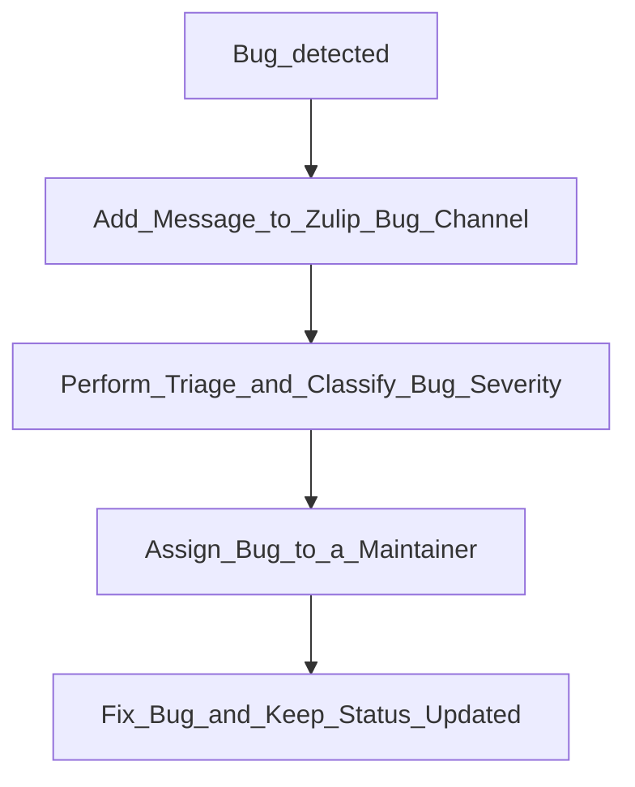

# Process of Taking Care of A Bug
This document describes the process of taking care of a bug in the project.
First, we will describe our general goals.
Afterward, we will discuss the different bug severities, followed by describing the process in detail.

## General Goals
We have the following three goals for the process of taking care of a bug:
 - **Fairness (G1)**: The load of bugs should be distributed fairly across all maintainers.
 - **Responsiveness (G2)**: The first response to a bug should be quick, to ensure that the maintainers are aware of the bug and its severity.
 - **Transparency (G3)**: The process of taking care of a bug should be transparent to the community. It should be clear who is responsible for the bug and what the current status is.

## Bug Severities

| Severity      | System Crash | Incorrect Results | Occurrence of Incorrect Results |
|---------------|--------------|-------------------|---------------------------------|
| Critical **(S1)** |  Yes         | Yes               | Always                          |
| Major **(S2)**    | No           | Yes               | Always                          |
| Minor **(S3)**    | No           | Yes               | Under specific circumstances    |

## Process
First, we display the process as a flowchart.
Then, we add a description of each step in more detail.

At any time, two maintainers are responsible for fixing bugs. As a result, it is always clear who is responsible for handling bugs (G3) and the first response for any bug should be fast (G2).
As we have a small team, we can rotate the maintainers responsible for handling bugs every two weeks to ensure that the load is distributed fairly (G1).

1. **Bug detected (Anyone)**: A bug is detected by a user, maintainer or by the CI and a new issue/pr is opened.
2. **Add Message to Zulip Bug Channel (Maintainer)**: The person(s) who found the bug adds a message to the Zulip bug channel with the bug number and the opened issue/pr. For each bug, there should be its own topic in the Zulip bug channel. Additionally, the responsibility for the bug is now transferred to the maintainers.
3. **Perform Triage and Classify Bug Severity (Maintainer)**: The maintainer on call perform a triage of the bug and classifies its severity. This should be done in the first 24h of the bug being detected.
4. **Assign Bug to a Maintainer (Maintainer)**: The maintainer on call assign the bug to a maintainer with the appropriate severity and expertise. Additionally, they make sure that the maintainer has time to work on the bug.
5. **Fix Bug and Keep Status Updated (Maintainer)**: The maintainer fixes the bug and keeps the status updated in the Zulip bug channel.
