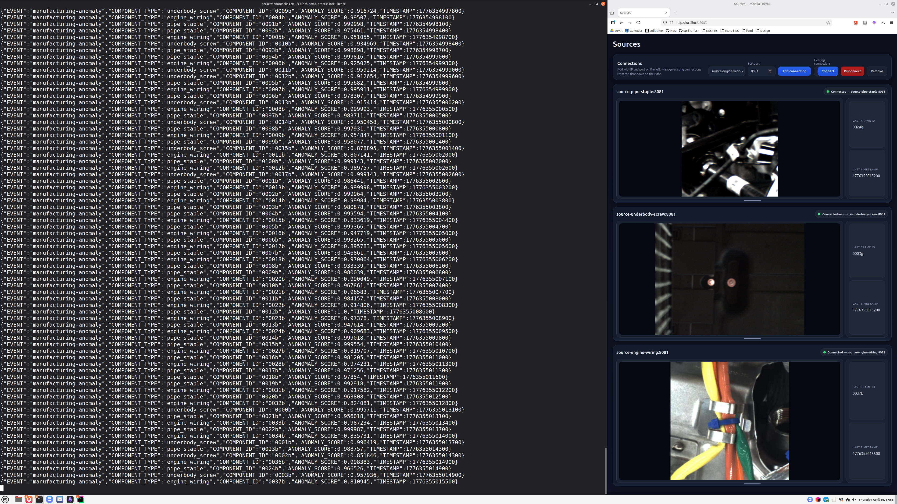

# Smart Manufacturing / Process Intelligence

This repository contains a demo setup for [NebulaStream](https://nebula.stream/) showing a use-case for Smart Manufacturing. 

Three video sources are modeled that show engine wiring, pipe clipping, and underbody screws from the [AutoVI dataset](https://auto-vi.utc.fr/index.html).

NebulaStream reads these video sources, 
uses an ML inference operator to detect anomalies in the images (i.e. manufacturing errors) 
and sends the detected anomalies to a Kafka Sink. 

For better insight into the demo, we further provide a simple WebApp that can show the three video streams. 

Everything is set up and connected using docker compose and works out of the box if you have docker installed.

## How to Run
Requirement: Have docker installed

1. Clone this repository
2. Open terminal in the repository root folder.
3. **Run once** to set up your local system: `bash ./demo/scripts/build.sh` (slow)
4. **Run to start demo** `bash ./demo/script/start.sh` (quick)
5. Navigate to http://localhost:8085 and select desired conntections.
6. **Stop everything**: Cancel the running terminal with `CTRL+C`

## Configuration

### Change speed of video stream
To change the speed at which the images are being send, go to `./demo/config/datagen-*.yaml` and adapt the value `period`. 
`period` defined how often an image is being sent in millisecond.
Restart the system after you changed the period. 

### Change Kafka Sink
To change the kafka sink, go to `./demo/queries/query-engine-wiring.yaml` and adapt the values `brokers` and `topic`.
You must restart the query to have the change reflected.

## References
* AutoVI dataset: Carvalho et al., The Automotive Visual Inspection Dataset (AutoVI): A Genuine Industrial Production Dataset for Unsupervised Anomaly Detection, 2024 (https://doi.org/10.1016/j.compind.2024.104151) 