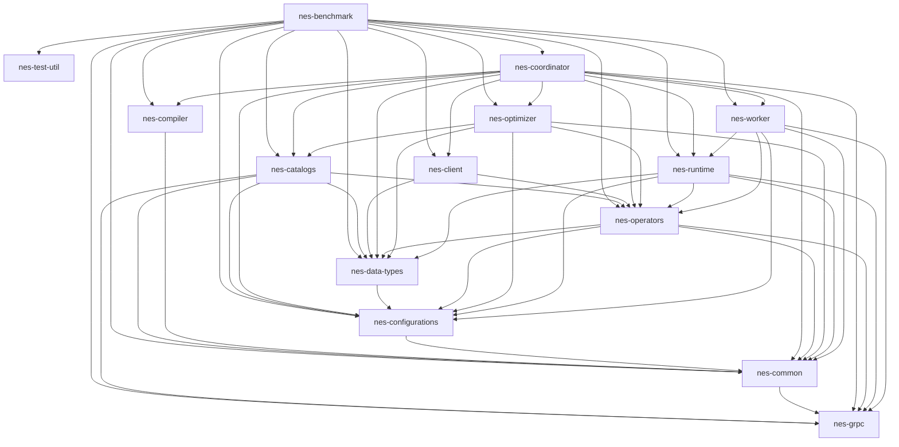

# NebulaStream 

NebulaStream is our attempt to develop a general purpose, end-to-end data management system for the IoT.
It provides an out-of-the box experience with rich data processing functionalities and a high ease-of-use.

NebulaStream is a joint research project between the DIMA group at TU Berlin and the DFKI IAM group.

Learn more about Nebula Stream at https://www.nebula.stream

Visit our documentation at https://docs.nebula.stream

## Documentation
- API:
    - [Query API](https://docs.nebula.stream/docs/query-api/generalconcept/) 
    - [REST API](https://docs.nebula.stream/docs/clients/rest-api/)     
    - [JAVA Client](https://docs.nebula.stream/docs/clients/java-client/)
- Development:
    - [Contribution-guidelines](https://docs.nebula.stream/docs/dev/contribution-guidelines/)
  
## Components:

The codebase is structured in the following components:

| Component                                | Description                                                                                                                                               |
|------------------------------------------|-----------------------------------------------------------------------------------------------------------------------------------------------------------|
| [nes-benchmark](nes-benchmark)           | This component contains benchmarks for different components.                                                                                              |
| [nes-catalogs](nes-catalogs)             | This component contains query, source, UDF, and topology catalogs and corresponding services.                                                             |
| [nes-client](nes-client)                 | This component contains the C++ client to interact with NebulaStream from C++ applications.                                                               |
| [nes-common](nes-common)                 | This component contains some base functionality that is used across all other components, e.g., for logging and exceptions.                               |
| [nes-compiler](nes-compiler)             | This component contains functionalities to compile source code or intermediate representations to executable binaries.                                    |
| [nes-configurations](nes-configurations) | This component contains all coordinator and worker specific configurations that the user can supply over command line or using a yaml file.               |
| [nes-data-types](nes-data-types)         | This component contains the basic data types of the system.                                                                                               |
| [nes-operators](nes-operators)           | This component contains definition of all logical operators supported by NebulaStream.                                                                    |
| [nes-optimizer](nes-optimizer)           | This component contains query optimizer for NebulaStream that contains rewrite rules, placement optimizations, sharing identification optimizations, etc. |
| [nes-plugins](nes-plugins)               | This component contains all external plugins that system supports, e.g., tensorflow, omnx, arrow, etc.                                                    |
| [nes-runtime](nes-runtime)               | This component contains all runtime components for the network stack and the memory managment                                                             |
| [nes-coordinator](nes-coordinator)       | This component contains the coordinator and the executable.                                                                                               |
| [nes-worker](nes-coordinator)            | This component contains the worker and the executable.                                                                                                    |

### Dependencies:

