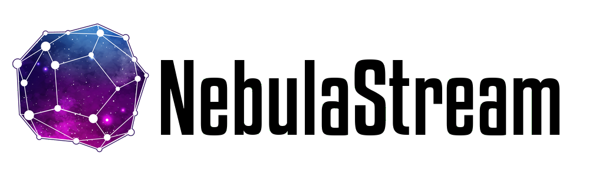

  <picture>
    <source media="(prefers-color-scheme: light)" srcset="docs/resources/NebulaBanner.png">
    <source media="(prefers-color-scheme: dark)" srcset="docs/resources/NebulaBannerDarkMode.png">
    
  </picture>
   
  <!-- Badges -->
  
  

----

NebulaStream is our attempt to develop a general-purpose, end-to-end data management system for the IoT.
It provides an out-of-the-box experience with rich data processing functionalities and a high ease-of-use.

NebulaStream is a joint research project between the DIMA group at TU Berlin and BIFOLD.

Learn more about Nebula Stream at https://www.nebula.stream or take a look at our [documentation](docs).

# Clang-Format, Clang-Tidy, License & Pragma Once Check, and Ensure Correct Comments
We use `clang-format` and `clang-tidy` to ensure code quality and consistency.
To run the checks, you can use the target `format`. 

## Development
NebulaStream targets C++23 using all features implemented in both `libc++` 18 and `libstdc++` 13.2. All tests are using
`Clang` 18.
Follow the [development guide](docs/technical/development.md) to learn how to set up the development environment.
To see our code of conduct, please refer to [CODE_OF_CONDUCT](CODE_OF_CONDUCT.md).
