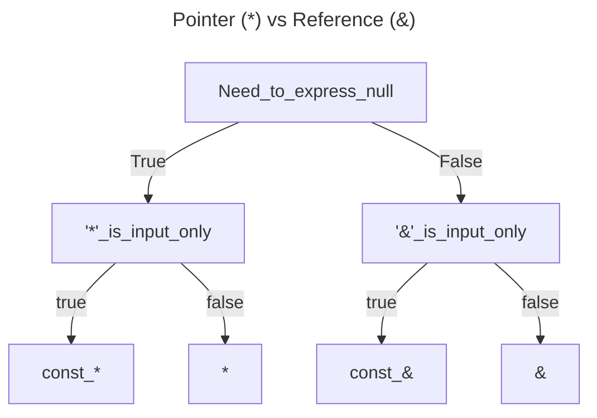

# General Coding Style and Clang Format
We use the [Clickhouse style](https:///clickhouse.com/docs/en/development/style) for the coding style, and we enforce the style by clang-format. 
Regarding comments, we use `////` for inline comments and `/* */` for multiline comments.
`///` are there for temporarily commenting out code.
The `.clang-format` file is located in the root directory of the project.
The style can be imported into Clion by following the steps below:
1. Go to the settings window: `File --> Settings`
2. Jump to C/C++ code style: `Editor --> Code Style --> C/C++`
3. Import the code style from `.clang-format`
4. Click `Apply` and `OK`


# Naming Conventions and Position of Operators
- Classes and structs start with uppercase and use camelcase: `MyClass`
- Functions and variables start with lowercase and use camelcase: `myMethod`
- Constants are all upper case: `const double PI=3.14159265358979323;`
- for magic numbers, we use constexpr: `constexpr auto MAGIC_NUMBER = 42;`

[///]: # (What do we do with the position of operators? Please leave feedback what you think is better)
- `*` and `&` next to the type not the name, e.g., `void* p` instead of `void *p` or `void& p` instead of `void &p`.
  - another idea would be to put the `*` and `&`, e.g., `void * p` or `void & p` (Clickhouse style)


# Includes and Forward Declaration
We use `include <>` for all includes and avoid [forward declaration wherever possible](https:///github.com/nebulastream/nebulastream-public/discussions/19).
Additionally, we use [include-what-you-use](https:///github.com/include-what-you-use/include-what-you-use) to reduce the includes to the bare necessaries.
We never use `using namespace` in the global scope of header files, as they get pulled into the namespace of all files that include the header file.
```cpp

/// Correct
include <DataStructure/SomeDataStructue.hpp>
    
/// Wrong 
include "../DataStructure/SomeDataStructure.hpp"
```


# Smart Pointers and Passing Objects
We avoid raw pointers and use [smart pointers](https:///en.cppreference.com/book/intro/smart_pointers) instead.
This includes no calls to `new` or `malloc` and use `make_shared` or `make_unique` instead.
If it is not possible, e.g., a library working with raw pointers, we make sure that a raw pointer is non-owning.
This means that a developer is never responsible for deleting the object, i.e., calling `delete` or `free`.
We use `unique_ptr` as a default and `shared_ptr` only if necessary.
As a shared pointer is more expensive than one might think, due to the reference count being atomic and thread-safe.

We differentiate between passing a smart pointer or only a reference to the object itself.
We prefer passing the object itself as a const reference `const auto&`, as it is more clear and the smart pointer is not passed around [GotW #91](https:///herbsutter.com/2013/06/05/gotw-91-solution-smart-pointer-parameters/).
We prefer `operator*` and `operator->` over `.get()` as it is more clear that the smart pointer is still managing the object.
```cpp
void correctParam(const SomeClass& someClass) {
    auto ret = someClass.someMethod();
    setSomeValue(ret);
}

/// We do not need the smart pointer here, simply access to the method
void wrongParam(const std::shared_ptr<SomeClass>& someClass) {
    auto ret = someClass->someMethod()
    setSomeValue(ret);
}

int main() {
    auto someClass = std::make_shared<SomeClass>();
    correctParam(*someClass);
    
    /// Works, but is against our coding guidelines
    correctParam(someClass.get());
    
    
    /// Bad example:
    const auto rawSomeClassObj = someClass.get();
    rawSomeClassObj->someMethod();
    /// reason:
    /// we can call ->someMethod() on a shared pointer, so the `.get()` call is not necessary
}
```
For a quick overview, we use the following graph to decide what operator to use:


# OOP and Inheritance
We differentiate between structs and classes, using structs for [plain-old-data structures](https://stackoverflow.com/q/4178175) and classes for classes with features such as `private` or `protected` members.
```cpp
struct SomeStruct {
    const double x1;
    const double x2;
    const uint64_t x3;
};


class SomeFancyClass {
    static constexpr auto DEFAULT_VALUE = 42;
  
  public:
    SomeFancyClass(SomeStruct someStruct) : somePrivateMember(FORTY_TWO), someStruct(someStruct) {}
    void somePublicMethod();
    int getSomePrivateMember() const { return somePrivateMember; }
    
  private:
    void somePrivateMethod();
  
  private:
    int somePrivateMember;
    SomeStruct someStructMember;
};
```
We use virtual destructors in base classes and the `final` keyword in virtual functions and class declarations whenever it should not be implemented in a derived class.


# Variable Declaration and Return Types
We use `const` wherever possible and remove it only if necessary (Rust approach).
We carefully consider return types, e.g., we do not pass [fundamental types](https:///en.cppreference.com/w/cpp/language/types) by const ref.
We return temporaries and local values by value, getters by reference or const reference, or by value for thread safety.
We declare enums as `enum class` to avoid polluting the namespace and give a type to the enum, e.g., `enum class Color : int8_t { RED, GREEN, BLUE };`.
```cpp
class SomeClass {
  public:
    /// Correct 
    const int getSomeValue() const { return someValue; }
    
    /// Wrong
    const int& getSomeValue() const { return someValue; }
    
    /// Correct
    void setSomeValue(const int value) { someValue = value; }
    
    /// Wrong
    void setSomeValue(int value) { someValue = value; }
    
    /// Correct 
    std::shared_ptr<SomeOtherClass> getSomeOtherClass() const { return someOtherClass; }
    
    /// Wrong 
    SomeOtherClass* getSomeOtherClass() const { return someOtherClass.get(); }
  private:
    int someValue;
    std::shared_ptr<SomeOtherClass> someOtherClass;
};
```

# Casting and Function Declaration,
We avoid C-style casts and use `static_cast`, `dynamic_cast`, `const_cast`, and `reinterpret_cast` instead.
Additionally, we use inline whenever possible to avoid the overhead of a function call.


# Operator Overloading
Wherever possible, we overload operators to make the code more readable and intuitive.
Instead of creating custom methods, e.g., `add()`, `subtract()` or `toString()`, we overload operators like `+`, `-`, or `<<`.
```cpp
class SomeClass {
  public:
    
    /// Correct
    SomeClass operator+(const SomeClass& other) const {
        return SomeClass(someValue + other.someValue);
    }
    
    SomeClass operator-(const SomeClass& other) const {
        return SomeClass(someValue - other.someValue);
    }
    
    friend std::ostream& operator<<(std::ostream& os, const SomeClass& someClass) {
        os << someClass.someValue;
        return os;
    }
    
    /// Wrong
    SomeClass add(const SomeClass& other) const {
        return SomeClass(someValue + other.someValue);
    }
    
    SomeClass subtract(const SomeClass& other) const {
        return SomeClass(someValue - other.someValue);
    }
    
    std::string toString() const {
        return std::to_string(someValue);
    }
    
  private:
    int someValue;
};
```
If we want to make an operator virtual, because it should be implemented in a derived class, we create a virtual function that is called by the operator, see [this discussion on StackOverflow](https://stackoverflow.com/questions/4571611/making-operator-virtual).
Oftentimes, the goal is to only allow access via the overloaded operator but not via the virtual function.
```cpp
class Base {
  public:
    Base operator+(const Base& other) const {
        return add(other);
    }
  
  protected:
    virtual Base add(const Base& other) const = 0;
};

class Derived {
    /// Now, we can implement the operator in the derived class
    protected:
        Derived add(const Derived& other) const override {
            return Derived(someValue + other.someValue);
        }
    };
};
```


# Exceptions and Error Handling
TODO once the [error handling design document](https://github.com/nebulastream/nebulastream-public/pull/109) is done, we will add the guidelines here.