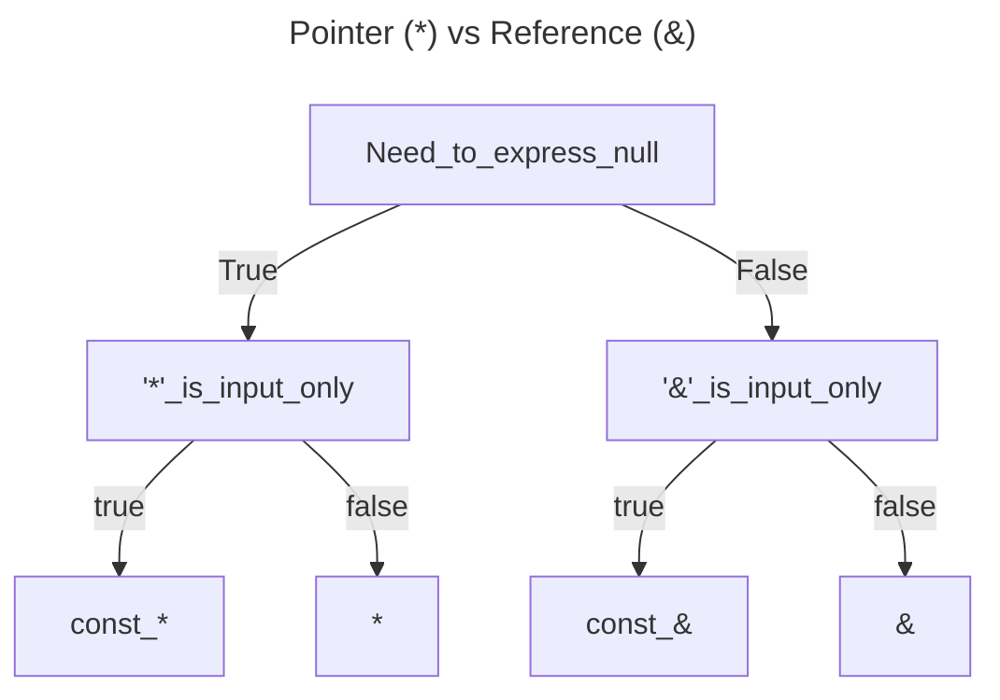
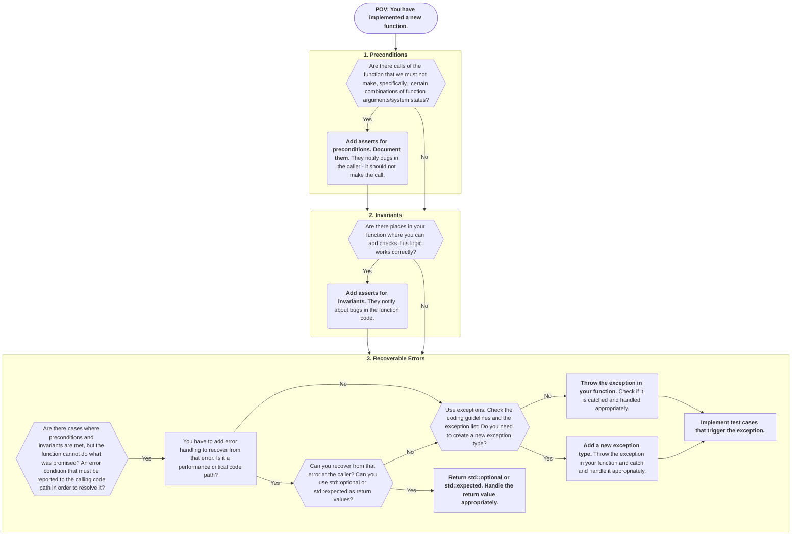

# General Coding Style and Clang Format
We use the [Clickhouse style](https:///clickhouse.com/docs/en/development/style) for the coding style, and we enforce the style by clang-format. 
The `.clang-format` file is located in the root directory of the project.
The style can be imported into Clion by following the steps below:
1. Go to the settings window: `File --> Settings`
2. Jump to C/C++ code style: `Editor --> Code Style --> C/C++`
3. Import the code style from `.clang-format`
4. Click `Apply` and `OK`

# Naming Conventions and Position of Operators
- Classes and structs start with uppercase and use camelcase: `MyClass`
- Functions and variables start with lowercase and use camelcase: `myMethod`
- Constants are all upper case: `const double PI=3.14159265358979323;`
- for magic numbers, we use constexpr: `constexpr auto MAGIC_NUMBER = 42;`
- `*` and `&` next to the type not the name, e.g., `void* p` instead of `void *p` or `void& p` instead of `void &p`.

# Includes and Forward Declaration
We use `include <>` for all includes and avoid [forward declaration wherever possible](https:///github.com/nebulastream/nebulastream-public/discussions/19).
Additionally, we use [include-what-you-use](https:///github.com/include-what-you-use/include-what-you-use) to reduce the includes to the bare necessaries.
We never use `using namespace` in the global scope of header files, as they get pulled into the namespace of all files that include the header file.
```cpp

/// Correct
include <DataStructure/SomeDataStructue.hpp>
    
/// Wrong 
include "../DataStructure/SomeDataStructure.hpp"
```


# Ownership and Pointer usage

**Ownership:**
- Prefer value semantics over pointers. This avoids heap allocations, pointer indirection ("pointer chasing"), and potential memory leaks.

- Use `unique_ptr` when you need dynamic allocation but want exclusive ownership. It’s our default choice when the performance cost of copying is a concern.

- Reserve `shared_ptr` for scenarios requiring shared ownership. Remember the atomic, thread-safe reference counting makes it more expensive than you might expect.

- Use `weak_ptr` for non-owning references to shared resources, or to break reference cycles involving `shared_ptr`.

- Favor type erasure (e.g., `std::function`, `std::any`, or a custom wrapper) for polymorphic objects instead of managing them through `shared_ptr`. C.f., [Sean Parent, Runtime Polymorphism](https://sean-parent.stlab.cc/presentations/2017-01-18-runtime-polymorphism/2017-01-18-runtime-polymorphism.pdf).

- Avoid raw pointers for ownership. Never call `new` or `malloc`; use `make_unique` or `make_shared` instead. If you must interact with APIs that use raw pointers, treat those pointers as non-owning observers only—ownership must be explicitly managed elsewhere.
  Remember, not only raw pointers can let you accidentally access invalid memory, but references as well.

**Parameter passing:**

- Pass objects by reference (e.g., `const T&`) or by value for small/trivially-copyable types.

- Accept smart pointers (`unique_ptr` or `shared_ptr`) only when you intend to express ownership transfer or sharing. Preferably pass them by value (and moving) so the intent to transfer or share ownership is explicit.

**Accessing smart pointers:**

- Use `operator*` and `operator->` to work with the managed object.

- Limit use of `.get()` to interoperate with APIs that require a raw pointer, avoiding unnecessary exposure of ownership details.

```cpp
void correctParam(const SomeClass& someClass) {
    auto ret = someClass.someMethod();
    setSomeValue(ret);
}

/// We do not need the smart pointer here, simply access to the method
void wrongParam(const std::shared_ptr<SomeClass>& someClass) {
    auto ret = someClass->someMethod()
    setSomeValue(ret);
}

int main() {
    auto someClass = std::make_shared<SomeClass>();
    correctParam(*someClass);
    
    /// Works, but is against our coding guidelines
    correctParam(someClass.get());
    
    
    /// Bad example:
    const auto rawSomeClassObj = someClass.get();
    rawSomeClassObj->someMethod();
    /// reason:
    /// we can call ->someMethod() on a shared pointer, so the `.get()` call is not necessary
}
```
For a quick overview, we use the following graph to decide what operator to use:


# OOP and Inheritance
We differentiate between structs and classes, using structs for [plain-old-data structures](https://stackoverflow.com/q/4178175) and classes for classes with features such as `private` or `protected` members.
```cpp
struct SomeStruct {
    const double x1;
    const double x2;
    const uint64_t x3;
};


class SomeFancyClass {
    static constexpr auto DEFAULT_VALUE = 42;
  
  public:
    SomeFancyClass(SomeStruct someStruct) : somePrivateMember(FORTY_TWO), someStruct(someStruct) {}
    void somePublicMethod();
    int getSomePrivateMember() const { return somePrivateMember; }
    
  private:
    void somePrivateMethod();
  
  private:
    int somePrivateMember;
    SomeStruct someStructMember;
};
```
We use virtual destructors in base classes and the `final` keyword in virtual functions and class declarations whenever it should not be implemented in a derived class.


# Variable Declaration and Return Types
We use `const` wherever possible and remove it only if necessary (Rust approach).
We carefully consider return types, e.g., we do not pass [fundamental types](https://en.cppreference.com/w/cpp/language/types) by const ref.
We return temporaries and local values by value, getters by reference or const reference, or by value for thread safety.
We declare enums as `enum class` to avoid polluting the namespace and give a type to the enum, e.g., `enum class Color : int8_t { RED, GREEN, BLUE };`.
```cpp
class SomeClass {
  public:
    /// Correct 
    const int getSomeValue() const { return someValue; }
    
    /// Wrong
    const int& getSomeValue() const { return someValue; }
    
    /// Correct
    void setSomeValue(const int value) { someValue = value; }
    
    /// Wrong
    void setSomeValue(int value) { someValue = value; }
    
    /// Correct 
    std::shared_ptr<SomeOtherClass> getSomeOtherClass() const { return someOtherClass; }
    
    /// Wrong 
    SomeOtherClass* getSomeOtherClass() const { return someOtherClass.get(); }
  private:
    int someValue;
    std::shared_ptr<SomeOtherClass> someOtherClass;
};
```

# Casting and Function Declaration,
We avoid C-style casts and use `static_cast`, `dynamic_cast`, `const_cast`, and `reinterpret_cast` instead.
Additionally, we use inline whenever possible to avoid the overhead of a function call.


# Operator Overloading
Wherever possible, we overload operators to make the code more readable and intuitive.
Instead of creating custom methods, e.g., `add()`, `subtract()` or `toString()`, we overload operators like `+`, `-`, or `<<`.
```cpp
class SomeClass {
  public:
    
    /// Correct
    SomeClass operator+(const SomeClass& other) const {
        return SomeClass(someValue + other.someValue);
    }
    
    SomeClass operator-(const SomeClass& other) const {
        return SomeClass(someValue - other.someValue);
    }
    
    friend std::ostream& operator<<(std::ostream& os, const SomeClass& someClass) {
        os << someClass.someValue;
        return os;
    }
    
    /// Wrong
    SomeClass add(const SomeClass& other) const {
        return SomeClass(someValue + other.someValue);
    }
    
    SomeClass subtract(const SomeClass& other) const {
        return SomeClass(someValue - other.someValue);
    }
    
    std::string toString() const {
        return std::to_string(someValue);
    }
    
  private:
    int someValue;
};
```
If we want to make an operator virtual, because it should be implemented in a derived class, we create a virtual function that is called by the operator, see [this discussion on StackOverflow](https://stackoverflow.com/questions/4571611/making-operator-virtual).
Oftentimes, the goal is to only allow access via the overloaded operator but not via the virtual function.
```cpp
class Base {
  public:
    Base operator+(const Base& other) const {
        return add(other);
    }
  
  protected:
    virtual Base add(const Base& other) const = 0;
};

class Derived {
    /// Now, we can implement the operator in the derived class
    protected:
        Derived add(const Derived& other) const override {
            return Derived(someValue + other.someValue);
        }
    };
};
```

# Error Handling

Following Herb Sutter, we differentiate between abstract machine corruption and programming bugs, recoverable errors:
1) **Corruptions** (e.g., stack overflow) cause a corrupted state that cannot be recovered programmatically. We use:
    - Signal handlers: handle the termination gracefully.
2) **Bugs** (e.g., out-of-bounds, null dereference) cannot be recovered either. We prevent them by using:
    - Preconditions asserts: check whether a function was correctly called.
    - Invariant asserts: check for bugs in function.
3) **Errors** occur when the function cannot do what was advertised, i.e., could not reach a successful return postcondition. We prevent them by using:
    - Exceptions: throw and catch to communicate an error to the calling code that can recover to a valid state. This is an elegant way if the error source and handling code are separated by multiple function calls (keyword: stack unwinding).
    - std::expected & std::optional: error handling in performance-critical code where errors are likely to occur frequently.

## Flow Chart
For each new function, the following flow chart should be followed:



## How to handle errors?
- NebulaStream follows the approach of using a system-wide exception model. We support multiple exception types, and they are defined in a central file system-wide.
- All currently supported exceptions are in `ExceptionDefinitions.hpp`. Reuse existing exceptions to handle your error.
- Generally, check if an exception is needed (*exceptional cases*). Throwing and catching exceptions is [very](https://www.open-std.org/jtc1/sc22/wg21/docs/papers/2022/p2544r0.html) [expensive](https://lemire.me/blog/2022/05/13/avoid-exception-throwing-in-performance-sensitive-code/).
    - Throw if the function cannot do what is advertised.
    - Throw if the function cannot handle the error properly on its own because it needs more context.
    - In performance-sensitive code paths, ask yourself: Can your error be resolved by returning a `std::optional` or a `std::expected` instead?
- Exceptions should be catched were they can be handled. 
- Use asserts to check preconditions and invariants of functions. We exclude asserts in our code if not compiled with `DEBUG` mode.
- Write test cases that trigger exceptions.
    ```C++
    try {
        sendMessage(someWrongNetworkConfiguration, msg);
    } catch (CannotConnectToCoordinator & e) {
        // We successfully caught the error, as expected.
        SUCCEED();
    }
    // We did not catch the error, even though we should have.
    FAIL();
    ```

## How to use exceptions?
- Throw exceptions by value.
    ```C++
    throw CannotConnectToCoordinator();
    ```
- Catch exceptions using the `const` reference.
- Rethrow with `throw;` without arguments.
- Add context to exception messages if possible. Sometimes, it makes sense to rethrow an exception and catch it where one can add more context to it. To modify the exception message later, append to the mutable string:
    ```C++
    catch (CannotConnectToCoordinator& e) {
        e.what += " for query id " + queryId;
        throw;
    }
    ```
- If a fatal error occurs, use the `main()` function return value to return the error code:
    ```C++
    int main () {
        /* ... */
        catch (...) {
            tryLogCurrentException();
            return getCurrentExceptionCode();
        }
    }
    ```

## How to define new exceptions?
- All our exceptions are in a central file, `ExceptionDefinitions.hpp`. Do not define them somewhere else.
- An exception type represents an 'error source' that needs to be handled in a specific way. Each exception type should represent a unique error requiring a specific handling approach. Thus, a new exception type should only be created if the error must be handled differently than all existing exceptions. This enables the reuse of handling approaches.
- The exception name and description should very concisely describe i) which condition led to the error ("UnknownSourceType") or ii) which operation failed ("CannotConnectToCoordinator"). The former is preferred to the latter.
- When writing error messages (which are `description` and optional context), we follow the [Postgres Error Message Style Guide](https://www.postgresql.org/docs/current/error-style-guide.html).

