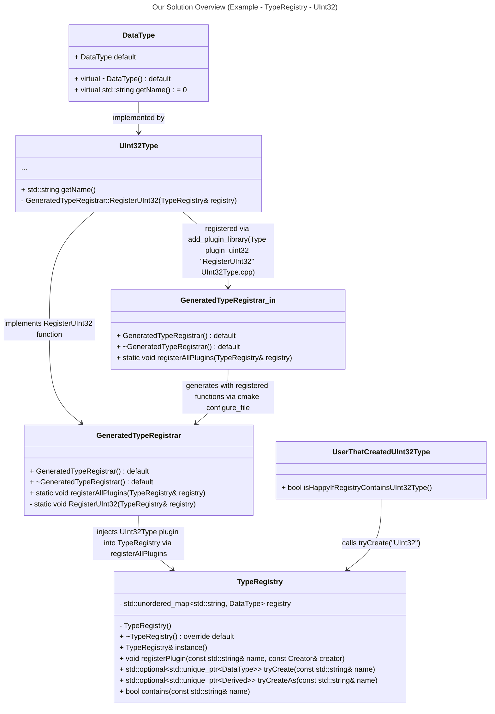

# The Problem
Adding a new feature to NebulaStream usually means adding code to the core of NebulaStream. Adding a single source, e.g., an [OBC](https://encyclopedia.pub/entry/43375) source or an arbitrarily exotic source or operator or data type that is needed by a single person means adding ~20 files to core code paths of NebulaStream, at very different places.
Enabling and disabling a plugin, since it might have dependencies that should are not shipped with the main repository, means adding `#ifdef`s to core code paths of NebulaStream.
This results in code like the following in `LowerLogicalToPhysicalSource.cpp`, where we must differentiate between all source types and we must hide sources that have dependencies behind `#ifdef`s.


## Current Implementation
With Nautilus, @philippgrulich introduced the [registry pattern](https://www.geeksforgeeks.org/registry-pattern/) to NebulaStream. In particular, he introduced a plugin registry with auto-register support. Nautilus backends (plugins), such as the MLIR backend or the Flounder backend can register themselves in a single registry (singleton) by adding a static like of code at the right place `[[maybe_unused]] static CompilationBackendRegistry::Add<MLIRCompilationBackend> mlirCompilerBackend("MLIR");`.
With the addition of the registry, we decided that we should modularize our code and introduce clear separation of concerns. Cuda (backend), Tensorflow and ONNX (model inference), and Arrow (source) were added to NebulaStream using the registry. As a result, they exist in `nes-plugins` and do not pollute the core code paths. Additionally, there was an effort to support sources with the plugin registry that was never fully realized.

## Problems with the Current Implementation
We cannot rely on the current implementation of the plugin registry, because it strongly depends on dynamic linking with shared libraries. The static registry line highlighted above to register the MLIRCompilationBackend is discarded by our linker (the **linker problem**) if we build and link static libraries. Additionally, even with dynamic linking, the current approach runs into the **Static Initialization Order Fiasco (SIOF)**. That is, there are no guarantees concerning the order in which static code is executed. As a result, if plugins have dependencies on other plugins, the dependencies might be resolved in the wrong order, leading to difficult to debug crash, because everything happens before `main()` is executed.

# Goals
Creating a registry that:
- G1: enables self-registering plugins that are **statically** linked
  - statically linking plugins allows us to link our entire project statically, mitigating dependency problems that we encountered using dynamic linking
- G2: allows us to separate between internal and external plugins
  - internal plugins are active by default, fully supported by the maintainers, and live in the main code tree
  - external plugins are plugins that are deactivated by default, not guaranteed to be maintained, live in the a specific directory for external plugins and that may have dependencies that are not shipped with main repository
- G3: is flexible enough to be used in various scenarios (sources, sinks, operators, data types, query rewrite rules, query compilation backends, expressions/functions, etc.)
  - the plugin registry might be used in many different ways and we should therefore not overfit the implementation to one specific use case
- G4: guarantees that specified plugins are registered (optimizer & linker cannot eliminate code essential to registering plugins)
- G5: avoids the static initialization order fiasco, enabling dependencies of plugins on other plugins
- G6: is only instantiated if it is used
- G7: has a proof of concept (PoC) implementation that demonstrates all the above capabilities (see 'Proposed Solution')
- G8: disabling a plugin is as simple as turning it to OFF, in contrast to having multiple `#ifdefs` scattered across the codebase
- G9: it must be possible to create tests for external plugins in the directory of the external plugin itself
  - the tests (and dependencies) of an external plugin are only picked up if the plugin is activated (G8)
  - thus, it is possible to test an external plugin independently of other external plugins

# Non-Goals
A registry that:
- can link registries during runtime (after building and compiling)
  - this requires dynamic linking, however, this design document is about static linking
  - we don't have a need for linking plugins during runtime yet, if the need arises we can add it using the following approach (without great difficulties):
    - implemented by DuckDB see [here](https://github.com/duckdb/duckdb/blob/ff3d6071e03582fe19e5d15cab5e4a2c3bc2f92f/src/main/extension/extension_load.cpp#L275)
      - uses dlsym and dlopen and a specific function `auto init_fun_name = res.filebase + "_init";` that must be implemented to have a fixed entry point


# Solution Background
The proposed solution uses a slightly adapted version of the registries used by ClickHouse and DuckDB, since they cover our goals. The ClickHouse implementation covers G2, G3, G4, G5, G6, G9. The DuckDB implementation additionally covers, G1 and G8. The arguments made for ClickHouse and DuckDB also apply to NebulaStream.

## ClickHouse Approach
ClickHouse uses many different registries (called factories) throughout their codebase. An example is the [DataTypeFactory](https://github.com/ClickHouse/ClickHouse/blob/master/src/DataTypes/DataTypeFactory.h). The DataTypeFactory publicly inherits from IFactoryWithAliases:
```c++
class DataTypeFactory final : private boost::noncopyable, public IFactoryWithAliases<std::function<DataTypePtr(const ASTPtr & parameters)>>
```
IFactoryWithAliases is a templated interface class that serves several other registries. In this case, the template is a constructor function for DataTypePtr, taking an ASTPtr.

ClickHouse avoids the linker problem and the SIOF by declaring register functions in the header file of the specific registry. From `DataTypeFactory.h`:
```c++
void registerDataTypeNumbers(DataTypeFactory & factory);
void registerDataTypeDecimal(DataTypeFactory & factory);
void registerDataTypeDate(DataTypeFactory & factory);
void registerDataTypeDate32(DataTypeFactory & factory);
void registerDataTypeDateTime(DataTypeFactory & factory);
void registerDataTypeString(DataTypeFactory & factory);
void registerDataTypeFixedString(DataTypeFactory & factory);
...
```
These functions are statically declared. The implementation of these functions is done in the implementation of the specific data types. For example, in [DataTypeNumbers.cpp](https://github.com/ClickHouse/ClickHouse/blob/575f2ec14dd4e83d488b48ea05729684dd6f63d3/src/DataTypes/DataTypesNumber.cpp#L45):
```c++
void registerDataTypeNumbers(DataTypeFactory & factory)
{
    factory.registerDataType("UInt8", createNumericDataType<UInt8>);
    factory.registerDataType("UInt16", createNumericDataType<UInt16>);
    factory.registerDataType("UInt32", createNumericDataType<UInt32>);
    factory.registerDataType("UInt64", createNumericDataType<UInt64>);
    ...
```
Where is `registerDataTypeNumbers()` called then, where does the actual registration happen? In [DataTypeFactory.cpp](https://github.com/ClickHouse/ClickHouse/blob/master/src/DataTypes/DataTypeFactory.cpp) in the constructor of `DataTypeFactory()`, the `DataTypeFactory` registers all plugins:
```c++
DataTypeFactory::DataTypeFactory()
{
    registerDataTypeNumbers(*this);
    registerDataTypeDecimal(*this);
    registerDataTypeDate(*this);
    registerDataTypeDate32(*this);
    ...
    registerDataTypeVariant(*this);
    registerDataTypeDynamic(*this);
}

DataTypeFactory & DataTypeFactory::instance()
{
    static DataTypeFactory ret;
    return ret;
}
```
The constructor is called the first time when DataTypeFactory::instance() is called (static variables are only initialized once and they are initialized in a thread safe way ([Meyers Singleton](https://laristra.github.io/flecsi/src/developer-guide/patterns/meyers_singleton.html))).
### Advantages
- registry is only created when used (on first `instance()` call)
- registration happens via function calls during runtime, which means:
  - no linker problem
  - no SIOF
  - registration can be debugged like any other code
### Disadvantages
- no self-registering possible since the register function for a new plugin must exist in the registry already
- static registration functions could lead to violations of the one definition rule, for a better solution, see [Proposed Solution](#proposed-solution) below.

## DuckDB Approach
DuckDB has a very similar [approach](https://github.com/duckdb/duckdb/blob/main/src/include/duckdb/function/built_in_functions.hpp), but it enables auto-registering of statically compiled plugins and activating/deactivating plugins via CMake configurations (G4, G8). The implementation has three main differences:
```c++
...
private:
	template <class T>
	void Register() {
		T::RegisterFunction(*this);
	}

	// table-producing functions
	void RegisterTableScanFunctions();
	void RegisterSQLiteFunctions();
	void RegisterReadFunctions();
  ...
```
1. register functions are private member functions of the registry (BuiltinFunctions in the example). The classes that register the plugin then define the register function(s) in their implementation (In `table_scan.cpp`):
```c++
void BuiltinFunctions::RegisterTableScanFunctions() {
	TableScanFunction::RegisterFunction(*this);
}
```
These register functions are called in the `Initialize()` call of BuiltinFunctions:
```c++
void BuiltinFunctions::Initialize() {
	RegisterTableScanFunctions();
	RegisterSQLiteFunctions();
	RegisterReadFunctions();
  ...
```
2. DuckDB uses a templated `Register()` function that can be used to register multiple classes. In `operators.cpp`:
```c++
void BuiltinFunctions::RegisterOperators() {
	Register<AddFun>();
	Register<SubtractFun>();
	Register<MultiplyFun>();
	Register<DivideFun>();
	Register<ModFun>();
}
```
3. For external plugins, DuckDB requires a specific cmake function to register the plugin. All registered plugins are tracked and passed to Cmake's `configure_file()` functionality. Using `configure_File()`, the register functions are code generated into a template file called [generated_extension_loader.cpp.in](https://github.com/duckdb/duckdb/blob/9ab29c02cb98c3d1956349039230039639f4ff01/src/main/extension/generated_extension_loader.cpp.in).
Furthermore, `configure_file()` outputs a `generated_extension_loader.cpp` file that then contains all the register functions in the body of the `TryLoadLinkedExtension()` function. This function can then be used to register extensions (plugins) in a registry.
This approach keeps achieves the same goals that the ClickHouse registry approach achieves, but enables statically linked, self-registering plugins (G4, G8).

(Additionally, DuckDB provides an [extension-template repository](https://github.com/duckdb/extension-template) that makes getting started with extension (plugin) development simple.)

### Advantages
- (same advantages that ClickHouse approach has)
- statically linked external plugins
- registration functions are private class functions (no violations of ODR possible)
### Disadvantages
- requires code generation via CMake which adds complexity


# Proposed Solution
Our solution closely resembles the [DuckDB Approach](#duckdb-approach) with two small differences. First, we don't register with a central catalog, but with multiple purpose-built registries. TypeRegistry, see diagram below, could be one such registry that is able to create all data types. If a plugin was successfully registered, a user can create a data type using the registry.

Second, we use a Registrar class to `Registrar` plugins.
The sole purpose of the Registrar is to separate the cmake code generation for the register functions of the individual plugins into a dedicated class. Because of the Registrar, the Registry does not need to be involved in code generation itself. That means the registry can be implemented like any other C++ class. In contrast, changes to the Registrar, which involve  adding two lines of code for a new internal plugin, need to be applied to the `.in` file so that when the Registrar is generated, the new internal plugins are also generated. 
Each registry has its own Registrar. The registrar is defined in an `.in` file. The `.in` file contains all internal plugins and no external plugins:
```c++
/// .in file example

#ifndef GeneratedTypeRegistrar_HPP
#define GeneratedTypeRegistrar_HPP

class TypeRegistry;

/// Auto generated, injects all plugins into the TypeRegistry
class GeneratedTypeRegistrar {
  public:
    GeneratedTypeRegistrar() = default;
    ~GeneratedTypeRegistrar() = default;

    static void registerAllPlugins(TypeRegistry& registry) {
        // External register functions@REGISTER_FUNCTIONS@
        // Internal register functions
        RegisterUint8(registry);
    }

  private:
    /// External Registry Header Functions@REGISTER_FUNCTIONS_HEADER@
    /// Internal Registry Header Functions
    static void RegisterUint8(TypeRegistry& registry);
};
#endif //GeneratedTypeRegistrar_HPP
```
When an external plugin is registered using the custom cmake function `add_plugin_library(Type plugin_uint32 "RegisterUInt32" UInt32Type.cpp)`, it is added to two lists. First, the `REGISTER_FUNCTIONS_HEADER` list and second, the `REGISTER_FUNCTIONS` list. The first list is inserted into the `.in` file for the placeholder `@REGISTER_FUNCTIONS_HEADER@` the latter is inserted into the `@REGISTER_FUNCTIONS` placeholder. The generated registrar (e.g. `GeneratedTypeRegistrar`) is created using cmake's `configure_file()`. The resulting `GeneratedTypeRegistrar` class then looks like this:
```c++
#ifndef GeneratedTypeRegistrar_HPP
#define GeneratedTypeRegistrar_HPP

class TypeRegistry;

/// Auto generated, injects all plugins into the TypeRegistry
class GeneratedTypeRegistrar {
  public:
    GeneratedTypeRegistrar() = default;
    ~GeneratedTypeRegistrar() = default;

    static void registerAllPlugins(TypeRegistry& registry) {
        // External register functions
        RegisterUInt64(registry);
        RegisterUInt16(registry);
        RegisterUInt32(registry);
        RegisterLine(registry);
        RegisterPoint(registry);

        // Internal register functions
        RegisterUint8(registry);
    }

  private:
    /// External Registry Header Functions
    static void RegisterUInt64(TypeRegistry& registry);
    static void RegisterUInt16(TypeRegistry& registry);
    static void RegisterUInt32(TypeRegistry& registry);
    static void RegisterLine(TypeRegistry& registry);
    static void RegisterPoint(TypeRegistry& registry);

    /// Internal Registry Header Functions
    static void RegisterUint8(TypeRegistry& registry);
};
#endif //GeneratedTypeRegistrar_HPP

```
When the Registry, e.g., the `TypeRegistry` is constructed, it calls the `registerAllPlugins()` function of its corresponding Registrar. The Registrar then injects all plugins into the Registry. `TypeRegistry.cpp`:
```c++
#include "TypeRegistry.h"
#include "GeneratedTypeRegistrar.h"

TypeRegistry::TypeRegistry() {
    /// this calls into the generated type registrar to register all internal and external plugins
    GeneratedTypeRegistrar::registerAllPlugins(*this);
}
...
```
### Internal Plugins
Internal plugins must be added to the `.in` file. The example for `GeneratedTypeRegistrar.h.in` contains the following line:
`static void RegisterUint8(TypeRegistry& registry);`. This line, and the `RegisterUint8(registry);` line in `registerAllPlugins()` must be added by a developer that creates a new internal plugin. Lastly, a developer of an internal plugin must implement the `RegisterUInt8()` function, e.g. the following way:
```c++
#include <Types/DataType.h>

void GeneratedTypeRegistrar::RegisterUInt8(TypeRegistry & typeRegistry) {
    const std::function func = [] () -> std::unique_ptr<DataType> {
        return std::make_unique<Uint8Type>();
    };
    typeRegistry.registerPlugin("UInt8", func);
}
```

### External Plugin
In the PoC, all external plugins exist in a `ExternalPlugins` directory. To create a new external plugin, a developer needs to follow three steps:
First, the developer needs to create an implementation for the new external plugin that contains a Register function similar to the `RegisterUInt8()` function above.
Second, the developer needs to register the plugin using the cmake function `add_plugin_library()`:
```cmake
add_plugin_library(Type plugin_uint32 "RegisterUInt32" UInt32Type.cpp)
```
Here, a plugin for the Type registry is added. The plugin is created as the plugin_uint32 library, the register function will be called "RegisterUInt32" and the source file that contains the register function is in `UInt32Type.cpp`.
Third, the `ExternalPlugins` directory contains a `PluginConfig.cmake` file. The developer of the external plugin needs to activate the plugin here. The config looks the following way:
```c++
include(${PROJECT_SOURCE_DIR}/cmake/PluginRegistrationUtil.cmake)

# Register plugins
register_plugin("Connectors/SourceDescriptors/SourceDescriptor" OFF)
register_plugin("Connectors/Sources/MQTTSource" ON)
register_plugin("Connectors/Sinks/PrintSink" ON)
register_plugin("Operators/FilterOperator" ON)
register_plugin("Types/UInt16" ON)
register_plugin("Types/Line" ON)
register_plugin("Types/Point" ON)
```
To register the UInt32 plugin, the developer needs to add another `register_plugin()` call for the UInt32 plugin, provide the path to the plugin and activate it by setting it to ON.
```c++
...
register_plugin("Types/UInt32" ON)
...
```
A plugin that is set to off is not considered in the build process which means that all dependencies of that plugin are not processed.

### Creating a new Registry
Creating a new registry involves the following steps:
1. Implement registry following the design of other registries. Each registry is distinct, that is, the registries do not inherit functionality from a common parent.
2. Make sure the implementation of the registry is part of the CMake build.
3. Create an `.in` file for the registry that will generate a registrar for the specific registry. Use that registrar to register all plugins in the implementation of the registry.
4. Add the new registry type to the CMakeList.txt that calls configure_file. Add it to:
```cmake
set(final_plugin_types
        Operator
        Type
        Source
        Sink
        SourceDescriptor
)
```
## Solution vs Goals 
In the following we check wether we reached the goals defined in the [Goals](#goals) section.

- G1: Our solution supports self-registering plugins that are statically linked by using CMake code generation
- G3: we did not create a single registry implementation that is flexible enough to handle various scenarios. An explanation can be found in [Alternative 3](#a3---one-templated-registry). It is still simple to create a new registry using an existing one as a template.
- G2: Our solution clearly allows us to separate internal and external plugins. We can deactivate all external plugins and therefore limit support. In contrast, internal plugins cannot be deactivated and must be supported
- G4: Our solution guarantees that specified plugins are registered (optimizer & linker cannot eliminate code essential to registering plugins) by making registration explicit using function calls that are executed during runtime.
- G5: Our solution avoids the static initialization order fiasco, enabling dependencies of plugins on other plugins by entirely avoiding static initialization of plugins before the `main()` function is executed.
- G6: Our solution is only instantiated if it is used, because it is constructed the first time `instance()` is called
- G7: We provide a PoC implementation that demonstrates all the above capabilities.
- G8: Our solution allows to disable a plugin by simply turning it to OFF in a cmake config file
- G9: it is possible to write tests in the directory of the external plugin itself. The PoC demonstrates this for a plugin that additionally has a dependency on grpc. To build the test, the external plugin must be activated in the config first.

Additionally, we checked that our solution supports external plugins with external dependencies and plugin-specific tests.

# Alternatives
## A1 - Factory Pattern
Why not use the factory pattern? In a way, the registry can be considered a factory. In fact, ClickHouse calls their registries factories. The registry has three characteristics that we require that a typical factory does not have:
1. It is a singleton. As a result, it can be accessed globally and it is only created once (on first use).
2. It provides constructors by supplying a key. This enables to add new plugins without changing the core code, just use the new string. Since queries are also just text that is parsed, this characteristic enables support for new keywords in queries without any changes to the query parser.
3. Self-registering plugins. To make the process of adding external plugins as simple as possible, we require a self-registering mechanism that is based on characteristics 1 and 2.

## A2 - Self-Registering via Static and Global Code
Our prior registry approach used static, global code to implement auto-registering plugins. The downsides of this approach are discussed in [Context and Scope](#context-and-scope) and are also highlighted [here](https://openusd.org/dev/api/page_tf__registry_manager.html) and [here](https://www.cppstories.com/2018/02/factory-selfregister/).

## A3 - Single Templated Registry Implementation
In our solution, each registry implements the singleton registry pattern again. We considered creating a templated registry. A functional PoC implementation can be found at the end of this document [Templated Registry](#templated-registry). We decided against the templated registry for several reasons:
1. It adds further complexity on top of an already complex data structure. Auto registering plugins via a registrar becomes more indirect (see constructor) and the unordered registry map needs to be hidden behind a static function to make sure that no copy of the non-static registry map is created.
2. Registries might significantly diverge in the future making it difficult to cram all the logic in a single registry.
3. We do not expect many registries to be created which means that the overhead of curating these registries individually, is negligible.

# Sources and Further Reading
## Source for Design Document Structure
https://www.industrialempathy.com/posts/design-docs-at-google/
## Plugin Registries
- https://stackoverflow.com/questions/873731/object-registration-in-static-library/873804#873804
  - Microsoft-specific solution to avoid linker issue
- https://github.com/psalvaggio/cppregpattern/tree/master
  - self-registering map that does not work (well) with static linking
- https://artificial-mind.net/blog/2020/10/17/static-registration-macro
  - Re-creating gtest with a static-registration-macro
- https://www.cppstories.com/2018/02/factory-selfregister/
  - self-registering factory (runs into linker issue)
- https://www.jibbow.com/posts/cpp-header-only-self-registering-types/
  - self-registering types (runs into linker issue)
  - complex solution to (SIOF)
- http://www.nirfriedman.com/2018/04/29/unforgettable-factory/
  - Registry based on "Curiously Recurring Template Pattern"
  - Cool, but has strong limitations (especially that base class is initialized with a template parameter, loosing polymorphism)
- https://gpfault.net/posts/dependency-injection-cpp.txt.html
  - interesting read on dependency injection in c++
- https://dxuuu.xyz/cpp-static-registration.html
  - uses Meyer's singleton, but runs into linker and SIOF problems
- https://openusd.org/dev/api/page_tf__registry_manager.html
  - Pixar OpenUSD registry implementation
  - heavy use of macros, a lot of dependencies on other code openusd code

# Appendix
## Single Templated Registry Implementation
```c++
#ifndef IRegistry_H
#define IRegistry_H

#include <unordered_map>
#include <string>
#include <functional>
#include <memory>
#include <iostream>
#include <optional>

/// NOT USED RIGHT NOW. Can be used to handle all currently existing registries, but adds further complexity.
/// T is the data type that is constructed by the registry.
/// U is the type registrar that registers all internal and external plugins.
template <typename T, typename U>
class IRegistry {
    using Creator = std::function<std::unique_ptr<T>()>;
    static std::unordered_map<std::string, std::function<std::unique_ptr<T>()>>& registry() {
        static std::unordered_map<std::string, Creator> registry;
        return registry;
    }
  public:
    IRegistry() {
        U::registerAllPlugins(*this);
    }
    virtual ~IRegistry() = default;

    template <bool update=false>
    void registerPlugin(const std::string& name, const Creator& creator) {
        std::cout << "register - registry size: " << registry().size() << std::endl;
        if(!update && registry().contains(name)) {
            std::cerr << "Plugin '" << name << "', but it already exists.\n";
            return;
        }
        registry()[name] = creator;
    }

    template <typename Derived>
    std::optional<std::unique_ptr<Derived>> tryCreateAs(const std::string& name) {
        if(registry().contains(name)) {
            auto basePointer = registry()[name]();
            auto *tmp = dynamic_cast<Derived*>(basePointer.get());
            if(tmp != nullptr) {
                std::unique_ptr<Derived> derivedPointer;
                basePointer.release();
                derivedPointer.reset(tmp);
                return std::optional(std::move(derivedPointer));
            }
            std::cerr << "Failed to cast from " << typeid(*basePointer).name() << " to " << typeid(Derived).name() << ".\n";
            return std::nullopt;
        }
        std::cerr << "Data type " << name << " not found.\n";
        return std::nullopt;
    }

    std::optional<std::unique_ptr<T>> tryCreate(const std::string& name) {
        std::cout << "tryCreate - registry size: " << registry().size() << std::endl;
        if(registry().contains(name)) {
            return std::optional(registry().at(name)());
        }
        std::cerr << "Data type " << name << " not found.\n";
        return std::nullopt;
    }

    [[nodiscard]] bool contains(const std::string& name) const {
        return registry().contains(name);
    }

    static IRegistry & instance() {
        static IRegistry instance;
        return instance;
    }
};
#endif // IRegistry_H
```
