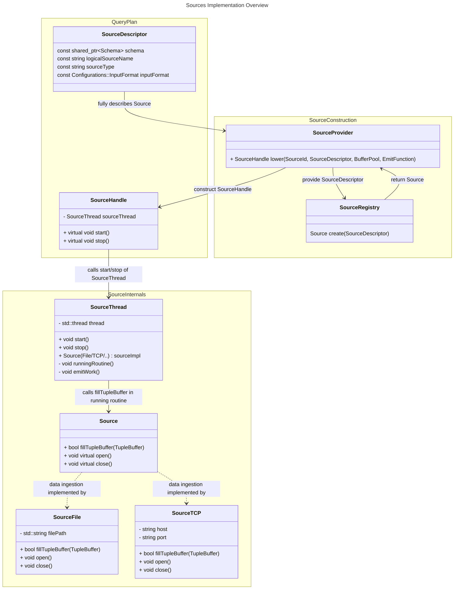

# The Problem

## Motivation and Vision
A core idea of NebulaStream is that it supports millions of sources.
Therefore, supporting a large number of heterogeneous data sources and sinks and making it easy to add new ones is vital to the usability of NebulaStream.\
A good example for a system that supports a large number of data sources and makes adding new ones easy is [Telegraf](https://github.com/influxdata/telegraf). Telegraf utilizes a modular setup with *inputs* (sources), *processors* (operators), *aggregators* (aggregations), and *outputs* (sinks). The modular design facilitates adding a new input/processor/aggregator/sink. As a result, the Telegraf community (including the core developers) created 300+ plugins.
Telegraf shows us that different users require different plugins (including data sources) and that users are willing to add these plugins, if the system facilitates it.

## Problems with NebulaStream
Currently, NebulaStream does not support the above [vision](#motivation-and-vision) because of the following problems:
- P1: the implementation of sources and sinks is unnecessarily complex
  - the implementation of sources and sinks grew over time, was never refactored and is scattered across an enormous number of classes
    - LogicalSource and PhysicalSource
      - `nes-catalogs/include/Catalogs/Source/LogicalSource.hpp`
      - `nes-catalogs/include/Catalogs/Source/SourceCatalog.hpp`
    - SourceLogicalOperator (that shares a directory with LogicalSourceDescriptor)
      - `nes-operators/include/Operators/LogicalOperators/Sources/SourceLogicalOperator.hpp`
      - `nes-operators/include/Operators/LogicalOperators/Sources/LogicalSourceDescriptor.hpp`
    - source/sink implementations (inherit from DataSource, SinkMedium, Reconfigurable, DataEmitter, RuntimeEventListener)
      - `nes-runtime/include/Sources/MQTTSource.hpp`
      - ... (source implementations, think 200+ sources)
      - `nes-runtime/include/Sinks/Mediums/MQTTSink.hpp`
      - ... (sink implementations, think 200+ sources)
      - `nes-runtime/include/Sources/DataSource.hpp`
      - `nes-runtime/include/Sinks/Mediums/SinkMedium.hpp`
      - `nes-runtime/include/Runtime/Reconfigurable.hpp`
      - `nes-runtime/include/Runtime/Execution/DataEmitter.hpp`
      - `nes-runtime/include/Runtime/RuntimeEventListener.hpp`
    - descriptors for every single source and sink (inherit from SourceDescriptor/SinkDescriptor)
      - `nes-operators/include/Operators/LogicalOperators/Sources/MQTTSourceDescriptor.hpp`
      - ... (source descriptors, think 200+ sources)
      - `nes-operators/include/Operators/LogicalOperators/Sinks/MQTTSinkDescriptor.hpp`
      - ... (sink descriptors, think 200+ sources)
    - types for every single source (inherit from PhysicalSourceType)
      - `nes-configurations/include/Configurations/Worker/PhysicalSourceTypes/MQTTSourceType.hpp`
      - ... (source types, think 200+ sources)
    - a file with ~2000 lines that handles serialization of operators, including sources and sinks
      - `nes-operators/src/Operators/Serialization/OperatorSerializationUtil.cpp`
    - proto files for sources and sinks
      - `grpc/SerializableOperator.proto`
    - many places where sources and sinks are lowered 
      - `nes-execution/include/QueryCompiler/Phases/Translations/LowerToExecutableQueryPlanPhase.hpp`
      - `nes-runtime/include/Runtime/Execution/ExecutableQueryPlan.hpp`
      - `nes-execution/include/QueryCompiler/Phases/Translations/ConvertLogicalToPhysicalSource.hpp`
      - `nes-execution/include/QueryCompiler/Phases/Translations/ConvertLogicalToPhysicalSink.hpp`
      - `nes-execution/include/QueryCompiler/Phases/Translations/DefaultPhysicalOperatorProvider.hpp`
      - ...
    - different factories 
      - `nes-execution/include/QueryCompiler/Phases/Translations/DefaultDataSourceProvider.hpp`
      - `nes-execution/include/QueryCompiler/Phases/Translations/DataSinkProvider.hpp`
      - `nes-execution/include/QueryCompiler/Phases/Translations/PhysicalOperatorProvider.hpp`
      - `nes-configurations/include/Configurations/Coordinator/LogicalSourceTypeFactory.hpp`
      - `nes-operators/include/Operators/LogicalOperators/LogicalOperatorFactory.hpp`
      - `nes-configurations/include/Configurations/Worker/PhysicalSourceTypeFactory.hpp`
      - ...
    - additional implementations for semi-supported plugins 
      - `nes-runtime/include/Sources/DataSourcePlugin.hpp`
      - `nes-runtime/include/Sinks/DataSinkPlugin.hpp`
      - `nes-configurations/include/Configurations/Worker/PhysicalSourceFactoryPlugin.hpp`
      - `nes-operators/include/Operators/LogicalOperators/Sources/SourceDescriptorPlugin.hpp`
      - ...
- P2: The DataSource interface forces all sources to use the TestTupleBuffer and it mixes reading data from sources, formatting/parsing sources, and starting and stopping queries in a single class
  - DataSource provides the allocateBuffer() function which returns a TestTupleBuffer
    - as a result, all sources use the TestTupleBuffer
- P3: adding a single source and sink requires changing/touching 20+ files (partially a result of P1)
- P4: setting up sources and sinks for querying is complex
  -  define logical sources in the coordinator YAML config
  -  define a physical source in the worker YAML config
  -  use the correct logical source name (string) in an analytical query
  -  *define* a physical sink descriptor in the same (analytical) query
- P5: the process of specifying a sink is different from the process of specifying a source and it mixes data query language (DQL) and data definition language (DDL) syntax in our queries (see last bullet point in P4)


# Goals
- G1: Simplify the source implementations. Following the encapsulation principle of OOP, the task of a source should simply be to ingest data and to write that data to a TupleBuffer.
  - addresses P1 and P3
- G2: Starting a query should be handled by a separate class that simply uses a source implementation.
  - addresses P2
- G3: Handle formatting/parsing separate from ingesting data. A data source simply ingests data. A formatter/parser formats/parses the raw data according to a specific format.
  - addresses P2
- G4: Create source/sink registries that enable us to easily create a new source/sink as an internal or external plugin and that returns a constructor given a source/sink name (or enum if feasible).
  - mainly addresses P1 and P3
- G5: unify the process of creating data sources and sinks
  - addresses P1, P3, and P5
  - keep the process of creating sinks as similar as possible to that of creating sources
- G6: provide a concept for simplifying (includes unifying) the process of configuring sources and sinks for queries
  - addresses P4 and P5

# Non-Goals
- refactoring the coordinator side of source/sink handling
  - we allow ourselves to make reasonable [assumptions](#assumptions), which must be part of this design document, of how the coordinator will handle sources and sinks in the future
    - this affects P4 and P5 in particular
    - we address this problem specifically in the discussion #10
- a complete vision or even implementation of how to separate formatting from sources and how to enable compilation of the formatting process
  - we address this problem specifically in the discussion #133
- a complete vision or even implementation on how to decouple sources from a dedicated thread, enabling us to scale out concerning the number of sources on a single worker
  - we address this problem specifically in the discussion #133
- a complete vision or even implementation on how to do source sharing
  - we address this problem specifically in the discussion #133
# Proposed Solution
## Fully Specified Source/Sink Descriptor
Currently, we are creating physical sources from source types. Source types are configured using either a `YAML::Node` as input or a `std::map<std::string, std::string>`. Therefore, all current configurations are possible to represent as a map from string to string. We also observe that most configurations use scalar values from the following set {uint32_t, uint64_t, bool, float, char}. Therefore, we conclude that we can model all current source configurations as a `std::unordered_map<std::string, std::variant<int64_t, std::string, bool, double>>`.
Given that everything that a worker needs to know to create a source/sink is the type, and potentially the configuration and meta information, we define the following:

The fully specified source descriptor contains:
  - the distinct type of the source/sink (one to one mapping from type to source/sink implementation)
  - the format of the inbound data (e.g., JSON, XML, etc.)
  - (optional) the configuration of the source/sink, represented as a `std::unordered_map<std::string, std::variant<int64_t, std::string, bool, double>>`
  - (optional) meta data, such as whether a source allows source sharing, represented as class member variables of the SourceDescriptor and the SinkDescriptor respectively.

Thus, there is only one source descriptor implementation and one sink descriptor implementation. The distinct type identifies which type of source the descriptor describes. The configuration is general enough to handle all source/sink configurations and the meta information are part of the source/sink descriptor. Furthermore, this descriptor is attached to queries and it contains all information to construct a fully specified source/sink, allowing for 'RESTful queries', i.e., the worker does not require to maintain state concerning sources and sinks to execute queries.

## Assumptions
We make the following assumptions:
- Assumption 1: The coordinator allows to create [fully specified source descriptors](#fully-specified-sourcesink-descriptor) during runtime
  - when creating a physical source/sink, the user must supply a worker id (or similar)
  - the user must connect the physical source to at least one logical source
  - this assumption is reasonable, since users currently already need to configure physical sources for each worker. During startup the workers then register the physical sources at the coordinator. 
- Assumption 2: The coordinator allows to create fully specified physical *sink* descriptors during runtime
  - physical sinks are currently already specified in a queries at runtime
  - this assumption is reasonable, since the only difference is that the physical sink descriptor is not specified in the analytical (DQL) query, but in a definition (DDL) query beforehand (just like a physical source is created (G5))
- Assumption 3: The coordinator can map all fully specified physical source and sink descriptors to workers
  - this assumption follows naturally from Assumption 1
  - additionally, this assumption is reasonable since it is already given for sources
    - from LogicalSourceExpansionRule:
      ```c++
      //Add to the source operator the id of the physical node where we have to pin the operator
      //NOTE: This is required at the time of placement to know where the source operator is pinned
      duplicateSourceOperator->addProperty(PINNED_WORKER_ID, sourceCatalogEntry->getTopologyNodeId());
      ```
- Assumption 4: The decomposed query plans that a worker receives from the coordinator contains a [fully specified source/sink descriptor](#fully-specified-sourcesink-descriptor)
  - even though the mapping from logical source names to source types and descriptors currently happens on the worker, this assumption is still reasonable, because:
    - the coordinator and worker can share a module that defines source and sink descriptors
    - the coordinator is already able to map logical source names to physical source names. Based on Assumption 1 and Assumption 2, the coordinator will therefore be able to map logical source names to fully specified source descriptors (sink descriptors are already given)
    - the coordinator is already able to parse query plans with fully specified sink descriptors
- Assumption 5: The coordinator only places decomposed query plans on worker nodes that support the fully specified source/sink descriptors contained in the decomposed query plan
  - this assumption logically follows from Assumption 2 and 3

## Solution
We propose the following solution. Users describe sources by providing the type of the Source, e.g. File or TCP, 
the schema and name of the logical source and the input format, e.g. CSV or JSON. During parsing, we create a validated and strongly types **SourceDescriptor**
from the description of the user and attach it to the query plan. During lowering, we give the *SourceDescriptor* to the **SourceProvider**, which constructs
the described **Source** using the **SourceRegistry** and, using the constructed Source, constructs and returns a **SourceHandle** which
becomes part of an executable query plan. The SourceHandel offers a very slim interface, `start()` and `stop()` and thereby hides all the 
implementation details from users of sources. Internally, the SourceHandle constructs a **SourceThread** and delegates the start and stop
calls to the *SourceThread*. The SourceThread starts a thread, so one thread per source, which runs the `runningRoutine()`. In the running routine,
the SourceThread repeatedly calls the `fillTupleBuffer` function of the specific *Source* implementation, e.g., of the **SourceTCP**. 
If `fillTupleBuffer` succeeds, the *SourceThread* returns a TupleBuffer to the runtime via the *EmitFunction*, if not, it returns an
error using the *EmitFunction*.

## G1
Source implementations now only implement the logic to read data from a certain source, e.g. File, Kafka, or ZMQ, and write the raw bytes received from that source into a TupleBuffer (not a TestTupleBuffer!). This design follows the encapsulation principle of OOP. Additionally, since we write only the raw bytes into a buffer, there is no CSVSource anymore, or a JSONSourceFile, or a ParquetSource. There is only a SourceFile that reads data from a file. CSV, JSON and Parquet are formats, therefore they are handled by a formatter/parser.

We plan to reduce the supported sources to only the File, ZMQ and the TCP source. We will add the other sources back as soon as the design is fleshed out.
## G2
Currently, the `WorkerRPCServer` calls `NodeEngine::startQuery()`,  which calls `QueryManagerLifecycle::startQuery()` , which calls `DataSource()::start()`. `start()` then spawns a thread and calls `DataSource()::runningRoutine()`, which then calls one of two running routines. Either `runningRoutineWithGatheringInterval()`, or `runningRoutineWithIngestionRate()`.
The running routine is controlled by the `GatheringMode` enum, which is always set to `INTERVAL_MODE` currently. We therefore propose to remove the `GATHERING_INTERVAL`. We simply gather data as fast as possible.

We propose that DataSource becomes a purely virtual interface with two functions `virtual start(EmitFunction &&) = 0` and `virtual stop() = 0`. The DataSource interface is implemented by two different kinds of DataSources.
1. PullingDataSource, which regularly pulls data from a source. Currently, sources like the TCP, Kafka or MQTT source act as pulling sources. They regularly call `receiveData()` to pull data from the respective data source.
2. PushingDataSource, here, a source continuously pushes data into the DataSource. An example would be the `ZMQSource()`. Currently, we spawn a ZMQ server with multiple threads that continuously ingests data and pushes it into the `ZMQSource()`. Therefore we do not interrupt the running routine for the ZMQSource:
    ```c++
    /// If the source is a ZMQSource, the thread must not sleep
    if (getType() != SourceType::ZMQ_SOURCE && gatheringInterval.count() > 0) {
        std::this_thread::sleep_for(gatheringInterval);
    }
    ```
Both types of data sources start a thread and regularly check if they have been requested to stop.

## G3
The source itself does not handle the formatting/parsing of the ingested data anymore. The first, observation is that formatting/parsing is tied to formats that may be shared by different sources. For example it is possible to read a JSON file, or to receive JSON via MQTT or TCP or Kafka. The second observation is that formatting is performance-critical. Our current CSV formatting/parsing is so slow that it is a major bottleneck in many experiments. 
By separating formatting/parsing from the source entirely, it becomes possible to make formatting/parsing part of the compiled query. This allows for interesting optimizations such as generating formatting/parsing code for a specific schema and a specific query. For example, a projection could be handled during formatting/parsing already.

For the initial implementation of sources and sinks we use simple runtime implementations (non-compiled) for sources and sinks. We will support CSV and JSON. In a later design document based on discussion #133, we develop a concrete idea for how to support compilation of data formatters/parsers.

## G4
In PR [#48](https://github.com/nebulastream/nebulastream-public/pull/48) we introduced the design of a static plugin registry. This registry allows to auto-register source and sinks constructors using a string key. In [Assumptions](#assumptions) we described that the worker receives fully specified query plans, were all sink and source names were already resolved to [fully specified source/sink descriptors](#fully-specified-sourcesink-descriptor). Thus, on the worker, after compiling the query, we can construct a source/sink in the following way using a fully specified source/sink descriptor and the source plugin registry:
1. get the distinct type as a string from the descriptor and use it as a key for the plugin registry to construct a `std::unique_ptr` of the specified source/sink type
2. if provided, get the configuration represented as a `std::unordered_map<std::string, std::variant<uint32_t, uint64_t, std::string, bool, float, char>>` from the descriptor and pass it to the newly constructed source/sink to configure it
3. if provided, configure meta data using the meta data configured in the descriptor

We could also pass the descriptor to the constructed source/sink by reference and the source/sink then configures itself and sets the meta data, but that is an implementation detail.

## G5 - Unify Sources and Sinks
### Coordinator exclusive
In [Assumptions](#assumptions) we describe that the coordinator will allow users to create a source or a sink using the same mechanism, which we will specify in an upcoming design document. This addresses the main issue, that physical sources are typically created in YAML files that configure workers and (physical) sinks are created in analytical queries. Furthermore, both source and sink names will be resolved to [fully specified source/sink descriptors](#fully-specified-sourcesink-descriptor) in the same way on the coordinator.
### Worker
The source and sink descriptor both inherit from the same abstract descriptor class. Sources and sinks use different plugin registries, since we might implement some protocols just as a source or sink (an example would be the serial interface to the Philips monitor in the NEEDMI project, where we don't need a sink). However, both registries are purposefully designed in a similar way. By separating the query start/stop logic and the formatting/parsing logic from the source implementation, sources and sinks can be constructed similarly. We construct both sources and sinks in the same pass from source/sink descriptors using the source/sink registries on the worker.


## G6 - Simplify Source/Sink Processing Logic (Worker)
We mainly address this problem by removing the necessity of workers to store any state concerning sources and sinks (see [Assumptions](#assumptions)). Workers receive decomposed queries with [fully specified source/sink descriptors](#fully-specified-sourcesink-descriptor) from the coordinator. In combination with the plugin registry (see solution [G4](#g4)), we allow source/sink descriptors to be dragged through the lowering process until we construct the actual sources and sinks using the registry, requiring only the descriptor.

# Alternatives
In this section, we regard alternatives concerning where to configure physical sources and sinks [A1](#a1---where-to-configure-physical-sources-and-sinks) and how to construct sources and sinks [A2](#a2---constructing-sources-and-sinks).
## A1 - Where to Configure Physical Sources (and Sinks)
In A1, we regard different alternatives concerning where to configure and where to maintain the state of physical sources and sinks.
### A1.1 - Configure Physical Sources on the worker
This is our current approach. We configure physical sources using YAML files. Configuring a physical source requires a logical- and a physical source name. The logical source name must already exist on the coordinator (must be configured).
#### Advantages
- physical sources are already configured on start up, allowing to submit queries directly after start up
- workers can be opaque to end users that submit analytical queries since everything was configured beforehand
- allows to statically register queries at start up (not yet supported)
  - great for devices that can only be configured during start up
#### Disadvantages
- it is not possible to add new sources after start up
  - if a worker moves into another subnet, configured physical sources may not be supported anymore
- setting up NebulaStream becomes difficult (see [The Problem](#the-problem))
- configuring sinks is different from configuring sources
  - we could also configure sinks in the YAML configuration but that would make the setup even less flexible
- the worker needs to keep track of all registered physical source in addition to the coordinator
- the coordinator and worker need to sync their physical sources (during start up)
#### vs Proposed Solution
- the [Proposed Solution](#proposed-solution) requires configuring sources after startup and looses the potential to deploy queries statically
- long-term the [Proposed Solution](#proposed-solution) enables to mix DDL and DQL queries, meaning that we can create larger queries that register physical sources and sinks and then query the newly created physical sources (and sinks)
  - the associated [discussion](https://github.com/nebulastream/nebulastream-public/discussions/10) describes this vision in more detail
- the [Proposed Solution](#proposed-solution) enables to worker to be stateless concerning sources and sinks
  - similar to REST, our queries contain the state needed to execute the query ([fully specified source/sink descriptors](#fully-specified-sourcesink-descriptor))

### A1.2 - Binding Physical Sources to Workers on the Coordinator
Same as A1.1, but register physical sources via queries on the coordinator. Could potentially combine A1.1 and A1.2, but that would mean managing more registering logic. Requires keeping state on the worker.
#### Advantages
- makes adding sources and sinks after set up possible
- makes a zero configuration NebulaStream a possibility
#### Disadvantages
- requires knowledge of workers in queries addressed at the coordinator (bind calls)
- no more support for statically registered queries (which we don't support yet)
- coordinator and worker need to sync their physical sources
- extra state kept on worker
#### vs Proposed Solution
- the [Proposed Solution](#proposed-solution) goes one step further, by not registering the physical sources and sinks on the worker, enabling the worker to be stateless concerning sources and sinks
  - similar to REST, our queries contain the state needed to execute the query ([fully specified source/sink descriptors](#fully-specified-sourcesink-descriptor))
  - however, this stateless approach might not be best-suited for **source sharing** for queries
    - we can (and probably should) determine whether to share sources on the coordinator, but we still need to modify running sources on the worker to enable source sharing
    - the coordinator could provide the query id and the origin id of the source that should now now share its data with at least two queries, but we still somehow need to find the source belonging to the query id and the origin id on the worker, which requires some sort of state

### A1.3 - Broadcasting
Configure a physical source and attach it to a logical source on the worker using DDL queries. Use the logical source name in a query. The coordinator then sends a broadcast message to all workers inquiring whether they support the specified physical source. The workers respond. All workers that support the physical source become part of the query.
#### Advantages
- does not require knowledge of workers when writing DQL queries
- can help using workers that are otherwise neglected
#### Disadvantages
- potentially spams the system with broadcast messages
- requires a lot of non-existing logic
- difficult to manage authorization (potentially not all nodes that support a source should participate)
- requires synchronization between all workers and the coordinator, which is difficult to implement robustly
#### vs Proposed Solution
- the [Proposed Solution](#proposed-solution) requires manually setting up physical sources and sinks on the coordinator, which requires knowledge about workers and in particular worker ids
- the [Proposed Solution](#proposed-solution) mostly builds on top of existing logic and therefore requires little changes in our system and it is easier to reason about

## A2 - Constructing Sources and Sinks
For the most part, sources and sinks exist as descriptors (see [fully specified source/sink descriptor](#fully-specified-sourcesink-descriptor)). However, to physically consume data, NebulaStream needs to construct the source/sink implementations from the descriptors. We discuss our solution approach concerning how to best construct the sources and sinks implementations in detail [#48](https://github.com/nebulastream/nebulastream-public/pull/48). The following is a brief summary.

### Factories (Current State)
- factories are well understood and allow us to construct any source/sink
- creating sources/sinks should be limited to very few places in the code, thus, only a few places need to import the factory and we don't need to forward factory objects between classes
- simple factories require big if-else cases on the different source/sink types
  - a source/sink descriptor is given, but it is still necessary to determine the correct constructor
- the factory is part of the core code paths, thus constructing any kind of source/sink is part of the core code paths, thus optional sources, e.g., an OPC source become part of the core code paths
  - this results in #ifdefs along core code paths
  - this results in verbose core code paths (pollution)

#### vs Proposed Solution (Static Plugin Registry)
- the implementation logic static plugin registry ([#48](https://github.com/nebulastream/nebulastream-public/pull/48)) is far more complex than a simple factory
- the static plugin registry enables us to construct sources/sinks using a name from the source/sink descriptor and thereby avoids large if-else branches
- the static plugin registry enables us to create external plugins that are still in-tree, but that are not part of core code paths and that can be activated/deactivated
  - no more/very few #ifdefs
  - less verbose code paths (logic is in (external) plugins)

# Open Questions
- is there a way to allow users to issue queries worker-agnostic?
  - in particular, the above assumptions state that a user needs to define a query that contains a specific worker ID to bind a physical source to a logical source
  - we should discuss this topic in discussion #10


# (Optional) Sources and Further Reading
- [Influx Telegraf webpage](https://www.influxdata.com/time-series-platform/telegraf/)
- [Influx Telegraf Github](https://github.com/influxdata/telegraf)

# (Optional) Appendix
