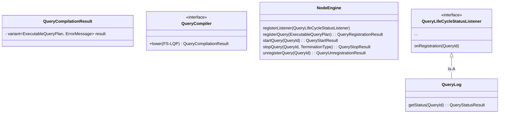
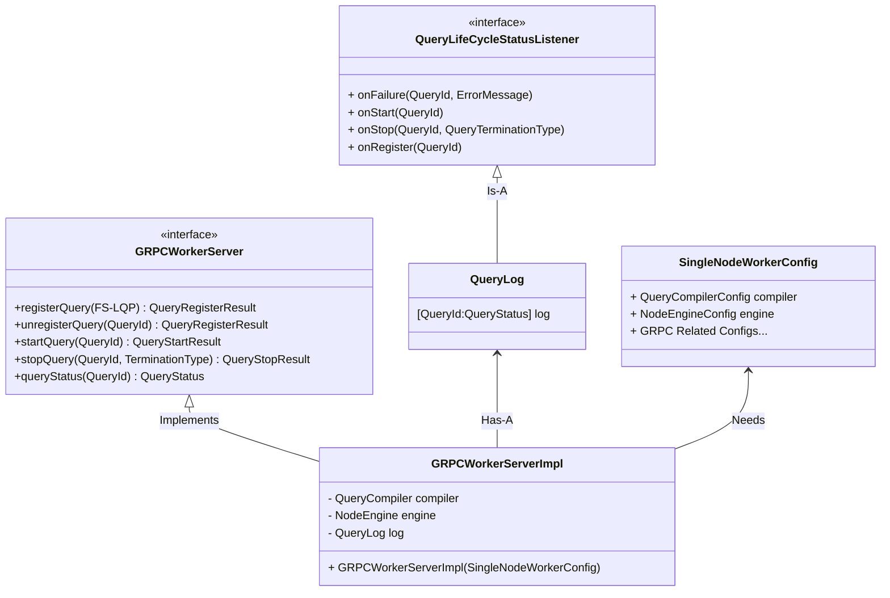
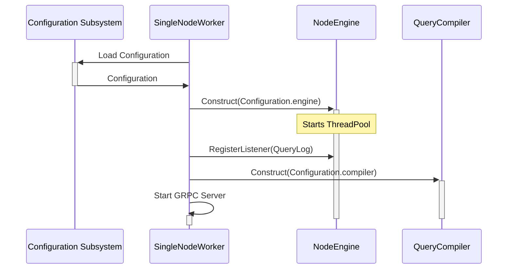
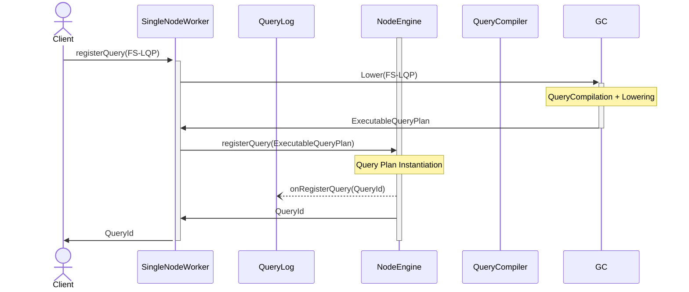
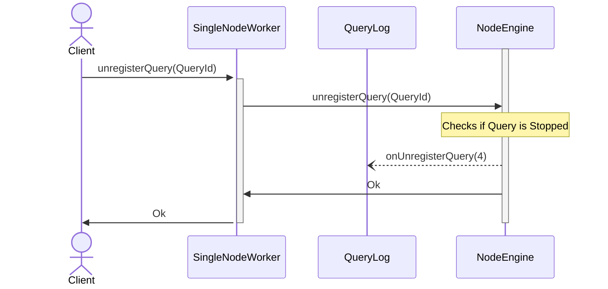
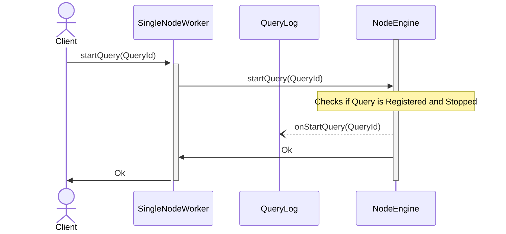
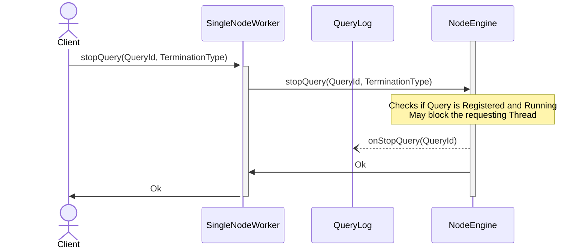
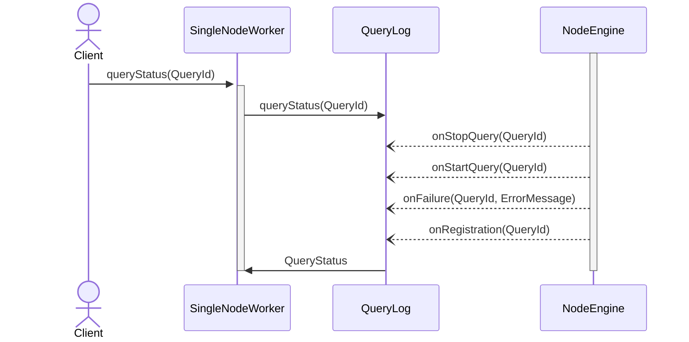

# The Problem

The NebulaStream research project faces several critical challenges that must be addressed for its future success. These challenges stem from various aspects of the project, including its direction, complexity, code quality, documentation, and the overall progress of the system. The project's current state presents several significant problems that must be tackled to ensure its viability and future growth. Below are the key challenges faced by the project: 

Unclear Project Directions: In recent months, the project has suffered from a lack of clear directions, leading to ambiguity about its goals and objectives. This has hindered progress and effective planning for the project's future development, as well as demotivated its developers. 

**Growing Complexity**: As the project has evolved, it has grown in complexity, making it harder to understand and maintain. The increasing complexity has made it challenging to introduce new features and enhancements, leading to inefficiencies and potential errors in the codebase. Testing usually favors writing long-running system or integration tests to circumvent the lack of isolation of the individual components. This causes tests to be rarely executed locally due to their long runtime. 

**Lack of Code Quality**: The project's code suffers from several quality issues, such as neglect of common software engineering techniques and irregular enforcement of best practices. The codebase could be described as a mix of Java-flavored C++, featuring deep inheritance hierarchies, memory unsafety, undefined behavior, and data races. The lack of automated tooling for detecting this kind of issue is mainly caused by the confusing build system surrounding the C++ project. Dynamic linking has introduced confusing and non-obvious problems with third-party libraries. 

**Dependency Management**: The out-of-tree NebulaStream-Dependency repo is largely unknown, and even fewer people know how it works. Adding, removing, or even updating libraries is strongly impeded. Changing the compiler or standard library version requires changes to the build system and the out-of-tree dependency repository. The NebulaStream project advertises support for C++20, yet all of the CI servers do not provide a recent version of the standard library; thus, many benefits of C++20 are not available.

**Unclear Ownership and Responsibility**: The ownership and responsibility of components within the project are poorly defined, leading to confusion about who is accountable for specific areas of development and maintenance. This is reflected in the system's overall complexity, as logic is rarely local within a single module but sprinkled around in many different places of the system. Usually, the answer to a question like: "Where does X happen?" is yes.

**Poor Documentation and Knowledge Transfer**: The project's documentation is inadequate, making it challenging for new or external developers to understand the system. The lack of comprehensive documentation means that the best way to comprehend the system is by debugging through it, hindering the onboarding process for new team members and external contributors. 

**Lack of Prioritization**: The project lacks clear priorities, leading to difficulty focusing on critical tasks and initiatives. Accurate Prioritization requires a deep understanding of the system's current state. However, the system's current set of supported operations is wildly unclear, with uncertainties regarding the supported query types, data sources and sinks, and expected query performance. The lack of clarity on performance issues and the reasons behind slow queries impedes effective troubleshooting and optimization efforts. 

# Goals and Non-Goals

The `SingleNodeWorker` effectively proposes a reboot of the NebulaStream project, limiting its scope to a non-distributed streaming engine. It will be built from a collection of hand-picked, tested, and documented components adapted from the existing NebulaStream project. 

The `SingleNodeWorker` tries to reduce complexity and allow for the creation of stable and future-proof interfaces for its internal components, which future milestones can built upon. The application itself will only wire and configure components together and provide their functionality to a user. 

During the development of `SingleNodeWorker`, we try to introduce best practices into the codebase and project management. By introducing and enforcing stricter rules, we hope to accelerate future development. The initial milestones reiterate the build system and tooling around the C++ project. The `SingleNodeWorker` developer experience should be comparable to other C++ Open-Source projects: building, testing, and running ci-checks should be available locally using idiomatic usages of the build system (i.e., `make test`).

The `SingleNodeWorker` **does not** determine the future scope of the NebulaStream project. The `SingleNodeWorker` might not be relevant in future milestones when we broaden the scope to focus on distributed stream processing or reintroduce sophisticated query optimization, like query placement and query merging. 

# (Optional) Solution Background

# Our Proposed Solution

1. External Interface that the `SingleNodeWorker` exposes to a user of the System
2. Dependencies on other Modules
3. Internal Interfaces used to compose the individual components
4. Internal flow of control during request processing
5. Improvements to the build process
6. Improvements for the CI-System
7. Configuration

## External Interface
The SingleNodeWorker is a GRPC Wrapper around a `NodeEngine` and a `QueryCompiler`. Externally the `SingleNodeWorker` supports 5 Operations:
QueryRegistration
QueryStart
QueryStop
QueryUnregistration
QueryStatus

### QueryRegistration
The system user can register a Fully-Specified-LogicalQueryPlan (FS-LQP). The result of the registration will be a QueryId uniquely identifying the query on the `SingleWorkerNode`. If the registration failed, a concrete and meaningful ErrorMessage will be returned. The ErrorMessage should explain in detail the underlying issue and which component raised it. A more coarse reason also allows error messages to be grouped into different categories. (e.g. `Unsupported`, `Invalid`).

```
QueryRegistrationResult registerQuery(FS-LQP)
QueryRegistrationResult: QueryId | QueryRegistrationError
QueryId: Integer
QueryRegistrationError: {
	 Component: String
	 Reason: String
         Detail: String
}
```
Example error message:
```
{
	Component: "QueryCompiler",
	Reason: "Unsupported",
	detail: "Could not Lower `mod(attribute("A"))`: FLOAT32 does not support 'mod'"
}
```
### QueryUnregistration
The user can unregister a Query from the system. Currently, unregistering a Query does not benefit the user except for releasing memory that would be allocated for the query internally. Unregistering a query requires the query to be stopped. Attempting to unregister a non-existing or running query will return an error.

```
QueryUnregistrationResult unregisterQuery(QueryId)
QueryUnregistrationResult: Ok | QueryUnregistrationError
QueryId: Integer
QueryUnregistrationError: {
	 Component: String
	 Reason: String
         Detail: String
}
```
Example error message:
```
{
	Component: "QueryManager",
	Reason: "Invalid",
	detail: "Query 3 is running"
}
```
### QueryStart

The user can start a previously registered query using its QueryId.
If the request succeeds, the query was started successfully. However, it might have failed already. Attempting to start a non-existing or running query will return an error.

```
QueryStartResult startQuery(QueryId)
QueryStartResult: Ok | QueryStartError
QueryId: Integer
QueryStartError: {
	 Component: String
	 Reason: String
         Detail: String
}
```
Example error message:
```
{
	Component: "QueryManager",
	Reason: "Invalid",
	detail: "Query 3 is running"
}
```
### QueryStop
The user can stop a currently running Query using its QueryId. If the request succeeds, the query will be stopped, and no external side effects, e.g., reading from a source or writing to a sink, will occur. Attempting to stop a non-existing or stopped query will return an error.

The user can choose between two different stop operations: Soft or Hard.

A Hard stop immediately terminates the query, this could lead to partial results emitted and the Sink. Partial results describe incomplete join results or window results, individual tuples are always emitted as a whole.

A Soft stop guarantees all results to be flushed to all the queries sinks. Flush is implementation defined on a per operator basis (e.g. the NLJ Operator will trigger all Windows during a flush).

```
QueryStopResult stopQuery(QueryId, QueryTermination)
QueryStopResult: Ok | QueryStopError
QueryId: Integer
QueryTermination: Soft | Hard
QueryStopError: {
	Component: String
	Reason: String
	Detail: String
}
```
Example error message:
```
{
	Component: "QueryManager",
	Reason: "Invalid",
	detail: "Query 3 is not running"
}
```

### QueryStatus
The user can query the current status of a Query using its QueryId. The result of the QueryStatus request will yield:
1. Current State of the Query. Note: A Query may have the state Unregistered, if the query was previously Registered. Requesting the Status for a never registered Query will return an Error.
2. (Hopefully Empty) List of ErrorMessages, that have caused the query to fail
3. NumberOfRestarts: How many times the query was (re)started.
4. The Input FS-LQP and the Lowered PhysicalQueryPlan.

```
QueryStatusResult status(QueryId)
QueryStatusResult: QueryStatus | QueryStatusError
QueryStatus: {
    State: Stopped | Running | Unregistered | Failed
    Failures: [ErrorMessages]
    NumberOfRestarts: Integer
    LogicalPlan: FS-LQP
    PhysicalPlan: PQP | String
},
QueryId: Integer
QueryStatusError: {
	Component: String
	Reason: String
	Detail: String
}
```

Example error message:
```
{
	Component: "QueryLog",
	Reason: "Invalid",
	detail: "Query 69 does not exist"
}
```

## Dependencies

### Internal
The SingleNodeWorker is the user facing application, effectively it takes dependencies on every module. More concrete SingleNodeWorker depends on:

- NodeEngine
- QueryCompiler:
- Configuration System to load and specify configurations
- Logical Operators and their Deserialization

### External
SingleNodeWorker uses GRPC to communicate with the client.


## Internal Interfaces

This section describes the interfaces of objects flowing from and to the internal components of NebulaStreams QueryCompiler and NodeEngine. The interfaces are intentionally kept incomplete as only relevant methods are discussed here. Implementation detail regarding the specific interfaces are kept in their respective design document.

In its current design the only cross module interface is the `ExecutableQueryPlan` which is created by the `QueryCompiler` and used by the `NodeEngine`.




## Internal Operations
The entrypoint into the `SingleNodeWorker` is the GRPCWorkerServer. The `GRPCWorkerServerImpl` implements the generated GRPCServer Interface. Internally the `GRPCWorkerServerImpl` owns the `NodeEngine` and the `QueryCompiler` additionally a Helper class `QueryLog` implements the QueryLifeCycleStatusListener interface and is responsible for logging the status of queries. The `QueryLog` is used to answer `QueryStatus` requests.




### Start of the SingleNodeWorker

Upon construction the `GRPCWorkerServerImpl` forwards the component relevant Configuration to the individuals components constructors, before configuring the GRPC Server and starting the system.



### QueryRegistration
The client issues a `registerQuery` request via GRPC with a FS-LQP. Internally the GRPCServer forwards the request to the `QueryCompiler` which either successfully lowers the query into an `ExecutableQueryPlan` or returns a `ErrorMessage`. In case of an `ErrorMessage` the GRPCWorkerServerImpl is responsible for packaging the Error into a QueryRegistrationError. If compilation succeeds the `ExecutableQueryPlan` is registered at the `NodeEngine` which internally does the instantiation. Error handling is identical to the `QueryCompiler` error scenario. If registration is successful the QueryId is forwarded to the client.

The QueryLog registers the onRegisterQuery and tracks QueryLifeCycle events for the new Query.



### QueryUnregistration

The client issues a `unregisterQuery` request via GRPC with a QueryId. Internally the GRPCServer forwards the request to the `NodeEngine`. If the unregistration succeeds at the `NodeEngine` the QueryLog will be notified and tracks the unregistration. If an error occurs the error is forwarded to the `Client`.



### QueryStart

The client issues a `startQuery` request via GRPC with a QueryId. Internally the GRPCServer forwards the request to the `NodeEngine`. If the `NodeEngine` fails to start the query, the error is forwarded to the client. If the query was started successfully at `NodeEngine` the client receives an OK. `NodeEngine` will inform the `QueryLog` of a the QueryStart. Internally the `QueryLog` increases the number of `restarts` for the QueryId.



### QueryStop

The client issues a `stopQuery` request via GRPC with a QueryId and a TerminationType. Internally the GRPCServer forwards the request to the `NodeEngine`. If the Stop was successful (currently all request are handled by blocking), the Query has been stopped. The QueryLog was informed of the QueryStop and tracks the state.




### QueryStatus
The client can request the current status of a Query with the `status` request via GRPC with a QueryId. Internally the GRPCServer forwards the request to the `QueryLog` which has been tracking the state of all Queries. The reasoning is that asking the `QueryLog` is less disturbing to the `QueryManager` which will have to lock the `Query Set`. But extracting the Book-Keeping into a dedicated class allows different components of the System to handle QueryLifeCycleEvents with different purposes. E.g. Tracking QueryState or Collecting Statistics for a Single Query only.

Changes to what `Statistics` are collected for the query log no longer require changes within the already very complex `QueryManager`.



# Improvements to the build process

### Modularization

Modularization is beneficial because it allows each module to be written independently without requiring knowledge of other modules' code. This separation enables faster development as team members can work on different parts simultaneously, addressing problems in smaller, manageable chunks. The modular design also enhances the overall program's flexibility and makes individual modules highly reusable, cutting costs and reducing time for future projects. Additionally, it leads to fewer and more easily detectable bugs, as issues are confined to their originating modules.

When adopting a modular approach, it is crucial to establish good and well-documented interfaces to ensure clear communication between modules. Additionally, stricter rules must be enforced when crossing module boundaries to maintain system integrity and prevent unexpected interactions.

#### Ownership of Modules

We assign ownership to modules. Each module has one or more code owners attached in the `CODEOWNERS` file. Pull requests concerning files mentioned under the owner's scope require a review.

#### Modularization in CMake and C++
To achieve a clean separation of modules, we revisit the organization of existing modules. The CMake Build System allows the separation between Public and Private dependencies. To use this effectively, modules are also designed with a publicly-facing interface and internal components.

For each modules we propose a structure like this:
```
...
memory/
	CMakeLists.txt 
	include/
		BufferProvider.hpp
		BufferProviderConfig.hpp
	src/
		RealBufferProvider.hpp
		RealBufferProvider.cpp
	tests/
		CMakeLists.txt 
		util/
			CMakeLists.txt 
			MemoryTestUtils.hpp
		RealBufferProviderTest.cpp
...
```
In this example, the MemorySubSystem provides a `BufferProvider` in its Public Interface.

Which files should be in the `public` interface? In general, all files that declare interfaces used by users of the module components. However, if these interfaces require components from other modules or internal components, these will have to be part of the `public` interface. E.g., in the example, a `BufferProvider` expects to be configured with a `BufferProviderConfig`; the configuration has to exist in the `public` interface; otherwise, the `BufferProvider` can not be constructed. In some scenarios, forward declaration of types can help reduce the `public` interface. Including further dependencies in hidden `.cpp` source files will not add additional `public` dependencies to the module.

```c++
// in include/BufferProvider.hpp
/// Public Interface
class BufferProvider {
    BufferProvider(Config config)
    virtual TupleBuffer provideBuffer() = 0;
}

// in src/RealBufferProvider.hpp
/// Private Implementation
#include <BufferProvider.hpp> // Note include of public interface
#include <folly/mpmc.hpp>
class RealBufferProvider: public BufferProvider {
    TupleBuffer provideBuffer() override;

private:
    folly::MPMC<TupleBuffer> buffers;
}

// in src/RealBufferProvider.cpp
#include "RealBufferProvider.hpp" // Note relative include
RealBufferProvider::provideBuffer() {
 // Implementation
}
```

From the cmake perspective the library can be declared as:
```cmake
add_library(memory src/RealBufferProvider.cpp)

target_include_directories(memory 
 PUBLIC ${CMAKE_SOURCE_DIRECTORY}/include # Every module, depending on memory, will only see this folder
 PRIVATE ${CMAKE_SOURCE_DIRECTORY} # Internally, all headers in the directory can be used
)

target_link_libraries(memory 
 PRIVATE folly # folly is a private dependency the user of memory do not need folly to use this module.
)
```

Internally, the module is now free to change the implementation of the `RealBufferProvider` and its dependencies. 

Tests are expected to use the private interface. An additional `MemoryTestUtils` module can export additional Testing Utilities for the module. A good example would be a `TestBufferProvider`, which can be instructed with certain properties. E.g: 
- Expect 5 requests to `getBuffer`
- Block the 3rd request
- Provide references to TupleBuffer.

### Dependency Management

Currently third-party dependencies are either: 
- vendored directly in-tree: YAML-Cpp, Backwards
- supplied via VCPKG in an external repository: Folly, GRPC
- components of the compiler toolchain in an external repository: LLVM, MLIR, Clang

We propose to move all dependencies into the repository using just VCPKG. The refactor allows to remove deprecated and unused dependencies. To accelerate local development we consider distributing prepopulated VCPKG caches in the nes-toolchain-image or provide an internally reachable http cache.

```
...
CMakeLists.txt
vcpkg/
 vcpkg.json
 ports/
 folly/
 ...
 toolchains/
 x64-linux-sanitizer.cmake
 ...

```

The advantage of VCPKG is that we can specify toolchains that correctly handle different sanitizers and guarantee all compiler and linker flags are consistent with the current project's configuration, which has previously been impossible. Dependencies currently not in the public VCPKG Registry should be specified and added manually to the vcpkg ports directory.

### Runtime Analyzer

To combat potential memory safety issues, which will inevitably arise, we employ dynamic runtime checks that can catch issues like Undefined Behavior, Memory Corruption, and Data Races during runtime.

For that we plan to use the different sanitizers for our debug builds and especially during testing, additional hardening is enabled from the [libc++ Hardening Mode](https://libcxx.llvm.org/Hardening.html). All of these changes require changes to the build system, and may also require changes to the dependencies.

Different CMake Options can toggle the use of the sanitizers and hardening mode:

- `-DNES_ENABLE_THREAD_SANITIZER=ON`
- `-DNES_ENABLE_UNDEFINED_SANITIZER=ON`
- `-DNES_ENABLE_MEMORY_SANITIZER=ON`
- `-DNES_ENABLE_ADDRESS_SANITIZER=ON`
- `-DNES_ENABLE_HARDENING_MODE=ON`

The build system should fail on incompatible combinations of sanitizers or if no libc++ is available.

### Static Analyzers

Static Analyzers are executed during the pull request if the analysis can be localized to changes. However, the result may be overruled. Currently we pick `clang-tidy` with a tbd set of rules.

### Docker Images

Docker Images for non-Linux development environments

Instead of offering native support for non-Linux Operating Systems, we provide a Development Docker Image that contains the required software to build the standalone worker on non-Linux machines. The Development Docker Image contains recent prebuilt dependencies and thus needs to be rebuilt whenever changes to the `vcpkg` folder are detected.

Additionally, we distribute Executable Docker Images, which contain a prebuilt version of NebulaStream.

#### Executable Image for different Versions:

- Stable Versions
- Current Unstable/Nightly/Master: Regression Tests for determining stability
- Pending PRs: It makes it easy for reviewers to test/use the PR. Images are discarded after merging the PR.

#### Different Build Types:

- Hardened debug build: To catch runtime errors during testing.
- Optimized build: Everyday usage
- Benchmark build: Disables debug logging at compile time

### Configuration

`SingleNodeWorker` configuration is only concerned with configuring the `GRPCServer`, configuration for the `NodeEngine` and the `QueryCompiler` are specified in their own module.

```yaml
grpcPort: 8080
grpcHost: localhost
queryCompiler: <QueryCompilerConfiguration>
nodeEngine: <NodeEngineConfiguration>
```

# Alternatives

### External Interface

#### Why `register` and `unregister`

Alternative interfaces could omit the `register` and `unregister` endpoint and only offer the `start` and `stop`. However, we would lose the possibility of preregistering many different queries and starting them simultaneously.

#### Why `FS-LQP` instead of a Textual Query

This is mostly to reduce the scope of the initial milestone. We expect the Query Parsing and Logical Optimization to change in the future. The `SingleNodeWorker` should bring stability and robustness to the `QueryExecution` components.

#### Why `grpc` and not `json over http`

Using `http` would require serialization and deserialization of `LogicalQueryPlans` operators, which already exists for `grpc`. A benefit of the `http` API would be the readability of the `LogicalQueryPlans,` However, current plans are to keep using the `NES` Dot-Query-Api and the old query parser to generate the `FS-LPQ` from textual queries. The `FS-LPQ` is much more verbose than the textual query thus the readability is limited anyway also since reusing the logical optimizations from in the client using the `http` api would require "manual" optimizations and schema-inference.

### Internal Interfaces

#### Why this `QueryLog`?

The `QueryLog` moves logic out of the `QueryManager` into a dedicated class. Requests concerning the status of a `Query` no longer concern the `QueryManager`, which would have had to lock the internal state to answer the request.

#### No Exceptions?

The interface does not try to specify the use of exceptions vs other error mechanisms, this is handled in a different design document. However Exceptions can not be transmitted via GRPC and thus need to be repackaged at some point.

### Internal Operations

#### QueryStop could be handled asynchronously.

The `stopQuery(queryId, termination)` request could not wait for completion of the termination. If the termination succeeded needs to be polled from the `queryStatus`. This approach would be useful if it is not important to verify if the query was actually stopped (or success is taken for granted). However, for the initial milestone we want to ensure start and stop operation actually succeed.

## Build Process

## What if not enforce Modularization
- It is easier to assign ownership and responsibilities if modules are clearly separated
- Testing of module internals becomes easier if you don't have to deal with external dependencies or the module dependency provide testing utils (e.g. The TestBufferProvider)

### Ownership of Modules


# Open Questions

# (Optional) Sources and Further Reading

# (Optional) Appendix
