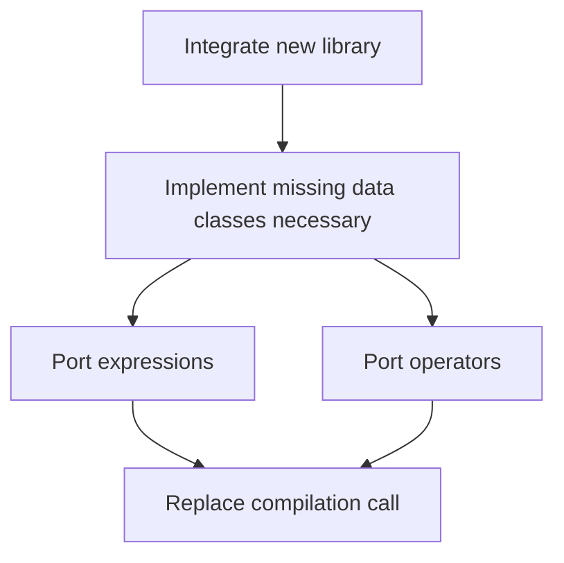

# The Problem
The current nautilus query compiler has some limitations that make it difficult to implement certain operators. 
One of the limitations is that it does not support the use of the standard library.
Another one is that it does not support the use of primitive C++ data types.
Finally, by extending the new library with std::tuple we can return multiple values from a function, which is not possible with the current Nautilus query compiler.

# Goals and Non-Goals
We would like to replace the existing Nautilus query compiler with the [NebulaStream library](https://github.com/nebulastream/nautilus/).
The maintainer of the NebulaStream library is Philipp (EX-DIMA), and he has agreed to help us with the integration as well as with the implementation of any missing components.
We do not want to discuss the use of other query compilers at this time.

[//]: # (# &#40;Optional&#41; Solution Background)

# Our Proposed Solution
In our proposed solution, we have to complete the following steps. 
Some (sub-)steps can be done in parallel, but some (sub-)steps depend on the completion of other steps.

## Integrate the NebulaStream library into the NebulaStream project.
After this step, we should be able to use the NebulaStream library in our project.
This means that we can include the library in our project and use the library's classes and functions.
We plan on including the NebulaStream library as a submodule in our project under `nes-nautilus/include` for the long term.
To make the removal of the old Nautilus library easier, we will include the NebulaStream library in `nes-nautilus-new/include` for the short term.
We will create a folder `nes-nautilus-new/include/Interface`, where we will place all the missing data classes,  e.g., `Record`, `RecordBuffer`, `MemoryProvider`, etc.

## Implement missing data classes necessary for our current interface
In our current interface, we have some data classes that are not yet implemented in the NebulaStream library.
Moreover, the nautilus library plans on being a general data processing framework.
Therefore, we have to implement at least the following classes under `nes-nautilus-new/include/Interface`:
- `Record`
- `RecordBuffer`
- `MemoryProvider`
- [`ExecutableDataType`](https://github.com/nebulastream/nemo/blob/main/src/operators/DataTypes.hpp)

Once we have implemented these classes, we plan on creating a simple filter operator that uses these classes to test if the implementation is correct.
To this end, we will create a new folder `nes-execution-new` where we will place the new operator.

## Investigate what libraries are currently supported by the NebulaStream library and what libraries are missing to support our expressions.
This step can be done in parallel with the porting of the existing operators to the new NebulaStream library.
We have to investigate what libraries are currently supported by the NebulaStream library and what libraries are missing to support our expressions.
Afterward, we have to implement the missing libraries in the NebulaStream library and can then port all of our expressions to the new NebulaStream library.
Similar to the previous step, we will create a new folder `nes-execution-new/include/Expressions` where we will place the new expressions.
Depending on the state of the plugin support, we either use the NebulaStream plugin support or use what we currently have for lowering the expressions.

## Port the existing operators to the new NebulaStream library.
After, we have implemented the missing data classes, we can start porting the existing operators to the new NebulaStream library.
This should be quite straightforward, as we have to solely change the syntax but not think about how to implement the operators.
We will place the new operators in the folder `nes-execution-new` and remove the old operators in the folder `nes-execution`.
This way, we can easily gauge the progress of the porting process.

## Replace the existing compilation call with the NebulaStream library's compilation call
In this step, we have to replace the existing compilation call with the NebulaStream library's compilation call.
We therefore have to replace the call to the old Nautilus library with the call to the new NebulaStream library.
This step should be quite straightforward, as we have already implemented the missing data classes and ported the existing operators to the new NebulaStream library.
Once we are done with the replacement, we can also remove the old Nautilus files from our project.
A lot of them will be located under `nes-nautilus`, so it should be easy to remove them.

## Sequence Diagram of the Steps
To have a quick overview what steps depend on each other, we have created a diagram that shows in what order the steps should be completed.

# Alternatives
As discussed in the goals and non-goals section, we do not want to discuss the use of other query compilers at this time.
Additionally, we do not want to implement the most optimized null handling solution at this time.

# Open Questions
An open question is the implementation of the data types in regard to the handling of null values.
There are pros and cons on implementing null values in the data types in this sub-epic.
We have to anyway think about how our DataType class should look like.
Therefore, we can also think about how to handle null values in the data types, but we do not have to implement the most optimized solution at this time.
On the other hand, we should not spend too much time on this, as we can always add null support in a later step.

# (Optional) Sources and Further Reading
- https://github.com/nebulastream/nautilus/
- https://github.com/nebulastream/nemo/
- https://github.com/nebulastream/nemo/blob/main/src/operators/DataTypes.hpp

[//]: # (# &#40;Optional&#41; Appendix)
