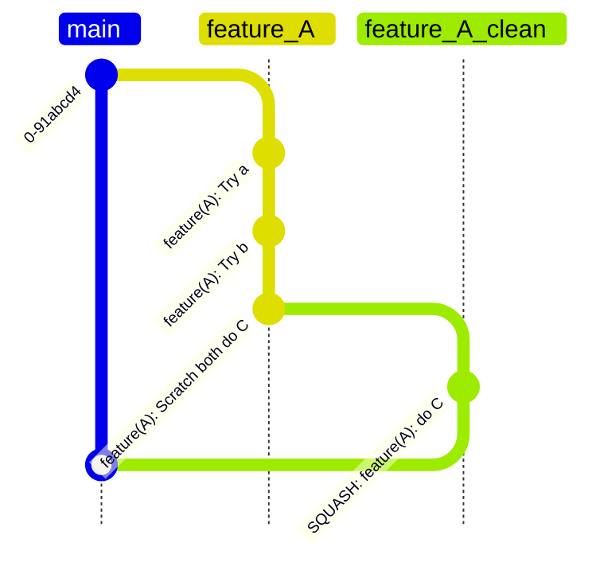

# The Problem

(**P1**) Demos struggle to find a stable version and usually start from scratch using the current master, freezing the
master until the demo is in a *stable* version.

(**P2**) The current state of features is lacking documentation, and there are no processes in place to determine if a
certain feature is supported in the current version or not.
This makes it hard to prepare for demos, keep track of features that require improvements or are missing

(**P3**) Currently, we run our CI per PR and create a new release after every merge into the main branch. This, in turn,
triggers an additional CI run. The CI Commits hide the original author of the affected code.

# Goals and Non-Goals

(**G1**): Semantic Versioning, Stable Versions, Nightly Master. We introduce a protocol of releasing a new stable
version. Users of the system can pick the latest stable version if they do not require (unstable/nightly) features.
Stable versions enable easy on-boarding of new users, as we can reliably hand out a well tested version of the system,
it enables reliable demos, and offers a good start for new prototyping efforts. The release of executable artifacts is
tied to the versioning scheme to trace issues back the relevant state of codebase. (**P1**)

(**G2**): Document requirements and mechanisms for tracking of features. We will distinguish between features and
prototypes, which may end up becoming features. We should have a concrete set of requirements that move a prototype into
a feature. Features require automated testing, documentation, and, most importantly, an owner. Features do not
necessarily need to be stable (more in [features](#features)) and might undergo substantial changes before integration
into the
stable version. It will be the owner's task to track the feature's current state. (**P2**)

(**G3**): Limit the number of CI Commits, by reducing the overall number of releases. The reduction of releases will
not affect the recency of our docker images. We propose distributing docker images for local development, stable,
nightly, and on-demand for any branch. (**P3**)

(**NG1**): Move CI-Actions to the PR-Review process. This is covered in
the [Review Process Design Document](https://github.com/nebulastream/nebulastream-public/pull/76)

# Proposed Solution

The current idea is to have two versions.

- Stable version (with a release number)
- Nightly version (current main branch)

We enforce formatting rules during the PR-review process to reduce the number of automated CI commits.

It is also unnecessary for an automated CI to commit changes if we enforce code formatting during the PR and the version
is only bumped at a release. We anticipate the release process to be more evolved as it encompasses stability tests
removing partial features in addition to bumping the version number, which we can not do automatically. (**G3**)


This idea proposes that we may introduce unstable features into the current `main` branch at any time (assuming they
meet our code-quality criteria). This should not discourage the use of separate feature branches and should usually
only be used if no major merge conflicts are anticipated or if the code is assumed to be stable within the next
milestone. For changes requiring experimentation, we prefer feature branches to prevent non-atomic commits. The
following example shows how feature `A` tries multiple approaches while committing to the main
branch. If these changes can be anticipated, a feature branch should be used. The feature branch is cleaned up (in this
case, a simple squash) before merged into the main branch. Bug fixes should be directly integrated into the main branch.




## Release process

When a release is planned (e.g., after a milestone), a new release-candidate branch from the main branch is created with
the name of the anticipated release version followed by the release candidate number (usually -rc1). We *loosely*
follow [semver](https://semver.org/lang/de/), since currently, we do not *need* to guarantee API stability. We are only
concerned with `minor` and `patch` versions, fixing the `major` version at 0. Roughly speaking, introducing a new
feature increases the `minor` version, while fixing (critical) bugs only increases the `patch` version. (**G1**)

The goal of the `release candidate` is to stabilize the (potentially) unstable main branch and remove unwanted features
(maybe due to instability or incompleteness). Once stability tests pass, we create a new stable release. Fixes
introduced in the stabilization process may or may not be reintroduced into the main branch. The idea is that the
release branch may be (sort of) detached from the main branch.

If we picked a poor time to prepare a stable release, the release candidate could be dropped. Future attempts for a
stable release will create a new `release-candidate` branch (-rc2), which may branch off a different commit of the main
branch. The reason for enumerating the release candidate is that a release candidate effectively is a beta version which
we could hand out to interested people, guaranteeing that the rc is reproducible might be a requirement in these
scenarios.

### Note on Commits

Ideally, the review process should ensure that commits merged into the main branch
are [atomic](https://www.aleksandrhovhannisyan.com/blog/atomic-git-commits/). This drastically reduces the burden of a
new stable release, as undesired changes can simply be
dropped and removed from the `rc`-branch with minimal merge conflicts.

## Features

A feature describes the system's core functionality and might contain sub-features. A stable version includes a set of
features that are guaranteed to work in the state in which they are documented. Introducing new features requires
feature-specific tracking of supported operations. Issues and commits targeting features will be appropriately labeled
to help create a stable version. (**G2**)

### Example of features

For example, NebulaStream is a compiling SPE that targets MLIR. Its compiling nature is a feature, and support for MLIR
is a sub-feature.

Another example is query merging as a feature, and specific rules of query merging, e.g., combing conditionals, are
sub-features.

### Creation of Features

A feature usually evolves from a prototype, which is usually created during the design document process. If a design
document is accepted, the design document's owner will be the feature's owner. The owner creates the relevant
documentation documenting the feature's current state and works on integrating the prototype into the system. The public
status of the feature will be maintained in the feature list within the README starting in the
`Under Development` status. The owner creates an `EPIC` umbrella issue for the issue and which links to smaller issues
in a task list. We use [Conventional Commits](https://www.conventionalcommits.org/en/v1.0.0/) to tag commits targeting a
specific feature. Plugins like [Conventional Commit](https://plugins.jetbrains.com/plugin/13389-conventional-commit) can
be configured to limit the number of scopes for commit types. The available scopes for the `feat` type are limited
to existing and documented features.

```
feat(QueryMerging): Enables query merging for sliding windows
```

### Feature Status

Unless a feature is in the Unmaintained state, the feature is associated with at least one owner. The owners are
responsible for maintaining a public feature status, declaring a feature and (its sub-features individually) as either
`Under Development`, `Unstable`, `Stable`, or `Unmaintained`.

Features that are `Under Development` usually reside in a separate feature branch. If the feature looks promising, it
will be integrated into the main branch, assuming it meets the necessary code quality, test coverage, and documentation.
Once integrated into the main branch, a feature is considered `Unstable`. An `Unstable` feature is only available in the
current
nightly system version. At this point, the feature will be part of our stability test suite and used by the
developers and earlier adopters. During the unstable phase, the features may undergo breaking changes, both from
internal
implementation details and from an outside user perspective. Subsequently, the documentation and integration tests are
subject to change.

A feature is considered stable if no further breaking changes are anticipated. Unit tests and integration tests cover
all of its advertised functionality and it has been integrated into the main branch passing our stability tests. If the
documentation lists usage examples, these examples must be integrated into the overall systems stability tests. The
feature rejects unsupported operations by returning an error message explaining the limitation:

```
MLIR Backend does not support modulo on 32-bit floating point
```

Describing the state of features in more detail is non-trivial as features differ in their requirements. For example,
a certain sub-feature of query merging is only enabled for certain types of windows, and the MLIR backend might only be
enabled for certain architectures. The detailed tracking and maintenance of the current state of features and
sub-features is the task of the feature's owner and is documented within the component's documentation.

The Review Process ensures that changes to a feature are properly documented within the feature state, including
regressions (e.g., dropping support for osx) (**G2**)

### Feature Integration

In the grand scheme of things, we are only interested in whether a certain feature is a core functionality of the
system. For example, does a system user require this feature, which might be transitive, and is the feature in a state
where it does not threaten the stability guarantees of the system? This also includes correctly reporting
not-implemented or missing functionality.

The first part is subjective and the maintainers' decision, while the latter part is dictated by whether the public
feature state is stable. The release process will remove commits targeting a feature that does not meet both criteria.

## Dealing with Critical Issues

If we encounter issues that threaten the stability of the current stable version, we introduce a path for one-off
fixes or critical issues to be integrated into an ad hoc patch version. The earlier graph shows how a new branch,
`v0.1.1-rc,` is created from the previous release. The commit fixing the critical issues is cherry-picked onto the
`v0.1.1-rc`. Assuming the stability tests succeed, a new version, `v0.1.1,` is released.

## Docker Images

We distribute NebulaStream in Docker Images. In its current state, creating Docker Images is cumbersome and usually
requires recreating the actions performed by the GitHub CI. We want to improve the process of building Docker images
for local testing by providing a script.

The Github CI builds and distributes additional Docker images for the following branches:

**Stable Versions:**
All stable versions are available from the docker registry. We tag the image with the version number `nes-worker:v0.1.1`
, and the `nes-worker:latest` refers to the latest stable version.

**Nightly Versions:**
The current main branch version is available via `nes-worker:nightly`. Versions of specific commits need to be built
manually using the provided script.

**On Demand:**
The CI can be manually instructed to create a docker images based on a specified branch. The resulting image will be
tagged `nes-worker:<branch-name>`.

### Additional Images

We may consider offering additional images with different build configurations, allowing sanitized or hardened builds to
be used for testing or debugging purposes. These images shall be explicitly marked as `nes-worker-debug:<version>` to
distinguish them from release builds.

## Docker Images for non-Linux development environments

Instead of offering native support for non-Linux Operating Systems, we should provide a Docker Image that contains the
required software to build the standalone worker (Not sure about future Plugins) on non-Linux machines.

## Executable image for distribution

There is an unavoidable trade-off between releasing a fully optimized build, which may offer the utmost performance
available and releasing a version that still contains debug symbols and low-overhead application hardening to catch bugs
during real usage of the system. More concretely, the performance build may directly remove `debug` and `trace` calls
during compilation, whereas the release version still contains them to enable `debug` or `trace` during runtime.

We propose the following naming scheme for both versions:

- **nes-worker:v0.1.1**: Contains debug symbols, Debug Log calls, and lightweight binary hardening.
- **nes-worker:v0.1.1-performance**: The fastest version possible

# Alternatives

There are plenty of alternatives for handling versioning numbers, `semver` is the industry standard for open-source
versioning.

- We always increase the patch version until significant changes (which could be subjective). This is how it is handled
  right now.
- Bumps to the minor versions could be done at every milestone regardless of introducing new features.
- We could use a timestamp or a date (Like Ubuntu)

This [stackoverflow post](https://stackoverflow.com/questions/20755434/what-is-the-master-branch-and-release-branch-for/20755706#20755706)
describes a git branching scheme that uses the main branch to only consist of stable releases. This means that the main
branch is always the latest stable version, and commits on the main branch reflect prior stable versions or critical
fixes. This scheme effectively introduces an additional development branch, which is used as we propose using the main
branch. The only real difference is that the main branch is a continuous branch where release candidates are merged
into. It is a matter of taste, but many public open-source projects use our proposed scheme.
