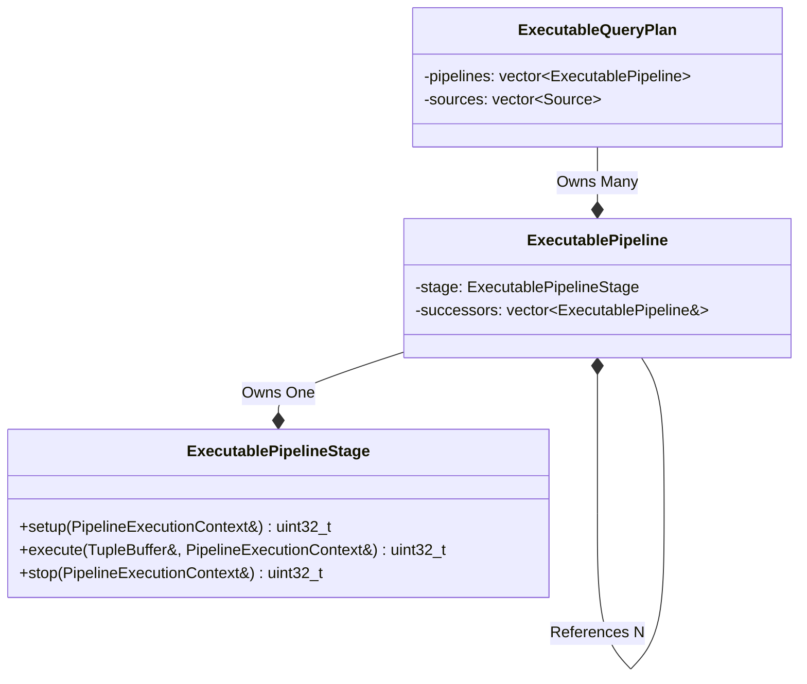
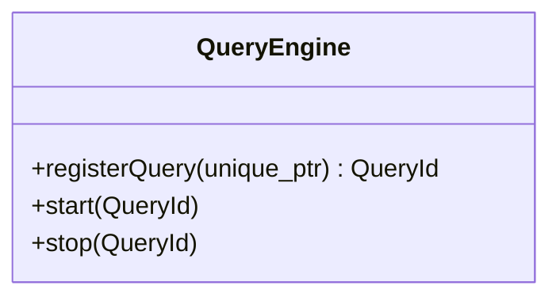
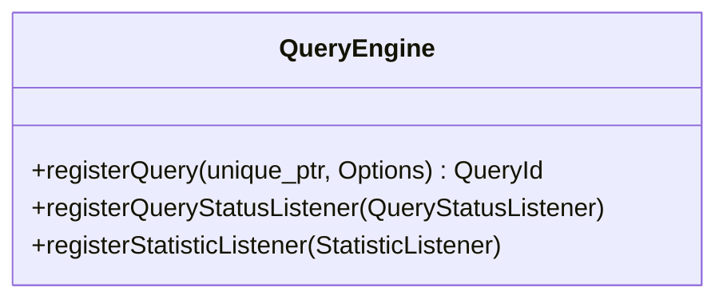
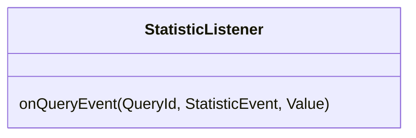
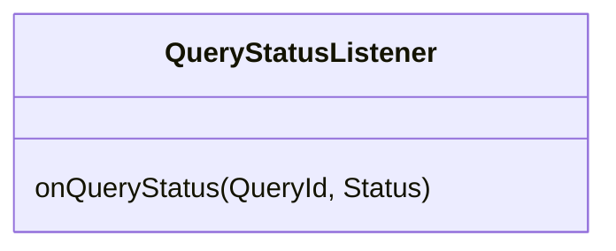
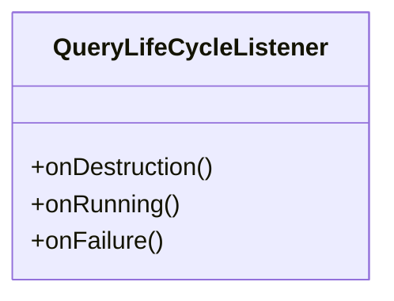
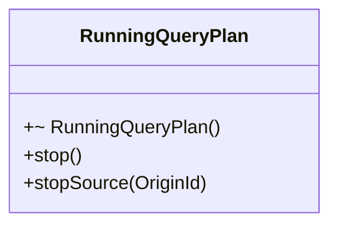
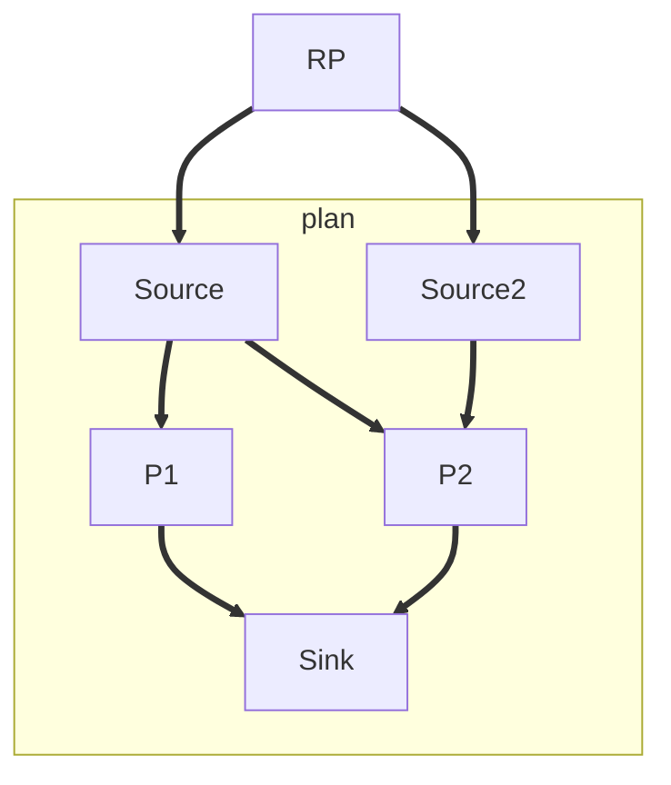
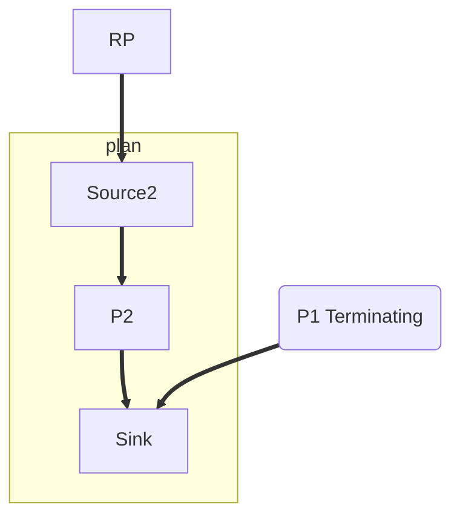
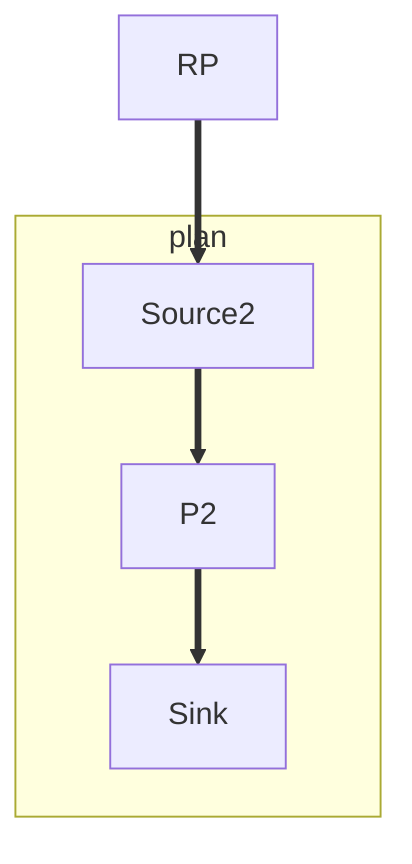

# The Problem

- Query Manager is a central piece, it distributes work across a participating worker threads
- In its current state it has not been reliable, while it might work on the happy path,
- Spaghetti web of reconfiguration messages + reference counting
- Poorly Documented not covered by any unit test / Thus hard to understand
- Proliferated throughout the code base. The QueryManager was frequently used as a central hub, which required every
  component in the system to know about the QueryManager:
  E.g. The QueryCompilation needs to about the QueryManager. The ExecutableQueryPlan exposes details of synchronization
  needed within the query manager. This creates an issue where most of the components are not usable in isolation.
- It is unclear how interaction with the QueryManager should work: Some Function e.g. QueryRegistration can happen
  asynchronous, while other functions like Stopping a query will block the requesting thread. This is reflected in poor
  documentation as it is unclear which operations are handled by which thread
- The QueryStatus has evolved over the years describing 7 different query states. Some of these states are currently not
  used in the system and some are redundant. Only with careful tracing of the source code you are able to understand
  under which circumstances a state is reached.

# Goals

- **G1** We need a QueryManager! The QueryManager should be able to start and stop queries concurrently.
- **G2** The QueryManager should provide a small interface. Registering, Starting and Stopping of Queries. Statistics
  and Events are only exposed via listeners. All external functions will never block the requesting thread and are
  solely handled by internal worker threads. The Internals of the QueryManager should not be reflected anywhere out side
  of the QueryManager itself.
- **G3** The QueryManager should be tested. It should be *easy* to reproduce failing scenarios.

# Non-Goals

This design document covers the groundwork of the QueryManager which includes starting, running, stopping queries and
gracefully handling internal and external events.

We will not cover future (or legacy) features such as:

- There will not be support for multiple Queues or pinning of Queries to a subset of workers.
- Queries are one-shot. If a Query stops or fails it will not be started again. A new query has to be registered.
- Extensive statistic collection. The QueryManager will expose statistics, but it will not cover all statistics
  available in the legacy system
- ... (This list can be extended)

# Solution Background

In previous design documents we have tackled our source implementations and how we want to invert the dependency of
sources onto the query manager.
We were able to achieve this by injecting a `EmitFunction` into the `SourceThread` which allows the `SourceThread` to be
tested independently of the QueryManager.
The QueryManager is still aware of the DataSources (at least of the abstract interface), which is fine, because in the
end the QueryManager has to manage it.

This design document attempts to tackle the other dependencies, most notably the `PipelineExecutionContext` (PEC), which
in the legacy system is
constructed during the query lowering. The PEC is the escape hatch for our `ExecutionPipelineStages`, so they can get
access to a buffer manager or emit work for its successors.

## Executable

The NebulaStream legacy `ExecutableQueryPlan` (`EQP`), was largely involved in the query runtime. In addition to
containing the Executable components, like the individual pipelines stages and sources the EQP
also kept track of how many Terminations are missing (or how many references still exist), it contained the Termination
future/promise pair and tracked the current status of the Query.
Obviously, the `EQP` has a reference to the `QueryManager`, to notify the query manager when the plan has completed or
any failure occurs. Carrying around all these information, made it hard to construct, as whoever was constructing the
`EQP` also needed to provide a reference to the `QueryManager`.

Within the design document we want to reduce the `ExecutableQueryPlan` to only the necessary components and leave the
runtime management logic to the internals of the QueryManager. The legacy `ExecutableQueryPlan` stripped of all
additional
logic is the following:

All computation happens within a `ExecutablePipelineStage`, which itself is just an interface which in the past used
to have multiple implementations: Interpreted or a Compiled. With the recent switch towards an externally maintained
Nautilus Library, we are able to reduce that to a single `CompiledExecutablePipelineStage` implementation. However, the
interface enables use to test the QueryManager without depending on the `QueryCompiler`. The `ExecutablePipelineStage`
only implements three methods, `setup`, `execute` and `stop`. `setup` and `stop` are called once, giving the pipeline a
chance to initialize and to clean up afterward. `execute` is called many times for each TupleBuffer. The
`ExecutablePipelineStage` can use the `PipelineExecutionContext` to gain access to the Memory System or runtime
parameter
like the number of threads or the current thread id. However, the most important aspect of the PipelineExecutionContext
is the `emit` function which allows a `ExecutablePipelineStage` to "emit" work to all its successor pipelines.

`ExecutablePipelines` connect `ExecutablePipelineStage` in a DAG. Every `ExecutablePipelines` either has a predecessor
`Source` or `ExecutablePipelines`.

Lastly the `ExecutableQueryPlan`, owns all `Sources` and `ExecutablePipelines`, thus fully describing a Executable
Query.



## Events

During runtime of a query we anticipate the following events, these events can be used to generate Test cases and all 
various combination of Events should be handled gracefully.

### Internal

Internal events originate from the QueryEngine interface, which could originally originate from the GRPC Api.
A User is able to request an idle query to be started or a running/starting query to be stopped. Usually these events
are generated on the GRPC Thread.

We call these events
`InternalStart` and `InternalStop`.

### External

External events originate from one of the `Sources` participating in the Query. These events are generated on the
`SourceThread`. Currently, a Source is able to emit a `EoS` or a `Failure` (in addition to `TupleBuffers` during normal
execution)

This implies, that currently neither `PipelineStages` nor `Sinks` are allowed to fail. Failures in the PipelineStage
should never happen and should generate a crash. Sinks on the other hand may have to be handled in the future, right
now, we assume a sink will implement some form of buffering or voiding of data if it is not able to write data into its
sink implementation.

# Our Proposed Solution

## Interface of the QueryEngine

We want to make the interface as simple as possible while still allowing future extensions.

To an external user of the QueryEngine, we allow 3 Operations:



**registerQuery**: Registers a ExecutableQueryPlan. The QueryPlan is now managed by the QueryEngine, in return a QueryId
is used to identify the registeredQuery plan for the other operations.

**start**: Starts the ExecutableQueryPlan identified via the QueryId. If the query is already running this is a noop.

**stop**: Starts the ExecutableQueryPlan identified via the QueryId. If the query is currently idle this is a noop.

### Flexibility and Extensibility



In the future we may enable different policies when it comes to query execution. A user of a query may change the
default
behavior of failing sources or handle out of memory scenarios differently. The register Query operation receives a
Options struct which the user can customize as he pleases. The different polices can be queried at the different if
any runtime event could use them. In its current state there will be no apparent need for the options so they will be
omitted.

In the previous implementation of the QueryManager the statistic collection has been integrated tightly into the
QueryManager.
The new design decouples emitting the statistic events from handling them.



### Query Status

The QueryStatusListener receives query status events. A similar approach is currently used by the existing
QueryManager. A Key distinction is that the does not need to be a direct relation between internal mechanisms used to
track the status of the query and the external query status.
E.g. while the QueryEngine internally might have multiple stages if query initialization, the query status listener
does not need to be aware and can happily live with a reduced number of query states.



### Life Cycle of a Query

- After QueryPlaning and Optimizations --> ExecutableQueryPlan
- ExecutableQueryPlan is a "Packaged" ExecutableQueryPlan.
    - It just contains the executables and how they are wired together. It is not concerned with how it is executed
    - ExecutableQueryPlan is the output of the QueryCompiler and the Input into the QueryManager
- Internally the QueryManager maintains map of query id and the query state.
- The EQP is `registered` inside the QueryManager. This creates a QueryId which now uniquely identifies this query
- as long as the query is not started it remains in the idle state.
- a `start` request with a queryId moves the idle query into the starting state.

#### Starting a Query

- The initial `start` emits a StartTask into the TaskQueue. No external request (from a non worker-thread) will ever
  manipulate the query state. All manipulations are executed internally via the ThreadPool.
- The Worker thread handling the start locks the target query state (if it exists) and transitions the
  ExecutableQueryPlan into a RunningQueryPlan (via the `RunningQueryPlan::start` method). This transition will emit all
  pipeline initialization tasks. Once all pipelines are initialized the queries sources are started. Once all sources
  are started the query is moved into the running state.
- The RunningQueryPlan is not aware of the state keeping of the QueryManager. It exposes a QueryLifecycleListener
  interface:



- The QueryManager registers its own listener which is responsible for moving the query into a new state.
    - e.g. the onRunning handler moves the query from the starting state into the running state.
- The onDestruction() is called once the entire query graph has been destroyed. The RunningQueryPlan is still alive
- When the RunningQueryPlan is destroyed all no listeners are called.

#### Stopping a Query

- the RunningQueryPlans interface offers modification to the lifetime of the query



- stopSource: will stop a specific source of the RunningQueryPlan. Internally the running source will be destroyed which
  causes the underlying source handle to be stopped (which may block) and destroyed, decreasing the ref count to all
  successor pipelines.
- stop: will perform a soft stop of the query plan.
  Stop is not a real member function, rather it is a free function, which is supposed to be called like this:
    ```c++
        auto stoppingPlan = RunningQueryPlan::stop(std::move(runningPlan));
    ```
  The StoppingPlan keeps the lifecycle listener and all callbacks alive while dropping all sources and pipelines.
  Eventually this will cause the stoppingQueryPlan to emit the onDestruction event.
  The SoftStop is implemented by destroying all sources which will release the references to all successor pipelines.

  The pipeline destructor will register a pipeline Termination Task (which for the time being keeps the pipeline alive
  and all referenced
  successors). If the TerminationTask is handled by a worker thread, the Pipeline stop method will be invoked and the
  TerminationTask will release the pipeline, which causes the chain of operators to slowly be terminated.


- destroying: The destructor of the running query plan (only if not implicitly destroyed within the stop function)
  causes all
  sources and pipelines to be dropped immediately, without causing any further actions (e.g. pipeline terminations).
  Sources are still closed, as it is likely they may have acquired resources during the open which have to be released
  within the close call. The onDestruction callback will be triggered from the current thread.

#### Note About Threads

Any of these operations could cause the LifeCycleListener hooks to be triggered, from the thread issuing the request.
This could be problematic if a LifeCycleHook tries to acquire a lock which is currently held by the thread issuing
the request

#### Other Components

##### RunningSource

The RunningSource is a wrapper around the SourceHandle. During construction, it initializes and starts the datasource,
while
during destruction the SourceHandle is stopped and destroyed.
The RunningSource is responsible for construction the EmitFunction which is used within the SourceImplementation. The
EmitFn
also contains the strong reference to all successor pipelines.

#### RunningQueryPlanNode

RunningQueryPlanNodes are the connection from the RunningQueryPlan Graph to the underlying executable pipeline stages.
This class enables the ExecutableQueryPlan to be fully oblivious about the actual logic used for executing the
QueryPlan. Previously all runtime related logic have been placed in the ExecutableQueryPlan making it hard to use in
tests.

The RunningQueryPlanNode occurs in two distinct stages. Initially during query start the RunningQueryPlan is
constructed.
SharedPtr are used to implement the reference counting between successor and predecessor pipelines. As long as a
predecessor exists its successor will be alive, **there can never be cycles in the query plan**.
The RunningQueryPlan just grabs the graph at its roots (the sources).

If RunningQueryPlanNode during initialization of the query plan the pipelines setup method was invoked the node is
marked as `requiresTermination`.
This flag is checked during the destruction of the `SharedPtr` RunningQueryPlanNode if all its predecessors have been
dropped.

This check happens in a custom deleter which is registered during SharedPtr creation. The deleter wraps the
RunningQueryPlanNode in a
unique_ptr (as it is now the only owner, otherwise the destructor would have not been called). If termination is
required a TerminationTask
owning the RunningQueryPlanNode is emitted. The RunningQueryPlanNode still has a reference to all successors so all
successors will still be alive.

When the Termination Task is handled the RunningQueryPlanNode is released (this time for sure), and all references to
its successors are removed, which may cause them to be destroyed in the same way.







Source:

- We only report externally cause source events
- Externally received EoS
- Externally received Error
- If a source was stopped via the internal stop no events for the source are emitted. Likewise, if one of the sources
  causes the query to fail only the failing source is reported.

# Proof of Concept

- demonstrate that the solution should work
- can be done after the first draft

# Alternatives

- discuss alternative approaches A1, A2, ..., including their advantages and disadvantages

# (Optional) Open Questions

- list relevant questions that cannot or need not be answered before merging
- create issues if needed

# (Optional) Sources and Further Reading

- list links to resources that cover the topic

# (Optional) Appendix

- provide here nonessential information that could disturb the reading flow, e.g., implementation details
