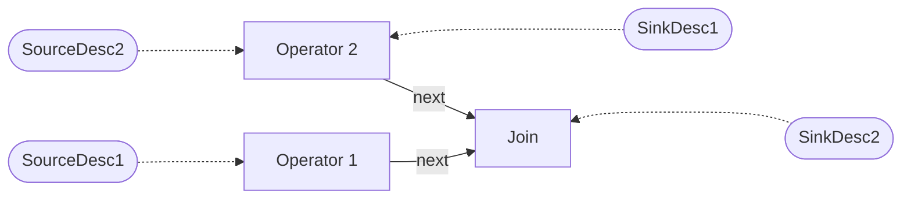
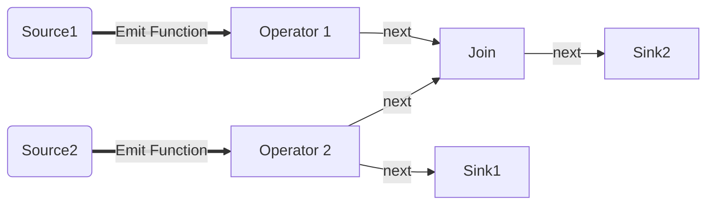
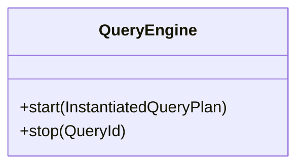
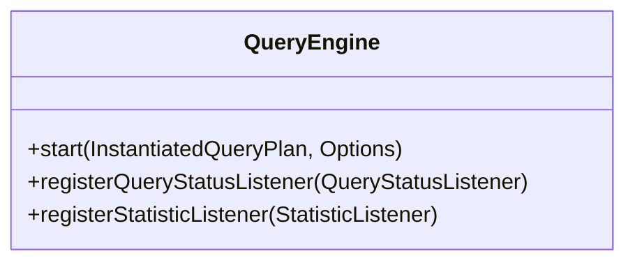
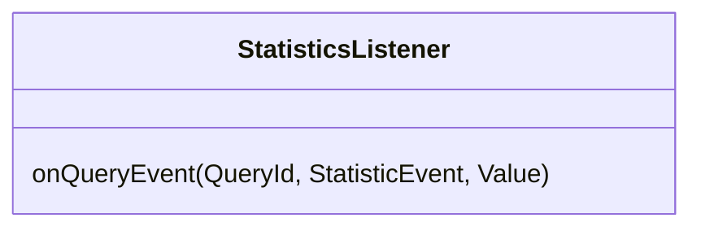
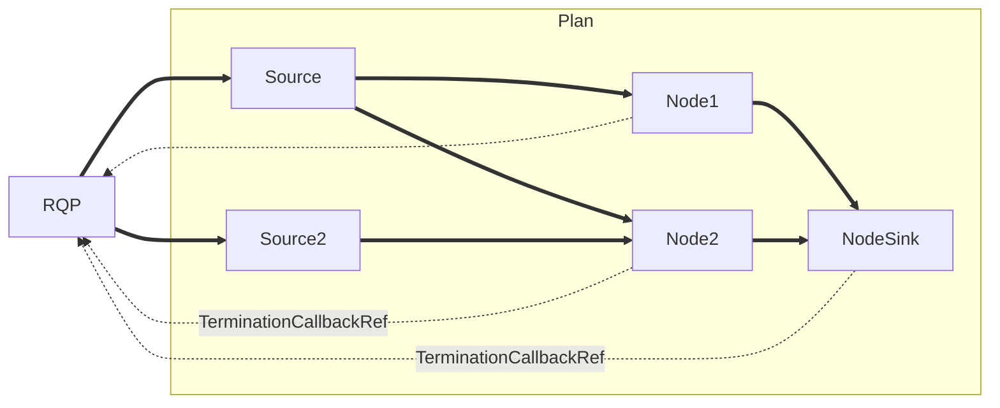
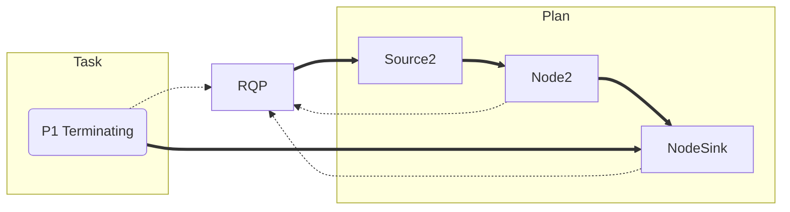
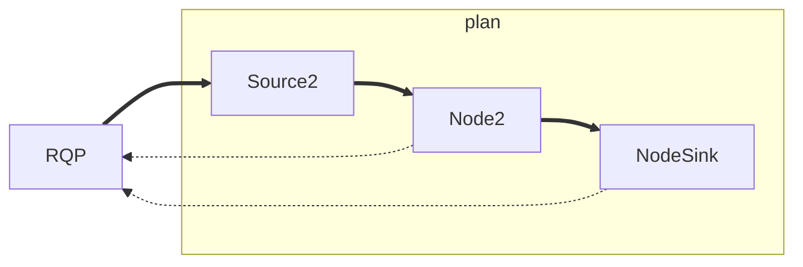

# The Problem

The `Query Manager`, while serving as a critical centralized component for work distribution across worker threads, has evolved into a problematic monolithic hub that undermines system reliability and maintainability.
Its pervasive presence throughout the codebase has created tight coupling, forcing components like QueryCompilation and ExecutableQueryPlan to directly depend on `Query Manager` internals.
This architectural approach has resulted in components that cannot be tested or used in isolation, with implementation details of synchronization logic leaking across system boundaries (**P1**).

The component's concurrent operation model exhibits significant design flaws, characterized by an inconsistent threading model where operations arbitrarily mix asynchronous and synchronous patterns.
Query registration operates asynchronously, while query termination blocks the requesting thread, yet these crucial behavioral differences remain undocumented (**P2**).
This confusion is compounded by a complex web of reconfiguration messages and reference counting mechanisms, alongside a bloated state machine that defines seven distinct query states—some redundant or unused—with opaque transition logic that can only be understood through detailed source code analysis (**P3**).

The absence of unit tests and comprehensive documentation has created a significant barrier to understanding and maintaining the `Query Manager`, leading to a system that may function in simple scenarios but lacks reliability in edge cases (**P4**).
This technical debt is particularly evident in the way the `Query Manager` has been used as a central hub, requiring widespread knowledge of its internals across the system.
The resulting architecture has created a situation where components are tightly coupled, documentation is insufficient to understand thread ownership and responsibilities, and the system's overall reliability is compromised.
These issues collectively impair development velocity, increase the risk of regressions, and make it challenging to onboard new developers or implement new features.

# Goals

At its core, our system requires a robust `Query Manager` capable of handling concurrent query operations, providing essential functionality for starting and stopping queries while maintaining operational reliability.

(**G1**): This foundational requirement must be balanced with architectural clarity and simplicity: the `Query Manager` should expose only a minimal, well-defined interface comprising core operations—query registration, initiation, and termination—while keeping its implementation details strictly encapsulated.
This encapsulation extends to the exposure of system statistics and events, which should be accessible solely through a dedicated mechanism, not via ad-hoc modifications of the `Query Manager` (**P1**).

(**G2**): The redesigned system will emphasize asynchronous operation, ensuring that all external function calls are non-blocking and delegated to internal worker threads for processing.
This architectural decision promotes system responsiveness and scalability while maintaining clear boundaries between the Query Manager's internal operations and its external interfaces (**P2**).

(**G3**): Crucially, the system has to move away from its current hybrid approach of mixing system-wide blocking reconfiguration messages with reference counting, instead relying solely on reference counting for resource management and synchronization.
To support this model, we'll need a clear separation between internal state management and external state representations, enabling higher-level components (i.e., the `NodeEngine`) to build sophisticated state tracking mechanisms while the `Query Manager` maintains minimal, essential state management internally **P3**).

(**G4**): Testing and reliability are paramount in this refactoring effort.
The new implementation must be comprehensively tested, with particular emphasis on making it straightforward to reproduce edge cases and failure scenarios.
This focus on testability not only ensure system reliability but also serve as living documentation for the Query Manager's behavior and capabilities.
By creating a test suite that thoroughly exercises the system's functionality, we'll provide developers with clear examples of proper usage patterns and expected behavior, facilitating both maintenance and future development efforts (**P4**).

# Non-Goals

This design document covers the groundwork of the Query Manager which includes starting, running, stopping queries and gracefully handling internal and external events.

We will not cover future (or legacy) features such as:

- The `Query Manager` will not be support for multiple Queues or pinning of Queries to a subset of worker-threads.
- Queries are one-shot. If a Query stops or fails it will not be started again. A new query has to be registered.
  Caching of compiled queries has to happen in a different component.
- Extensive statistic collection. The `QueryManager` will expose statistics, but it will not cover all statistics available in the legacy system.

# Solution Background

In previous design documents, we have tackled our source implementations and how we want to invert the dependency of sources onto the query manager.
We were able to achieve this by injecting an `EmitFunction` into the `SourceThread` which allows the `SourceThread` to be tested independently of the Query Manager.
The Query Manager is still aware of the Sources (at least of the abstract interface), which is fine, because in the end the Query Manager has to manage them.

This design document attempts to tackle the other dependencies, most notably the `PipelineExecutionContext` (PEC), which in the legacy system is constructed during the query lowering.

The `PEC` is the escape hatch for our `ExecutionPipelineStages`, so they can get access to a buffer manager or emit work for their successors.

## Executable

The NebulaStream legacy `ExecutableQueryPlan` (`EQP`), was largely involved in the query runtime.
In addition to containing the Executable components, like the individual pipelines' stages and sources the EQP also kept track of how many pipelines have not yet terminated (or how many references still exist), it contained the termination future/promise pair and tracked the current status of the Query.
Previously, the `EQP` has a reference to the `QueryManager`, to notify the `QueryManager` when the plan has completed or any failure occurs.
Carrying around all this information made it hard to construct, as whoever was constructing the `EQP` also needed to provide a reference to the `QueryManager`.

The legacy `ExecutableQueryPlan` **stripped of all additional logic** is the following:

All computation happens within an `ExecutablePipelineStage`, which itself is just an interface which in the past used to have multiple implementations: Interpreted or Compiled.
With the recent switch towards an externally maintained Nautilus library, we are able to reduce that to a single `CompiledExecutablePipelineStage` implementation.
The `ExecutablePipelineStage` only implements three methods, `start`, `execute` and `stop`. `start` and `stop` are called once, giving the `ExecutablePipelineStage` a chance to initialize and to clean up afterward.
The worker threads call `execute` once for each `TupleBuffer` (more precisely.
The `ExecutablePipelineStage` can use the `PipelineExecutionContext` to gain access to the Memory System or runtime parameters like the number of threads or the current thread id.
However, the most important aspect of the `PipelineExecutionContext` is the `emit` function, which allows a `ExecutablePipelineStage` to "emit" work to all its successor pipelines.

Each `ExecutablePipeline` owns a single `ExecutablePipelineStage`, and references multiple successor `ExectuablePipelines` or `Sinks` to create the DAG.
Backward references are not explicitly maintained, but effectively every `ExecutablePipeline` has at least one predecessor `Source` or `ExecutablePipeline`.

Lastly the `ExecutableQueryPlan` owns all `Sources`, `Sinks`, and `ExecutablePipelines`, thus fully describing an Executable Query.


## Events

Right now the only system events are: `QueryStart` and `QueryStop`.

The `Query Manager` reduces all possible runtime events to a fixed set of events, which could occur in arbitrary order.
Any combination of events should be handled gracefully, potentially terminating a single query without influencing other queries.
Test cases construct scenarios of events occurring in arbitrary order (**G4**). We differentiate between runtime events originating internally in the system or externally via data sources.

*The legacy system made these assumptions implicitly; the refactored version only exposes interaction with the query engine via these runtime events.*

### System

System events originate from the `Query Manager` interface, which could in turn originate from the gRPC API.
A user can request to start an idle query or to stop a running/starting query. Usually, the gRPC Thread generates these events.
In the future, a coordinator or internal house-keeping could trigger a system event, not just the gRPC interface.

### Source

Source events originate from one of the `Sources` participating in the Query. These events are generated by the `SourceThread`.
Currently, only `Sources` are able to emit an `EoS` or a `Failure`, in addition to `TupleBuffers` during normal execution.

This implies that currently neither `PipelineStages` nor `Sinks` are allowed to fail.
Failures in the `PipelineStage` should never happen and should end in a crash. Sinks on the other hand may have to be handled in the future.
Right now, we assume a sink will implement some form of buffering or voiding of data if it is not able to write data into its sink implementation.

The Proof of concept implements error handling for all pipelines and fails only the associated query. 
In the current state, we prefer stability of the system over potential memory corruption during pipeline failures, but this hopefully changes with maturity of the system and its operators.

# Our Proposed Solution

A big issue the query engine has to deal with is that queries may come and go at any time.
We still have to uphold memory and lifetime guarantees in a highly multithreaded scenario.
We make heavy use of atomic reference counting via `shared_ptr` while allowing query cancellation via `weak_ptrs`.
The reference counting happens implicitly, reducing the risk of leaking references.

We use reference counting to implement incremental query termination, where predecessor pipelines, or sources, keep their successors alive until termination, incrementally terminating all pipelines of a query.

Lastly, we use callbacks to group source code relevant to a specific component that may run at different times in different contexts.
For example, multiple scenarios could cause a `RunningQueryPlan` to be destroyed.
However, we can define a single `onDestruction` handler when starting the Query.
The handler guarantees that we always unregister a Query and notify the `QueryStatusListener`, regardless of the circumstances.

## Renaming of Query Manager to Query Engine

To simplify the interface of the Query Manager, we reduce the responsibilities of the Query Manager to solely the execution of Queries.
The Query Manager no longer handles the registration of sources; in fact, the Query Manager does not know anything about the query internals; it simply provides an interface to start, run, and stop queries.
We shift the management of queries to a higher-level component.
Thus, we rename the `Query Manager` to `Query Engine`.

In the proof of concept, the `NodeEngine` handles query registration and query instantiation and passes the InstantiatedQueryPlan` to the `Query Engine.

## Query Instantiation

To separate the Sources/Sinks from the `QueryCompiler`, we only produce an `ExecutableQueryPlan`, which does not contain concrete source implementations.
The `ExecutableQueryPlan` will contain abstract descriptors and pointers to fix up the `QueryPlan` at a later stage.

Fixing up the `ExecutableQueryPlan` is called instantiation, which is currently handled in the `NodeEngine`.
Query instantiation instantiates sources and sinks by directly invoking the Source/Sink Provider and patching up all involved successor relationships.
The `EmitFunction` requires direct access to the TaskQueue and is thus only created during query start (or more precise: source start).

#### ExecutableQueryPlan



#### Instantiated Query Plan



## Callbacks

The new implementation makes heavy use of callbacks, which are usually implemented via lambda functions.
Internally it combines callbacks with reference counting to implement something that resembles a [Dead Man Switch](https://en.wikipedia.org/wiki/Dead_man%27s_switch): the registered callbacks are triggered once the last reference goes out of scope (**G3**).

```c++
struct InternalCallback {
    std::optional<std::functions<void()>> callback;
    ~InternalCallback(){
        if(callback){
            (*callback)(); /// detonate
        }
    }
}

struct CallbackOwner {
    std::weak_ptr<InternalCallback> holder;
    ~CallbackOwner(){
        if(auto strong_ref = holder.lock()) {
            holder->callback->reset(); /// disarm
        }
    }
}

struct CallbackReference {
    std::shared_ptr<InternalCallback> callback;
}
```

The creation of a callback will yield two components: The `owner` and a `reference`.
References can be copied which increments the reference count on the InternalCallback.
The owner is move only, it cannot be copied.

If the owner goes out of scope the callback is disarmed, e.g. it will not be triggered once all references go out of scope.
If all references go out of scope, the last reference will call the destructor for the `InternalCallback` which will call the registered callback assuming it has not been cleared.

This mechanism is used among other things for tracking if a `RunningQueryPlan` is still referenced and triggers the `onDestruction` callback once all pipelines are no longer referenced.

During query initialization, we use a callback (`PipelineSetupCallback`) to await the start of all pipelines. 
During that period, a query stop needs to disarm the callback by destroying the `CallbackOwner`.
Disarm prevents the `PipelineSetupCallback` from firing once the worker threads have skipped all pending tasks, as the query has already stopped.

## Interface of the Query Engine

We want to make the interface as simple as possible while still allowing future extensions (**G1**).
To an external user of the QueryEngine, we allow two Operations:



**start**: Starts the `InstantiatedQueryPlan` identified via the `QueryId`.
If the `QueryId` is already used, this function will not do anything.
`start` will insert a `Start` task into the `TaskQueue`, and the actual query start happens asynchronously on one of the worker threads.
Thus, it is impossible to directly report an error as another request could attempt to start the query simultaneously. Failures during query start (e.g., opening a source) are reported via the status listener.

**stop**: Stops the InstantiatedQueryPlan identified via the QueryId.
If the query does not exist, this is a no-op.
The requesting thread puts a `Stop` task into the task queue.
Query termination will happen asynchronously on multiple worker threads.
The system stop causes a graceful query termination, allowing all pipelines to flush their state toward the sinks.
The status listener will eventually report that the query has stopped.

### Flexibility and Extensibility

The query engine is complex in itself.
Future expansions will only increase its complexity, leaving it in a state where tracking down errors becomes painful.
However, the system will require insights into the query engine in the form of statistics and want to control certain aspects of query execution such as error handling.
We want to enable these future use cases without increasing the complexity of the engine itself.
For this, we expand the query engine interface to accept a `QueryStatus` and `Statistic` listener, which allows complexity to shift into other components (**G1**).



In the future we may enable different policies when it comes to query execution.
A user of a query may change the default behavior of failing sources or handle out of memory scenarios differently.
The start Query operation will receive an `Options` struct which users can customize as they please.
The different polices can be queried by the worker threads to influence how source events are handled.
In its current state there is be no apparent need for the options so they will be omitted.

In the previous implementation of the QueryEngine the statistic collection has been integrated tightly into the QueryEngine.
The new design decouples emitting the statistic events from handling them.
The current prototype exposes `start`/`stop` events for a query as well as individual task execution.
Other components (than the QueryEngine) can build more sophisticated statistics on top of these events.
For example, a component could keep track of all currently running queries, by monitoring the `start`/`stop` events.



The proof of concept emits statistic events for: `QueryStart`, `QueryStop`, `PipelineStart`, `PipelineStop`, `TaskStart`, `TaskCompleted`, `TaskEmitted`.
This "small" set of statistic events can answer most higher-level performance-related questions.
- How many queries are currently running?
- How many tasks are executed per second?
- What task takes the most time?
- How many tuples are processed per second?

### Query Status

The `QueryStatusListener` receives query status events.
A similar approach is currently used by the existing `QueryEngine`.
A key distinction is that we do not need to have a direct relation between internal mechanisms used to track the status of the query and the externally reported query status.
E.g., while the `Query Engine` internally might have multiple stages of query initialization, the query status listener does not need to be aware and can happily live with a reduced number of query states.
Query status events can be generated at different locations within the QueryEngine, e.g., in the `onDestruction` handler of a `RunningQueryPlan`.


To the outside, the `QueryStatusListener` represents the query in either of the states: `Running,` `Stopped`, and `Failed.`

### Life Cycle of a Query

After submission of the fully specified logical plan via gRPC to the single node worker, the query compiler produces the ExecutableQueryPlan.
The EQP is stored within the NodeEngine waiting for the explicit query start signal from the user.
Because the QueryId is already created during query registration the `NodeEngine` is in charge of maintaining uniquely identifiable QueryIds.
Upon receiving the start signal, the node engine moves the plan into the `Executing` state and instantiates the EQP.
The `NodeEngine` submits the instantiated plan to the query engine, via the `start` methods.

#### Starting a Query

The `Query Engine`'s `start` method emits a `Start` task into the Query Engines `Task Queue`.
This allows the calling thread to return immediately. This also implies that no external (non-worker) thread will ever manipulate internal query engine state.
The `Start` tasks contains the `InstantiatedQueryPlan` and is the basis for the `RunningQueryPlan`.
The `RunningQueryPlan` is the `QueryEngines` internal representation of a running query, keeping track of the state of individual pipelines and sources.
Using an internal representation allows both the `ExecutableQueryPlan` and the `InstantiatedQueryPlan` not to know about the state required to track the query execution.
Upon receiving a `Start` task, the worker thread constructs the `RunningQueryPlan` (**G2**).

The construction of the RunningQueryPlan creates a DAG of `shared_ptrs`, where every predecessor pipeline or source holds a strong reference to all its successors.
Additionally, each `RunningQueryPlanNode` (Node in the DAG) holds a reference to the `RunningQueryPlans` destruction callback.

The constructor of the `RunningQueryPlanNode` emits `StartPipeline` tasks to the `Task Queue`.
Worker threads asynchronously pick up and handle these `StartPipeline` tasks.
Each `StartPipeline` task calls the `start` method of the `ExecutablePipelineStage`.
Each `StartPipeline` task carries a `CallbackRef` for the `PipelineSetupCallback`.
Once the worker threads handled all `StartPipeline` tasks, the `PipelineSetupCallback` starts all sources and triggers the `onRunning` event on the registered QueryLifeCycleListener.
The query is in the `Running` state.


The worker thread responsible for starting the query (constructing the RunningQueryPlan) registers a  QueryLifeCycleListener, which the `QueryEngine` uses internally to move the state of the Query between the `Starting`, `Running`, `Terminated` states.
The `QueryLifeCycleListener` further propagates its events to the global `QueryStatusListener`, which reports the status of all queries to the outside of the query engine.

#### Stopping a Query

A stop request may originate either from a Source or from the Query Engine interface.

##### External Stop

If a source emits `EndOfStream`, the source thread will emit a `StopSource` task into the `Task Queue`.
Once again, no query state management will ever be handled on a non-worker thread.
This is especially important as terminating a source will terminate the source's internal thread which would cause a deadlock if the termination is carried out on the source thread itself (**G2**).

The `StopSource` task receives a weak reference to the `RunningSource`, if there was a second `StopSource` pending in the meantime the weak reference is invalidated and the `StopSource` task is discarded.
If the weak reference is still valid, it is upgraded to a strong reference and the `RunningSources` unregister is called, which internally atomically removes the running source from the RunningQueryPlan.
Even if multiple concurrent events cause removal of the source only one will succeed.
Once the `StopSource` task destroyed its strong reference, the `RunningSource` stops and destroys the underlying source implementation.
The source holds a reference to all its successors in its `EmitFunction`.

In general, garbage collection destroys and thereby terminates all pipelines when their reference count reaches zero, meaning they no longer have predecessors.
If, however, a different source which has not yet emitted its `EndOfStream` keeps them alive, the query will continue to run.

##### System Stop

If the Query Engine is instructed to stop a query by a given query id, a `Stop` Task is emitted into the `Task Queue`.
The worker thread responsible for stopping the query will lock the query state at either `Starting` or `Running` and perform the transition into the `Stopping` state.

The RunningQueryPlan differentiates between 3 termination modes:

1. Soft stopping the query:

The `QueryEngine` can transition the RunningQueryPlan into a StoppingQueryPlan via:

```c++
StoppingQueryPlan RunningQueryPlan::stop(std::unique_ptr<RunningQueryPlan>)
```

The StoppingQueryPlan drops the reference to all sources, which terminates all sources and eventually terminates all successors.
Every pipeline holds a reference to the `QueryTerminationCallback`, which ensures once the last pipeline referencing the `RunningQueryPlan` is destroyed the `RunningQueryPlan` notifies the Query Engine via its `onDestruction` callback.

However, for the mechanism to function, we need to keep the `CallbackOwner` alive, which is what the `StoppingQueryPlan` is doing.
Once all `CallbackRefs` go out of scope and the reference count of `StoppingQueryPlan` reaches zero, the garbage collector disposes of it.

2. Destructor:

If a `RunningQueryPlan` goes out of scope without using the explicit `stop`/`dispose` the destructor of the `RunningQueryPlan` stops the query immediately without awaiting graceful pipeline termination.
Internally the destructor of the `RunningQueryPlan` destroys its `CallbackOwner` after releasing sources and their successors, which still emit events via the `QueryLifeCycleListener`.
All `Pipeline` tasks only contain a `weak_ptr` to the `RunningQueryPlanNode`.
The `QueryEngine` safely drops a `RunningQueryPlan`, because every `Pipeline` task checks if its weak reference is still valid and skips the task if the reference is invalid.

Right now the only scenario where the destructor is used is during query engine shutdown when the set of RunningQueryPlans is destroyed.

3. Disposing the query:

```c++
void RunningQueryPlan::dispose(std::unique_ptr<RunningQueryPlan>)
```

Disposing of the query plan will immediately terminate the `RunningQueryPlan` without emitting any `LifeCycleEvents`.
Disposal of the `RunningQueryPlan` happens during a query failure. However, disposal is also used as a general clean-up mechanism during `onDestruction` because we do not want to emit another `onDestruction` event.

#### Other Components

##### `RunningSource`

The `RunningSource` is a wrapper around the `SourceHandle`.
During construction, it initializes and starts the underlying `SourceHandle`, while during destruction the SourceHandle is stopped and destroyed.
The RunningSource is responsible for constructing the EmitFunction which is used within the sources' implementation.
The `EmitFunction` also contains the strong reference to all successor pipelines.

#### RunningQueryPlanNode

`RunningQueryPlanNodes` are the connection from the `RunningQueryPlan` graph to the underlying executable pipeline stages.
This class enables the ExecutableQueryPlan to be fully oblivious to the actual logic used for executing the QueryPlan.
Previously, we placed all runtime related logic in the `ExecutableQueryPlan` making it hard to use in tests.

The `RunningQueryPlanNode` has two distinct phases.
Initially during query start the RunningQueryPlan is constructed.
`shared_ptr`s are used to implement the reference counting between successor and predecessor pipelines.
As long as one predecessor exists the predecessor keeps its successors alive, **there can never be cycles in the query plan**.
The RunningQueryPlan owns the graph by owning the roots(sources) of the graph.
While the `RunningQueryPlan` has references to all pipelines these references are weak and do not participate in the lifetime of the `RunningQueryPlanNode`s (**G3**).

If the `QueryEngine` invokes the `start` method of the pipelines of a query plan, during initialization of that query plan, the `RunningQueryPlanNode` is marked as `requiresTermination`.
This flag is checked during the destruction of the `shared_ptr<RunningQueryPlanNode>` if all its predecessors have been dropped.
Creating the `RunningQueryPlan` registers a custom deleter for every `shared_ptr<RunningQueryPlanNode>`, which performs the check.
Additionally, the deleter wraps the `RunningQueryPlanNode` in a `unique_ptr` (as it is now the only owner, otherwise the destructor would have not been called).
If a user requests or an internal event requires the termination of a query plan, the `QueryEngine` emits a `StopPipeline` task that owns the `unique_ptr<RunningQueryPlanNode>`.
The `unique_ptr<RunningQueryPlanNode>` still has a reference to all of its successors.
So all the successors of the `RunningQueryPlanNode` are still alive.

When a worker thread handles the `StopPipeline` task, it releases the `unique_ptr<RunningQueryPlanNode>`.
As a result, it removes all references to the successors of the `RunningQueryPlanNode`, which may destroy the successors in the same way.

The following example explains how this allows partial termination of an active query due to an EndOfStream on one of the sources.


Active `RunningQueryPlan`: The `RQP` owns its sources, which own their successor pipelines.
Both `Node1` and `Node2` share ownership of `NodeSink`


A `Source Event` has terminated `Source1`.
Destruction of `Source1` causes `Node1` to dangle.
A custom deleter of `Node1` prevents destruction and creates a new `Task`, which now owns `Node1`.
`Node1` maintains a reference on the RQP TerminationCallback and a reference to the shared ownership of `NodeSink`.



The Task stops `Node1`'s pipeline and releases `Node1`.
`Node1` releases its reference to the `TerminationCallback` and `SinkNode`.
Every component of the `RunningQueryPlan` is referenced by its predecessors; thus, no further termination will occur.

## Prevent data loss during EndOfStream

The current system does not guarantee what data is processed when the system terminates a query.
For example, from the perspective of QueryEngine, receiving data on the source side and terminating a query from the system side happens asynchronously.
From an outside perspective it is impossible to observe if data has been processed by a source and was skipped because the query was terminated after receiving or if the source was terminated before receiving.

Giving tasks access to only a `weak_ptr` of the successor pipelines allows us to terminate the pipeline easily and skip all pending tasks.

However, if a stop originates from a `Source`, we can establish an order, and data received before an `EndOfStream` should not be dropped. 
This turns out to be problematic because tasks do not keep pipelines alive, and eventually, a pipeline stop task may overtake a task that is processing previously received data.

To resolve this issue, we introduce a `PendingPipelineStopTask` and an extra reference counter for each `RunningQueryPlanNode`, which counts the number of pending tasks referencing a pipeline.
Whenever a predecessor task or a source emits a new task, it also increases the reference counter of the newly created task's target pipeline. 
The worker thread processing the tasks decreases the reference counter.

Since each source produces data in order, this guarantees that the successor pipeline's reference counter will only be zero once it has processed all previously received data.

Once the target's reference counter reaches zero, the `PendingPipelineStopTask` will be transformed into a normal `PipelineStopTask`. 
A worker thread receiving a `PendingPipelineStopTask` while the pipeline is still referenced will reenter it into the queue until the reference counter reaches 0.

Lastly, the reference counter can be ignored if we want to forcefully terminate the query. 
The `weak_ptr` implementation prevents invalid memory accesses to expired pipelines, just like it would do during a hard stop.

# Proof of Concept

The PoC is implemented on a stacked branch. You can find it in PR #465.

## Testing the Proof of Concept

The proof of concept tests the query engine in multiple scenarios.
Test cases can be constructed by chaining events, observing statistics, and verifying lifecycle events.
The test cases use queries built with dummy pipelines that do not perform any work but must be properly started and stopped.
Sources can inject arbitrary failures or end of streams, but also failures during opening and closing (**G4**).

A test case constructs a `TestingHarness`, which eases creating queries and exposes various controllers and probes into the runtime components.
The testing harness allows the construction of multiple queries with arbitrary structures.

The following example tests how a single query starts and receives 4 buffers.
The test inserts a failure into the source once the 1st buffer passes the system and three more are in flight.
The test states the expected query lifecycle events at the beginning. In this case, we expect the query to reach the `running` state but not the `stopped` state.
Additionally, we expect the query engine to log a query failure alongside which source has failed (currently, the engine emits a failure event via a dedicated logQueryFailure handle).

We can use probes at sources, pipelines, sinks, and the query to wait until a specific action has happened (e.g. source was opened) or use a timeout to assert that a specific action did not occur (e.g., the source was not closed).

`TestingHarnes::start` and `TestingHarnes::stop` will create and destroy the `QueryEngine`.
This allows test cases to verify correct behavior when the QueryEngine is shutdown while queries are still active.

```c++
TEST_F(QueryManagerTest, singleQueryWithSourceFailure)
{
    TestingHarness test;
    auto builder = test.buildNewQuery();
    auto source = builder.addSource();
    auto sink = builder.addSink({builder.addPipeline({source})});
    auto query = test.addNewQuery(std::move(builder));

    auto sourceCtrl = test.sourceControls[source];
    auto sinkCtrl = test.sinkControls[sink];
    test.expectQueryStatusEvents(QueryId(1), {Runtime::Execution::QueryStatus::Running});
    EXPECT_CALL(*test.status, logQueryFailure(QueryId(1), ::testing::_));
    test.expectSourceTermination(QueryId(1), source, Runtime::QueryTerminationType::Failure);

    test.start();
    {
        test.startQuery(std::move(query));

        EXPECT_TRUE(sourceCtrl->waitUntilOpened()) << "Expected source to be opened";
        EXPECT_FALSE(sourceCtrl->waitUntilClosed()) << "Expected source to stay open";

        sourceCtrl->injectData(identifiableData(1), NUMBER_OF_TUPLES_PER_BUFFER);
        sourceCtrl->injectData(std::vector(DEFAULT_BUFFER_SIZE, std::byte(0)), NUMBER_OF_TUPLES_PER_BUFFER);
        sourceCtrl->injectData(std::vector(DEFAULT_BUFFER_SIZE, std::byte(0)), NUMBER_OF_TUPLES_PER_BUFFER);
        sourceCtrl->injectData(std::vector(DEFAULT_BUFFER_SIZE, std::byte(0)), NUMBER_OF_TUPLES_PER_BUFFER);

        sinkCtrl->waitForNumberOfReceivedBuffers(1) << "Expected at least on buffer to be emitted";
        sourceCtrl->injectError("Source Failed");
        test.waitForQepTermination(QueryId(1), DEFAULT_AWAIT_TIMEOUT) << "Expected query to teminate";
    }
    test.stop();
    
    EXPECT_TRUE(sourceCtrl->wasClosed()) << "Expected source to be closed";
    EXPECT_TRUE(sourceCtrl->wasDestroyed()) << "Expected source to be destroyed";

    auto buffers = sinkCtrl->takeBuffers();
    EXPECT_GE(buffers.size(), 1) << "Expected at least one buffer";
    EXPECT_TRUE(verifyIdentifier(buffers[0], NUMBER_OF_TUPLES_PER_BUFFER));
}
```

# Alternatives

## Rust-based implementation

The smaller interface to the QueryEngine would allow a implementation in rust, because the shared interface is very small.
Future implementations of the query engine could potentially be rewritten in rust, which would benefit from rust safety guarantees, especially regarding multi threading.

## Reconfiguration Messages

I would not count the old reconfiguration message approach as a viable alternative, as stopping the entire query engine to perform query lifecycle events, does not scale with increasing number of worker threads.
It does allow for simpler reasoning about concurrent events, because it prevents certain events from happen concurrently. But you can construct numerous scenarios where all threads are hold back by a single slow worker thread (e.g. one thread triggering a large join).
