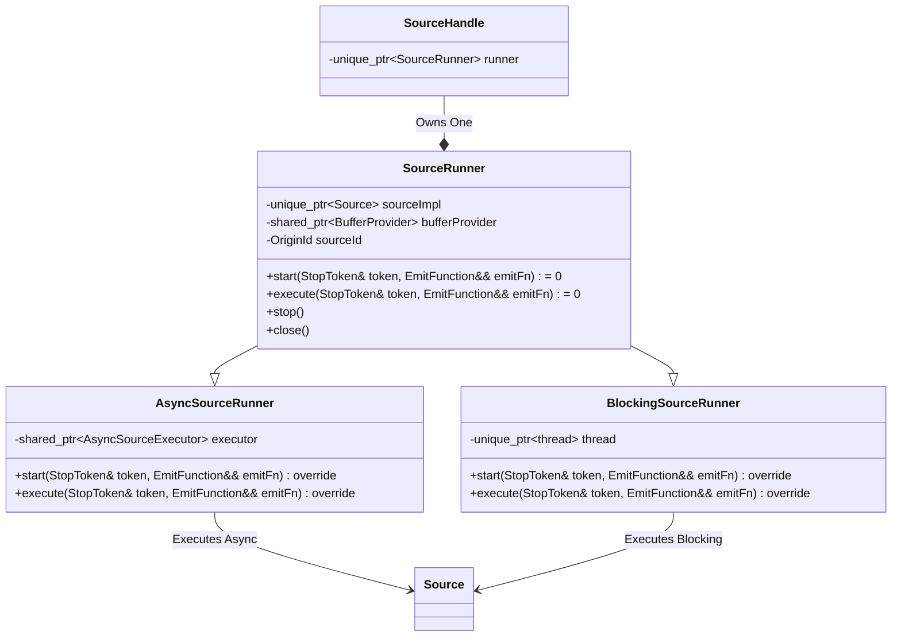
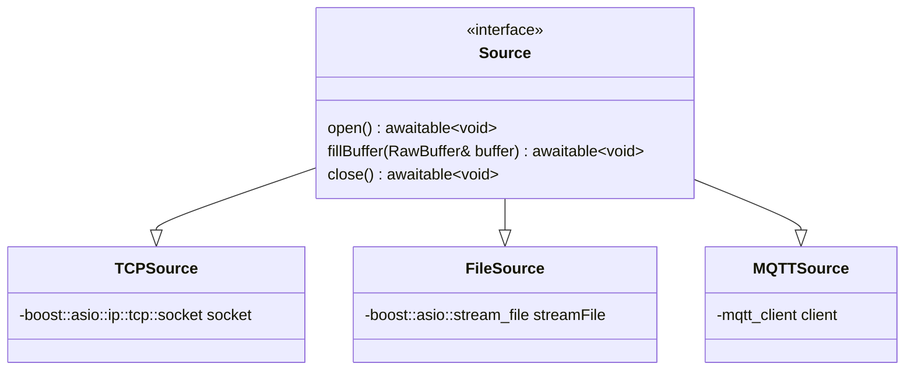

# The Problem
NebulaStream aims to handle millions of heterogeneous sources across massively distributed and heterogeneous devices.
This requires a single node to handle thousands of sources concurrently.

Currently, each source that is started runs in an individual thread. 
That is, starting 1000 sources means starting 1000 threads just for the sources. 
Since the threads are running permanently, ingesting data into the system, this leads to a massive oversubscription of the CPU and causes frequent context switching.
Given that each thread allocates state in the form of a private stack), this is expensive. 
Therefore, the current approach does not scale with an increasing number of sources (**P1**).

Each source reads data from external systems or devices and writes them into buffers provided by the NES `BufferManager`.
In its current state, fast sources can cause a deadlock by taking all buffers, since query processing cannot proceed without buffers (**P2**).


# Goals
A single node worker should be able to handle thousands of concurrent sources without data ingestion becoming a bottleneck.
Slow disk or network I/O can still cause a bottleneck during query execution (this may be out of the system's control).
However, adding more sources should not slow down existing sources or CPU-bound operations for internal reasons such as CPU oversubscription or threads busy-waiting on data to become ready.
Of course, devices like the disk or network card are limited in the bandwidth they can provide with regard to concurrent access, but at least we can hide these latencies and allow the system to use these resources more efficiently by accessing them asynchronously, without blocking the CPU
(**G1, scalability**, addresses P1).


The `BufferManager` should have entirely separate pools for I/O and compute, removing the potential deadlocks (**G2, deadlock prevention**, addresses P2).
Moreover, the `BufferManager` should receive the information it needs to facilitate fairness and maximum efficiency by making it aware of sources and their requirements.
In particular, it needs to take care of flow control and speed differences between different sources to ensure that a) buffering is possible under high load of a particular source while b) guaranteeing each source to receive a single buffer at a time to make progress for queries that depend on that source.
In addition, the `BufferManager` should be extended to expose an asynchronous interface for sources to use.
Our goal is to get rid of blocking operations within I/O threads wherever possible.
We propose simple policies and provide a PoC implementation to showcase this.

The following three goals are additional goals that do not address specific problems in the current implementation, but are still important with respect to usability and maintainability.

The implementation of new sources should be as easy as possible by providing a small, concise interface that should closely match the current interface.
Sources will still be able to setup (open resources), fill a raw byte buffer, and close resources again.
After the redesign, a source should be easy to digest and contain only the state necessary to manage the connection to an external system/device **(G3, simplicity and decomposition**).

The implementation should conform to the past effort of refactoring the [description and construction of sources](https://github.com/nebulastream/nebulastream-public/blob/main/docs/design/20240702_sources_and_sinks.md).
We want this redesign to not impact the construction of sources at all, we aim to only redesign the execution model.
The impact on the rest of the codebase should be minimal (**G4, non-invasiveness**).
We do not want the `QueryEngine` that manages sources to know or depend on the internals of the execution model of the sources.

Errors should be handled transparently as described in the [DD on error handling](https://github.com/nebulastream/nebulastream-public/blob/main/docs/design/20240711_error_handling.md).
Every possible error regarding I/O operations should be handled appropriately by trying to recover from it if possible, or emitting the error to a higher-level component (**G5, fault transparency**).

It should still be possible to implement new sources with the current threading model as a fallback/baseline **(G6, backwards compatibility)**.

# Non-Goals
- **NG1**: a complete vision or implementation on how the sources interact with the `BufferManager`, and what policies the `BufferManager` should implement to facilitate fairness and performance. We only provide a PoC here.
- **NG2**: a complete vision or implementation on how to handle source sharing.
- **NG3**: a complete vision or implementation on how to handle data ingestion via internal sources (e.g., when intermediate data is shuffled around between nodes).
- **NG4**: handling of selective reads, i.e., predicate/projection pushdown as typically done in formats like Parquet

# Solution Background
Most software systems depend on external data in some way:
- Web servers - clients connect via network and issue requests 
- DBMSs - large volumes of historical data are scanned from disk or network, originating from potentially multiples queries
- SPEs - sources continuously ingest data (think thousands of sources, potentially from thousands of different queries)

All of them need some mechanism to map compute resources (i.e., threads) to these concurrently running I/O operations.

## Threads
There are two naive threading models to manage data ingestion:
1. Single-threaded I/O that switches between all connections/sources
2. A single thread per connection/source (as currently implemented in NES)

The former leads to serial execution, limiting throughput. 
The latter leads to a lot of overhead in the case of very large numbers of connections/queries and therefore to a term called *oversubscription* of the CPU.

From "C++11 - Concurrency in Action": *"When you have an application that needs to handle a lot of network connections, it’s often tempting to handle each connection on a separate thread, because this can make the network communication easier to think about and easier to program.
This works well for low numbers of connections (and thus low numbers of threads).
Unfortunately, as the number of connections rises, this becomes less suitable; the large numbers of threads consequently consume large numbers of operating system resources and potentially cause a lot of context switching (when the number of threads exceeds the available hardware concurrency), impacting performance.
In the extreme case, the operating system may run out of resources for running new threads before its capacity for network connections is exhausted.
In applications with very large numbers of network connections, it’s therefore common to have a small number of threads (possibly only one) handling the connections, each thread dealing with multiple connections at once."*

Web servers and query engines therefore often use separate thread pools for I/O and compute.
This decoupling prevents tasks that are CPU-bound to hog threads and being unable to respond to external requests. 
At the same time, threads that do blocking I/O calls (e.g., asking for a disk page, making a request to S3, etc.) stall compute threads or other threads that could issue I/O requests in the meantime.

## Async I/O
If we have a separate thread pool for I/O operations, we need to define operations and decide how to schedule them on this pool.
With the assumption that we primarily do I/O when dealing with sources, we are **waiting** for something to happen in the background for most of the time.
At some point in each source, we call a client like `doRequest()` and then block during this call.
The CPU does not have any insight information on what we are waiting on, so if we are unlucky and the CPU does not give another thread a time slice, we block the CPU with our I/O.

An improvement to this would be to to put the thread to sleep by using mechanisms like `std::future` and have another thread run while we wait on the I/O to complete.
However, the calling thread would still be occupied and therefore is not free to use for other tasks.
If we assume a limited pool of threads, which we strive to have, we could still end up in the situation where all available I/O threads are sleeping, waiting for blocking I/O to complete.
During this time, no other I/O tasks can make progress.

It would be nice to have a mechanism to pause/resume a function waiting for external I/O **without** occupying a thread while waiting for data to arrive.
That's what async I/O gives us, and an elegant way to implement it using modern C++ are coroutines.
They enable us to suspend and resume running functions while **preserving** their state.
Internally, the compiler rewrites coroutines to state machines to make this work.
C++20 introduced three new keywords, namely `co_await`, `co_yield` and `co_return`.
`co_await` pauses execution and awaits another coroutine that is called (lower-level code), `co_yield` yields a value to the caller without returning to the caller (think python generators), `co_return` signals termination of the coroutine with an optional return value.
Coroutines provide an elegant way to implement async I/O while allowing it to look like sequential execution.
Before coroutines existed, one had to use chains of callbacks that were invoked when asynchronous operations returned to the calling function.
Utilizing these mechanisms of pausing/resuming execution, we are now able to wait for external events to happen in the background, without occupying a thread (like a TCP socket filling a buffer, or a disk page to be copied into memory).

An important thing to note is that we should avoid running blocking operations by yielding control regularly.
Otherwise, we block a thread, possibly preventing other async operations from making progress.
For this reason, the efforts to move data parsing (which might be CPU-intensive) from the sources and async I/O go hand in hand.
Currently, sources read external data into the system while additionally parsing that data to the schema of the logical source.
This mixes up I/O logic with data parsing and therefore violates basic principles like the separation of concerns. 
If we follow the guideline and isolate I/O-bound operations properly from CPU-bound operations, an enormous amount of concurrent tasks can be scheduled on relatively few threads. 

The ongoing I/O operations can be wrapped into coroutines that represent tasks that drive the sources' progress.
An async runtime manages these ongoing tasks.
It can run with a fixed-size thread pool or even just a single thread and it polls tasks that are ready to make progress.
How does it know what tasks (coroutines) are ready to be resumed and make progress?
Typically, this is done via syscalls like `epoll`. 
They allow the kernel to notify the asynchronous runtime (`boost::asio::io_context`) when something happened on a file descriptor (i.e., data has arrived), queueing an event together with the coroutine to be picked up by a thread and resumed.
We do not rely on busy-waiting, nor do we need a timer or regularly wake up to check if something is ready.

When resumed, we can deal with the arrived data, e.g., by giving it out to other components for further processing.
Potentially, the task can then make a new request before yielding control again.

Libraries that help implementing async I/O are, among others, `boost::asio` (C++) and `tokio.rs` (Rust).
They provide executors, thread pools, and low-level I/O primitives like `boost::asio::posix::stream_descriptor` and `boost::asio::ip::tcp::socket`.
Here is an example of an asynchronous TCP server that handles a single connection:
```cpp
awaitable<void> handleConnection(tcp::socket socket)
{
    try 
    {
        // Loop until the connection is closed
        for (;;;)
        {
            // Allocate a buffer that data can be written to in the background
            auto buffer = new boost::array<char, 8192>;
    
            // Receive some more data. When control resumes at the following line,
            // n represents the number of bytes read.
            // This does not block, but state is saved and control yielded back to the runtime, allowing other tasks to make progress.
            size_t n = co_await  socket->async_read_some(boost::asio::buffer(buffer), use_awaitable);
            // use_awaitable is a special "completion token" that indicates that we want to resume in the current coroutine
            // We could pass a callback instead.
    
            // Handle the data we have received
            ...
        }
    // Boost Asio handles termination signals via error codes
    } 
    catch (boost::system::error& error) 
    {

        if (error.code() == boost::asio::error::eof)
        {
            fmt::print("Connection closed (EOF)\n");
        }
        co_return;
    }
}
```
Note that you cannot plug every possible function into a `co_await`, but only "awaitable" functions, i.e., other coroutines.
By using any of the coroutine keywords, you implicitly make a coroutine from the current function.
To make it run, we would use a call like the following:
```cpp
boost::asio::post(io_context, [socket]()
    {
        co_spawn(io_context, handleConnection(std::move(socket)), boost::asio::detached);
    }
);
```
`detached` is a special completion token that indicates the end of an asynchronous execution chain, i.e., we are not interested in the result of the awaitable.

In summary, systems using async I/O get the following benefits:
- The number of threads (and therefore the overhead) is kept small
- I/O operations can be interleaved with other I/O operations 
- I/O operations can be interleaved with computation (CPU-bound tasks)

# Our Proposed Solution
The proposed solution depends on these key design decisions:
1. We redesign sources to make asynchronous calls inside coroutines to allow efficient data ingestion for thousands of sources on relatively few threads (G1).
2. We introduce a centralized `AsyncSourceExecutor` that drives the execution of all asynchronous sources on a thread pool (G1).
3. We allow synchronous/blocking sources to keep existing and run them in the current thread-per-source execution model as a fallback (G6).
Both synchronous and asynchronous sources expose the same interface to the `QueryEngine`, so it does not deal with the different execution models.
4. Sources receive buffers by utilizing non-blocking calls (prevent blocking I/O threads) from a separate I/O buffer pool (prevent deadlocks) (G2).
5. We allow the user to configure timeouts on a per-source basis. When the timeout expires, a pending asynchronous operation is cancelled to prevent high tail latencies. 


## Async I/O Library
The primary library for implementing async I/O in C++ is [`boost::asio`](https://www.boost.org/doc/libs/1_86_0/doc/html/boost_asio.html), which is battle-tested and used in numerous applications that require efficient I/O handling.
It provides us with everything we need to implement the goal of executing a large number of concurrent sources in an asynchronous, non-blocking way.
The library comes with a runtime, asynchronous I/O objects like sockets, file descriptors, serial port interfaces, etc.
Therefore, we choose `boost::asio` as the library to implement asynchronous sources and their orchestration on a thread pool.

## Interfaces
The highest-level component that we need to redesign is the `SourceHandle`, which is created by the `SourceProvider`.
General functionality of plugin registration, source descriptor validation, and construction of the source implementation does not need to change (G4).
Currently, `SourceHandle` wraps a `SourceThread`, an object that drives a single source on an internal thread.
The `QueryEngine` creates an `InstantiatedQueryPlan` that contains the `SourceHandle`s for that query and starts them, delegating the call to the `SourceThread`.
We remove the `SourceThread` and replace it with an abstract base class called `SourceRunner` that is owned by a `SourceHandle`.
A `SourceRunner`'s primary responsibility (like the `SourceThread`'s) is to drive the source on (a set of) internal threads.
However, we want two distinct ways to do so: 

1. The fallback of running an internal thread for each synchronous/blocking source.
2. The preferred approach of dispatching the source to an async I/O runtime.

Therefore, we create two derived classes, namely the `SourceRunnerSync` that will run a blocking source, and the `SourceRunnerAsync`, which is responsible for running asynchronous sources.
For this reason, the former uniquely owns a thread, whereas the latter has shared ownership of an `AsyncSourceExecutor` that all asynchronous sources use to run on.
The `AsyncSourceExecutor` should be created from the outside by a higher-level component and live for the entire duration of the worker.
The following diagram illustrates the interfaces.



## SourceRunner

The `execute` function encapsulates the `runningRoutine` of the current `SourceThread` and runs a loop until a stop token is received from the outside:
```cpp
void SourceRunnerSync::execute(StopToken& token, EmitFunction&& emitFn)
{
    sourceImpl->open();
    while (!token.stopRequested())
    {
        RawBuffer buffer = bufferProvider->getBufferBlocking();
        sourceImpl->fillBuffer(buffer);
        emitFn(buffer);
    }
    sourceImpl->close();
}
```
`AsyncSourceRunner::execute`, on the other hand, represents the highest-level coroutine that drives a particular asynchronous source:
```cpp 
awaitable<void> AsyncSourceRunner::execute(StopToken& token, EmitFunction&& emitFn)
{
    co_await sourceImpl->open();
    while (!token.stopRequested())
    {
        RawBuffer buffer = co_await acquireBuffer();
        co_await sourceImpl->fillBuffer(buffer);
        emitFn(buffer);
    }
    co_await sourceImpl->close();
    co_return;
}
```
Note that all functions that are called are either non-blocking coroutines (like `sourceImpl->fillBuffer()`), or cheap functions that do not block the CPU for a long time (e.g., the `emitFn` that emits a buffer to successors).
Also note that at this point, the code is not entirely complete: error handling is missing and the `stopToken` is not considered in the `acquireBuffer` function.
When the `QueryEngine` wants to start a new asynchronous source, it calls `start` on the `AsyncSourceRunner`.
This function will then dispatch the `execute` function to the underlying `AsyncSourceExecutor` in a non-blocking way.

```cpp
void SourceRunnerAsync::start(StopToken& token, EmitFunction&& emitFn)
{
    executor->dispatch([this, &token, emitFn]()
    {
        execute(token, emitFn);
    });
}
```

## AsyncSourceExecutor
The `AsyncSourceExecutor` is the central component that manages the execution of all asynchronous sources at once.
It is responsible for creating the `boost::asio::io_context` and the thread pool that runs the coroutines.
For now, we hardcode a reasonable number of threads or use `std::thread::hardware_concurrency()` to determine the number of threads.
At a later point, we could define the number as a function of the number of async sources that are currently running and change the number of threads adaptively at runtime.

```cpp
class AsyncSourceExecutor
{
private:
    boost::asio::io_context ioc;
    std::vector<std::unique_ptr<std::jthread>> threadPool;
public:
    AsyncSourceExecutor()
    {
        for (size_t i = 0; i < std::thread::hardware_concurrency(); ++i)
        {
            threadPool.push_back(std::make_unique<std::jthread>([this]()
            {
                ioc.run();
            }));
        }
    }

    void dispatch(std::function<awaitable<void>(StopToken&, EmitFunction&&)> fn)
    {
        boost::asio::post(ioc, 
                          co_spawn(ioc, 
                                   []() { fn(); },
                                   detached)
        );
    }

    ~AsyncSourceExecutor()
    {
        ioc.stop();
    }
}
```

As we can see, the executor is very simple and the magic happens behind the scenes in the `boost::asio::io_context`.
It contains the reactor pattern that is responsible for polling file descriptors and waking up coroutines that are ready to make progress.
The `io_context` is allowed to schedule tasks to any thread that called `run` on it.

## Sources
The sources' interface only contains the functions `open`, `fillBuffer`, and `close`.
Instead of returning `void`, they return `awaitable<void>`, which is a type that can be awaited in a coroutine.
Blocking sources can be integrated into this scheme by wrapping their blocking calls into a coroutine.



The sources' implementations will be very simple, requiring only logic to open/close resources and fill a single buffer with data (G3):
```cpp
class TCPSource : public Source
{
private:
    boost::asio::ip::tcp::socket socket;

public:
    awaitable<void> open() override
    {
        co_await socket.async_connect(...);
    }

    awaitable<void> fillBuffer(RawBuffer& buffer) override
    {
        size_t bufferOffset = 0;
        try
        {
            while (bufferOffset < buffer.size())
            {
                size_t bytesRead = co_await socket->async_read_some(boost::asio::buffer(buffer.data() + bufOffset, buffer.size() - bufOffset), use_awaitable);
                bufferOffset += bytesRead;
            }
        }
        catch (boost::system::system_error& error)
        {
            if (error.code() == boost::asio::error::eof)
            {
                // Connection closed
                co_return;
            }
            else
            {
                // Handle error
            }
        }
        co_return;
    }

    void close() override
    {
        socket.close();
        co_return;
    }
}

```

## Buffer Management
We aim to address four challenges related to buffer management:
1. Deadlock prevention (G2)
2. Flow control
3. Fairness of distribution
4. Asynchronous interface (G1)

### Deadlock Prevention
On a high level, deadlocks occur if there are cyclic dependencies on a specific resource in the system (here: buffers).
In our case, producers (sources) and consumers (successor pipelines) of data depend on buffers to make progress.
If a consumer acquires all buffers to store internal state of e.g., pending windows, the corresponding source can not acquire a buffer anymore. 
Consequently, no new data can be produced for the operator to trigger the window and release its buffers.
In our producer/consumer relationship between sources and successor pipelines, deadlocks need to be avoided (G2). 
By separating an I/O pool from the rest of the global buffer pools, we avoid the deadlock problem between sources and their consumer pipelines (P2).
A redistribution of these pools based on the requirements of I/O and processing is an optimization that could be applied at a later point (NG4).

### 2) Flow Control
For flow control (handling speed differences between producer and consumer, and among different producers), the following questions arise with respect to buffers:
1. **Slow Source <--> Fast Downstream**: *How do we keep the latency in check when a source takes a very long time to fill a buffer?*

This will be the general case where the system is not overwhelmed with external data, and I see two approaches here:
- *Demand-based*: If a running successor pipeline of a source is idle (no task has been produced that it can process), it may ask a `Source` to release a partially filled buffer.
Instead of issuing new requests or waiting for more data, the `SourceRunner` driving the source could yield control and give out the buffer, asking the `BufferManager` for a new one.
This approach would require to have some kind of backwards control flow from pipelines directly to the source or would need to be handled by the `QueryEngine`. 
- *Timeout-based*: After some time has passed, the source releases its buffer, writing it downstream.
Global timeouts are not suitable as each query might have different latency requirements.
Instead, we let the user set a timeout on a per-source basis.
A disadvantage of this approach is that the timeout set only reflects on the maximum latency of the source and might not translate to query latency, which most users are interested in.

As a first baseline, we implement the timeout-based approach.
The timer is associated with each asynchronous operation.
When the timer of the source expires, the source cancels the ongoing operation and releases the partially filled buffer.

-- TODO: describe cancellation of async operations

2. **Fast Source <--> Slow Downstream**: *How do we apply backpressure to help the system under high load?*

If we work with a fixed-size buffer pool, we apply backpressure automatically to a source when the `BufferManager` rejects its request to acquire a buffer.
This forces the source to try again later.
We implement this in the `AsyncSourceRunner` by setting a timeout to an asynchronous timer `retryTimer` and try again when it expires.
In the meantime, the external system will be throttled.
A future, more sophisticated approach could involve an asynchronous interface between the `AsyncSourceRunner` and the `BufferManager`, discussed [here](#asynchronous-interface).

```cpp
boost::asio::steady_timer retryTimer(ioc, std::chrono::milliseconds(10));

awaitable<RawBuffer> AsyncSourceRunner::acquireBuffer()
{
    std::optional<RawBuffer> buf;
    while (!buf)
    {
        // Call non-blocking function
        buf = bufferProvider->getBufferNoBlocking();
        if (!buf)
        {
            // Wait for a while and try again
            co_await retryTimer.async_wait();
        }
    }
    co_return buf.value();
}
```

3. **Fast Sources <--> Slow Sources**: *How do we handle speed differences between sources and prevent fast sources from stealing all resources?*

Speed differences among sources can be defined as differences in buffer requests per unit time.
When downstream tasks are generally reading and thus releasing the buffers faster than the sources can fill new buffers, case 1) applies and the speed differences do not lead to problems. 
By contrast, when a source is producing and thus requesting buffers at a faster rate than downstream tasks can release them, case 2) applies.
In a temporary case, enough buffers are available and the buffer manager will happily give them out to fast producers so the available buffers will be automatically be distributed relative to the demand.
With the separation of I/O and compute pools, we prevent fast sources from stealing all resources from the global pool.
Problems arise when a single or few sources take so many buffers such that others are impacted and have buffer requests denied.

In general, we always want to guarantee **each source having a single buffer available that it can fill in the background (double buffering)**. 
This is the minimum required to effectively utilize async I/O.

To facilitate fairness here, I propose the simple algorithm:
- Sources ask for buffers, by putting their id in a FIFO queue 
- A source can only ask for one buffer at a time. After a source received a buffer, it can only ask for another buffer, after it finished processing the current one and sees that it needs more.
- Slower sources are guaranteed to move up in the FIFO queue everytime a faster source takes a buffer

### Asynchronous Interface
Currently, each source has a local `BufferProvider` that maintains a pool of buffers only for this source. 
The `SourceThread` uses this provider to call `getBufferBlocking` repeatedly in the running thread routine.
This call blocks until a buffer becomes available, which we want to avoid on I/O threads.
Therefore, we use the non-blocking alternative available called `getBufferNoBlocking`, which returns an `std::optional`.
In this case we do not block, but the source still requires a buffer to make progress, so we go to sleep without blocking the I/O runtime.
The timeout is arbitrary and needs to be set explicitly at compile-time, which is not ideal.

A future alternative is to extend the asynchronous behavior across the boundaries of the sources and integrate an event-based mechanism into the `BufferManager`.


## Testing

## Benchmarking

# Proof of Concept
Will be created after approval of this PR.

## Implementation plan
1. Implement the redesign of the execution model for sources.
2. Implement three sources (TCP, File, MQTT) that use the new execution model.
3. Write unit tests for the sources.
4. Write integration tests that show the interplay of multiple sources.
5. Benchmark the system with a high number of sources.
6. Make the `BufferManager` aware of sources and implement a simple policy for fairness of distribution.

# Alternatives

# Open Questions
## Urgent
- How to handle the PR, split up into execution model, implementation of specific sources and the `BufferManager` changes?

## Non-Urgent
- How to deal with source sharing? Are there special considerations?
- How to deal with internal sources?
- 


# Sources and Further Reading
- https://www.boost.org/doc/libs/1_86_0/doc/html/boost_asio.html
- https://stackoverflow.com/questions/8546273/is-non-blocking-i-o-really-faster-than-multi-threaded-blocking-i-o-how
- https://stackoverflow.com/questions/43503656/what-are-coroutines-in-c20

# (Optional) Appendix

