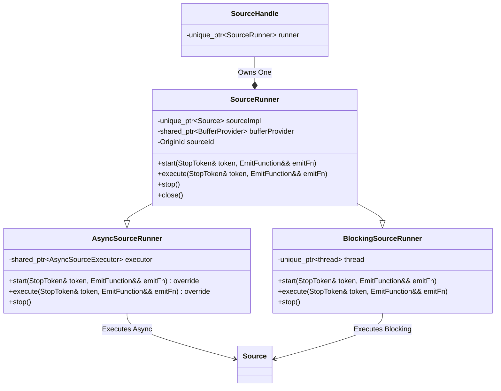
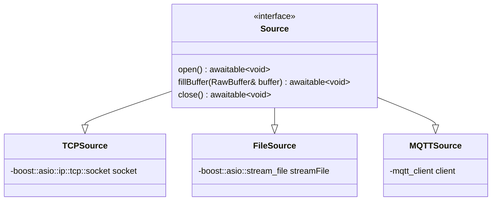

# The Problem
NebulaStream aims to handle millions of heterogeneous sources across massively distributed and heterogeneous devices.
This could require a single node to handle up to thousands of sources concurrently.

Currently, each source runs in an individual thread. 
That is, starting 1000 sources means starting 1000 threads just for the sources. 
Since the threads are running permanently, ingesting data into the system, this leads to a massive oversubscription of the CPU and causes frequent context switching.
Given that each thread allocates state in the form of a private stack, this is expensive. 
Therefore, the current approach does not scale with an increasing number of sources per node (**P1**).

Sources read data from external systems or devices and write them into buffers provided by the NES `BufferManager`.
Precisely, local buffer providers maintain a fixed-size buffer pool per source. 
If the available memory of the system is exhausted by the number of sources, potentially all available memory will be taken by the sources.
As an example, if we have 100 buffers in the system and 10 sources.
If each source receives a local buffer pool of 10 buffers, this can cause a deadlock, since query processing cannot proceed without buffers (**P2**).

Furthermore, this static assignment of buffers so sources is highly inflexible with respect to the actual requirements of the sources at runtime (**P3**).
For example, a source might be idle for a long time, while another source is producing data at a high rate.

# Goals
A single node worker should be able to handle thousands of concurrent sources as efficiently as possible.
Slow disk or network I/O can be the main bottleneck during query execution (this may be out of the system's control).
However, adding more sources should impact existing sources or CPU-bound operations as little as possible. 
Therefore, we want to avoid stalls due to CPU oversubscription or threads busy-waiting on data to become ready.
Even though devices like the disk or network card are limited in the bandwidth they can provide with regard to concurrent access, but we can hide these latencies and allow the system to use these resources more efficiently by accessing them asynchronously, blocking the CPU as short as possible.
(**G1, scalability**, addresses P1).


The `BufferManager` should have separate pools for sources and processing, removing potential deadlocks due to sources taking all buffers (**G2, deadlock prevention**, addresses P2).
Moreover, there should be a centralized `BufferManager` for just the sources. 
It can be aware of the sources and their requirements holds the information it needs to facilitate fairness and maximum efficiency.
In particular, it needs to take care of flow control and speed differences between different sources to ensure that a) buffering is possible under high load of a particular source while b) facilitating fairness such that each source receives a single buffer at a time to make progress for queries that depend on that source (**G3, fairness and demand-based buffer distribution**, addresses P3).

In addition, the `BufferManager` should be extended to expose an asynchronous interface for sources to use.
Our goal is to get rid of blocking operations within source threads wherever possible.
We propose a simple policy and provide a PoC implementation to showcase this.

The following three goals are additional goals that do not address specific problems in the current implementation, but are still important with respect to usability and maintainability.

The implementation of new sources should be as easy as possible by providing a small, concise interface that should closely match the current interface.
Sources will still be able to setup (open resources), fill a raw byte buffer, and close resources again.
This complements with the [removal of parsing from the sources](https://github.com/nebulastream/nebulastream-public/pull/492).
A single source should be easy to digest and contain only the state necessary to manage the connection to an external system/device **(G4, simplicity and decomposition**).

The implementation should conform to the past effort of refactoring the [description and construction of sources](https://github.com/nebulastream/nebulastream-public/blob/main/docs/design/20240702_sources_and_sinks.md).
We want this redesign to not impact the construction of sources at all, we aim to only redesign the execution model.
The impact on the rest of the codebase should be minimal (**G5, non-invasiveness**).
We do not want the `QueryEngine` that manages sources to know or depend on the internals of the execution model of the sources.

Errors should be handled transparently as described in the [DD on error handling](https://github.com/nebulastream/nebulastream-public/blob/main/docs/design/20240711_error_handling.md).
Every possible error regarding I/O operations should be handled appropriately by trying to recover from it if possible, or emitting the error to a higher-level component (**G6, fault transparency**).

It should still be possible to implement new sources with the current threading model as a fallback/baseline **(G7, backwards compatibility)**.

# Non-Goals
- **NG1**: a complete vision or implementation on how the sources interact with the `BufferManager`, and what policies the `BufferManager` should implement to facilitate fairness and performance. We only provide a PoC here. For further details, see the [BM spilling & redesign DD](https://db.in.tum.de/~fent/papers/coroutines.pdf?lang=de)
- **NG2**: a complete vision or implementation on how to handle source sharing.
- **NG3**: a complete vision or implementation on how to handle data ingestion via internal sources (e.g., when intermediate data is shuffled around between nodes).
- **NG4**: handling of selective reads, i.e., predicate/projection pushdown as typically done in formats like Parquet.

# Solution Background
Most software systems depend on external data in some way:
- Web servers - clients connect via network and issue requests 
- DBMSs - large volumes of historical data are scanned from disk or network, originating from potentially multiples queries
- SPEs - sources continuously ingest data (think thousands of sources, potentially from thousands of different queries)

All of them need some mechanism to map compute resources (i.e., threads) to these concurrently running I/O operations.

## Threads
There are two naive threading models to manage data ingestion:
1. Single-threaded I/O that switches between all connections/sources
2. A thread per connection/source (as currently implemented in NES)

The former leads to serial execution, limiting throughput. 
The latter leads to a lot of overhead in the case of very large numbers of connections/queries and therefore to a term called *oversubscription* of the CPU.

From "C++11 - Concurrency in Action": *"When you have an application that needs to handle a lot of network connections, it’s often tempting to handle each connection on a separate thread, because this can make the network communication easier to think about and easier to program.
This works well for low numbers of connections (and thus low numbers of threads).
Unfortunately, as the number of connections rises, this becomes less suitable; the large numbers of threads consequently consume large numbers of operating system resources and potentially cause a lot of context switching (when the number of threads exceeds the available hardware concurrency), impacting performance.
In the extreme case, the operating system may run out of resources for running new threads before its capacity for network connections is exhausted.
In applications with very large numbers of network connections, it’s therefore common to have a small number of threads (possibly only one) handling the connections, each thread dealing with multiple connections at once."*

Web servers and query engines therefore often use separate thread pools for I/O and compute.
This decoupling prevents tasks that are CPU-bound to hog threads and being unable to respond to external requests. 
At the same time, threads that do blocking I/O calls (e.g., asking for a disk page, making a request to S3, etc.) stall compute threads or other threads that could issue I/O requests in the meantime.

## Async I/O
If we have a separate thread pool for I/O operations, we need to define operations and decide how to schedule them on this pool.
With the assumption that we primarily do I/O when dealing with sources, we are **waiting** for something to happen in the background for most of the time.
At some point, each source calls a client library to interact with the external system like `requestData()` and then blocks during this call.
The CPU does not have any insight information on what we are waiting on, so if we are unlucky and the CPU does not give another thread a time slice, we block the CPU with our I/O.

An improvement to this would be to to put the thread to sleep by using mechanisms like `std::future` and have another thread run while we wait on the I/O to complete.
However, the calling thread would still be occupied and therefore is not free to use for other tasks.
If we assume a limited pool of threads, which we strive to have, we could still end up in the situation where all available I/O threads are sleeping, waiting for blocking I/O to complete.
During this time, no other I/O tasks can make progress.

It would be nice to have a mechanism to pause/resume a function waiting for external I/O **without** occupying a thread while waiting for data to arrive.
That's what async I/O gives us, and an elegant way to implement it using modern C++ are coroutines.
They enable us to suspend and resume running functions while **preserving** their state.
Internally, the compiler rewrites coroutines to state machines to make this work.
C++20 introduced three new keywords, namely `co_await`, `co_yield` and `co_return`.
`co_await` pauses execution and awaits another coroutine that is called (lower-level code), `co_yield` yields a value to the caller without returning to the caller (think python generators), `co_return` signals termination of the coroutine with an optional return value.
Coroutines provide an elegant way to implement async I/O while allowing it to look like sequential execution.
Before coroutines existed, one had to use chains of callbacks that were invoked when asynchronous operations returned to the calling function.
Utilizing these mechanisms of pausing/resuming execution, we are now able to wait for external events to happen in the background, without occupying a thread (like a TCP socket filling a buffer, or a disk page to be copied into memory).

An important thing to note is that we should avoid running blocking operations by yielding control regularly.
Otherwise, we block a thread, possibly preventing other async operations from making progress.
For this reason, the efforts to move data parsing (which might be CPU-intensive) from the sources and async I/O go hand in hand.
Currently, sources read external data into the system while additionally parsing that data to the schema of the logical source.
This mixes up I/O logic with data parsing and therefore violates basic principles like the separation of concerns. 
If we follow the guideline and isolate I/O-bound operations properly from CPU-bound operations, an enormous amount of concurrent tasks can be scheduled on relatively few threads. 

The ongoing I/O operations can be wrapped into coroutines that represent tasks that drive the sources' progress.
An async runtime manages these ongoing tasks.
It can run with a fixed-size thread pool or even just a single thread and it polls tasks that are ready to make progress.
How does it know what operations (coroutines) are ready to be resumed and make progress?
Typically, this is done via syscalls like `epoll`. 
They allow the kernel to notify the asynchronous runtime (`boost::asio::io_context`) when something happened on a file descriptor (i.e., data has arrived), queueing an event together with the coroutine to be picked up by a thread and resumed.
We do not rely on busy-waiting, nor do we need a timer or regularly wake up to check if something is ready.

When resumed, we can deal with the arrived data, e.g., by giving it out to other components for further processing.
Then, the task can request more data before yielding control again.

Libraries that help implementing async I/O are, among others, `boost::asio` (C++) and `tokio.rs` (Rust).
They provide executors, thread pools, and low-level I/O primitives like `boost::asio::posix::stream_descriptor` and `boost::asio::ip::tcp::socket`.
Here is an example of an asynchronous TCP server that handles a single connection:
```cpp
awaitable<void> handleConnection(tcp::socket socket)
{
    try 
    {
        // Loop until the connection is closed
        for (;;;)
        {
            // Allocate a buffer that data can be written to in the background
            auto buffer = new boost::array<char, 8192>;
    
            // Receive some more data. When control resumes at the following line,
            // n represents the number of bytes read.
            // This does not block, but state is saved and control yielded back to the runtime, allowing other tasks to make progress.
            size_t n = co_await  socket->async_read_some(boost::asio::buffer(buffer), use_awaitable);
            // use_awaitable is a special "completion token" that indicates that we want to resume in the current coroutine
            // We could pass a callback instead.
    
            // Handle the data we have received
            ...
        }
    // Boost Asio handles termination signals via error codes
    } 
    catch (boost::system::error& error) 
    {

        if (error.code() == boost::asio::error::eof)
        {
            fmt::print("Connection closed (EOF)\n");
        }
        co_return;
    }
}
```
Note that you cannot plug every possible function into a `co_await`, but only "awaitable" functions, i.e., other coroutines.
By using any of the coroutine keywords, you implicitly make a coroutine from the current function.
To make it run, we would use a call like the following:
```cpp
boost::asio::post(io_context, [socket]()
    {
        co_spawn(io_context, handleConnection(std::move(socket)), boost::asio::detached);
    }
);
```
`detached` is a special completion token that indicates that we are not interested in the result of the awaitable.

In summary, systems using async I/O get the following benefits:
- The number of threads (and therefore the overhead) is kept small despite a large number of concurrent I/O operations
- I/O operations can be interleaved with other I/O operations 
- I/O operations can be interleaved with computation (CPU-bound operations)

# Our Proposed Solution
The proposed solution depends on these key design decisions:
1. We redesign sources to make asynchronous calls inside coroutines to allow efficient data ingestion for thousands of sources on relatively few threads (G1).
2. We introduce a centralized `AsyncSourceExecutor` that drives the execution of all asynchronous sources on a thread pool (G1).
3. We allow synchronous/blocking sources to keep existing and run them in the current thread-per-source execution model as a fallback (G7).
Both synchronous and asynchronous sources expose the same interface to the `QueryEngine`, so it does not deal with the different execution models.
4. We have a single separate the I/O buffer pool shared among sources to prevent deadlocks (G2).
5. A local `BufferManager` maintains the buffer pool for the sources and exposes an asynchronous interface to prevent blocking I/O threads.
6. To prevent high tail latencies, we allow the user to configure timeouts on a per-source basis. 
When the timeout expires, a pending asynchronous operation is cancelled. 
7. We implement a simple policy for fairness and demand-based buffer distribution among sources despite contention (G3).

## Async I/O Library
The primary library for implementing async I/O in C++ is [`boost::asio`](https://www.boost.org/doc/libs/1_86_0/doc/html/boost_asio.html), which is battle-tested and used in numerous applications that require efficient I/O handling.
It provides us with everything we need to implement the goal of executing a large number of concurrent sources in an asynchronous, non-blocking way.
The library comes with a runtime, asynchronous I/O objects like sockets, file descriptors, serial port interfaces, etc.
Therefore, we choose `boost::asio` as the library to implement asynchronous sources and their orchestration on a thread pool.

## Interfaces
The highest-level component that affects this redesign is the `SourceHandle`, which is created by the `SourceProvider` to wrap a single physical source.
General functionality of plugin registration, source descriptor validation, and construction of the source implementation does not need to change (G4).
Currently, the `SourceHandle` owns a `SourceThread`, an object that runs a single source on an internal thread.
The `QueryEngine` creates an `InstantiatedQueryPlan` that contains the `SourceHandle`s for that query and starts them, delegating the call to the `SourceThread`.
We remove the `SourceThread` and replace it with an abstract base class called `SourceRunner` that is owned by a `SourceHandle`.
A `SourceRunner`'s primary responsibility (like the `SourceThread`'s) is to drive the source on (a set of) internal threads.
However, we want two distinct ways of doing so: 

1. The fallback of running an internal thread for each synchronous/blocking source.
2. The preferred approach of dispatching the source to an async I/O runtime.

Therefore, we create two derived classes:
- `BlockingSourceRunner`, where each instance will run a single blocking source.
- `AsyncSourceRunner`, which is responsible for running an asynchronous source.

For this reason, the former uniquely owns a thread, whereas the latter has shared ownership of an `AsyncSourceExecutor` that all asynchronous sources use to run on.
The `AsyncSourceExecutor` should be created from the outside by a higher-level component and live for the entire duration of the single node worker.
The following diagram illustrates the interfaces.



## SourceRunner

The `execute` function encapsulates the `runningRoutine` of the current `SourceThread` and runs a loop until requested from the outside in the given stop token:
```cpp
void BlockingSourceRunner::execute(StopToken& token, EmitFunction&& emitFn)
{
    sourceImpl->open();
    while (!token.stopRequested())
    {
        RawBuffer buffer = bufferProvider->getBufferBlocking();
        sourceImpl->fillBuffer(buffer);
        emitFn(buffer);
    }
    sourceImpl->close();
}
```
`AsyncSourceRunner::execute`, on the other hand, represents the coroutine that drives a particular asynchronous source to completion:
```cpp 
awaitable<void> AsyncSourceRunner::execute(StopToken& token, EmitFunction&& emitFn)
{
    co_await sourceImpl->open();
    while (!token.stopRequested())
    {
        RawBuffer buffer = co_await acquireBuffer();
        co_await sourceImpl->fillBuffer(buffer);
        emitFn(buffer);
    }
    co_await sourceImpl->close();
}
```
Note that all functions are either non-blocking coroutines (like `sourceImpl->fillBuffer()`), or cheap functions that do not block the CPU for a long time (e.g., the `emitFn` that emits a buffer to successors).
Also note that the code is neither entirely complete nor correct, instead it aims to show the general structure of the new execution model.
For example, error handling is omitted and the interfaces are not implemented exactly as specified.

When the `QueryEngine` decides to start a new asynchronous source, it calls `start` on the `SourceHandle`, which in turn invokes `start` on the corresponding `SourceRunner`.
There, we dispatch the `execute` function to the underlying `AsyncSourceExecutor` in a non-blocking way.

```cpp
void SourceRunnerAsync::start(StopToken& token, EmitFunction&& emitFn)
{
    executor->dispatch([this, &token, emitFn]()
    {
        execute(token, emitFn);
    });
}
```

## AsyncSourceExecutor
The `AsyncSourceExecutor` is the central component that manages the execution of all async sources at once.
It is responsible for creating the `boost::asio::io_context` and the thread pool that runs the coroutines.
For now, we hardcode a reasonable number of threads to use for the async sources.
At a later point, we could define the number as a function of the number of sources that are currently running and change the thread count adaptively at runtime.

```cpp
class AsyncSourceExecutor
{
private:
    boost::asio::io_context& ioc;
    std::vector<std::unique_ptr<std::jthread>> threadPool;
public:
    AsyncSourceExecutor(boost::asio_io_context& ioc) : ioc(ioc)
    {
        for (size_t i = 0; i < numSourceThreads; ++i)
        {
            threadPool.push_back(std::make_unique<std::jthread>([this]()
            {
                ioc.run();
            }));
        }
    }

    void dispatch(std::function<awaitable<void>(StopToken&, EmitFunction&&)> fn)
    {
        boost::asio::post(ioc, 
                          [fn]() { co_spawn(ioc, fn(), boost::asio::detached) }
        );
    }

    ~AsyncSourceExecutor()
    {
        ioc.stop();
    }
}
```

As we can see, the executor is very simple and the magic happens behind the scenes in the `boost::asio::io_context`.
It contains the reactor pattern that is responsible for polling file descriptors and resuming the coroutines that are ready to make progress.
The `io_context` is allowed to schedule tasks to any thread that called `run` on it.

## Sources
The sources' interface only contains the functions `open`, `fillBuffer`, and `close`.
Instead of returning `void`, they return `awaitable<void>`, which is a type that can be awaited in a coroutine.
Blocking sources can be integrated into this scheme by wrapping their blocking calls into a coroutine.



The sources' implementations will be very simple, requiring only logic to open/close resources and fill a single buffer with data (G4):
```cpp
class TCPSource : public Source
{
private:
    boost::asio::ip::tcp::socket socket;

public:
    awaitable<void> open() override
    {
        co_await socket.async_connect(...);
    }

    awaitable<void> fillBuffer(RawBuffer& buffer) override
    {
        size_t bufferOffset = 0;
        try
        {
            while (bufferOffset < buffer.size())
            {
                size_t bytesRead = 
                    co_await socket->async_read_some(boost::asio::buffer(buffer.data() + bufferOffset, buffer.size() - bufferOffset), 
                                                     boost::asio::use_awaitable);
                bufferOffset += bytesRead;
            }
        }
        catch (boost::system::system_error& error)
        {
            if (error.code() == boost::asio::error::eof)
            {
                // Connection closed
                co_return;
            }
            else
            {
                // Handle other errors
            }
        }
    }

    awaitable<void> close() override
    {
        socket.close();
        co_return;
    }
}
```

## Buffer Management
We aim to address four challenges related to buffer management:
1. Deadlock prevention (G2)
2. Flow control (G3)
3. Fairness of distribution (G3)
4. Asynchronous interface (G1)

### Deadlock Prevention
On a high level, deadlocks occur if there are cyclic dependencies on a specific resource in the system (here: buffers).
In our case, producers (sources) and consumers (successor pipelines) of data depend on buffers to make progress.
If a consumer acquires all buffers to store internal state of e.g., pending windows, the corresponding source can not acquire a buffer anymore. 
Consequently, no new data can be produced for the operator to trigger the window and release its buffers.
Similarly, when sources take all buffers, the downstream tasks are blocked and cannot release buffers, leading to a deadlock.
In our producer/consumer relationship between sources and successor pipelines, deadlocks need to be avoided (G2). 
By separating an source pool from processing pools, we avoid the deadlock problem between sources and their consumer pipelines (P2).
A redistribution of these pools based on the requirements of I/O and processing is an optimization that could be applied at a later point (NG4).

### Flow Control
For flow control (handling speed differences between producer and consumer, and among different producers), the following questions arise with respect to buffers:
1. **Slow Source <--> Fast Downstream**: *How do we keep the latency in check when a source takes a very long time to fill a buffer?*

This will be the common case where the system is not overwhelmed with external data, and I see two approaches here:
- *Demand-based*: If a running successor pipeline of a source is idle (no task has been produced that it can process), the `Source` may be asked to release a partially filled buffer.
Instead of issuing new requests or waiting for more data, the `SourceRunner` driving the source could yield control and give out the buffer, asking the `BufferManager` for a new one.
With this approach, it is unclear which component is responsible for detecting the idle state of the pipeline and request the cancellation of the ongoing operation.
We might require to have some kind of backwards control flow from pipelines directly to the source or need to handle this with the `QueryEngine`?
- *Timeout-based*: After some time has passed, the source releases its buffer, writing it downstream.
Global timeouts are not suitable as each query might have different latency requirements.
Instead, we let the user set a timeout on a per-source basis.
If no timeout is provided, the source will wait indefinitely for a buffer to be filled.
A disadvantage of this approach is that the timeout set only reflects on the maximum latency of the source and might not translate to query latency, which most users are interested in.
An advantage is that the source is autonomous and no external components need to be involved. 

As a first baseline, we implement the timeout-based approach.
The timer is associated with each asynchronous operation.
When the timer of the source expires, the source cancels the ongoing operation and releases the partially filled buffer.
```cpp
auto deadline = std::chrono::milliseconds(100);
asio::steady_timer timer{co_await boost::asio::this_coro::executor, deadline};
asio::cancellation_signal cancel_read;

awaitable<void> fillBuffer()
{
    size_t bufferOffset = 0;
    try
    {
        while (bufferOffset < buffer.size())
        {
            timer.async_wait(
                [&](system::error_code ec)
                {
                    if (!ec) // Timer expired
                        cancel_read.emit(asio::cancellation_type::total);
                }
            );

            size_t bytesRead = 
                co_await socket->async_read_some(boost::asio::buffer(buffer.data() + bufferOffset, buffer.size() - bufferOffset), 
                                                 boost::asio::bind_cancellation_slot(cancel_read.slot()), // Bind the cancellation slot to the read operation
                                                 boost::asio::use_awaitable);
            bufferOffset += bytesRead;
            timer.cancel();
        }
    }
    catch (boost::system::system_error& error)
    {
        ...
    }
}
```

In this example, we use the `asio::cancellation_signal` to emit a cancellation signal when the timer expires after 100ms.
We start the timer before the read operation and cancel it when the read operation completes.
The `bind_cancellation_slot` function binds the cancellation slot to the read operation.

2. **Fast Source <--> Slow Downstream**: *How do we apply backpressure to help the system under high load?*

As long as the source buffer pool is not exhausted, the system can handle the load, which is called "buffering".
We apply backpressure automatically to a source when no buffers are available, i.e., the `BufferManager` rejects the source's request to acquire a buffer.
This forces the source to try again later.
In the meantime, the external system will be throttled.

A first baseline to implement this could be the `AsyncSourceRunner` setting a timeout to an asynchronous timer `retryTimer` and try again when it expires.
The asynchronous timer is necessary to avoid blocking any of the I/O threads in the `AsyncSourceExecutor`.
A second, more sophisticated follow-up approach could involve an asynchronous interface between the `AsyncSourceRunner` and the `BufferManager` for the sources, discussed [here](#asynchronous-interface).

```cpp
boost::asio::steady_timer retryTimer(ioc, std::chrono::milliseconds(10));

awaitable<RawBuffer> AsyncSourceRunner::acquireBuffer()
{
    std::optional<RawBuffer> buf;
    while (!buf)
    {
        // Call non-blocking function
        buf = bufferProvider->getBufferNoBlocking();
        if (!buf)
        {
            // Wait for a while and try again
            co_await retryTimer.async_wait();
        }
    }
    co_return buf.value();
}
```

3. **Fast Sources <--> Slow Sources**: *How do we handle speed differences between sources and prevent fast sources from stealing all resources?*

Speed differences among sources can be defined as differences in buffer requests per unit time.
When downstream tasks are overall reading and thus releasing the buffers faster than the sources can fill new buffers, case 1) applies (slow source, fast downstream) and the speed differences do not lead to contention for buffers. 
By contrast, when a source is producing and thus requesting buffers at a faster rate than downstream tasks can release them, case 2) applies (fast source, slow downstream).
In a temporary case, enough buffers are available (buffering), and the buffer manager happily give them out to fast producers.
This is not possible in the current implementation of source-local buffer pools that can not be redistributed.
In the new implementation, we will have a source buffer pool that can be shared among all sources.
In this scenario, the available buffers will be automatically be distributed relative to the demand.
With the separation of a single source pool and N processing pools, we prevent fast sources from stealing resources from the processing pipelines.

### Fairness of Distribution
With this model, problems arise when a single or few sources take so many buffers such that the majority are impacted and have buffer requests denied, preventing them from making progress.

In general, we want to guarantee **a single buffer available to fill in the background** for as many sources as possible. 
This is required to effectively utilize async I/O.

To facilitate fairness here, we propose the following round-robin algorithm:
- Give out buffers on a first-come, first-serve basis as long as there is no contention.
- When there is contention (no buffers available), switch to round-robin mode and place the requesting source's id into a FIFO queue.
- Track requests of the sources to ensure each source requests only one buffer at a time.
- When a buffer is available, give it out to the next source in the queue.

This approach would lend itself well to an asynchronous interface, because in this case the `BufferManager` could notify the waiting source that a buffer has become available.
With the timeout-based approach, the source would have to poll the `BufferManager` regularly for a buffer, and it will be denied each time before its turn is reached in the FIFO queue.

### Asynchronous Interface
Currently, each source has a local `BufferProvider` that maintains a pool of buffers only for this source. 
The `SourceThread` uses this provider to call `getBufferBlocking` repeatedly in the running thread routine.
This call blocks until a buffer becomes available, which we want to avoid on I/O threads.
Therefore, we use the non-blocking alternative available called `getBufferNoBlocking`, which returns an `std::optional`.
In this case we do not block, but the source still requires a buffer to make progress, so we go to sleep without blocking the I/O runtime.
The timeout is arbitrary and needs to be set explicitly at compile-time, which is not ideal.

A future alternative is to extend the asynchronous behavior across the boundaries of the sources and integrate an event-based mechanism into the `BufferManager`.
The following example shows in simplified pseudocode how this could look like.
Note that this is simplified and ignores aspects like locking, error handling, etc.
```cpp
awaitable<RawBuffer> BufferManager::getBufferAsync()
{
    RawBuffer buffer;
    if (!pool.empty())
    {
        // Get buffer directly
        buffer = pool.front();
        pool.pop_front();
    }
    else
    {
        // Wait for a buffer to become available
        auto promise = std::make_shared<boost::asio::awaitable<void>::promise_type>();
        pendingCoroutines.push_back(promise);

        co_await promise->get_future();

        buffer = pool.front();
        pool.pop_front();
    }
    co_return buffer;
}
```
The `BufferManager` provides an asynchronous interface to the sources, which can now await the availability of a buffer.
When a buffer becomes available, the `BufferManager` notifies a source that is waiting for a buffer with `pendingSources.pop_front` and `promise->set_value`.

## Testing
- We write unit tests for the specific sources that check for correct behavior in normal cases.
- We write integration tests with multiple async and blocking sources active at the same time.
- We write negative tests to ensure that the new components handle errors correctly.

An open question is how we want to model external systems to test specific sources like MQTT or TCP.
One option would be to use the C library of testcontainers `testcontainers-c` and setup containers as test fixtures in gtest.
We have included an example on how this works in the [appendix](#appendix).

## Benchmarking
We provide a benchmark that compares the performance of the current thread-per-source model with the new async I/O model.
The benchmark should show whether the new model can handle more sources concurrently than the old model.
We envision the benchmarking setup as follows:
- One machine acts as the data generator
- We use [fio](https://github.com/axboe/fio), a "flexible I/O tester" written by Jens Axboe (author of parts of the Linux I/O stack)
- We run fio on the data generator machine to simulate a large number of sources
- On another machine, we run a single-node worker that ingests the data from the sources and releases buffers right away
- We measure the throughput of both models and compare

# Proof of Concept
Will be created after approval of this PR.

## Implementation plan
1. Implement the redesign of the execution model for sources.
2. Implement three sources (TCP, File, MQTT) that use the new execution model.
3. Write unit tests for the sources.
4. Write integration tests that show the interplay of multiple sources.
5. Benchmark the system with a high number of sources.
6. Make the `BufferManager` aware of sources and implement a simple policy for fairness of distribution.
7. Write unit tests for the `BufferManager` changes

# Alternatives
- **Alternative 1**: Implement the I/O layer in Rust using `tokio.rs`, which is a more sophisticated async I/O library.
This alternative would require a significantly higher engineering effort but could pave the way for writing more parts of the system in Rust.
- **Alternative 2**: Use libraries like `libcoro` or `cppcoro` to implement the sources and their execution.
These are libraries that are build around the concept of coroutines and provide a more lightweight interface than `boost::asio`.
They are missing low-level I/O primitives for which we would have to rely on `boost::asio` anyway.
- **Alternative 3**: Use `io_uring` for async I/O, which is a new interface for asynchronous I/O supported in newer versions of the Linux kernel.
It has been shown to be faster than `epoll` in some cases, requiring less system calls and general overhead by sharing data structures between user and kernel space.
In some experiments, `io_uring` showed [good results](https://ryanseipp.com/post/iouring-vs-epoll/).
However, it is a low-level interface and has limited support in `boost::asio`, and would therefore require us to build a lot more custom code around it.
Also, it is not portable to other operating systems and requires Linux kernel 5.1 or newer.

# Open Questions
## Urgent
- How to handle the PR, split up into execution model, implementation of specific sources and the `BufferManager` changes?
- How to model external systems to test specific sources?

## Non-Urgent
- How to deal with source sharing? Are there special considerations?
- How to deal with internal sources?


# Sources (no pun intended) and Further Reading
- [`boost::asio` docs](https://www.boost.org/doc/libs/1_86_0/doc/html/boost_asio.html)
- [Blocking vs. Non-blocking I/O](https://stackoverflow.com/questions/8546273/is-non-blocking-i-o-really-faster-than-multi-threaded-blocking-i-o-how)
- [Coroutines](https://stackoverflow.com/questions/43503656/what-are-coroutines-in-c20)
- [Coroutines under the hood](https://lewissbaker.github.io/)
- [Definition async/sync/blocking/non-blocking](https://stackoverflow.com/questions/2625493/asynchronous-and-non-blocking-calls-also-between-blocking-and-synchronous)
- [Per-operation cancellation in `boost::asio`](https://cppalliance.org/asio/2023/01/02/Asio201Timeouts.html)
- [TUM paper on coroutines and async I/O in Umbra](https://db.in.tum.de/~fent/papers/coroutines.pdf?lang=de)

# Appendix
## Testcontainers
```cpp
#include <iostream>
#include <string>
#include <gtest/gtest.h>
#include "testcontainers-c.h"

class WireMockTestContainer : public ::testing::Test {

const char* WIREMOCK_IMAGE = "wiremock/wiremock:3.0.1-1";
const char* WIREMOCK_ADMIN_MAPPING_ENDPOINT = "/__admin/mappings";

protected:
    void SetUp() override {
        std::cout << "Creating new container: " << WIREMOCK_IMAGE << '\n';
        int requestId = tc_new_container_request(WIREMOCK_IMAGE);
        tc_with_exposed_tcp_port(requestId, 8080);
        tc_with_wait_for_http(requestId, 8080, WIREMOCK_ADMIN_MAPPING_ENDPOINT);
        tc_with_file(requestId, "test_data/hello.json", "/home/wiremock/mappings/hello.json");

        struct tc_run_container_return ret = tc_run_container(requestId);
        containerId = ret.r0;

        EXPECT_TRUE(ret.r1) << "Failed to run the container: " << ret.r2;
    };

    void TearDown() override {
        char* error = tc_terminate_container(containerId);
        ASSERT_EQ(error, nullptr) << "Failed to terminate the container after the test: " << error;
    };

    int containerId;
};

TEST_F(WireMockTestContainer, HelloWorld) {
    std::cout << "Sending HTTP request to the container\n";
    struct tc_send_http_get_return response = tc_send_http_get(containerId, 8080, "/hello");

    ASSERT_NE(response.r0, -1) << "Failed to send HTTP request: " << response.r2;
    ASSERT_EQ(response.r0, 200) << "Received wrong response code: " << response.r1 << response.r2;

    std::cout << "Server Response: HTTP-" << response.r0 << '\n' << response.r1 << '\n';
}
```

