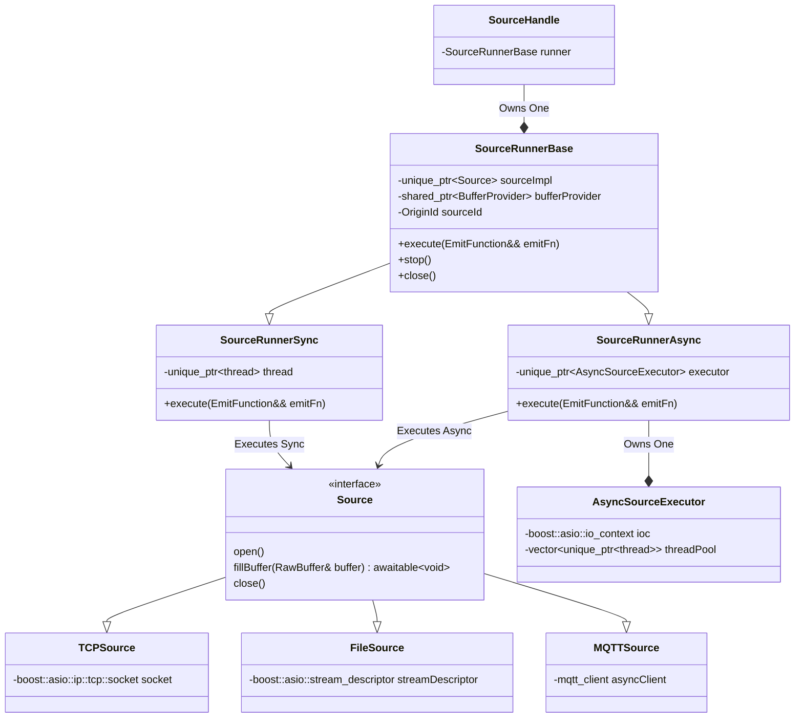

# The Problem
NebulaStream promises to be able to cope with millions of sources on millions of devices as one of its main selling points.
This requires a single node to handle thousands of sources concurrently.

Currently, each source that is started runs in an individual thread. 
That is, starting 1000 sources means starting 1000 threads just for the sources. 
Since the threads are running permanently, ingesting data into the system, this leads to a massive oversubscription of the CPU and causes frequent context switching.
Given that each thread allocates state (a private stack of several MBs), this is expensive. 
Therefore, the current approach does not scale with an increasing number of sources (**P1**).

Currently, sources read external data into the system while additionally parsing that data to the schema of the logical source.
This mixes up I/O logic with data parsing and therefore violates basic principles like the separation of concerns (**P2**).

Each source reads data from external systems or devices and writes them into buffers provided by the NES `BufferManager`.
In its current state, all buffers could be taken by fast sources.
This leads to a deadlock, since query processing can not proceed without buffers (**P3**).


# Goals
A single node worker should be able to handle thousands of concurrent sources without data ingestion becoming a bottleneck.
By that, we do not mean that slow disk or network I/O can not be the bottleneck in query execution (this may be out of the systems control).
Instead, the key aspect is that adding more sources should not slow down existing sources or CPU-bound operations for internal reasons such as CPU oversubscription or threads spin waiting on data to become ready.
Of course, devices like the disk or network card are limited in the bandwidth they can provide with regard to concurrent access, but at least we can hide these latencies and allow the system to use these resources more efficiently by accessing them asynchronously, without blocking the CPU
(**G1, scalability**, addresses P1).

The implementation of new sources should be as easy as possible by providing a small, concise interface that should closely match the current interface.
Sources will still be able to setup (open resources), fill a raw byte buffer, and close resources again.
Sources will be free of parsing logic, enabling clear separation of concerns regarding I/O and compute.
Their only task should be to ingest raw bytes into buffers as fast as possible.
After the redesign, a source should be easy to digest and contain only the state necessary to manage the connection to an external system/device **(G2, simplicity and decomposition**, addresses P2).

The `BufferManager` should have entirely separate pools for I/O and compute, removing the potential deadlocks (**G3**, addresses P3).
It may be possible to enable transferring buffers between the two pools if necessary, but that is an optimization.
The `BufferManager` should receive the information it needs to facilitate fairness and maximum efficiency by making it aware of sources and their requirements.
In particular, it needs to take care of flow control and speed differences between different sources to ensure that a) buffering is possible under high load of a particular source while b) guaranteeing each source to receive a single buffer at a time to make progress for queries that are dependants of that source.
In addition, the `BufferManager` should be extended to expose an asynchronous interface for sources to use.
Our goal is to get rid of blocking operations within I/O threads wherever possible.
We propose simple policies and provide a PoC implementation to showcase this.

The following three goals are additional goals that do not address specific problems in the current implementation, but are still important with respect to usability and maintainability.
The implementation should conform to the past effort of refactoring the [description and construction of sources](https://github.com/nebulastream/nebulastream-public/blob/main/docs/design/20240702_sources_and_sinks.md).
We want this redesign to not impact the construction of sources at all, we aim to only redesign the execution model.
The impact on the rest of the codebase should be minimal (**G4, non-invasiveness**).
We do not want the `QueryEngine` that manages sources to know or depend on the internals of the execution model of the sources.

Errors should be handled transparently as described in the [DD on error handling](https://github.com/nebulastream/nebulastream-public/blob/main/docs/design/20240711_error_handling.md).
Every possible error regarding I/O operations should be handled appropriately by trying to recover from it if possible, or emitting the error to a higher-level component (**G5, fault transparency**).

It should still be possible to implement new sources with the current threading model as a fallback/baseline **(G5, backwards compatibility)**.

# Non-Goals
- **NG1**: a complete vision or implementation on how the sources interact with the `BufferManager`, and what policies the `BufferManager` should implement to facilitate fairness and performance. We only provide a PoC here.
- **NG2**: a complete vision or implementation on how to handle parsing tuples out of the bytes that the source emits.
- **NG3**: a complete vision or implementation on how to handle source sharing.
- **NG4**: a complete vision or implementation on how to handle data ingestion via internal sources (e.g., when intermediate data is shuffled around between nodes).

# Solution Background
Most software systems depend on external data in some way:
- Web servers - clients connect via network and issue requests 
- DBMSs - large volumes of historical data are scanned from disk or network, originating from potentially multiples queries
- SPEs - sources continuously ingest data (think thousands of sources, potentially from thousands of different queries)

All of them need some mechanism to map compute resources (i.e., threads) to these concurrently running I/O operations.

## Threads
There are two naive threading models to manage data ingestion:
1. Single-threaded I/O that switches between all tasks/connections/sources
2. A single thread per task/connection/source (as currently implemented in NES)

The former leads to serial execution, limiting throughput. 
The latter leads to a lot of overhead in the case of very large numbers of connections/queries and therefore to a term called *oversubscription* of the CPU.

From "C++11 - Concurrency in Action": *"When you have an application that needs to handle a lot of network connections, it’s often tempting to handle each connection on a separate thread, because this can make the network communication easier to think about and easier to program.
This works well for low numbers of connections (and thus low numbers of threads).
Unfortunately, as the number of connections rises, this becomes less suitable; the large numbers of threads consequently consume large numbers of operating system resources and potentially cause a lot of context switching (when the number of threads exceeds the available hardware concurrency), impacting performance.
In the extreme case, the operating system may run out of resources for running new threads before its capacity for network connections is exhausted.
In applications with very large numbers of network connections, it’s therefore common to have a small number of threads (possibly only one) handling the connections, each thread dealing with multiple connections at once."*

Web servers and query engines therefore often use separate thread pools for I/O and compute.
This decoupling prevents tasks that are CPU-bound to hog threads and being unable to respond to external requests. 
At the same time, threads that do blocking I/O calls (e.g., asking for a disk page, making a request to S3, etc.) stall compute threads or other threads that could issue I/O requests the meantime.

## Async I/O
Now that we have a separate thread pool for I/O operations, we need to define operations and decide how to schedule them on this pool.
With the assumption that we primarily do I/O when dealing with sources, we are **waiting** for something to happen in the background for most of the time.
At some point in each source, we call a client like `doRequest()` and then we are blocking on this call.
The CPU does not have any insight information on what we are waiting on, so if we are unlucky and the CPU does not give another thread a time slice, we block the CPU with our I/O.

An improvement to this would be to to put the thread to sleep by using mechanisms like `std::future` and have another thread run while we wait on the I/O to complete.
However, this still has the thread where the call was invoked from occupied, so this exact thread is not free to use for other tasks.
If we assume a limited pool of threads, which we strive to have, we could still end up in the situation where all available I/O threads are sleeping, waiting for blocking I/O to complete.
During this time, no other I/O tasks can make progress.

It would be nice to have a mechanism to pause/resume a function waiting for external I/O **without** occupying a thread while waiting for data to arrive.
That's what async I/O gives us, and the easiest way to implement it using modern C++ are coroutines.
They enable us to suspend and resume functions as they are running, while **preserving** their state.
Internally, the compiler rewrites coroutines to state machines to make this work.
C++20 introduced three new keywords, namely `co_await`, `co_yield` and `co_return`.
`co_await` pauses execution and awaits another coroutine that is called (lower-level code), `co_yield` yields a value to the caller without returning to the caller (think python generators), `co_return` signals termination of the coroutine with an optional return value.
Coroutines provide an elegant way to implement async I/O while allowing it to look like sequential execution.
Before coroutines existed, one had to use chains of callbacks that were invoked when asynchronous operations returned to the calling function.
Utilizing these mechanisms of pausing/resuming execution, we are now able to wait for external events to happen in the background, without occupying a thread (like a TCP socket filling a buffer, or a disk page to be copied into memory).

An important thing to note is that we should avoid running blocking operations by yielding control regularly.
Otherwise, we block a thread, possibly preventing other async operations from making progress.
For this reason, the efforts to move data parsing (which might be CPU-intensive) from the sources and async I/O go hand in hand.
If we follow the guideline and isolate I/O-bound operations properly from CPU-bound operations, an enormous amount of concurrent tasks can be scheduled on relatively few threads. 

The ongoing I/O operations can be wrapped into coroutines that represent tasks that drive the sources' progress.
An async runtime manages these ongoing tasks.
It can run with a fixed-size thread pool or even just a single thread and it polls tasks that are ready to make progress.
How does it know what tasks (coroutines) are ready to be resumed and make progress?
Typically, this is done via syscalls like `epoll`. 
They allow the kernel to notify when something happened (i.e., data has arrived), queueing an event together with the coroutine to be picked up by a thread and resumed.
We do not rely on spin waiting, nor do we need a timer or regularly wake up to check if something is ready.

When resumed, we can deal with the arrived data, e.g., by giving it out to other components for further processing.
Potentially, the task can then make a new request before yielding control again.

Libraries that help implementing async I/O are, among others, `boost::asio` (C++) and `tokio.rs` (Rust).
They provide executors, thread pools, and low-level I/O primitives like `boost::asio::posix::stream_descriptor` and `boost::asio::ip::tcp::socket`.
Here is an example of an asynchronous TCP server that handles a single connection:
```cpp
awaitable<void> handleConnection(tcp::socket socket)
{
    try 
    {
        // Loop until the connection is closed
        for (;;;)
        {
            // Allocate a buffer that data can be written to in the background
            auto buffer = new boost::array<char, 8192>;
    
            // Receive some more data. When control resumes at the following line,
            // n represents the number of bytes read.
            // This does not block, but state is saved and control yielded back to the runtime, allowing other tasks to make progress.
            size_t n = co_await  socket->async_read_some(boost::asio::buffer(buffer), use_awaitable);
            // use_awaitable is a special "completion token" that indicates that we want to resume in the current coroutine
            // We could pass a callback instead.
    
            // Handle the data we have received
            ...
        }
    // Boost Asio handles termination signals via error codes
    } catch (boost::system::error& error) 
    {

        if (error.code() == boost::asio::error::eof)
        {
            fmt::print("Connection closed (EOF)\n");
        }
        co_return;
    }
}
```
Note that you cannot plug every possible function into a `co_await`, but only "awaitable" functions, i.e., other coroutines.
By using any of the coroutine keywords, you implicitly make a coroutine from the current function.
To make it run, we would use a call like the following:
```cpp
boost::asio::post(io_context, [socket]()
    {
        co_spawn(io_context, handleConnection(std::move(socket)), boost::asio::detached);
    }
);
```
`detached` is a special completion token that indicates the end of an asynchronous execution chain, i.e., we are not interested in the result of the awaitable.

In summary, systems using async I/O get the following benefits:
- The number of threads (and therefore the overhead) is kept small
- I/O operations can be interleaved with other I/O operations 
- I/O operations can be interleaved with computation (CPU-bound tasks)

# Our Proposed Solution
The proposed solution depends on these key design decisions:
1. We redesign sources to make asynchronous calls inside coroutines to allow efficient data ingestion for thousands of sources on relatively few threads.
2. We remove parsing from the sources to separate cpu-bound and i/o-bound workloads.
3. We introduce a centralized `asyncsourceexecutor` that drives the execution of all asynchronous sources on a thread pool.
4. We allow synchronous sources to still exist and run on separate detached threads as a fallback.
Both synchronous and asynchronous sources expose the same interface to the `QueryEngine`, so it does not need to deal with the different execution models.
5. We have sources receive buffers by utilizing an asynchronous interface (prevent blocking i/o threads) from a separate buffer pool (prevent deadlocks).
6. We allow the `QueryEngine` to request partially filled buffers in source implementations when its task queue is empty, canceling asynchronous operations. this prevents high tail latencies without timeouts. 

## Source Implementations
We need asynchronous i/o requests and the removal of parsing logic because if we desire to reduce the number of threads significantly when dealing with large numbers of sources, we can not afford to make blocking calls or do CPU-intensive work on these few threads.
Therefore, we strip the schema and all other parsing-related state and logic off the sources.

The primary library for implementing async I/O in C++ is `boost::asio`, which is battle-tested and known to have only small overhead.
It provides us with everything we need, from an async runtime to asynchronous I/O objects like sockets, file descriptors, serial port interfaces, etc.
Therefore, we choose `boost::asio` as the library to implement asynchronous sources.




## Buffer Management
On a high level, deadlocks occur if there are cyclic dependencies on a specific resource in the system (here: buffers).
In our case, producers and consumers of data depend on buffers to make progress.
If a consumer acquires all buffers to store internal state of e.g., pending windows, the corresponding source can not acquire a buffer anymore, so no new data can be produced for the operator to trigger the window and release its buffers.
Therefore, we have a horizontal divison of components (producer-consumer dependencies) and a vertical division (e.g., among different sources/pipelines, no dependencies).
Only producer/consumer relationships are susceptible to deadlocks in our case.
Hence, between producer/consumer relationships deadlocks need to be avoided, whereas among sources only fairness of distribution plays a role. 
By separating an I/O pool from the rest of the global buffer pools, we avoid the deadlock problem between sources and their consumer pipelines (P3).
A redistribution of these pools based on the requirements of I/O and processing is an optimization that could be applied at a later point.

Currently, each source has a local `BufferProvider` that maintains a pool of buffers only for this source. 
The `SourceThread` uses this provider to call `getBufferBlocking` repeatedly in the running thread routine.

### 1) Asynchronous Interface
Since sources should be implemented in an asynchronous manner from now on, we need to question the call to `getBufferBlocking` that currently happens on an I/O thread.
This call blocks until a buffer becomes available, which we want to avoid on I/O threads.
There is a non-blocking alternative available called `getBufferNoBlocking`, which returns an `std::optional`.
In this case we do not block, but the source still requires a buffer to make progress, so we need to use a timer within the source that wakes us up to try again.
This timeout is arbitrary and needs to be set by us developers, which is not ideal. 
An alternative might be to extend the asynchronous behavior of the sources and implement an event-based mechanism into the `BufferManager` that notifies the coroutine that asked for the buffer when it is available.

### 2) Flow Control
For flow control (handling speed differences between producer and consumer, and among different producers), the following questions arise with respect to buffers:
1. **Slow Source, Fast Downstream**: *How do we keep the latency in check when a source takes a very long time to fill a buffer?*

This will be the general case where the system is not overwhelmed with external data, and I see two approaches here:
- *Demand-based*: If the `QueryEngine` sees that the task queue is empty, it may ask a `Source` to release a partially filled buffer.
Instead of issuing new requests or waiting for more data, the coroutine driving the source could yield control and give out the buffer, asking the `BufferManager` for a new one.
This approach would require to have some kind of backwards control flow or would need to be implemented by the `QueryEngine`, but it would give a consistent approach for controlling the latency.
- *Timeout-based*: After some time has passed, the source releases its buffer, writing it downstream.
Here, we get another hyperparameter for the system. 
Global timeouts are not suitable as each query might have different latency requirements.
Also, the timeout set might not even be reflected in the final latency (it only reflects on the latency of the source).
Therefore, I propose the implementation of a demand-based solution.

2. **Fast Source, Slow Downstream**: *How do we apply backpressure to help the system under high load?*

If we work with a fixed-size buffer pool, we can apply backpressure to a source by rejecting its request to acquire a buffer.
This forces the source to try again later.
The source could then set a timeout and be woken up by the I/O executor at a later point to try again.
In the meantime, the external system will be throttled.

3. **Fast Sources, Slow Sources**: *How do we handle speed differences between sources and prevent fast sources from stealing all resources?*

Speed differences can be defined as differences in buffer requests per unit time.
When downstream tasks are generally reading and thus releasing the buffers faster than the sources can fill new buffers, case 1) applies and the speed differences do not lead to problems. 
By contrast, when a source is producing and thus requesting buffers at a faster rate than downstream tasks can release them, case 2) applies.
In a temporary case, enough buffers are available and the buffer manager will happily give them out to fast producers so the available buffers will be automatically be distributed relative to the demand.
Problems arise when a single or few sources take so many buffers that others are impacted and have buffer requests denied.
Therefore, in general, we always want to guarantee **each source having a single buffer available that it can fill in the background (double buffering)**. 
This is the minimum required to effectively utilize async I/O.
The `BufferManager` needs to make sure it holds a reserve of a single buffer per source at all times.
Implementation-wise, I see two approaches here:
#### 1.1) Global Pool + Backup Pool
Under normal operation, the `BufferManager` draws buffers from the global I/O pool based on demand.
It is aware of currently running sources and keeps a backup of buffers when under high load. 
In order to prevent sources that are under high load from stealing all resources of the global pool, we draw from the backup pool if the global pool is in use.
To facilitate fairness here, I propose the simple algorithm:
- Sources ask for buffers, by putting their id in a FIFO queue 
- A source can only ask for one buffer at a time. After a source received a buffer, it can only ask for another buffer, after it finished processing the current one and sees that it needs more.
- Slower sources are guaranteed to move up in the FIFO queue everytime a faster source takes a buffer

The previous necessitate the assumption/invariant that more buffers exist than the number of sources registered.
When a source wants to be registered and this would violate the requirement, performance will degrade.

# Proof of Concept

# Alternatives

# Open Questions
- How to deal with source sharing?
- How to deal with internal sources?

# Sources and Further Reading
- https://www.boost.org/doc/libs/1_86_0/doc/html/boost_asio.html
- https://stackoverflow.com/questions/8546273/is-non-blocking-i-o-really-faster-than-multi-threaded-blocking-i-o-how

# (Optional) Appendix

