# The Problem

The current system's limitation lies in its support for queries across a single engine.
However, the legacy system and NES aim to process queries across geographically distributed instances.

Designing a network stack presents a significant challenge, particularly when considering dynamically changing networks with nodes joining and leaving the system.

The legacy system integrated networking as a core component, resulting in numerous references and special cases that check for `NetworkSources` and `NetworkSinks`.
The legacy `DataSource` interface seems to mismatch the design of the `NetworkSource` and `NetworkSink`.
ReconfigurationMessages were extensively used to communicate the connection status between a source and a sink.

The legacy networking stack has positive aspects, as the abstraction of using sources and sinks allows the worker to remain somewhat oblivious to whether a query is distributed or not, despite the aforementioned problems.
Queries were effectively divided along a path of sources and sinks, connected via Network Source/Sink pairs.

The system's users lacked control over handling potential disconnects, which typically led to the crashing of one node, followed by every other node.
Buffering of data and general fault-tolerance mechanisms were only partially implemented to address connection losses between nodes.

# Goals

The goal is to enable distributed queries that are robust even when counterparts on different nodes do not yet exist.
Another goal is to ensure no modifications are required to other components in the system, avoiding special cases.
We aim for policy-based propagation of faults, potentially allowing for an infinite buffer of TupleBuffers if desired.
The system should implement per-query backpressure, propagating backpressure to upstream nodes if a downstream worker cannot accept more work, while avoiding unnecessary backpressure on unrelated queries.

# Non-Goals

The optimizer and placement of operators are not primary goals; while some form of placement is required for testing, we rely on a simple bottom-up implementation.
Coordination of queries is also a non-goal; buffering and waiting for counterparts should allow starting and stopping queries asynchronously.
We start queries asynchronously without waiting for confirmation, and we could implement polling to verify the state of a set of distributed queries.

# Solution Background

Single Node Queries

# Our Proposed Solution

Our proposed solution divides the implementation into two main components.
The Planning Component, managed by NebuLI, handles the distribution of the query to multiple workers.

The NetworkConnection component facilitates control and data message exchange between two workers.
Connections are established using a channel identifier and a connection identifier, where the channel identifier uniquely identifies a communication channel between a source and a sink, and the connection identifier specifies the network address of the other participant.

We introduce a NetworkSource and NetworkSink into the system, which can be hidden behind the source/sink provider, making them transparent to the rest of the system, and they function like normal sources and sinks.

The process of dividing the query plan into multiple connected query plans is performed offline in NebuLI.

## Planning

Planning or operator placement solves the question where each operator should run given a query and a topology of participating workers.

A Join Query with two sources and a Sink. Note that in its current implementation the distributed planning is done last. All transformation rules have already been applied. This implies that all source operators in the query graph are already attached to a physical source.

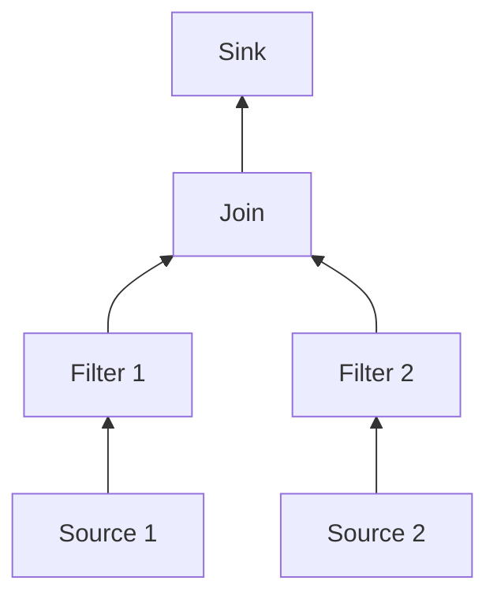

Topology of 3 Nodes. Node1 and Node2 cannot communicate directly. Data can only flow from node node1 to node3 and node2 to node 3.

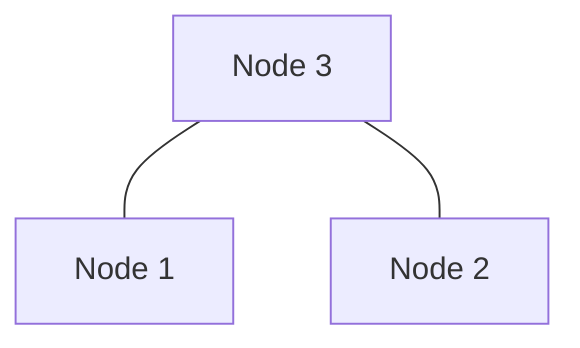

Topologies are currently described as yaml configurations:

```yaml
logical: [...] # list of logical sources
nodes: # list of nodes
  - address: addr:port # how to reach the node
    links: [...] # list of connected nodes and directions
    sinks: [...] # list of sinks attached to the worker
    physical: # which physical sources are attached to the ndoe
      - logical: logical_source_name
        type: TCP
      # ... more sources
  # ... more nodes
```

Placement starts by loading known operator placements from the topology.
The topology has to describe where each physical source is attached. E.g. from the Topology we know that Source1 has to placed at node 1 and Source 2 has to be placed an node 2. Likewise we can apply pinning for the sink operator.

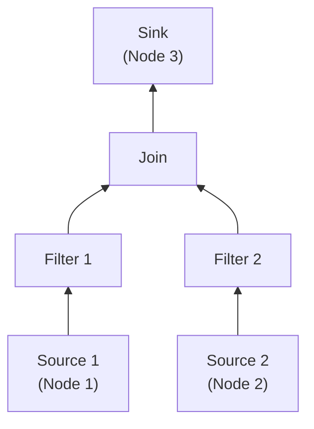

For bottom up placement we topologically sort all operators starting from the source operators.

For unary operator data will only from the child operator, thus we only have to take the current capacity of the node into account when placing the operator.
If there is enough capacity we place the operator where its child operator is placed.
If the capacity is not enough we pick the first node along **a random** path from the current node to the node where the next downstream operator (usually the sink) is placed.

For n-aray operator pick the lowest common ancestor between all child nodes.

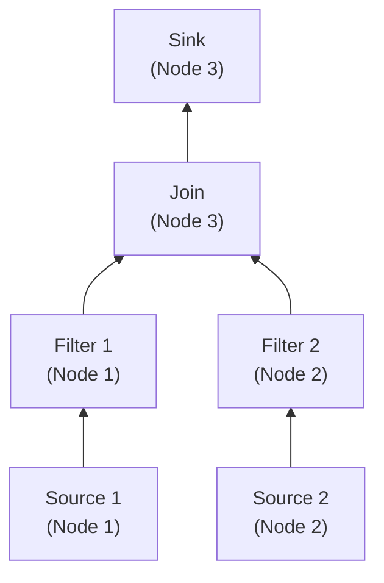

### Requirements

To simplify the planning and decomposition process, the current implementation enforces the following requirements:

**1. Single Sink:**

The implementation requires a single sink in the query. This ensures all data flows to one root node.

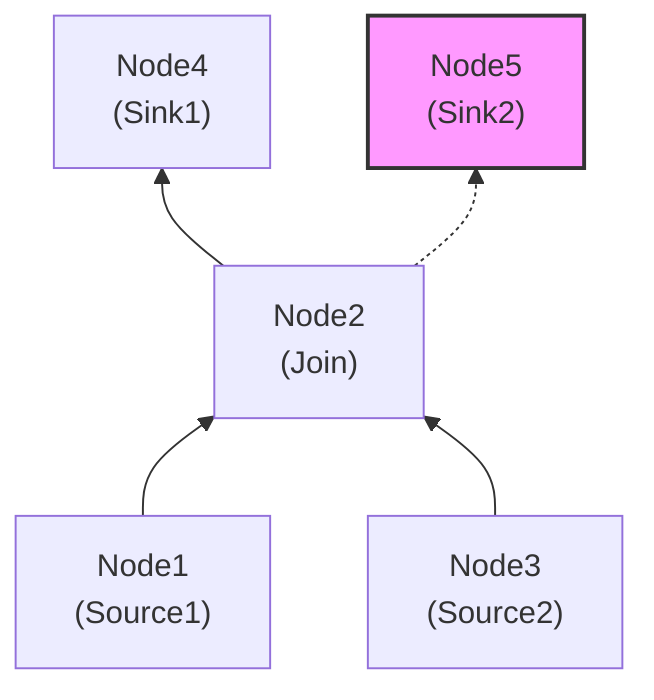

**2. Tree Structure:**

The implementation transforms the topology into a tree structure. It achieves this by ignoring multiple paths between nodes and picking the first available path. This simplification may lead to suboptimal operator placement, especially when considering node capacity constraints. Choosing a path randomly, instead of evaluating all possible paths, might result in a path with insufficient capacity being selected.

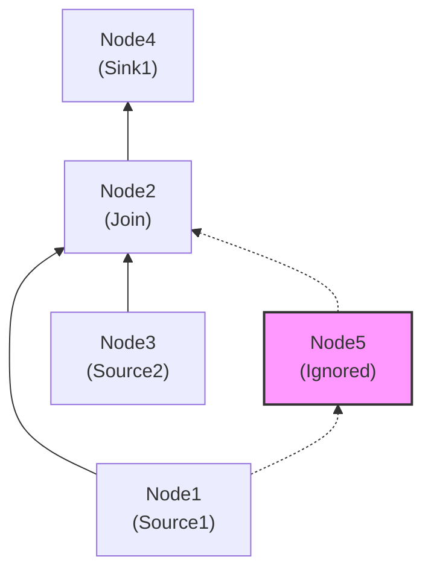

### Decomposition

NebuLI decomposes the query plan after placing all operators.

1. It groups operators by node.
2. It creates new query plans with operators on a single node.
3. It stitches these query plans together with NetworkChannel, based on the topology.

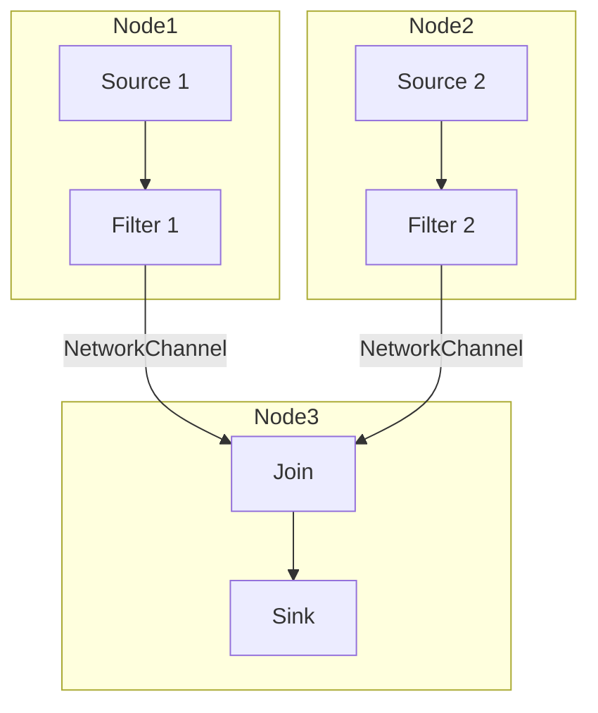

The network channel is implemented using network sources and sinks that are put around the the decomposed query plan.

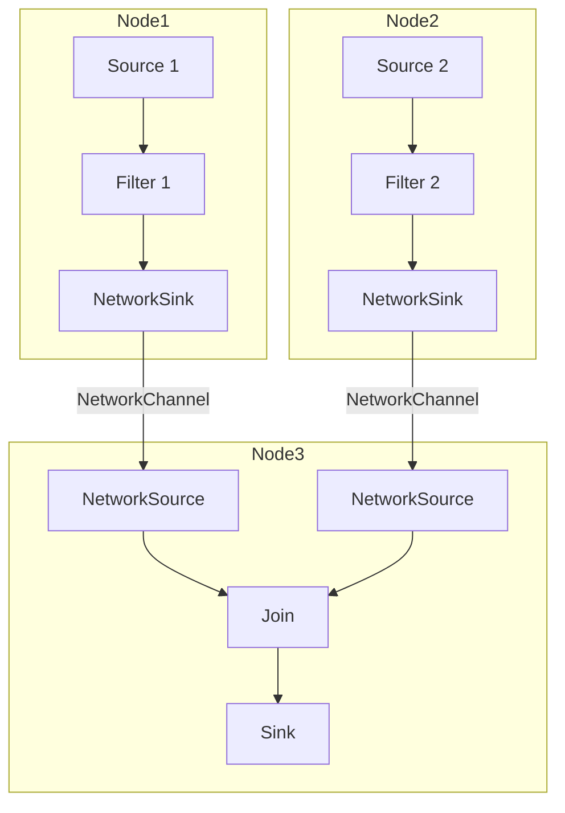

### Deployment

The deployment process involves the following steps:

1.  The topology configuration contains a GRPC endpoint for each worker node.
2.  NebuLI uses these endpoints to register and start each decomposed query plan on the respective worker nodes.
3.  Each worker node returns a query ID, which is local to that node.

Currently, NebuLI lacks a global query ID counter and built-in mechanisms for stopping or logging distributed queries. Implementing these features requires building additional functionality on top of NebuLI; for example, starting a distributed query would involve tracking the individual query IDs, which could then be used to stop each query individually.

## Network Channel

`NetworkChannel`s are the abstraction we use to implement `NetworkSource`s and `NetworkSink`s. The creation of a `NetworkChannel` is handled asynchronously by an in-house Tokio based rust library. The legacy system has used ZeroMQ, and multiplexed multiple data flows via a single TCP Connection. The `NetworkChannel` library uses distinct TCP Connections for all data channels.

`NetworkChannel` allow us to distributed operators across multiple nodes. A `NetworkChannel` connects pairs of operators, not queries.

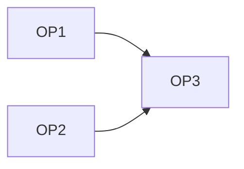
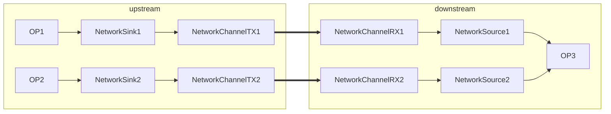

In its current iteration the `NetworkChannel` can be its own isolated components. It is integrated into NebulaStream solely via a a dedicated `NetworkSource` and `NetworkSink`.

Despite the name, the creation of `NetworkChannel`s both for receiving and sending data does not require a functional network connection to be established. It will handle buffering internally. The library will try to establish connections continuously. This enables decomposed queries to be deployed asynchronously, without waiting for its counterpart. Once a connection has been established buffered data is send via the network connection.

The `NetworkChannel`s implementation is split into two logical type of network connections. `ControlConnection`s and `DataConnection`s.

#### Control Connections

There will only be one Control Connection between two `NebulaStream` nodes, regardless of how many queries, or paired operator exists.
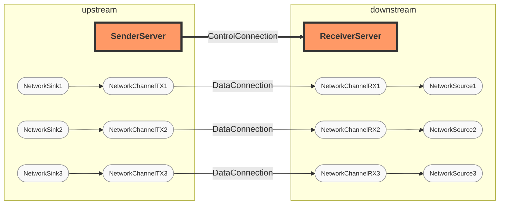

In its current iteration control connections are not created eagerly, mostly because the SingleNodeWorker does not know about other nodes in the system.

A `ControlConnection` is only established upon the first `NetworkChannel` creation request.

The `ReceiverServer` starts a control port and listens for incoming connections from other nodes. This control port implements a heartbeat mechanism to ensure the other node is alive.

When a query starts and new data channels are required, the `SenderServer` sends an `OpenChannelRequest` to the `ReceiverServer`.
If the `ReceiverServer` has previously handed out a `NetworkChannel` internally to the `NetworkSource`, the channel identifier used within the `OpenChannelRequest` is registered at the `ReceiverServer`

The `ReceiverServer`'s control handler allocates a new TCP port and responds with an `Ok` message containing the new port number.

If the `ChannelIdentifier` has not previously been allocated, which could happen for a variety of reasons, the `ReceiverServer` answers with a `Deny` message. The `NetworkChannel` on the sender side remains active, but will be continuously reattempt to establish a channel connection. If eventually the channel is registered at the `ReceiverServer` side the channel will be established.


#### Data Connections

*   The `SenderServer` creates a new `DataChannelHandler` that connects to the receiver's data channel port.
*   This newly created TCP connection is solely used for data transfer.
*   Registering a channel returns a `ReceiverChannel` to the `NetworkSource`, regardless of whether the underlying connection is established. The `NetworkSource` can block on the `ReceiverChannel` and retrieve data once a `DataConnection` is established by the `ReceiverServer`.


Any worker participating in distributing query processing need to be started with the `data` configuration which gives the system an ip address + port to listen for
incomming data connections. Additionally the system needs to be compiled with the networking sink/source plugins enabled.

Two components implement the NetworkChannels functionality. `SenderServer` and `ReceiverServer`, both are implemented as singletons and contain an individual tokio runtime. Both services handle out channel, that can be read or write from.

On startup the services are instantiated, this enables upstream and downstream nodes to connect to the worker instance. Channel on the other hand are only handed out when a query is started.

1. Init Receiver / Sender Server
2. Receiver Server controller listens on configured port
3. Start Query
   3.1 NetworkSink register a SenderChannel
   3.2 NetworkSource reigster a ReceiverChannel
4. SenderServer controller reaches out to ReceiverServer controller on other node attempts to open DataChannel
5. ReceiverServer starts DataChannelHandler by allocating new TCP Port
6. ReceiverServer sends Ok response to SenderServer with New TCP Port
7. SenderServer creates new DataChannelHandler which connects to port
8. Writes to NetworkSink will write to the SenderChannel which writes to the DataChannel TCP Connection which writes to the ReceiverChannel


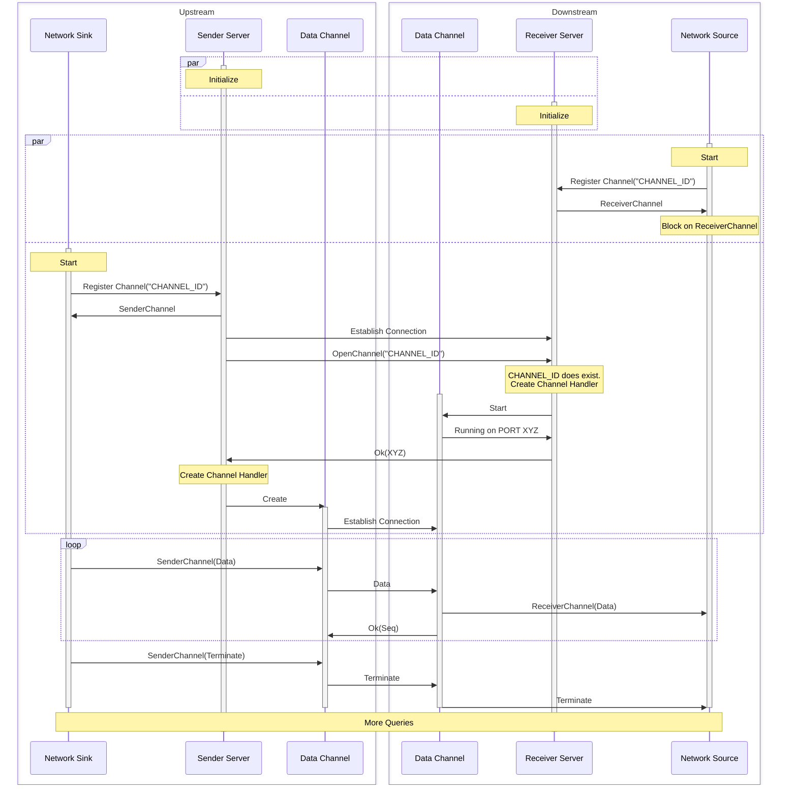

## Receiver

The receiver starts the control port. the control port listen for other nodes to connect, the control port implements simple heartbeat mechansim to determine that the other node is alive.

Once a query is started and a new data channel needs to be created to allow a network sink to communicate with a network source a OpenChannelRequest is send from the SenderServer to the ReceiverServer. If a receiver channel has previously been created from a query of the downstream node the control handler on the receiver server will allocate a new tcp port and answer with a Ok response and the new port number.

A Data Channel Handler will be created that listens on the newly allocated datachannel port. The Sender server will also create a new data channel handler
that connections to the receivers data channel. The newly created TCP connection will soley used for data.

Registering a channel will return a ReceiverChannel to the NetworkSource. This ReceiverChannel is created regardless if the underlying connection is established or not. The source can block on the ReceiverChannel and will retrieve data, once a real data connection has been established by the ReceiverServer.

The recv call from the ReceiverChannel may fail, at which point the source has the option to reopen the data channel or fail the query.

## Sender

The Sender server is started on start up. it is also a singleton. when a network sink is `started`.

# Proof of Concept

- demonstrate that the solution should work
- can be done after the first draft

# Alternatives

### ZeroMQ

ZeroMQ introduces a large dependency, while the legacy implementation used ZeroMQ in a very limited way.
The implementation used ZeroMQ messages to serialize and deserialize messages, and a ROUTER/DEALER combination to distribute work from a single receiver thread onto multiple network threads.
Application-level acknowledgments still need to be implemented.
The current solution is purely TCP-based and can thus exploit lower-level TCP features, such as backpressure.

### C++ Implementation

Due to the clean separation of the networking stack and the rest of the single-node worker, we are able to use a Rust-based implementation.
An alternative implementation in C++ using Boost Asio would also be possible.
Rust brings along its benefits of ruling out certain areas of bugs, particularly those that are notoriously difficult to debug in C++.
Rust's memory safety features prevent common errors such as null pointer dereferences, buffer overflows, and data races.
This design document introduces the first steps of integrating Rust-based components, and the network stack appears to be an ideal candidate for these efforts, with Tokio being a mature and well-documented implementation of an async runtime.
Tokio provides asynchronous I/O capabilities, allowing the network stack to handle a large number of concurrent connections efficiently.
Compared to Boost Asio, Tokio offers a more modern and ergonomic API, as well as better performance in some cases.

### Multiplexing Data Channels

The implementation uses multiple TCP connections for each data channel, but we could create a single TCP connection and send data for multiple channels.
The problem with multiple TCP connections is that it could be wasteful on OS resources, and we are limited by the number of available ports.
However, we can simply use the TCP backpressure mechanism on a single data channel by not receiving, thus slowly preventing the other side of the channel from writing.
Additionally, no complex dispatch logic is required to move data into the correct channel implementation.
Closing a data channel is as simple as closing a socket.

# (Optional) Open Questions

- list relevant questions that cannot or need not be answered before merging
- create issues if needed

# (Optional) Sources and Further Reading

- list links to resources that cover the topic

# (Optional) Appendix

- provide here nonessential information that could disturb the reading flow, e.g., implementation details
