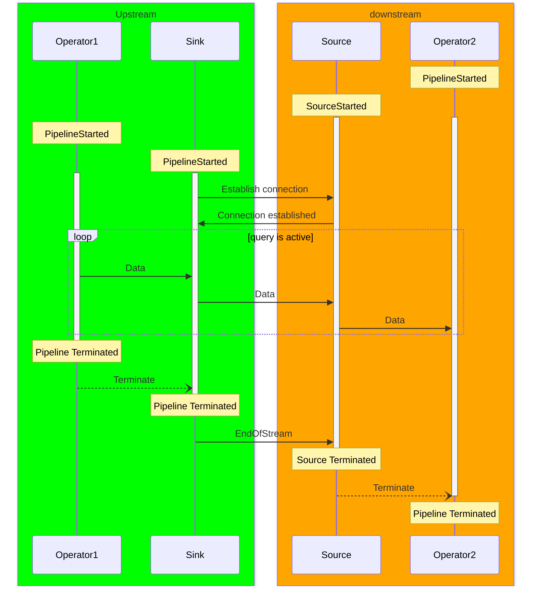
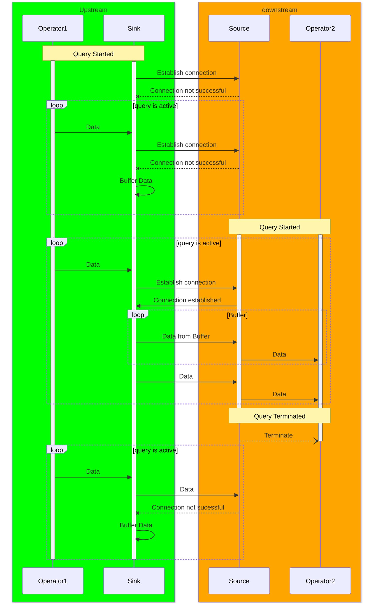
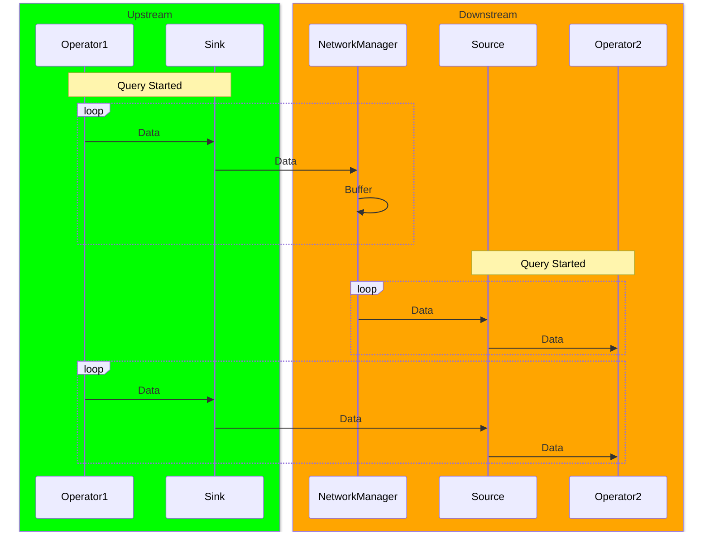
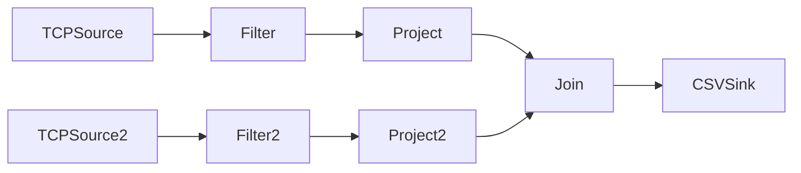
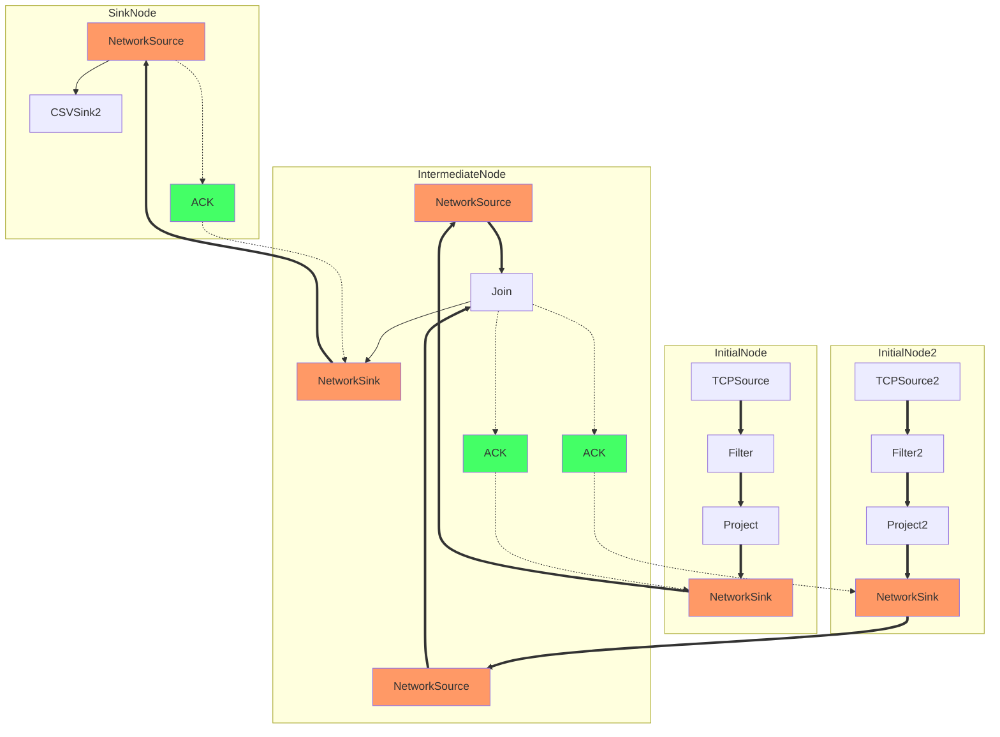

# The Problem

The current system only supports queries across a single engine. The legacy system and NES however targets query processing
across geo distributed instances.

Designing a network stack is a non trivial task, especially targeting dynamically changing networks with nodes entering 
and leaving the system. 

The legacy system handled networking as an integral part to the system, there are countless references and special cases
checking for `NetworkSources` and `NetworkSinks`. The Legacy `DataSource` interface appears to missmatch the design of 
the `NetworkSource` and `NetworkSink`. ReconfigurationMessages have been extensively used to communicate if a source and
a sink is connected.

There are positive aspects about the Legacy Networking stack. The abstraction of using sources and sinks allow the
worker to be somewhat oblivious (disregarding the aforementioned problems) to if a query is distributed or not. Queries
where effectively chopped along a path of sources and sinks and connected via Network Source/Sink Pairs.

The user of the system could not decide how to deal with potential disconnects along the way, usually a disconnect ended
up crashing one node and then every other node. Buffering of data or general fault-tolerance in case of connection loss inbetween nodes was only partially implemented.

# Goals

- Enable Distributed Queries. Robust to not (yet) existing counterparts on different nodes.
- No modification to other components in the system. No special cases.
- Policy based propagation of faults. Potential infinite buffer of TupleBuffers if desired. 

# Non-Goals
- Optimizer and Placement.
- Coordination of queries. Buffering and waiting for counterparts should allow starting and stopping queries asynchronously

# (Optional) Solution Background
ZMQ
Single Node Queries

# Our Proposed Solution

We introduce a NetworkSource and NetworkSink into the system. These can be hidden behind the source provider and are thus
unknown to the rest of the system. They behave just like normal sources and sinks.

The actually chopping of the query plan into multiple connected query plans happens offline (e.g. in NebuLi or manually).
We can introduce a component that does that automatically for testing/demoing.

Ideal successor query is already running:

Upstream Buffering

Downstream Buffering:

# Proof of Concept
- demonstrate that the solution should work
- can be done after the first draft

# Alternatives
- discuss alternative approaches A1, A2, ..., including their advantages and disadvantages

# (Optional) Open Questions
- list relevant questions that cannot or need not be answered before merging
- create issues if needed

# (Optional) Sources and Further Reading
- list links to resources that cover the topic

# (Optional) Appendix
- provide here nonessential information that could disturb the reading flow, e.g., implementation details
