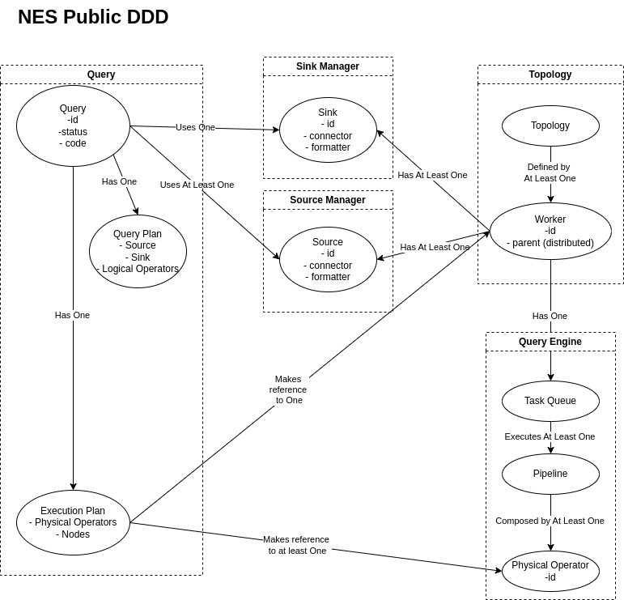
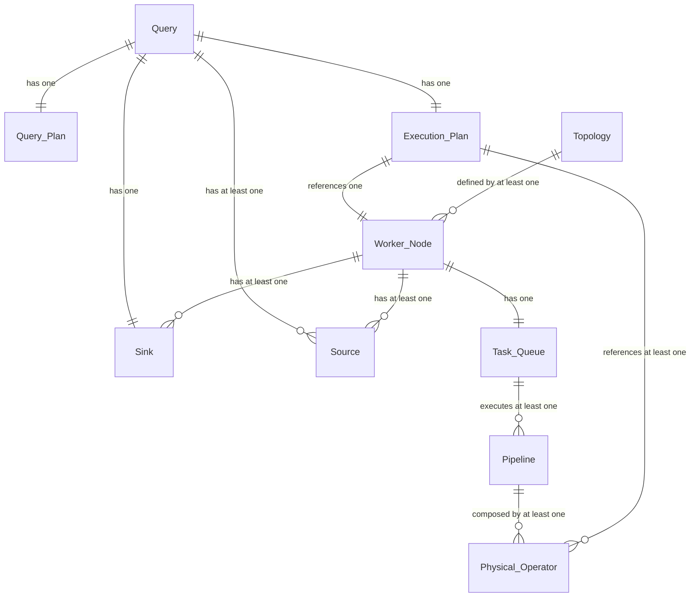

# The Problem
- Currently there is an effort to enable a REST Server for NebulaStream, however, the API definition is not yet complete.
- Once the REST API is defined and documented, the NebulaStream REST Server can be implemented and therefore the NebulaStream UI would be enabled as a new entry point to the system for base-users, performing the minimal User-Flow, as described in the [New NebulaStream UI](https://github.com/nebulastream/nebulastream-ui/tree/experimental/lite), more specifically in the [User-Story for a Base-Use](https://github.com/nebulastream/nebulastream-ui/issues/454).
    - In short, the UI base-user should be able to perform the User-Flow: `Write Query` -> `Submit Query` -> `List Registered Queries` -> `Inspect Query` -> `Stop Query`
    - Additionally, taken from the Legacy NebulaStream UI, the SIGMOD Demo paper, code, documentation, talks with Maintainer Team Members, the user should be able to also perform some inspections as described in the User-Flow (UI perspective): `Connect to Nebuli REST` -> `Inspect Topology` -> `Inspect Worker Nodes` -> `Inspect Sources` -> `Inspect Sinks` -> `Write a Query` -> `Submit a Query` -> `Register a Query` -> `Start a Query` -> `List all Queries` -> `Use pre-loaded Queries (UI Feature)` -> `Inspect Query Status` -> `Inspect Query Plan` -> `Inspect Execution Plan` -> `Stop a Query` -> `Restart a Query` -> `Delete a Query`
- P1 the NebulaStream Public Model is not clearly defined in a single piece of documentation
- P2 the legacy REST API does not reflect the new NebulaStream model

# Goals
- G1 Confirm the NebulaStream Model
- G2 Create the OpenAPI Definition based on the NebulaStream Model

# Non-Goals
- NG1 Implement REST Server, that is done in [#767](https://github.com/nebulastream/nebulastream-public/issues/767) 

# Alternatives

The intention of this DD is to present a design upfront getting feedback, verify correctness, and change whenever it is necessary.

# (Optional) Solution Background
- Legacy REST API
- SIGMOD Demo Paper
- Sample Queries

# Our Proposed Solution
For the proposal in REST API first defining the current NebulaStream Model, this means, which entities and the relationship between them.

- **Query**: A description of the desired actions over a source stream into a sink stream
- **Query Plan**: A set of nodes (logical operators) and edges
- **Execution Plan**: A set of nodes and edges with the worker_id and the operators executed
- **Sink Manager**: 
- **Sink**: A combination of connector and formatter
- **Source Manager**: 
- **Source**: A combination of connector and formatter
- **Topology**: A collection of Worker Nodes and its hierarchy
- **Worker**: An instance of NebulaStream that computes tuples
- **Query Engine**: 
- **Task Queue**: Store Tasks that will be processed by the Engine
- **Pipeline**: Subsequence of a query to be processed in a concrete WorkerNode by a TaskQueue, a.k.a. RunningQueryPlanNode
- **Physical Operator**: The concrete instance of an operator that is applied over a tuple

Goal G1 can be achieved by a review from the Maintainers Team on the assumptions expressed in the Entities and the Relationships expressed in the diagram above.

Goal G2 can be achieved by looking at the PoC OpenAPI file described below and accessible [here](./../resources/NES_OpenAPI.yaml).

Implementation should be a follow up issue once this is accepted and [#767](https://github.com/nebulastream/nebulastream-public/issues/767) 

# Proof of Concept
The proposal for the REST API is fully documented in [this file](./../resources/NES_OpenAPI.yaml), that can be loaded in the [SwaggerEditor](https://editor-next.swagger.io/) for an extensive exploration.

Here we describe high-level decisions.

## End-Points
- `/healthCheck`: used as heartbeat
- `/queries`: all queries
- `/queries/{id}`: specific registered query details
- `/queries/{id}/plan`: a specific query plan
- `/queries/{id}/execution`: a specific execution plan, including operator placement
- `/sinks`: all sinks
- `/sinks/{name}`: specific sink details
- `/sources`: all sources
- `/sources/{name}`: specific source details
- `/sources/{name}/physical`: specific source physical connections
- `/topology`: all the worker nodes and the hierarchy
- `/topology/nodes`: all worker nodes overview (no hierarchy)
- `/topology/nodes/{id}`:: specific worker node details

The [OpenAPI file](./../resources/NES_OpenAPI.yaml) contains details on each end-point, the methods, the requests, responses, and the schemas. To better visualize it, copy the content and load it in the [SwaggerEditor](https://editor-next.swagger.io/) or Import the URL.

# Summary
- NebulaStream Model is presented
- REST API definition is proposed for the current known (explicit or implicit) features, no fancy features from the UI perspective are considered here, as it is the initial point for the `UI` -> `REST Server` -> `Nebuli` -> `NebulaStream` interaction.

# (Optional) Open Questions
- Is the NebulaStream Model valid?
- Are the End-Points, requests, responses, and schemas realistic with the information tha is available?
- `/queries/{id}` `DELETE` is a special case, it can serve as a double functionality, first time it stops the query, second time, or if the query is in a `STOPPED` status, then it will unregister the query from the system.
- While creating the model, we noticed the following:
    - It is not clear if the sources and sinks can be declared independently from the Query.
    - Sources and Sinks share the Connector and Formatter in the SIGMOD Demo Paper _Fig. 1 NebulaStream Architecture_, why in a YAML definition, are not those expressed explicitly as attributes? How to reflect them correctly in the Model?
    - Are the Sources and Sinks linked in a single node? Can they be in different nodes? The Model (figure) is based on the single worker.
    - Are sources and sinks a special case of an operator as in the legacy code?
    - Is the user or the system who decides where to place the sources and sinks?
    - Logical Sources and Physical Sources are somehow loosely connected, does that mean that I can register one logical source with a schema and 2 or 3 physical ones, a CSV File, a JSON MQTT, and a CSV TCP?
    - Can the user unregister Sources and Sinks? This might require a DELETE method in the corresponding end-points.
    - Is it possible to get the output schema upfront? This might enable an easier configuration for result visualization.
    - Must all the Queries using one sink use the same output schema?
    - Logical Operators in the Query Plan are the same as the Physical Operators in the Execution Plan? If not, then the Execution Plan requires a different reference for the `Supported Operators`
- For now, the UI assumes only one NebulaStream System, the healthCheck only applies if the REST Server responds, is it possible to know the status of the workers?

# (Optional) Sources and Further Reading
- [New NebulaStream UI](https://github.com/nebulastream/nebulastream-ui/tree/experimental/lite)

# (Optional) Appendix
`NONE`