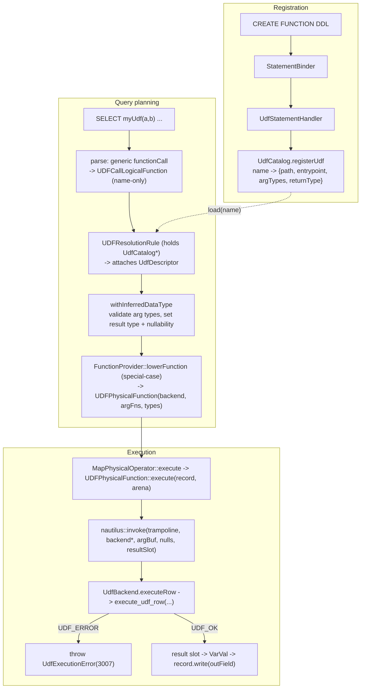
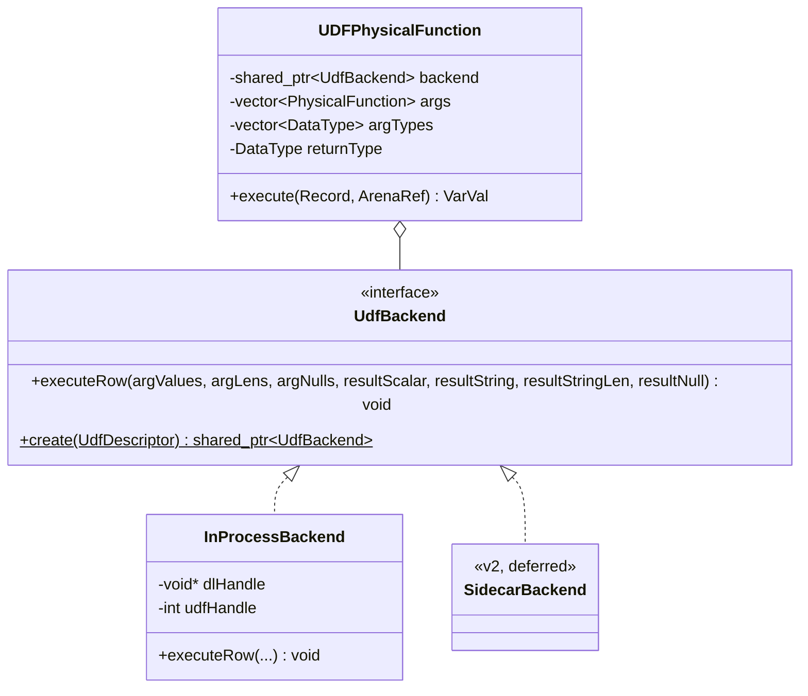

# The Problem

NebulaStream can evaluate a fixed catalog of built-in scalar functions (`Add`, `Concat`, `CHAR_LENGTH`, `FROM_BASE64`, ...) inside `SELECT` and `WHERE` expressions.
It can also register and run ML models through the `nes-inference` feature (`CREATE MODEL` + `MODEL_INFERENCE(...)`).
It has no way to run a *user-defined scalar function*.

P1: Adding even a trivial scalar transform requires modifying and recompiling the engine.
A new built-in means authoring a `LogicalFunction`/`PhysicalFunction` pair in C++, wiring an `add_plugin(...)` entry, and rebuilding.
A user who only wants `to_euro(amount, ccy)` cannot get it without a source change to NebulaStream.

P2: There is no path for functions authored in another language.
Data-science users typically express business logic in Python, but NebulaStream exposes no boundary at which such code can be plugged in.

P3: Foreign, user-supplied code fails at runtime in ways the engine currently has no facility to contain.
A UDF can raise, receive bad input, or even crash the process.
The engine must surface recoverable failures as query errors — with a diagnostic reaching the user — without the worker dying, and today no such loading-and-containment facility exists.

# Goals

G1 (addresses P1, P2): A user registers a precompiled `.so` scalar UDF through SQL DDL and calls it by name in any scalar expression, with no engine recompilation.
Registration declares the UDF's signature (argument types + return type), the path to the `.so`, and the entry point inside it.
Calling the UDF requires *no* query-side grammar change — `myUdf(a, b)` rides the existing generic function-call path.

G2 (addresses P2): The engine boundary is a language-agnostic C ABI.
The registered `.so` need only export three C symbols.
Python is the first supported author language, via a bridge `.so` that embeds an interpreter behind that ABI.

G3 (addresses P3): A recoverable UDF failure fails only the query, never the worker.
The failure carries a dedicated error code (`UdfExecutionError`) plus the underlying diagnostic (e.g. the Python traceback), and is delivered to the client.
This is assertable by negative systests (`ERROR 3007`).

G4: The feature mirrors the existing `nes-inference` structure — catalog, DDL, a name→resolved logical node, deferred load at lowering, and `nautilus::invoke` into a runtime object.
Reusing established patterns minimizes new concepts and reviewer surface.

# Non-Goals

NG1: Containing *fatal* UDF crashes (segfault, `os._exit`, native `abort`) is out of scope for v1.
In-process execution cannot contain them (see [Proof of Concept](#proof-of-concept)), and the process-isolation machinery that can is a large subsystem (see A2).
v1 instead places a seam (`UdfBackend`) so that a v2 sidecar backend closes this gap without changing any layer above it.

NG2: Vectorized / batched execution is out of scope.
v1 is scalar, one row in and one value out.
The per-row GIL and per-row call-overhead ceilings, and the column-batch ABI that would relieve them, are deferred.

NG3: Aggregate, table, and window UDFs are out of scope — only scalar UDFs.

NG4: Full NES type coverage is out of scope for v1.
v1 supports `BOOLEAN`, the integer widths (`INT8..INT64`, `UINT8..UINT64`), the float widths (`FLOAT32/64`), and `VARSIZED`.
`TIMESTAMP`, decimal, and `CHAR` are deferred and rejected at registration.

NG5: Sandboxing untrusted UDF code beyond process isolation (resource limits, seccomp, filesystem/network confinement) is out of scope.

# Alternatives

## A1 — UDF as an operator (like inference) vs. as a physical function

`nes-inference` models inference as a whole operator (`InferModelPhysicalOperator`), a node in the query plan.
We could model a UDF the same way: a `UDFOperator` that consumes a record buffer and appends an output column.

Disadvantage: an operator cannot be nested inside an arbitrary expression.
`SELECT to_euro(amount, ccy) * 1.1 FROM ... WHERE to_euro(amount, ccy) > 100` needs the UDF to be a *function* in the expression tree, not a plan node.
Modeling it as an operator would fail G1 (call the UDF in *any* scalar expression).

Chosen: model the UDF as a `PhysicalFunction` (`UDFPhysicalFunction`), applied automatically by the existing `MapPhysicalOperator`, and usable anywhere a scalar function is.
We still borrow inference's *catalog + name→resolved + deferred-load + `nautilus::invoke`* patterns; we just attach them to the function machinery instead of the operator machinery.

## A2 — In-process execution vs. sidecar process isolation

The registered `.so` can be loaded in two places.

A2a (in-process): the worker `dlopen`s the `.so` and calls it directly.
Advantage: minimal — one loaded handle, one `nautilus::invoke` trampoline, a single marshalling boundary, no new binary, no IPC.
Disadvantage: a *fatal* crash in the UDF (segfault, `os._exit`, native `abort`) takes down the worker; no `try/catch` can contain it (confirmed by the PoC).
Recoverable failures (exceptions, bad input, wrong return type) are still fully contained — the bridge catches them and returns an error, the worker survives, the query fails with a diagnostic.

A2b (sidecar): a separate process loads the `.so` and the worker talks to it over IPC.
Advantage: even a fatal crash kills only the sidecar; the worker survives, the query fails, the sidecar respawns — G3 in the strongest form.
Disadvantage: a whole extra subsystem — a new interpreter-hosting executable, a hand-rolled wire protocol, an IPC client with crash-detection/respawn/reaping, a *second* marshalling boundary, and interpreter-deployment plumbing — layered on top of a core that is ~90% shared with A2a.

Chosen: A2a for v1, behind a `UdfBackend` interface, with A2b as a documented v2.
A2a already satisfies G3 for every *recoverable* failure, which is the common case; only fatal native crashes remain, and those are NG1 for v1.
The `UdfBackend` seam makes v2 a localized change: `SidecarBackend` satisfies the same interface, so the catalog, DDL, logical function, resolution rule, lowering, `UDFPhysicalFunction`, exception code, and systests are all untouched when isolation is added.
This keeps the reversible-decision cost near zero while shipping a much smaller v1.

## A3 — Resolve the UDF name at parse time vs. a two-phase resolution rule

A UDF call `myUdf(a, b)` reaches `LogicalFunctionProvider::tryProvide`, which fails to find `myUdf` in the built-in registry.

A3a (parse-time): thread the `UdfCatalog` into the parser and resolve the descriptor there.
Disadvantage: the codebase deliberately keeps catalogs out of the parser — source names are also left unbound at parse and resolved by later rules, and `AntlrSQLQueryPlanCreator` holds no catalog.
This would break that layering invariant.

A3b (resolution rule): the parser builds a *name-only* `UDFCallLogicalFunction` placeholder, and an optimizer rule (`UDFResolutionRule`, holding the catalog) later attaches the resolved `UdfDescriptor` — exactly how `InferModelResolutionRule` upgrades `InferModelNameLogicalOperator` to `InferModelLogicalOperator`.

Chosen: A3b.
It matches both the model-inference precedent and the source-binding precedent, and it keeps type inference catalog-free (the function validates against the stored descriptor).
Known cost: `LogicalOperator` has no generic "map all my functions" accessor, so the rule reaches into the operator types where scalar UDFs appear (`Selection` for `WHERE`, `Projection`/`Map` for `SELECT`) for the MVP and generalizes later.

## A4 — Route physical-function creation through the registry vs. special-case in lowering

Built-in physical functions are created through `PhysicalFunctionRegistry`, keyed by the logical function's type name, with `PhysicalFunctionRegistryArguments{childFunctions, inputTypes, outputType}`.

A4a (registry): extend `PhysicalFunctionRegistryArguments` with a generic config channel carrying the `.so` path/entrypoint/signature.
Disadvantage: pollutes a shared, widely-used struct with a UDF-specific payload, for a single consumer.

A4b (special-case): `FunctionProvider::lowerFunction` already special-cases `FieldAccessLogicalFunction` and `ConstantValueLogicalFunction` before consulting the registry.
Add a third branch that reads the descriptor off the resolved `UDFCallLogicalFunction` and constructs the `UDFPhysicalFunction` directly.

Chosen: A4b.
It follows existing precedent, needs no change to shared registry types, and is the natural home for carrying non-generic metadata (a `.so` path) from logical to physical.

## A5 — Reuse the prototype ABI as-is vs. a cleaned-up ABI

The PoC ships a working 3-symbol ABI, but its README flags two production gaps: a NaN sentinel for NULL (in-band, lossy) and a 3-value type table (`string/int64/double`) far narrower than NES's types.

A5a (as-is): fastest — the existing bridge `.so` drops in unchanged.
Disadvantage: inherits the NaN-null ambiguity and the narrow type table, both of which we would have to break compatibility to fix later.

A5b (cleaned-up): keep the 3-symbol shape but add explicit per-value null flags (in and out), a full NES type-code table, and length-delimited (binary-safe) strings.

Chosen: A5b.
Explicit null flags remove the NaN ambiguity and correctly represent a NULL result distinct from a valid NaN.
Length-delimited strings fix the CFFI bytes-vs-str nuance the PoC surfaced (the CPython bridge passed `str`, the PyPy examples used `bytes` keys).
The cost is updating the bridge, which we control.

## A6 — `CREATE FUNCTION` DDL vs. config-only registration

A6a (config/API only): populate the `UdfCatalog` at worker startup from a config file, with zero grammar change anywhere.
Disadvantage: no interactive registration; diverges from how models are registered.

A6b (`CREATE FUNCTION` DDL): a new DDL statement mirroring `CREATE MODEL`, plus the catalog.
This is the only grammar change, and it is confined to the DDL — calling a UDF still needs none.

Chosen: A6b, for parity with `CREATE MODEL` and an interactive registration experience.
(A programmatic seeding path can be added later without conflict.)

# Solution Background

An isolated prototype at `../udf/poc_dlopen` (outside this repo) established the runtime mechanism and the failure model — see [Proof of Concept](#proof-of-concept).
The feature is deliberately shaped after `nes-inference`, whose relevant machinery is:
- `ModelCatalog` (`nes-inference/include/ModelCatalog.hpp`) — a name-keyed registry populated by a `CREATE MODEL` DDL handler.
- The two-phase `InferModelNameLogicalOperator` → `InferModelLogicalOperator` resolution via `InferModelResolutionRule`.
- Deferred heavy work at lowering (`LowerToPhysicalInferModel::apply`).
- `InferModelPhysicalOperator` holding a `std::shared_ptr` runtime object and calling into it via `nautilus::invoke`.

The physical-function machinery the UDF plugs into is:
- `PhysicalFunctionConcept` (`nes-physical-operators/include/Functions/PhysicalFunction.hpp`), whose sole method is `VarVal execute(const Record&, ArenaRef&) const` — no lifecycle hook, and no `ExecutionContext` (only the arena is passed by `MapPhysicalOperator`).
- The `nautilus::invoke` pattern for calling a C++ runtime function from compiled query code, as in `CastVarSizedToNumericPhysicalFunction` and `ToBase64PhysicalFunction`.

# Our Proposed Solution

## High-level overview

A UDF is registered like a model (a catalog + a DDL) but *executed* as a scalar function in the expression tree.
The single point at which isolation lives is a `UdfBackend` interface; v1 provides `InProcessBackend`.





## The C ABI (the language-agnostic boundary — G2)

New header `nes-udf/include/UdfAbi.h`, includable by the engine, the backend, and UDF authors:

```c
enum UdfTypeCode {  /* stable wire values; mirror DataType::Type */
  UDF_BOOL=0, UDF_INT8=1, UDF_INT16=2, UDF_INT32=3, UDF_INT64=4,
  UDF_UINT8=5, UDF_UINT16=6, UDF_UINT32=7, UDF_UINT64=8,
  UDF_FLOAT32=9, UDF_FLOAT64=10, UDF_VARSIZED=11, UDF_TIMESTAMP=12 /* deferred */ };
enum UdfStatus { UDF_ERROR=0, UDF_OK=1 };   /* NULL is a flag, not a status */

int  initialize_udf(const char* entrypoint, int argc,
                    const int* arg_type_codes, int return_type_code, char** errormessage);

int  execute_udf_row(int handle,
                     const void* const* arg_values, const long long* arg_lens, const int* arg_nulls,
                     void* result_scalar, char** result_string, long long* result_string_len,
                     int* result_null, char** errormessage);

void cleanup_udf(int handle);
```

Explicit `arg_nulls`/`result_null` replace the PoC's NaN sentinel (A5).
`arg_lens` + `result_string_len` make VARSIZED binary-safe (mapped to Python `bytes`).

## Registration (G1, A6)

The only grammar change is a `createFunctionDefinition` rule (mirroring `createModelDefinition`), plus `SHOW`/`DROP FUNCTION`.
`StatementBinder` produces a `CreateFunctionStatement`; a `UdfStatementHandler` (holding a `std::shared_ptr<UdfCatalog>`) validates and calls `UdfCatalog::registerUdf`.
The catalog is instantiated at the app entry points and threaded into the `QueryOptimizer` (for the resolution rule), exactly as `modelCatalog` is.

## Invocation, resolution, lowering (G1, A1, A3, A4)

Calling `myUdf(a, b)` needs no grammar change: it parses through the generic `functionCall` rule, and `LogicalFunctionProvider` returns a name-only `UDFCallLogicalFunction` placeholder when the built-in registry misses.
`UDFResolutionRule` attaches the `UdfDescriptor` from the catalog before type inference.
`UDFCallLogicalFunction::withInferredDataType` validates argument types/arity against the signature and sets the result type and nullability.
`FunctionProvider::lowerFunction` special-cases the resolved logical function and builds the `UDFPhysicalFunction`, calling `UdfBackend::create(descriptor)` (which, in v1, `dlopen`s the `.so` and calls `initialize_udf`).

## Execution (G1)

`UDFPhysicalFunction::execute(record, arena)` mirrors `InferModelPhysicalOperator`'s raw-buffer marshalling, with a single boundary in v1:
it evaluates each argument function into a scratch buffer (scalars inline, VARSIZED as pointer+length, plus a null-flag byte per argument), then makes one fixed-signature `nautilus::invoke` call regardless of arity.
The trampoline calls `backend->executeRow(...)`, which in `InProcessBackend` calls `execute_udf_row` directly.
A scalar result is read back into a `VarVal`; a VARSIZED result is copied out of the reply into arena-allocated memory (the "return size, then allocate, then copy" two-step used by `InferModel`/`ToBase64`, because the arena cannot be allocated from inside the trampoline).
A NULL result is honored via the result null flag.

NULL semantics (v1) are **strict** (SQL `RETURNS NULL ON NULL INPUT`): if any argument evaluates to NULL, `execute` short-circuits to a NULL result of the return type and never invokes the UDF. This keeps a UDF like `currency.add` (which would raise on `None`) well-defined on NULL input and spares every author from handling `None`. The ABI still carries per-argument null flags (`arg_nulls`), so a future non-strict (`CALLED ON NULL INPUT`) mode could pass NULLs through as Python `None` without an ABI change. A UDF may still *produce* NULL from non-NULL inputs by returning `None`, which the result null flag carries back independently of the strict input rule.

## Error propagation (G3)

On a recoverable failure the backend throws `UdfExecutionError` (new code `3007`), carrying the bridge's formatted message.
The throw unwinds out of `nautilus::invoke`, through the compiled pipeline, to the engine's single catch site (`handleTask`, `nes-query-engine/Task.hpp`), which is the same path divide-by-zero (`ArithmeticalError`) and bad casts (`FormattingError`) already take.
The worker thread survives; only the query moves to `FAILED`.
`QueryLog` records the message + code, the gRPC status carries them, and the client reconstructs the `Exception`.
Two rules are load-bearing: never use `PRECONDITION`/`INVARIANT` on the UDF path (they `std::terminate`), and re-wrap any `std::exception`/pybind error at the backend boundary into `UdfExecutionError` (else it flattens to `UnknownException`/9999).

## How the goals are addressed

G1: registration by DDL + call with no grammar change + no recompile — met by the catalog, the single DDL rule, and the generic-function-call path.
G2: the C ABI is the boundary; Python rides in behind a bridge `.so`.
G3: recoverable failures throw `UdfExecutionError` and unwind to the existing catch site; the worker survives and the user sees `3007` + message; a negative systest asserts it.
G4: catalog, DDL, two-phase resolution, deferred load at lowering, and `nautilus::invoke` all mirror `nes-inference`.

# Proof of Concept

The prototype at `../udf/poc_dlopen` validated the runtime mechanism (`dlopen` → `dlsym` → C ABI → embedded interpreter → error via out-param) and, crucially, the failure model.
Its host loads the bridge with `RTLD_NOW | RTLD_GLOBAL`, resolves the three ABI symbols, and drives rows through a Python `converttoeuro(amount, ccy)`:

| Scenario | Python does | Result in C++ | Worker survives? |
| --- | --- | --- | --- |
| Happy path | returns a float | `UDF_OK`, value written | — |
| Explicit `raise` | `raise ValueError(...)` | `UDF_ERROR` + traceback message | **Yes** |
| Natural `KeyError` | bad dict lookup | `UDF_ERROR` + message | **Yes** |
| `os._exit(70)` | hard process exit | call never returns | **No** |
| NULL deref | SIGSEGV | signal kills process | **No** |

This is the evidence base for the design: any ordinary Python *exception* is fully recoverable in-process (supporting G3 for v1), while a *hard* failure is not (motivating NG1 and the v2 sidecar behind the `UdfBackend` seam).
The prototype also surfaced the ABI gaps that A5 fixes (NaN-null sentinel, narrow type table, bytes-vs-str) and the GIL serialization ceiling that NG2 defers.

# Summary

The problem is that NebulaStream cannot run a user-defined scalar function without an engine change (P1), has no cross-language extension boundary (P2), and no facility to load foreign code and contain its failures (P3).

The proposed solution registers a UDF like a model (catalog + `CREATE FUNCTION` DDL) but executes it as a scalar `PhysicalFunction`, so it is callable in any expression with no query-side grammar change (G1), across a language-agnostic C ABI with a Python bridge (G2); recoverable failures throw a dedicated `UdfExecutionError` that fails only the query while the worker survives (G3); and every structural choice mirrors `nes-inference` (G4).

Among the alternatives, the pivotal one is A2: we ship in-process for v1 and defer the sidecar, because in-process already meets G3 for all recoverable failures, the sidecar is a disproportionately large subsystem, and a `UdfBackend` seam makes adding it later a localized, no-regret change.
The remaining alternatives (A1 function-not-operator, A3 resolution-rule, A4 special-case lowering, A5 cleaned-up ABI, A6 DDL) each follow existing engine precedent, which keeps the reviewer surface small.
The solution meets G1, G2, and G4 fully, and G3 for the recoverable-failure class; the fatal-crash residue is the explicit NG1, closed in v2.

# Open Questions

OQ1: Interpreter deployment — the bridge `.so` needs a Python runtime and a resolvable module path (`NES_UDF_PATH`) on the worker host; how is this surfaced in worker config and packaged for CI?

OQ2: Build-gating the `Udf` systest group — the group needs a Python runtime and the example `.so`s present; do we mirror the `Inference`/IREE `ENABLE_..._TESTS` gate?

OQ3: Error semantics — v1 fails the *query* on a UDF error; do we also want an opt-in "map error to NULL and continue" mode per UDF?

OQ4: Where does `dlopen` run — lowering is assumed worker-side (like model compilation); confirm the `.so` path resolves on the worker in all deployment topologies.

# Appendix — implementation outline

Component split mirrors `nes-inference` / `nes-inference/runtime`:
- `nes-udf/` (light): `UdfAbi.h`, `UdfDescriptor` (reflectable), `UdfCatalog`.
- `nes-udf/runtime/` (`nes-udf-runtime`, does `dlopen`): `UdfBackend` interface + `InProcessBackend`; linked `PRIVATE` into `nes-physical-operators` next to `nes-inference-runtime`.
- v2 adds `nes-udf/sidecar/` (executable), `UdfWireProtocol.hpp`, `SidecarBackend`.

Ordered build sequence:
1. ABI header + `nes-udf` skeleton + `UdfCatalog`/`UdfDescriptor` (+ reflection) + `UdfCatalogTest`.
2. `CREATE FUNCTION` grammar + `StatementBinder` + `UdfStatementHandler` + entry-point wiring + binder test.
3. `UDFCallLogicalFunction` + `LogicalFunctionProvider` fallback + `UDFResolutionRule` + `SemanticAnalyzer` wiring + logical test.
4. `UdfBackend`/`InProcessBackend` + `UDFPhysicalFunction` + trampoline + `FunctionProvider` special-case + physical test.
5. `EXCEPTION(UdfExecutionError, 3007, ...)` in `ExceptionDefinitions.inc` + type-mapping table.
6. `nes-systests/udf/` positive + negative (`ERROR 3007`) systests + build-gating.

Reuse for v2: `subprocess::Popen` (`nes-common/include/Util/Subprocess.hpp`, already used by `nes-inference/src/IreeTool.cpp`) for spawn + crash-detection — note its destructor does not reap the child and `communicate()` is one-shot.

A detailed, file-by-file implementation plan (with `file:line` anchors) is kept alongside this document during implementation.
