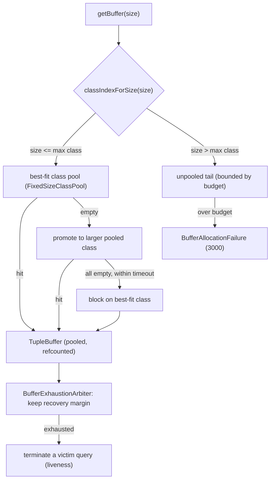
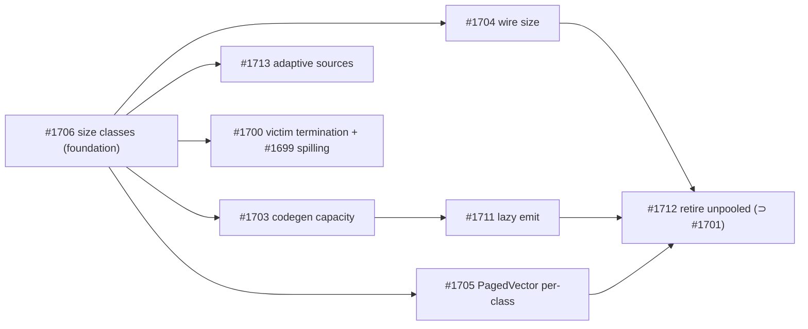

# The Problem

NebulaStream (NES) is a compiled stream-processing engine that routes every record through a single unit of memory: a pooled, reference-counted `TupleBuffer` handed out by one `BufferManager` (`nes-memory/include/Runtime/BufferManager.hpp`).
In a compiled streaming engine this buffer is unusually central.
It is the unit of data movement, the substrate for operator state (join hash tables, windowed aggregations, paged vectors), the payload of network transfer between pipelines, and — because the engine generates code — a compile-time constant that the code generator folds into the pipeline as `capacity = bufferSize / tupleSize`.
The buffer is therefore woven into the data path, the state, the network, and the generated program at once.

This consolidation is efficient, but today the buffer substrate is *rigid*, and the rigidity shows up at every point where the buffer is woven in.

The `BufferManager` hands out a **single fixed size** (default 8 KiB); any other size falls through to a slow, per-thread *unpooled* path (`nes-memory/include/Runtime/UnpooledChunksManager.hpp`) with a heap-allocated control block and RW-locked chunk maps (**P1**).
A microbenchmark measures this unpooled path at 1.4–3.4× the latency of the pooled path, and it fragments because it suballocates variable sizes from rolling chunks (**P1**).

The unpooled path is **unbounded**: a large group-by or join whose state overflows the pool allocates from unpooled memory until it exhausts physical RAM and the OS OOM-kills the entire worker, taking every co-located query down with it (**P2**).

Because the per-buffer capacity is **baked into generated code** and the size is **fixed in the network wire format** (`SerializedTupleBufferHeader`, `nes-network/nes-rust-bindings/network/src/lib.rs:34`), variable-sized data cannot ride the pooled path end to end even if the allocator could serve it: a right-sized buffer would be mis-deserialized at the receiver (**P3**).

Output buffers are acquired **eagerly at full size**: `EmitPhysicalOperator::open` (`nes-physical-operators/src/EmitPhysicalOperator.cpp:54`) grabs a full operator-buffer-size buffer and emits it regardless of occupancy, so a pipeline that produces three tuples still pins a full 8 KiB buffer (**P4**).

Each source is throttled by a **static** inflight cap — a fixed `std::counting_semaphore` sized once at `maxInflightBuffers` (`nes-query-engine/RunningSource.cpp`) — so an idle source is permitted buffers it never uses while a fast source is capped even when memory is free (**P5**).

Finally, there is a consequence specific to *streaming*.
Because a streaming query never terminates, its state grows monotonically and pins buffers that are not released until a window fires, which itself requires processing more input, which requires more buffers from the same pool.
When the pool is exhausted a producer waits for a buffer while the only action that would free one also needs a buffer.
The result is not a slowdown but a **circular wait**: the engine deadlocks (**P6**).
Batch engines never face this, because query completion is a guaranteed reclamation event; a streaming engine has no such event.

These six problems are not independent.
They are the same rigidity — a fixed buffer size — viewed from the allocator (**P1**), the budget (**P2**), the compiler and network (**P3**), the emit path (**P4**), the source scheduler (**P5**), and the liveness of a non-terminating query (**P6**).

# Goals

(**G1**): Serve a variable-sized buffer request from the fast pooled path in O(1), at pooled-path latency, without fragmentation.
This addresses **P1** by removing the single-size constraint so that most variable-sized requests no longer fall to the slow unpooled path.

(**G2**): Bound total execution memory by a configurable budget, and make an over-budget request fail cleanly with a recoverable error rather than OOM-killing the worker.
This addresses **P2** by turning an unbounded allocation into a bounded one with a defined failure mode. Essentially, we need to get rid of all unpooled buffers and turn them into a sequence of pooled buffers.

(**G3**): Make code generation and the network wire protocol size-aware, so one generated pipeline handles buffers of any size and the receiver reconstructs the right size.
This addresses **P3**, which is the part of the design unique to a *compiled* engine.

(**G4**): Defer output-buffer acquisition and size the buffer to the tuples actually produced, making execution memory proportional to live tuples rather than to buffer count.
This addresses **P4** and is essentially important if the buffer leaves the node to reduce network traffic.

(**G5**): Replace the static per-source inflight cap with an elastic, fair quota drawn from the global budget that grows under load and decays on idle.
This addresses **P5** and would also allow for a priority based buffer hand-out.

(**G6**): Guarantee progress when the budget is reached: resolve pool exhaustion as a liveness condition rather than a deadlock, and provide disk spilling for state that exceeds the resident budget.
This addresses **P6** and allows us to decide which buffer should be spilled (the one who guarantee progression) and which not (maybe source buffers that would add new work to an already overloaded systems).

(**G7**): Preserve NES's performance envelope.
The dynamic substrate must not regress throughput on fixed-size pipelines and must keep the zero-GC, lock-free, reference-counted recycling on the hot path.
This is a cross-cutting requirement that constrains every other goal.

(**G8**): Deliver the redesign incrementally.
Each axis must be independently reviewable, mergeable, and backward compatible, so that a partial rollout leaves the engine correct and the default configuration behaves byte-for-byte as today.

# Non-Goals

(**NG1**): We do not build a general-purpose disk-backed buffer manager with page-level eviction and pointer swizzling in the style of Umbra or LeanStore.
NES's execution memory is in-memory, reference-counted, and latency-critical; page-fault-driven paging and swizzling add machinery and latency that a streaming hot path does not need.
Disk spilling in this design is scoped to *operator state slices* (G6), not to every buffer as the main purpose is to make the system able to continue processing.

(**NG2**): We do not change the reference-counting and recycling model.
The `BufferControlBlock` atomic refcount and the recycle callback (`nes-memory/TupleBufferImpl.hpp`) stay exactly as they are; size classes reuse them per class.
Changing the ownership model is out of scope and would jeopardize **G7**.

(**NG3**): Full runtime capacity for the *columnar* layout is out of scope for the first iteration.
Columnar capacity fixes per-column offsets at lowering time (`LowerSchemaProvider.cpp:114`) and requires computing offsets at runtime; the row layout lands first and columnar follows in a dedicated change. Anyhow, the columnar layout is not used at all in NES atm.

(**NG4**): We do not coordinate memory across nodes.
The budget (**G2**) is a single-node budget; a distributed or cluster-wide memory budget is a separate problem.

(**NG5**): We do not redesign the query scheduler or the task queue.
Liveness (**G6**) interposes on buffer allocation and query termination but leaves the work-distribution model untouched.

# Alternatives

We evaluate the alternatives per axis, because the redesign spans several loosely coupled decisions.

**A1 — Keep the fixed pool and only make the unpooled path faster and bounded.**
This is the smallest change: cap the unpooled byte counter (which #1701/#1702 already do) and optimize its chunk manager.
It partially addresses **P2** but leaves **P1** (the pooled path is still single-size), **P3**, and **P4** untouched, and it keeps the fragmenting, RW-locked chunk machinery.
It does not let variable-sized data ride the pooled path, so we reject it as a complete solution while keeping its budget idea for **G2**.

**A2 — One larger or statically configurable buffer size.**
Widening the fixed size trades internal fragmentation for less unpooled traffic but wastes memory on every small buffer and still cannot serve requests above the chosen size.
It does not achieve **G1** or **G4** and we reject it. In addition, we do have different requirements by default, input buffers are determined by the source and maybe different sources produce different sizes. In addition, processing buffers are highly specific to the processing as a global window produces one value but a keyed-window one per key (data dependent) and joins are highly unpredictable.

**A3 — A general slab/arena allocator (e.g., jemalloc-style) for all buffers.**
A generic allocator serves arbitrary sizes but abandons NES's lock-free MPMC-queue pooled recycling and its placement-new'd control blocks, which are the basis of the zero-GC hot path.
It directly threatens **G7** and we reject it.

**A4 — A VM-assisted buffer manager (vmcache / LeanStore lineage).**
`mmap`-backed pages with fault-in and pointer swizzling elegantly unify variable sizes and spilling.
However, this design targets disk-backed paging of a buffer *pool*, not a streaming in-memory data path, and its pinning/swizzling/eviction machinery adds per-access latency that conflicts with **G7**.
We borrow only its `mmap`-relocation idea, and only for operator-state spilling (G6, NG1), not for the general buffer path.

**A5 — A single fixed block plus external spill for everything (DuckDB style).**
DuckDB deliberately uses one block size and pushes overflow to temporary disk storage.
This fits a batch engine but not streaming, which needs variable-sized *in-flight* buffers and *network payloads*, not just spill.
We reject it as the general model but adopt spilling as one bounded mechanism (G6).

**A6 — Reservation-based liveness (the rejected `#1683`).**
We first built a scheme that reserves a per-query buffer quota so that no query can starve another (`tryGetReservedBuffer`/`numOfReservedBuffers`).
In practice reservation wasted buffers that idle queries held and let an over-budget query stall forever without making progress, so it achieved neither **G6** nor **G7**. In general, in streaming we cannot deterministically provide buffers to queries in advance and statically as the workload is unpredictable.
Victim-query termination (A7-chosen) supersedes it and reservation does not appear in the shipped engine.

**A7 — Compile-time cardinality analysis for emit sizing.**
Instead of staging output at runtime, the compiler could statically bound each operator's output cardinality and size the buffer at codegen time.
Output cardinality is unknown for filters and aggregations, so a static bound reduces to the input count (no better than eager for a full input buffer); we choose runtime staging (`StageAndCopy`) for the general case and keep a static `InputSized` mode for the many-to-one case.

We narrow the general allocator decision to **segregated power-of-two size classes** that reuse NES's existing pooled recycling, and we co-design the compiler, network, emit, source, budget, and liveness axes around it.
This is the consensus design of DuckDB, ClickHouse, Velox, and Umbra for variable-sized allocation, adapted to a streaming, reference-counted, in-memory substrate (see [Solution Background](#solution-background)).

# Solution Background

This design condenses a body of prior work that lives in the repository and in the literature.

**Prior work in NES (issues and PRs).**
The umbrella is the EPIC #1714 (*Dynamic, variable-sized memory management*), which sequences the axes below.
- **#1706** — size-class buffer manager (the foundation; implemented on the integration branch).
- **#1703** — dynamic buffer capacity in Nautilus codegen.
- **#1704** — carry the buffer size in the network wire protocol.
- **#1705** — per-size-class page selection for the `PagedVector`.
- **#1711** — lazy, right-sized emit (selectable allocation modes).
- **#1712** — retire the unpooled path (route every size through size classes under the budget); subsumes **#1701**.
- **#1713** — adaptive, AIMD per-source inflight provisioning.
- **#1699** — disk-backed operator-state spilling.
- **#1700** — victim-query termination for liveness.
- **#1701 / #1702** — bound the unpooled path with a budget and clean failure.
- **#1683** — the rejected reservation scheme (see A6).

**External prior art.**
Segregated power-of-two size classes are shared by Umbra (variable-size pages in power-of-two classes, the class encoded in the swizzled pointer) and its LeanStore/vmcache lineage, by Velox (a small set of `SizeClass` objects with a malloc fallback), and by ClickHouse (S·2^N blocks).
DuckDB deliberately uses a single fixed block plus external spill.
Lasch et al.'s *Cooperative Memory Management for Table and Temporary Data* frames the budget/eviction split between long-lived and temporary allocations.
Flink 2.0's *Disaggregated State Management* addresses the streaming-state-overflow problem from the state-backend side, which is complementary to our buffer-substrate approach.

# Our Proposed Solution

We make the buffer substrate elastic along every axis — size, capacity, lifetime, distribution, liveness, and overflow — under one bounded global budget, while preserving the reference-counted recycling on the hot path.
The subsystem is six mechanisms that form one substrate rather than six features.

## Size-class buffer manager (G1, addresses P1)

We generalize the single fixed pool into segregated **power-of-two size classes**.
A sized request `getBuffer(size)` (`nes-memory/BufferManager.cpp`) rounds up to the smallest fitting class via `classIndexForSize`, serves it in O(1) from that class's own lock-free pool, and **promotes** to a larger pooled class when the best-fit class is momentarily empty; only a request larger than the maximum class falls to the unpooled tail.
Each class is a `FixedSizeClassPool` (`nes-memory/FixedSizeClassPool.hpp`) — NES's existing MPMC queue plus a `std::deque<MemorySegment>` of stable-address segments — instantiated once per class, so every class keeps the exact zero-GC, lock-free, reference-counted recycling of the current pool (**G7**).
The `BufferManager` owns a `vector<unique_ptr<FixedSizeClassPool>>` and a `defaultPoolIndex`.
Provisioning is pluggable via `BufferProvisioningPolicy`: `TotalBudgetSplit` (a fixed total footprint divided across classes), `EagerPerClass` (a fixed count per class), and `LazyElastic` (a small floor that faults in regions on demand up to a cap).
The design is backward compatible by construction: with no size-class configuration there is exactly one class (the operator buffer size) and the engine behaves byte-for-byte as today (**G8**). The exact and best size class for a given workload or even dynamically is then part of future research work.
Unlike the size-class allocators of Umbra, Velox, and ClickHouse, ours is a streaming, in-memory substrate — reference-counted, never paged, no pinning or pointer swizzling — so size classes are purely an allocation-latency and fragmentation optimization (**NG1**).

## Size-aware code generation and network (G3, addresses P3)

Variable-sized buffers are insert unless the compiler and the network stop assuming a fixed size.
For code generation (#1703) we make the per-buffer capacity a **runtime value** carried on the buffer reference (`TupleBufferRef`) instead of the constant-folded `bufferSize / tupleSize`, so one compiled pipeline writes buffers of different sizes; the row layout lands first and columnar follows (**NG3**).
For the network (#1704) we add the buffer size to the wire header (`SerializedTupleBufferHeader`) so the receiver allocates the fitting size class *before* deserializing, instead of deserializing into a pre-allocated fixed buffer and pushing variable child data onto the unpooled path.

## Lazy, right-sized emit (G4, addresses P4)

We defer output-buffer acquisition and make the emit operator's allocation strategy a selectable mode (#1711, `EmitPhysicalOperator.cpp`, `ExecutionContext::allocateBuffer(size)` / `copyToRightSizedBuffer`).
- `EagerFull` (baseline): a full buffer up front.
- `InputSized`: size the output buffer to the input cardinality (an upper bound), capped at the operator buffer size.
- `StageAndCopy`: write to a staging buffer, then copy the records into an exactly right-sized buffer at flush.
- `ReuseAcrossRuns`: carry a partially filled buffer across pipeline invocations, flushing only when full.
Execution memory then tracks the tuples actually emitted: `InputSized` captures the many-to-one case directly, and `StageAndCopy` captures the general case, including selective filters, by sizing to the actual output. Again the best strategy is then evaluated in future research.

## Adaptive source provisioning (G5, addresses P5)

We replace the fixed `counting_semaphore` cap with a resizable throttle (#1713, `InflightThrottle`).
Each source starts with a small quota and, when it consistently saturates that quota *and* global memory is free, is granted more on an AIMD curve (additive grant, multiplicative backoff), bounded by the configured cap so it never exceeds the static baseline; quotas decay on idle and return to the global pool.
The control signals already exist: buffer-acquisition stalls in the source retry loop (`SourceThread.cpp`), the `BackpressureChannel` state, and global memory pressure from the budget.

## Bounded budget, clean failure, and liveness (G2, G6, addresses P2, P6)

A single global budget caps total memory and an over-budget request fails cleanly rather than OOM-killing the worker: `getBuffer(size)` (and the unpooled tail) return a recoverable `BufferAllocationFailure` (error 3000) that the caller turns into a per-query failure (#1701/#1702).

For liveness (#1700) a `BufferExhaustionArbiter` interposed on buffer allocation keeps a **recovery margin** of free buffers in reserve (default = worker-thread count, so all workers detect exhaustion together), then selects a victim query, fails it (`QueryCatalog::failQuery` → `QueryBufferExhausted`, 3007), waits briefly for its buffers to drain, and retries; it self-terminates if the caller's own query is the victim, so liveness holds either way (a safety deadline bounds the loop).
Victim selection is a policy with a design space; the shipped engine implements `TERMINATE_LARGEST` (frees the most per kill) and `TERMINATE_SELF` (trivially local), and the wider space (oldest, over-fair-share, cost-based) is future work (see [Open Questions](#open-questions)).
Termination supersedes the reservation scheme of A6.

Independently and composably, a query may run with state larger than its resident budget by **spilling** cold operator state to disk (#1699).
A spillable slice allocates its state over an `ArenaMemoryResource` (`nes-memory/.../Spill/ArenaMemoryResource.hpp`): an anonymous `mmap` region whose eviction is `pwrite` + `madvise(DONTNEED)` and whose reload is `pread` back to the *same virtual address*, so live pointers into the state survive eviction.
A process-wide `SpillManager` governor evicts the coldest unpinned slices above a high watermark (0.9 of budget) down to a low watermark (0.7); pinning (`pinSliceForBuild`) guarantees a slice in use is never evicted, which requires the no-op slice cache.
Termination guarantees progress; spilling buys time by relocating state; the two occupy complementary regimes.

## Putting it together

A single global budget caps total memory; allocation is right-sized along four axes — size (size classes), capacity (size-aware codegen), lifetime (lazy emit), and distribution (adaptive sources) — and, under pressure, the engine either relocates state (spilling) or sheds a victim query (termination) to keep running.
Size, capacity, lifetime, distribution, liveness, and overflow are thus governed coherently by one bounded buffer substrate.

# Proof of Concept

We implemented all axes in NES and measured them on a single 64-thread server (2×32 cores, 503 GiB RAM), `Benchmark` build.
We report the outcomes honestly, including where a goal is not yet met, because a design document should record the degree to which the solution reaches its goals.

**G1 (size classes) — met.**
A microbenchmark (2 M allocate/free per thread) measures the unpooled tax at 1.4–3.4× the pooled path (186 ns fixed vs 596 ns unpooled single-threaded), and size classes track the fixed pool (173 ns vs 186 ns), confirming O(1) pooled-latency service.
On the variable-sized YSB workload the payloads that the baseline routes off-pool are served from the pooled 256 KiB and 512 KiB classes with byte-identical results.

**G7 (no regression) — met.**
End-to-end completion time on a 50 M-tuple YSB aggregation is 31.83 s (baseline) vs 31.45 s (size classes) and 31.62 s (`StageAndCopy`), all within the baseline's own 4.0 % run-to-run spread (median of five/three runs).

**G4 (right-sized emit) — met.**
An emit-bytes counter (`NES_EMIT_STATS`) shows `StageAndCopy` reduces emitted-buffer memory by 3.6–16× (72–94 %) with byte-identical results (e.g. 180 KiB → 11 KiB on a low-cardinality aggregation), and the per-flush copy cost is +0.2 % on an emit-heavy pass-through — effectively free.
`InputSized` captures the many-to-one case (−46–62 %) but not selective filters (−5 %), exactly the predicted split.

**G2 (clean failure) — met.**
Under a ~1 KiB unpooled budget a keyed aggregation raises a recoverable `BufferAllocationFailure` (3000) and the worker survives, where the unbounded path would OOM-kill the process.

**G6 (liveness) — met for termination, partially for spilling.**
On a 16-buffer pool the arbiter terminates a victim query ("selected as victim") instead of deadlocking, and the worker stays live.
Spilling produces byte-identical results across keyed aggregation (7/7), stacked aggregation (4/4), and a nested-loop join (11/11) at a 16 KiB budget; its overhead at that tight budget exceeds 10× (it did not complete in 150 s vs 15 s in memory), which motivates termination as the backstop but leaves a clean overhead sweep as future work.

**Not yet demonstrated (honest gaps).**
The *whole-system* memory footprint is **not** reduced by turning all axes on: enabling size classes raises the peak live pooled bytes (5.8 MB → 30–60 MB) because more distinct buffers are concurrently live, and the `TotalBudgetSplit` policy caps only the *reserved* auxiliary-class capacity, not the live peak, while the default pool stays eagerly allocated.
The adaptive-source benefit (**G5**) is not yet demonstrated: the mechanism is bounded by the static cap and, in this architecture, the inflight cap is rarely the binding backpressure, so a clear throughput/fairness win needs a cap-bound workload and per-source counters.
The size-aware wire (**G3**) is now measured: the test harness runs every query as a distributed source-node/sink-node plan over the engine's real network channel, and a receive-side counter confirms that variable-sized data crosses the wire as child buffers (50 for YSB, 25 for Nexmark) which the receiver serves from pooled size classes via `getBuffer(child.size())`, with byte-identical results — only the `#1704` *parent* right-sizing branch stays unfired because these payloads fit the receive buffer, so a large-payload two-node throughput sweep would still sharpen it.
The adaptive-source benefit (**G5**) remains undemonstrated: the generator source hangs at the unlimited emit rate needed to make the inflight cap the binding constraint, and the adaptive quota is bounded by the static cap, so there is no clean throughput win to measure.
The victim-policy space beyond the two shipped policies is not evaluated.

# Summary

The problem is a single rigidity — a fixed buffer size — that manifests as a slow unbounded unpooled path (**P1**, **P2**), a capacity baked into codegen and the wire format (**P3**), eager full-size emit (**P4**), a static per-source cap (**P5**), and, uniquely for streaming, a circular-wait deadlock under exhaustion (**P6**).
The proposed subsystem addresses each: segregated power-of-two size classes serve variable sizes at pooled speed (**G1**); a global budget with clean failure bounds memory (**G2**); size-aware codegen and wire let variable data ride the pooled path (**G3**); lazy right-sized emit makes memory proportional to tuples (**G4**); adaptive provisioning replaces the static cap (**G5**); and victim termination plus spilling keep the engine live and bounded (**G6**) — all while preserving the reference-counted hot path (**G7**) and shipping incrementally (**G8**).
The proof of concept confirms **G1**, **G2**, **G3** (codegen row layout and the size-aware wire), **G4**, **G7**, and the termination half of **G6** with measured, byte-identical results, and it is candid that the whole-system footprint reduction and the adaptive-source benefit (**G5**) remain to be demonstrated.
We prefer segregated size classes over the alternatives because they alone serve variable sizes at pooled latency without abandoning NES's zero-GC recycling (rejecting A2/A3), without disk-paging machinery a streaming path does not need (rejecting A4/A5), and because victim termination succeeds where the reservation scheme (A6) wasted buffers and stalled progress.

# Open Questions

- **Q1**: Which provisioning policy and budget make the *whole-system* live footprint smaller than the fixed pool, given that the default pool dominates the peak? (relates to #1712)
- **Q2**: What workload makes the inflight cap the binding backpressure, so the adaptive-source benefit (**G5**) is measurable, and what per-source counters does the benchmark build need for a Jain-fairness metric? (#1713)
- **Q3**: Should we retire the unpooled path entirely (large/huge `LazyElastic` classes under the budget), and what is the clean over-budget failure at the size-class layer? (#1712, subsumes #1701)
- **Q4**: Which additional victim-selection policies (oldest, over-fair-share, cost-based) do we implement behind `selectVictim`, and how do we evaluate them on a lopsided workload? (#1700)
- **Q5**: How do we isolate spill-I/O overhead from the slice-cache-off cost, and expose `SpillManager` evict/reload counters in the benchmark build? (#1699)
- **Q6**: What is the runtime-capacity design for the *columnar* layout, whose per-column offsets are fixed at lowering time? (#1703, NG3)
- **Q7**: Maybe we should have a fixed size buffer for sources and the proposed buffer only for processing or alternative just allocate more buffers to the buffer size the sources are using?

# Sources and Further Reading

- Neumann, Freitag. *Umbra: A Disk-Based System with In-Memory Performance.* CIDR 2020.
- Leis et al. *LeanStore: In-Memory Data Management Beyond Main Memory.* ICDE 2018; and *Virtual-Memory Assisted Buffer Management.* SIGMOD 2023.
- Kuiper, Boncz, Mühleisen. *Robust External Hash Aggregation in the Solid State Age.* ICDE 2024 (DuckDB).
- Lasch et al. *Cooperative Memory Management for Table and Temporary Data.* SiMoD @ SIGMOD 2023.
- Mei et al. *Disaggregated State Management in Apache Flink 2.0.* PVLDB 18(12), 2025.
- Leis et al. *Morsel-Driven Parallelism.* SIGMOD 2014.
- NES EPIC #1714 and issues #1699–#1706, #1711–#1713 (and the rejected #1683).

# Appendix

**Configuration keys** (`nes-runtime/interface/Configuration/WorkerConfiguration.hpp`, off by default):
`enable_buffer_size_classes`, `buffer_size_class_min_bytes` / `_max_bytes` (validated as powers of two), `buffer_size_class_provisioning`, `buffer_size_class_budget_bytes`; `default_query_execution.emit_buffer_allocation_mode`; `enable_adaptive_inflight_buffers`, `default_max_inflight_buffers`; `query_engine.buffer_exhaustion_policy`, `query_engine.buffer_recovery_margin`; `enable_state_spilling`, `state_memory_budget_in_bytes`, `spill_directory`.
Note: the emit-mode key currently applies only via the worker-config YAML (`-w`), not the CLI override — a usability issue worth a follow-up.

**Instrumentation added for the evaluation** (benchmark-build escape hatches, since logging is compiled out): `NES_BM_STATS` dumps peak pooled occupancy, per-size-class allocation counts, and peak resident pooled bytes; `NES_EMIT_STATS` dumps total emitted-buffer bytes, tuples, and count.
