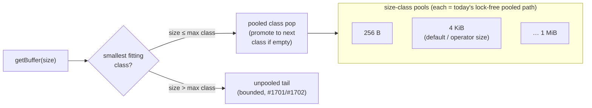

# Variable-sized buffers via size classes

# The Problem

NebulaStream preallocates a pool of fixed-size `TupleBuffer`s (the operator buffer size — configurable;
our runs use 4 KiB) and hands them out through a lock-free MPMC queue with reference-counted recycling and
no per-buffer heap allocation. Any request for a *different* size — a `VARSIZED` payload, a hash-map page,
a paged-vector segment — cannot come from that pool and falls to the **unpooled** path
(`UnpooledChunksManager`): a per-thread allocator that heap-allocates a control block per buffer,
suballocates from a per-thread chunk behind a lock, and frees a chunk only once its last buffer is released.
Throughout, a *variable-sized request* means asking the pool for a buffer whose size differs from the
operator buffer size — to hold a `VARSIZED` value, an operator-state page, or any other payload — not the
`VARSIZED` column type specifically.

**P1 — the unpooled path is slower and fragments, and variable-sized data always takes it.**
A microbenchmark (2 M allocate/free pairs per thread) puts the unpooled path at 596 ns/op single-threaded
versus 186 ns for the pool (3.2×), narrowing to 1.6× at eight threads (§PoC). It also fragments: a chunk is
pinned until its last buffer is released, so one long-lived buffer keeps the whole chunk resident. For a
`VARSIZED` workload this tax is paid on *every* payload, and none of that memory is bounded by the pool's
accounting.

**P2 — variable-sized data forces a second, competing memory subsystem.**
Because the pool serves one size, every variable-sized request goes to a *separate* allocator with its own
memory, accounting, and lifecycle. The engine runs two memory subsystems side by side, competing for the
same machine memory but reasoned about independently: the pool reserves a fixed budget up front; the
unpooled path grows on demand from anonymous memory. Memory is not exchangeable between them such that the pool can be
exhausted while the unpooled path has headroom — and each carries its own cap, failure mode, and
instrumentation. Bounding the unpooled path removed its OOM failure mode but not the split.

The unpooled subsystem is also less predictable than the pool, which matters for an engine targeting
steady-state latency. Its allocation latency is variable — a heap allocation under a per-thread lock, with
occasional chunk creation — rather than the pool's O(1) dequeue, and its chunk size is a rolling average of
recent requests, so identical requests behave differently depending on history. And two subsystems mean two
of everything to build and test — control blocks (native vs. heap-wrapped), locking, recycling, budgeting,
metrics, and any future spilling or NUMA work — each handled twice. Serving variable sizes from the pool
collapses the common case onto one predictable subsystem, leaving the unpooled path a rare tail for
requests above the largest class.

**P3 — variable-sized buffers arriving over the network land on the unpooled path.** A variable-sized child
buffer received at a pipeline boundary is allocated from the unpooled path today, inheriting P1 and P2 on
the receive side. (The wire format itself is not the problem — it already carries the buffer size, since
Rust slices and vectors store their length and unused bytes are not transmitted — so this is purely which
allocator the receiver uses.)

# Goals

- **G1** — Serve a variable-sized buffer request from the pool at pool latency, so the common case no
  longer hits the unpooled path and the two subsystems collapse to one (P1, P2).
- **G2** — Keep the existing hot path: lock-free, reference-counted recycling, no per-buffer heap control
  block. The scheme must reuse it, not replace it. (Constrains G1.)
- **G3** — Bound the extra memory the size-class pools reserve, so a workload that uses only a few sizes
  does not pay for the classes it never touches. Two quantities must both stay bounded: *reserved capacity*
  (virtual memory the pools claim up front) and *resident memory* (physical pages actually faulted in) — a
  class can reserve address space cheaply as long as it stays resident-light until used.
- **G4** — Ship incrementally: the size-class path lands behind `enable_buffer_size_classes` (default off)
  so it can be reviewed, tested, and rolled out one piece at a time; with it off the engine behaves exactly
  as today. The flag is a rollout switch, not a permanent mode — the goal is to make size classes the
  default once the pieces land, not to keep two code paths forever.

# Non-Goals

- **NG1** — Bounding the unpooled path and OOM query termination. #1701/#1702 (done) bound the unpooled
  byte counter; #1700 (open) terminates a query when the bounded budget is reached.
- **NG2** — Disk spilling of operator state. Spilling should start from a **pin/unpin API plus accounting**
  exposed to buffer users (so pinned vs. floating memory can be measured before a mechanism exists), not
  from the buffer-manager internals. Separate design; #1699.
- **NG3** — Adaptive per-source inflight provisioning (#1713). No measurement shows the static cap is a
  problem, and source buffers are released promptly under normal pressure; if evidence appears, it is its
  own design.
- **NG4** — Columnar runtime capacity, and any cross-node / cluster-wide budget.
- **NG5** — Changing the reference-counting or ownership model.

# Proposed Solution

Generalize the single pool into segregated power-of-two classes. Each class is a `FixedSizeClassPool` — the
engine's existing MPMC queue plus a deque of stable-address segments — so the per-class hot path is
byte-for-byte today's pooled path (G2). `getBuffer(size)` computes the smallest fitting class
(`classIndexForSize`, a linear scan over the classes), pops from that class's queue, and **promotes** to a
larger pooled class if the best-fit is momentarily empty. **The unpooled path stays**, but only as the tail
for a request larger than the maximum class (which #1701/#1702 already bound); everything up to the maximum
class is now pooled. With no size-class configuration there is exactly one class — the operator buffer
size — and behaviour is unchanged.


```mermaid
flowchart LR
    R["getBuffer(size)"] --> C{"smallest fitting<br/>class?"}
    C -->|"size ≤ max class"| P["pooled class pop<br/>(promote to next<br/>class if empty)"]
    C -->|"size &gt; max class"| U["unpooled tail<br/>(bounded, #1701/#1702)"]
    subgraph Pools["size-class pools (each = today's lock-free pooled path)"]
      P256["256 B"]
      P4K["4 KiB<br/>(default / operator size)"]
      P1M["… 1 MiB"]
    end
    P --> Pools
```

**Interface.** No breaking change to `BufferManager`'s public interface. `getBuffer(size)` already exists;
this proposal changes what backs it (a fitting size class instead of the unpooled path) and adds
configuration (`enable_buffer_size_classes`, the class `min`/`max`, and the provisioning policy). The
`TupleBuffer` handle, reference counting, and recycling are unchanged (NG5).

**Which classes.** Powers of two from a configurable minimum to a maximum (our runs: 256 B … 1 MiB).
Sub-page classes are pointless for large payloads but useful for small emit outputs (a three-field result
belongs in a 256 B buffer, not a 4 KiB one), so we expose `min`/`max` and default the minimum to 256 B.

**Classes grow on demand; they are not fully preallocated.** A class is not a fixed slab sized at startup —
under the default `LazyElastic` policy each class reserves a small floor and *faults in additional regions
as it is used*, up to a per-class ceiling. This is why the peak footprint tracks the working set rather than
the sum of every class at full size (the alternative, `EagerPerClass`, does preallocate every class fully —
and §PoC shows why that is a footgun). `BufferProvisioningPolicy`: `LazyElastic` (default, grows lazily),
`EagerPerClass` (all classes preallocated), `TotalBudgetSplit` (one byte budget split across classes).

**Emit is a consumer of the small classes, not a provisioning policy.** A pipeline that emits a few tuples
currently pins a full operator-size output buffer; with sub-page classes available it can instead request a
buffer sized to the actual output (`InputSized`, #1711) — e.g. a 256 B class for a three-field result. The
mechanism is one rule (size to the output row count, capped at the operator buffer size), not a menu of
strategies; a quantile-based size is added only if evidence shows it beats the row-count bound. The
same rule covers a projection that *grows* the schema: the emit buffer follows the actual output schema.

**Network.** A variable-sized child buffer arriving on a pipeline boundary is served from a fitting size
class (`getBuffer(child.size())`) instead of the unpooled path. This is purely an allocator choice at the
receiver; the wire format already carries the size (§P3) and is unchanged.

# Alternatives

The proposed solution (A1) is one of three ways to serve a variable-sized request while keeping the pooled
hot path. This section records why A1 over the other two (A2, A3), with a measured comparison.

**A1 — Segregated power-of-two size classes (proposed).** One pool per class, each an instance of the
existing lock-free machinery; round a request up to the smallest fitting class. *For:* reuses the hot path
verbatim (G2); a request costs a scan over the ~14 classes to pick the smallest fitting one, then the same
O(1) lock-free pop the fixed pool uses (the scan adds no measurable latency, §PoC); variable sizes become
pooled and bounded. *Against:* there are N classes to provision, most unused on any one workload, so the
provisioning policy carries real weight (§PoC quantifies this — with eager provisioning it is a footgun).

**What A1 gives up (so the tradeoff is explicit).** A1 is not a general allocator with only upside. It
deliberately drops the things that make a general allocator complex: it serves ~14 *fixed* power-of-two
sizes, not arbitrary sizes; it never coalesces or splits blocks; and it keeps O(1) reference-counted
recycling per class. The price of dropping those is paid in **provisioning**. Because each class is a
separate lock-free pool, a workload whose state concentrates in one class must have that class provisioned
large enough — and that is a two-sided knob: too small and the class exhausts and the query is terminated;
too large and the class's lock-free queue exceeds its own allocation limit (see the join in the engine
comparison, which needs the default class elastic *and* a per-class ceiling tuned between those two walls).
A2 and A3 avoid that knob with a single flat budget. So A1 buys memory efficiency and a reused hot path at
the cost of a per-class provisioning burden that A2/A3 do not carry; that is the trade the recommendation
accepts.

**A2 — One fixed size, composed (the DuckDB route).** Keep a single buffer size and represent anything
larger as a chain/tree of fixed buffers. *For:* no size-class provisioning, no internal fragmentation, one
hot path, nothing new to reason about in the allocator — a genuinely simpler *buffer manager*. *Against:*
the simplicity is only local; it moves complexity into every consumer that needs a *contiguous* larger
region. In NES today those are concrete and several: the `ChainedHashMap` pages behind keyed aggregation
and joins, `PagedVector` segments, `Arena`/`VarVal` `VARSIZED` values, `NLJSlice` state, and a buffer
serialized to the wire. Each would have to allocate a run of fixed blocks and gather/scatter across the
non-contiguous boundary itself, and composition does not help where physical contiguity is actually
required (a hash probe cannot straddle a block boundary for free). So A2 does not remove the complexity — it
distributes it across those consumers. It is a real and defensible tradeoff *if* the team values a
dead-simple buffer manager over simple consumers; the measured comparison below is what it costs in memory.

**A3 — Virtual-memory over-allocation with a resident budget (vmcache/Umbra-lite).** Reserve a large
virtual region, keep a tight budget of *resident* pages, fault in on access. *For:* one unified budget, no
fragmentation, and a natural path to spilling later. *Against:* heavier machinery (fault handling; and
**pointer swizzling the moment ownership becomes DAG-like** rather than tree-like — needed once a buffer can
refer to another, possibly-spilled buffer through a central table of swizzled pointers). NES's ownership is
tree-like today (parent→child child-buffers), so swizzling is not yet forced; if we move to DAG ownership
we cannot avoid it.

**Measured comparison.** The implementation and all files referenced in this document (the size-class
buffer manager, the A2/A3 allocators, and this microbenchmark) live on the implementation branch
`mem/integration` (PR #1706), not on this doc-only branch. All three are implemented as an allocator
microbenchmark (`nes-memory/benchmarks/BufferManagerBenchmark.cpp`) and run on `sr630-wn-a-11` (Benchmark build, 1M
`alloc + touch-every-byte + free` per thread). Two request sizes bracket the design: 1 KiB (fits one
class/block) and 48 KiB (spans many). Latency is ns/op at 8 threads (lower is better); memory is physical
bytes reserved per allocation ÷ bytes requested.

| approach | 1 KiB ns/op | 48 KiB ns/op | mem 1 KiB | mem 48 KiB |
|---|--:|--:|--:|--:|
| **A1** size classes | 701 | **1741** | **1.00×** | 1.33× |
| **A2** compose-fixed | 676 | 9622 | 4.00× | 1.00× |
| **A3** vmcache (reuse) | 152 | 1724 | 4.00× | 1.00× |
| **A3** vmcache (reclaim) | 1819 | 5771 | 4.00× | 1.00× |
| unpooled (baseline) | 1157 | 1143 | ~1× | ~1× |

**A2** carries *both* 4× internal waste on a small
buffer *and* 5.5× the latency on a large one, because a 48 KiB request becomes twelve 4 KiB block-pops —
the composition cost is real and lands on the hot path. **A3** splits on its own budget knob: in *reuse*
mode (freed slices kept resident) it matches A1's latency, but that discards the resident-budget benefit
that motivates it; the mode that actually bounds resident memory (`madvise(DONTNEED)` on every free) puts a
syscall on the allocation path and costs 3–10×. **A1** pays only a bounded ≤1.33× round-up and a single
O(1) pop, and is the only pooled path with no per-op syscall. This is an allocator microbenchmark, not the
integrated engine: at 48 KiB a memory-bandwidth-bound `memset` dominates every pooled path (so unpooled
looks competitive there), and A1's single-class queue shows contention under the zero-work alloc/free loop
that real per-buffer work would mask. It measures the intrinsic allocation cost, not end-to-end throughput.

**Engine-level comparison.** All three are also implemented as real engine allocation modes — A1 the
size-class pools, A2 (`variable_size_allocator=ComposeFixed`) and A3 (`variable_size_allocator=VmCache`) as
memory resources backing the variable-sized path — and run on three queries of increasing state
(`sr630-wn-a-11`, 8 threads). Memory is the live/resident peak of variable-sized state.

| query (state) | A1 size classes | A2 compose-fixed | A3 vmcache |
|---|--:|--:|--:|
| selection — filter+project (none) | ~0 | ~0 | ~0 |
| window — SUM GROUP BY (aggregation) | **23.7 MB** | 29.2 MB | 29.4 MB |
| join — Nexmark Q8, 18 M ⋈ (tens of GB) | **22.3 GB** | 35.3 GB | 35.1 GB |

All three complete every query with byte-identical results. **A1 is the most memory-efficient on every
workload** — power-of-two packing beats A2's 4 KiB block granularity and A3's page granularity (23.7 vs
~29 MB on the window; **22.3 vs ~35 GB on the join, ~1.6× tighter**). A2's cost surfaces as external
fragmentation (tens of thousands of free extents on the join); A3's as page-reclaim churn (`madvise` then
re-fault). The counter-cost is provisioning: to serve the join's large single-class state, A1 needs the
default class made *elastic* under lazy provisioning **and** a per-class growth ceiling sized between two
walls — too low and a class exhausts and the query is terminated, too high and the class's lock-free queue
exceeds its own allocation limit — whereas A2 and A3 take a single flat arena budget and fault in on demand.
A1 therefore wins on efficiency and loses on operability for unbounded single-class state: the same
trade-off the recommendation rests on.

**A1 is the choice now.** It is the smallest step that satisfies G1 while reusing the hot path (G2),
without committing to composition-everywhere (A2) or fault-handling and swizzling (A3) before they are
needed. A1 does not dominate on every axis: A2 wins where composition across consumers is acceptable, and
**A3 is the better long-term target once spilling** (NG2) introduces a resident-page budget. The A1-vs-A3
question re-opens with the spilling design.

# Proof of Concept (reproducible)

All numbers: node `sr630-wn-a-11` (2×32 cores, 503 GiB RAM), `Benchmark` build (`-O3 -DNDEBUG`, no
logging/asserts). Reproduction commands are in the appendix.

**Microbench — cost of the size-class indirection.** The benchmark does 2 M `getBuffer`/release
pairs per thread. `getBuffer(size)` adds, over the fixed pool, only `classIndexForSize` (a linear scan over
the ~14 classes) before the same lock-free pop.

| threads | FixedPooled | SizeClassPooled | Unpooled |
|--:|--:|--:|--:|
| 1 | 186 ns | **173 ns** | 596 ns |
| 2 | 761 | 724 | 1059 |
| 4 | 774 | 761 | 1130 |
| 8 | 706 | 691 | 1142 |

The class index adds **no measurable latency** — SizeClassPooled tracks (in fact slightly beats, within
noise) FixedPooled across 1–8 threads — while both are 1.6–3.2× faster than the unpooled path. So the cost
of size classes is not the lookup; the win is keeping variable sizes off the unpooled path.

**Placement.** On the variable-sized YSB workload, classes *off*
sends the 256 KiB/512 KiB payloads to the unpooled path (invisible to pool accounting); classes *on* serves
them from the pooled 256 KiB and 512 KiB classes. Results are byte-identical either way (switching an
allocation from unpooled to pooled is not expected to change correctness — it is a placement change).

**Memory efficiency — reserved vs. used classes.** On that workload **3 of 14 classes are used** and peak
*live* pooled memory is ~1 MB. *Reserved* capacity depends entirely on the policy:

| provisioning | reserved capacity | of which default 4 KiB pool | peak live | YSB-50M wall |
|---|--:|--:|--:|--:|
| `EagerPerClass` | **1134 MB** | 128 MB | ~1 MB | 30.9 s |
| `TotalBudgetSplit` | 311 MB | 128 MB | ~1 MB | 30.4 s |
| `LazyElastic` (default) | 176 MB | 128 MB | ~1 MB | 30.4 s |

All three pass identical results and are throughput-equivalent (30.4–30.9 s, within the fixed-pool
baseline's ~4.8 % run-to-run spread): provisioning is a memory knob, not a speed knob. Only 3 of the 14
classes are used on this workload.

The 128 MB default-class pool is the *same* the fixed-pool engine reserves today. Above it, `EagerPerClass`
reserves ~1 GB of mostly-unused classes — unacceptable; `LazyElastic` reserves ~48 MB of auxiliary-class
floors that are faulted lazily, so *resident* memory stays ~1 MB regardless of the class count. This is the
real cost of A1 and the reason provisioning is a first-class knob: choose `LazyElastic`, and resident
memory tracks the working set; choose `EagerPerClass`, and you pay for classes you never touch.

**Throughput.** On a 50 M-tuple YSB aggregation, enabling size classes changes median completion time by
−2.3 % (31.1 s vs 31.8 s), within the baseline's own 4.8 % run-to-run spread. Throughput on fixed-size
pipelines is unchanged; the value is memory placement — variable sizes pooled and bounded — at no
throughput cost.

**Emit right-sizing — measured, and workload-dependent.** `InputSized` vs eager emit, `NES_EMIT_STATS`
(total emit-buffer bytes; deterministic):

| query | eager | InputSized | saved |
|---|--:|--:|--:|
| projection — YSB 50 M map (under-filled output) | 14.17 GiB | 10.63 GiB | **25 %** |
| aggregation — YSB 50 M window (full output) | 5.16 GiB | 5.16 GiB | 0 % |

Both are throughput-neutral (map 17.5 vs 17.4 s). The benefit is real but not universal: it applies exactly
where output buffers are under-filled — a projection or low-cardinality stage that emits far fewer bytes
than an operator buffer holds — and is zero when buffers are already full (the aggregation's partial emits
here). The extreme case (a stage emitting a handful of tuples) saves proportionally more; these two YSB
queries both fill buffers well, so 25 % is a conservative floor, not the ceiling. This is why emit is scoped
as one bounded rule (size to the output, capped at the operator buffer) rather than a headline result.

**Query shapes — where the second subsystem appears.** Three queries of increasing state, each run with
classes off and under the three provisioning policies (256 B … 1 MiB classes), measured by peak pooled
bytes and the classes actually touched (`NES_BM_STATS`).

| query (state) | classes off | classes on (peak pooled, classes used) |
|---|---|---|
| selection — filter+project, YSB 50 M (none) | `4096` only, 5.5 MB | identical: `4096` only, 5.5 MB |
| window — SUM GROUP BY, YSB 50 M (aggregation) | `4096` only, 5.3 MB — state on the unpooled path | pooled, 7–8 classes `256 B–512 K`: Lazy 34 MB / Eager 55 MB / Split 25 MB |
| join — Nexmark Q8 bid⋈auction, 18 M (hash join) | **hard buffer-allocation failure** at 2 s | pooled across **all 13** classes; runs to pool exhaustion, then cleanly terminated (#1700): Split 245 MB … Lazy 6.4 GB resident |

The stateless selection allocates only operator-size buffers, so size classes are a no-op — every
configuration is identical. The windowed aggregation allocates variable-sized state (256 B–512 K pages);
with classes off that state is served by the unpooled path and is invisible to pool accounting (peak pooled
stays 5.3 MB), while with classes on it is pooled and bounded (25–55 MB by policy). The hash join is the
sharpest case: with classes off it cannot allocate its `ChainedHashMap` pages at all — a 24-byte
variable-sized request has no pooled home, exhausts the bounded unpooled path, and the query dies with a
hard `buffer allocation failure`. With classes on the same pages are pooled across all thirteen classes; the
join runs until the pool is *genuinely* exhausted and is then terminated cleanly to relieve pool exhaustion
(#1700) rather than failing on an allocation, and provisioning bounds the resident memory it reaches before
termination (TotalBudgetSplit 245 MB … LazyElastic 6.4 GB). This is P2 end to end: variable-sized operator
state either lives in a fragile second subsystem that cannot serve a 24-byte page, or folds into the one
pooled, bounded, live subsystem. (The join's state exceeds the configured pool budget — not machine memory —
at every policy, so it does not complete here; the off-vs-on contrast is the placement result, not a
throughput number.)

# Open Questions

- **Re-evaluate A3 with the spilling design** (NG2): if we adopt a resident-page budget, a VM-over-allocation
  manager may subsume size classes.
- **Auxiliary-class floor.** `LazyElastic` reserves ~48 MB of floors here; can the floor be zero (fault the
  first buffer of a class on first use) without a latency cliff?
- **Interception point for the bounded-budget failure** (#1700): the arbiter today only sits in
  `PipelineExecutionContext::allocateBuffer`, which not everyone uses; a `BufferManager` wrapper is cleaner,
  pending a virtual-call cost check.

# Appendix — reproduction

On the benchmark node (`sr630-wn-a-11`, 2×32 cores, 503 GiB RAM; tree at `/local-ssd/zeuchste/nes-mem`,
`Benchmark` build; run inside `nix develop . --command`):

```bash
S=cmake-build-release/nes-systests/systest/systest
MB=cmake-build-release/nes-memory/benchmarks/buffer-manager-benchmark
T=nes-systests/benchmark_small/YahooStreamingBenchmark_with_varsized.test

# microbench
$MB

# placement (classes off vs on) + per-class provisioned/used
NES_BM_STATS=1 $S -t $T                                             # classes off
NES_BM_STATS=1 $S -t $T -- --worker.enable_buffer_size_classes=true # classes on
#   read BM_CLASS lines: "size=<bytes> allocs=<served> buffers=<provisioned>"

# memory efficiency by provisioning policy
for P in LazyElastic EagerPerClass TotalBudgetSplit; do
  NES_BM_STATS=1 $S -t $T -- --worker.enable_buffer_size_classes=true \
    --worker.buffer_size_class_provisioning=$P
done

# throughput (YSB-50M): baseline vs size classes
$S -b --show-query-performance --data <TESTDATA> -t nes-systests/benchmark/YSB50M_tput.test -- \
  --worker.query_engine.number_of_worker_threads=8 [--worker.enable_buffer_size_classes=true]

# query shapes: stateless selection / stateful window / stateful join, each off + 3 policies
# (join is measured in correctness mode: -b crashes the harness timer on a query that fails to complete)
SEL=nes-systests/benchmark/YSB50M_map.test        # filter+project (stateless)
WIN=nes-systests/benchmark/YSB50M_tput.test       # SUM GROUP BY window (aggregation)
JOIN=nes-systests/benchmark/Nexmark.test:5        # Q8 variant bid<->auction (hash join)
CLS="--worker.enable_buffer_size_classes=true --worker.buffer_size_class_min_bytes=256"
for Q in $SEL $WIN; do for P in "" "$CLS --worker.buffer_size_class_provisioning=LazyElastic" \
    "$CLS --worker.buffer_size_class_provisioning=EagerPerClass" \
    "$CLS --worker.buffer_size_class_provisioning=TotalBudgetSplit"; do
  NES_BM_STATS=1 $S -t $Q -b --show-query-performance --data <TESTDATA> -- \
    --worker.query_engine.number_of_worker_threads=8 $P
done; done
NES_BM_STATS=1 $S -t $JOIN --data <TESTDATA> -- --worker.query_engine.number_of_worker_threads=8 [$CLS ...]

# A1/A2/A3 as engine allocation modes (A2/A3 select an mmap-arena resource; NES_VARALLOC_STATS=1 dumps
# arena peak resident / reuse / fragmentation). A1 needs the default class elastic (LazyElastic) plus a
# per-class ceiling for large single-class state:
#   A1: --worker.enable_buffer_size_classes=true --worker.buffer_size_class_provisioning=LazyElastic \
#       --worker.buffer_size_class_buffers_per_class=12000000 --worker.number_of_buffers_in_global_buffer_manager=200000
#   A2: --worker.variable_size_allocator=ComposeFixed
#   A3: --worker.variable_size_allocator=VmCache
```

All commands above run against the implementation branch `mem/integration` (PR #1706); build that branch to
reproduce the numbers in this document.
