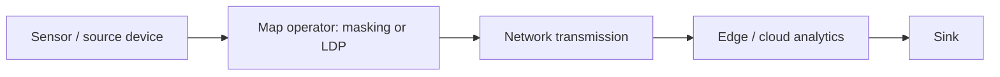

# The Problem
NebulaStream (NES) processes streams across sensors, edge workers, and cloud resources. Its architecture supports operators such as `map`, `filter`, and `project`, as well as user-defined operators. In deployments that process sensitive information, sending raw records from a source device to downstream workers may expose more information than the application needs to transmit.

[Mascara](https://dl.acm.org/doi/pdf/10.1145/3698808) addresses disclosure-compliant query answering in relational databases through disclosure policies, query rewriting, and utility estimation. However, Mascara cannot be integrated directly into NES as it is defined for relational databases. This proposal therefore does not attempt to port Mascara.

Instead, it proposes a reusable collection of masking functions and local differential privacy (LDP) protocols that can be applied to records close to their source, before those records cross the network. These transformations may be exposed as NES operators or as a library used by stateless map operators.

**P1 — Raw sensitive values may leave source devices unnecessarily.** Applications that require only transformed data need a convenient way to apply transformations before network transmission.

**P2 — Users lack a common, reusable collection of source-side privacy transformations.** Reimplementing masking and randomization in individual applications increases duplication and makes configuration harder to review.

**P3 — Masking and LDP have different semantics and protection properties.** NES must avoid presenting simple masking as a formal privacy guarantee or treating all randomized transformations as interchangeable.

**P4 — Privacy transformations must fit NES's operator and execution model.** The system needs a practical way to configure and execute transformations at or near sources without requiring a new access-control subsystem.

# Goals
**G1 — Provide reusable masking primitives.** Offer common functions such as generalization, suppression, tokenization, and perturbation through a library or operators. *(Addresses P2, P4.)*

**G2 — Provide a foundation for LDP protocols.** Support carefully specified local randomization mechanisms that can be applied before data leaves a source device. *(Addresses P1, P2, P3.)*

**G3 — Make source-side placement possible.** Allow users and the optimizer/planner to place eligible transformations near source devices, subject to NES's placement capabilities and semantics. *(Addresses P1, P4.)*

**G4 — Make protection semantics explicit.** Clearly distinguish ordinary masking from mechanisms with formal LDP guarantees, and document parameters and assumptions for the latter. *(Addresses P3.)*

**G5 — Reuse NES operators and libraries.** Prefer stateless map semantics for per-record transformations and avoid introducing an independent privacy runtime where possible. *(Addresses P2, P4.)*

# Alternatives
- **A1:** Implement masking and LDP transformations as separate, independent modules. This approach clearly separates concerns and allows each module to evolve independently, but it may lead to duplicated effort and less efficient integration with NES's existing operator and execution model.

- **A2:** Provide a masking/LDP library invoked through stateless map operators. This approach leverages NES's existing operator model and allows transformations to be applied in a flexible and composable manner, but it may require users to manually manage placement and configuration details.

- **A3:** Besides implementing masking and LDP transformations, also provide a simple job definition language or configuration mechanism to allow users to specify which transformations to apply and where to place them in the data flow. 

# Our Proposed Solution

## Overview

Create a reusable privacy-transformation library with two clearly separated groups:

1. **Masking functions:** deterministic or randomized transformations such as generalization, suppression, tokenization, and perturbation. Documentation must state that these functions do not automatically provide a formal privacy guarantee. For this check the masking functions implemented for [Mascara](https://github.com/rudip7/mascara/blob/main/src/main/resources/maskingFunctions/masking.sql)
2. **Local differential privacy protocols:** mechanisms that randomize an individual's value locally before it is transmitted. Each protocol must document its input domain, parameters, randomization behavior, and applicable privacy guarantee and assumptions.

Expose these functions through a common configuration interface and make them callable from stateless map operators. Users should be able to apply the transformation at the source side when NES placement and deployment permit it.

## Conceptual data path



The diagram expresses the intended placement for suitable use cases. It is not a claim that NES currently pushes every map operator to every physical source; the actual plan must be inspected and the required placement behavior implemented or configured.

## API shape

The implementation should follow NES's existing operator and UDF conventions. 
For LDP, the configuration should identify the protocol and all required parameters. Randomized mechanisms must use an appropriate source-side randomness strategy and must not silently fall back to deterministic masking.

A possible internal organization is:

```text
privacy/
  masking/
    generalization
    suppression
    tokenization
    perturbation
    ...
  local_dp/
    Generalized Randomized Response (GRR)
    Optimized Unary Encoding (OUE)
    Optimized Local Hashing (OLH)
    ...
  map_adapter/
    NES map/UDF integration
```

The directory layout is a suggestion; maintainers should choose the organization consistent with NES's library and plugin conventions.

## Initial masking functions

**Generalization.** Replace a precise value with a broader category or range, such as an age with an age band. The configuration must define the hierarchy or mapping and behavior for missing or out-of-domain values.

**Suppression.** Remove or redact a sensitive value. The operator must specify whether it emits a null, a designated marker, or omits a record; these choices have different downstream semantics.

**Tokenization.** Replace a sensitive value with a token. The design must distinguish random/non-linkable tokens from stable tokens, since stable tokens may enable linking records. Any token vault or reversibility mechanism is outside the initial stateless library unless separately designed.

**Perturbation.** Add noise or otherwise perturb a value. The operator must document the distribution, parameterization, domain constraints, and whether the method has any formal guarantee. Ordinary perturbation must not be labelled LDP unless the mechanism has a proven guarantee under stated assumptions.

## Local differential privacy

LDP protocols should be implemented as explicit mechanisms rather than as an unspecified “privacy noise” option. The library should document for each mechanism:

- Supported input domain and encoding.
- Protocol name and reference.
- Privacy parameter(s), including the meaning and valid range of each parameter.
- Randomization algorithm and source of randomness.
- Output domain and interpretation.
- Privacy guarantee and assumptions, including the unit of privacy and whether repeated reports compose.
- Known utility limitations and intended analytics.

A protocol such as randomized response may be a candidate for categorical data, but the precise mechanism and parameterization must be selected and reviewed before implementation. Numerical mechanisms require an explicit bounded domain or other stated assumptions. The design should not invent a generic guarantee that applies to every transform.

Because LDP randomizes data at the source, the receiving system generally cannot recover the original value of an individual record from the reported value. The usefulness of the resulting stream depends on the chosen mechanism and downstream analysis.

The most common LDP mechanisms include Generalized Randomized Response (GRR), Optimized Unary Encoding (OUE), and Optimized Local Hashing (OLH), RAPPOR, Subset Selection (SS).

# Proof of Concept
The PoC should validate both function behavior and placement.

1. Implement one generalization or suppression transform as a stateless map operation.
2. Apply it to a source containing synthetic sensitive values and verify the downstream output.
3. Inspect the optimized/distributed plan to confirm where the operator executes and whether raw values cross a network edge.
4. Implement one carefully selected categorical LDP protocol with documented parameters and a testable reference implementation.
5. Test input/output domains, parameter validation, randomization behavior, and reproducibility requirements for tests.
6. Verify that production randomness is not fixed or reused incorrectly, while allowing deterministic test injection where NES conventions permit.
7. Measure per-record processing overhead and resulting network volume for representative data.
8. Document the limits of the chosen masking function and the exact assumptions behind the selected LDP guarantee.

The PoC should not claim that the full pipeline is legally compliant or that masking alone provides formal privacy.

# Summary
- this section closes the Problems/Goals bracket opened at the beginning of the design document
- briefly recap how the proposed solution addresses all [problems](#the-problem) and achieves all [goals](#goals) and if it does not, why that is ok
- briefly state why the proposed solution is the best [alternative](#alternatives)


# Sources and Further Reading
- [Mascara's SIGMOD paper writen by Poepsel-Lemaitre et. al.](https://dl.acm.org/doi/pdf/10.1145/3698808) 
- [Mascara repository](https://github.com/rudip7/mascara)
- Dwork and Roth, *The Algorithmic Foundations of Differential Privacy* (background on differential privacy; protocol-specific LDP references should be added after mechanism selection).
- Arcolezi, Héber H., et al. "On the risks of collecting multidimensional data under local differential privacy." arXiv preprint arXiv:2209.01684 (2022). (very good overview of LDP protocols)


