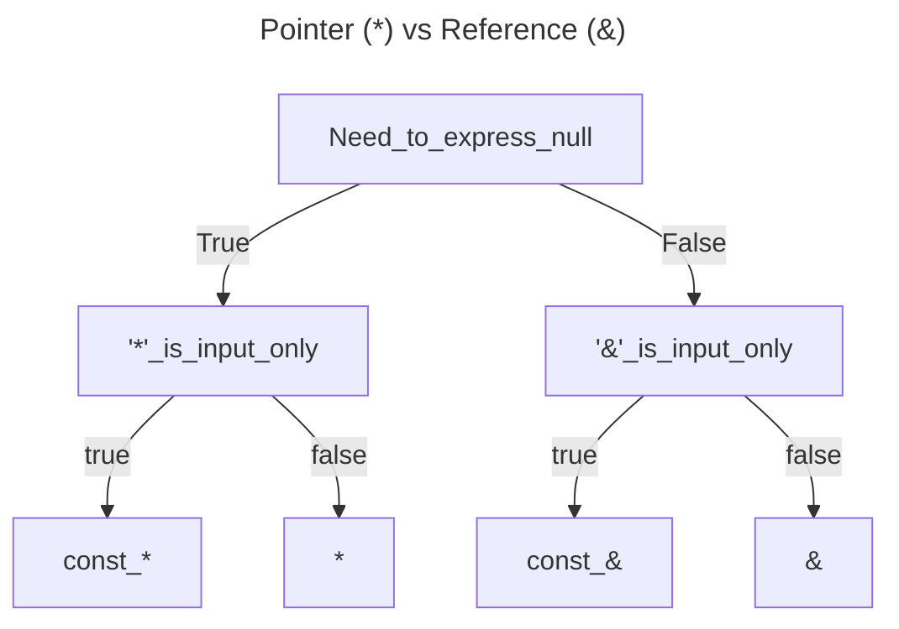
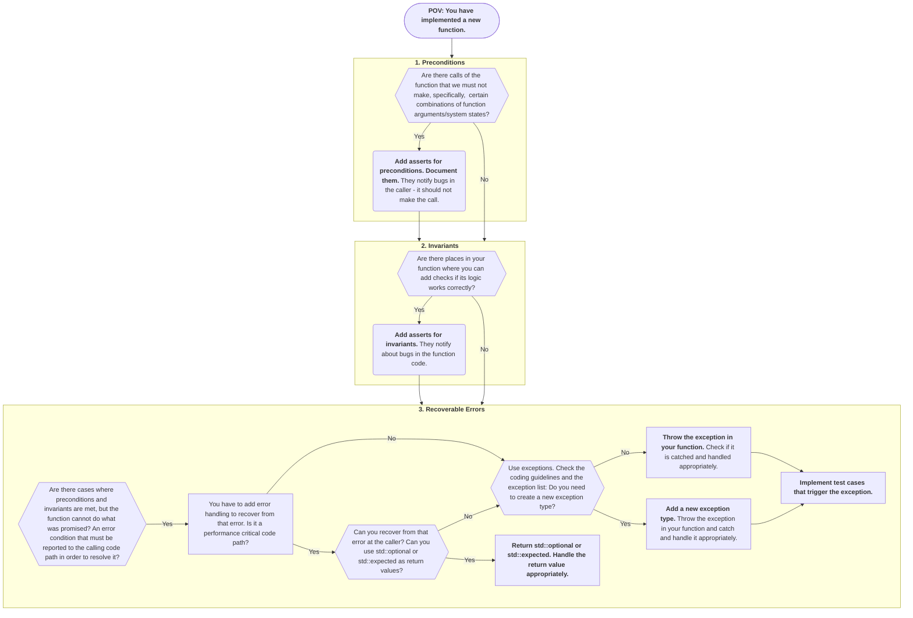

# General Coding Style and Clang Format
We use the [Clickhouse style](https:///clickhouse.com/docs/en/development/style) for the coding style, and we enforce the style by clang-format. 
The `.clang-format` file is located in the root directory of the project.
The style can be imported into Clion by following the steps below:
1. Go to the settings window: `File --> Settings`
2. Jump to C/C++ code style: `Editor --> Code Style --> C/C++`
3. Import the code style from `.clang-format`
4. Click `Apply` and `OK`

# Fixing Clang-Tidy Warnings

As part of our CI, we are running a clang-tidy check on the codebase and the fixes are exported and provided via annotations.
This performs some static code analysis to ease of the load of the code reviewer.
We will provide the commands, assuming one uses our provided docker image.
For building it locally with vcpkg, the commands should be quite similar.
This section provides a good starting point for fixing clang-tidy warnings.
As every setup is different, it might be necessary to adjust the commands to your setup.

## Running clang-tidy via CMake targets (recommended)
Just like `clang-format` is available as the `format` / `check-format` CMake targets, clang-tidy on your diff is
available as CMake targets. These wrap `clang-tidy-diff.py` so you no longer need the hand-written `git diff | clang-tidy-diff-19.py ...`
command below. There are five targets:

| Target | Scope | Mode |
| --- | --- | --- |
| `tidy-diff` | `NES_TIDY_DIFF_BASE` (default `HEAD`, i.e. all uncommitted changes) | check |
| `tidy-diff-fix` | same as above | applies `-fix` |
| `tidy-diff-to-main` | `origin/main` (whole branch) | check |
| `tidy-diff-to-main-fix` | `origin/main` (whole branch) | applies `-fix` |
| `tidy-full` | every translation unit (what nightly CI runs) | check |

For reviewing a PR, the usual command is to fix everything on your branch relative to `origin/main`:
```bash
cmake --build build --target tidy-diff-to-main-fix
```
Or, wrapped in the development container (the `-to-main` targets pin the base internally, so no `-e NES_TIDY_DIFF_BASE=...`
plumbing is needed):
```bash
docker run \
    --workdir $(pwd) \
    -v $(pwd):$(pwd) \
    nebulastream/nes-development:local \
    cmake --build build-docker --target tidy-diff-to-main-fix
```
In CLion these appear in the target dropdown, so you can run them like any other build target — no need to edit the
Docker toolchain environment.

Notes:
- Some headers (gRPC/protobuf stubs, ANTLR, cxxbridge) only exist once they have been generated; without them
  clang-tidy reports spurious `file not found` errors. The targets depend on `nes-codegen`, which produces exactly
  those files without compiling or linking anything, so a configured build tree is enough — no full build needed.
- The targets are only registered when `CMAKE_EXPORT_COMPILE_COMMANDS=ON` (on by default) — clang-tidy needs the
  `compile_commands.json`.
- `tidy-full` writes its report to `<build-dir>/clang-tidy.log`; the diff targets write to
  `<build-dir>/clang-tidy-diff-report.txt`.
- To compare against an arbitrary base (a branch or commit other than `origin/main`), set `NES_TIDY_DIFF_BASE` and use
  the plain `tidy-diff` / `tidy-diff-fix` targets, e.g. `NES_TIDY_DIFF_BASE=origin/some-branch cmake --build build --target tidy-diff-fix`.

## Running the clang-tidy diff workflow with Nix
If you want to reproduce the current clang-tidy diff workflow locally with the Nix toolchain, run the following command
from the repository root.
```bash
nix run .#clang-tidy
```
By default, the command compares the current checkout to `origin/main`.
To use another branch or commit, pass it after `--`, for example `nix run .#clang-tidy -- upstream/main`.
The command uses the official `clang-tidy-diff.py` workflow, applies fixes in place, and configures and builds
`build/`.

## Manual invocation (fallback / custom setups)
The CMake targets above are preferred. Use the manual commands below only for custom bases or non-CMake setups.

As a pre-requisite, you need to have the docker image built and your git repository updated.
Before running clang-tidy, we must create a running container from the image.
If possible, you should run the Docker container in rootless mode. 
Otherwise, the clang-tidy check will change the ownership of the files to root, and you will have to change it back. 
```bash
docker run --rm -it -v <path/to/nebulastream>:/tmp/nebulastream nebulastream/nes-development
```

Then, we can run the following command to fix the clang-tidy warnings inside the Docker container.
Before running the command, please change the `<no. threads>`.
If you want run clang-tidy on the diff to another branch, please change `origin/main` to that branch.
The below command assumes that NebulaStream is mounted under `/tmp/nebulastream` in the docker image.
We exclude '*.inc' files, since '*.inc' files are dependent header files that other header files include and that therefore don't need to compile on their own.
```bash
export LLVM_SYMBOLIZER_PATH=llvm-symbolizer-19 && \
    git config --global --add safe.directory /tmp/nebulastream && \
    cd /tmp/nebulastream && \
    rm -rf build/ && mkdir build && \
    cmake -GNinja -B build -DCMAKE_EXPORT_COMPILE_COMMANDS=ON && \
    git diff -U0 origin/main -- ':!*.inc' | clang-tidy-diff-19.py -clang-tidy-binary clang-tidy-19 -p1 -path build -fix -config-file .clang-tidy -use-color -j <no. threads>
```
Since we generate some header files in the build process, clang-tidy might complain about missing header files.
In this case, you have to build `NebulaStream` before running the clang-tidy check to create the missing header files.
```bash
export LLVM_SYMBOLIZER_PATH=llvm-symbolizer-19 && \
    git config --global --add safe.directory /tmp/nebulastream && \
    cd /tmp/nebulastream && \
    rm -rf build/ && mkdir build && \
    cmake -GNinja -B build -DCMAKE_EXPORT_COMPILE_COMMANDS=ON && \
    cmake --build build -j -- -k 0 && \
    git diff -U0 origin/main -- ':!*.inc' | clang-tidy-diff-19.py -clang-tidy-binary clang-tidy-19 -p1 -path build -fix -config-file .clang-tidy -use-color -j <no. threads>
```

## Fixing clang-tidy warnings compared to a commit hash
If you want to fix the clang-tidy warnings compared to a hash commit, the commands are quite similar.
The only difference is that you replace the `<branch name>` with the hash commit.
```bash
git diff -U0 origin/<branch name> -- ':!*.inc'
git diff -U0 ${START_COMMIT_SHA} -- ':!*.inc'
```

## Important notes
There are some important notes to consider when running clang-tidy to fix the warnings.
- It might take a while to run the clang-tidy check, depending on the number of files and the number of threads you use.
- You should not do anything to the codebase while the clang-tidy check is running. No switching branches, no rebasing, no committing, no editing files, etc. Grab yourself a coffee and wait for the clang-tidy check to finish.
- It might happen that clang-tidy will run into compiler errors. In this case, you have to fix the compiler errors first before running the clang-tidy check again.

## FAQ
It might happen that you cannot edit the `NebulaStream directory, after running the clang-tidy check.
This might be due to the fact that the folder is now owned by root, as the Docker container runs as root (if you use the provided docker command and don't use rootless mode).
To fix this, you can run the following command.
```bash
sudo chown -R $USER:$USER <path/to/nebulastream>
```

# Naming Conventions and Position of Operators
- Classes and structs start with uppercase and use camelcase: `MyClass`
- Functions and variables start with lowercase and use camelcase: `myMethod`
- Constants are all upper case: `const double PI=3.14159265358979323;`
- for magic numbers, we use constexpr: `constexpr auto MAGIC_NUMBER = 42;`
- `*` and `&` next to the type not the name, e.g., `void* p` instead of `void *p` or `void& p` instead of `void &p`.
- We only use acronyms in a type name if they are widely used outside of the NebulaStream system (e.g., CSV, JSON).

## Naming Types that Implement an Interface
Naming is complex, so it is especially important to follow a fixed naming scheme when choosing names for new components and extensions of existing components.

Types implementing an interface follow a naming schema of `{NameOfSpecialization}{NameOfInterface}`:

```c++
class Source {
    virtual void source_around() = 0;
};

class SpecificSource : public Source {
    void source_around() override { specifc_sourcing_around(); }
};
```

Interfaces inheriting from other interfaces may choose to replace the original interface name.
Inheriting from multiple non-mixin type interfaces usually requires coming up with a new name.

```c++
class Node {
    ///...
};

class Operator : public Node {
    /// pure virtual
};

class JoinOperator : public Operator {
    /// concrete
};

class FunctionNode : public Node {
    /// pure virtual
};

class AddFunctionNode : public FunctionNode {
    /// concrete
};

/// multiple inheritance with a real interface and a mixin
class SubFunctionNode : public FunctionNode, public std::enabled_shared_from_this<SubFunctionNode> {
    /// concrete
};

/// multiple inheritance with two real interfaces.
class BufferManager : public AbstractBufferProvider, public AbstractPoolProvider {
    /// concrete
};
```

The alternative `{NameOfInterface}{NameOfSpecialization}` would potentially create ambiguous names, e.g., `SourceFile` instead of `FileSource`.
Also, the alternative is very unconventional in general programming jargon — the standard library does not use `ListLinked` or `MapUnordered`.

# Includes and Forward Declaration
We use `include <>` for all includes and avoid [forward declaration wherever possible](https:///github.com/nebulastream/nebulastream-public/discussions/19).
We never use `using namespace` in the global scope of header files, as they get pulled into the namespace of all files that include the header file.
```cpp

/// Correct
include <DataStructure/SomeDataStructue.hpp>
    
/// Wrong 
include "../DataStructure/SomeDataStructure.hpp"
```


# Ownership and Pointer usage

**Ownership:**
- Prefer value semantics over pointers. This avoids heap allocations, pointer indirection ("pointer chasing"), and potential memory leaks.

- Use `unique_ptr` when you need dynamic allocation but want exclusive ownership. It’s our default choice when the performance cost of copying is a concern.

- Reserve `shared_ptr` for scenarios requiring shared ownership. Remember the atomic, thread-safe reference counting makes it more expensive than you might expect.

- Use `weak_ptr` for non-owning references to shared resources, or to break reference cycles involving `shared_ptr`.

- Favor type erasure (e.g., `std::function`, `std::any`, or a custom wrapper) for polymorphic objects instead of managing them through `shared_ptr`. C.f., [Sean Parent, Runtime Polymorphism](https://sean-parent.stlab.cc/presentations/2017-01-18-runtime-polymorphism/2017-01-18-runtime-polymorphism.pdf).

- Avoid raw pointers for ownership. Never call `new` or `malloc`; use `make_unique` or `make_shared` instead. If you must interact with APIs that use raw pointers, treat those pointers as non-owning observers only—ownership must be explicitly managed elsewhere.
  Remember, not only raw pointers can let you accidentally access invalid memory, but references as well.

**Parameter passing:**

- Pass objects by reference (e.g., `const T&`) or by value for small/trivially-copyable types.

- Accept smart pointers (`unique_ptr` or `shared_ptr`) only when you intend to express ownership transfer or sharing. Preferably pass them by value (and moving) so the intent to transfer or share ownership is explicit.

**Accessing smart pointers:**

- Use `operator*` and `operator->` to work with the managed object.

- Limit use of `.get()` to interoperate with APIs that require a raw pointer, avoiding unnecessary exposure of ownership details.

```cpp
void correctParam(const SomeClass& someClass) {
    auto ret = someClass.someMethod();
    setSomeValue(ret);
}

/// We do not need the smart pointer here, simply access to the method
void wrongParam(const std::shared_ptr<SomeClass>& someClass) {
    auto ret = someClass->someMethod()
    setSomeValue(ret);
}

int main() {
    auto someClass = std::make_shared<SomeClass>();
    correctParam(*someClass);
    
    /// Works, but is against our coding guidelines
    correctParam(someClass.get());
    
    
    /// Bad example:
    const auto rawSomeClassObj = someClass.get();
    rawSomeClassObj->someMethod();
    /// reason:
    /// we can call ->someMethod() on a shared pointer, so the `.get()` call is not necessary
}
```
For a quick overview, we use the following graph to decide what operator to use:


# OOP and Inheritance
We differentiate between structs and classes, using structs for [plain-old-data structures](https://stackoverflow.com/q/4178175) and classes for classes with features such as `private` or `protected` members.
```cpp
struct SomeStruct {
    const double x1;
    const double x2;
    const uint64_t x3;
};


class SomeFancyClass {
    static constexpr auto DEFAULT_VALUE = 42;
  
  public:
    SomeFancyClass(SomeStruct someStruct) : somePrivateMember(FORTY_TWO), someStruct(someStruct) {}
    void somePublicMethod();
    int getSomePrivateMember() const { return somePrivateMember; }
    
  private:
    void somePrivateMethod();
  
  private:
    int somePrivateMember;
    SomeStruct someStructMember;
};
```
We use virtual destructors in base classes and the `final` keyword in virtual functions and class declarations whenever it should not be implemented in a derived class.


# Variable Declaration and Return Types
We use `const` wherever possible and remove it only if necessary (Rust approach).
We carefully consider return types, e.g., we do not pass [fundamental types](https://en.cppreference.com/w/cpp/language/types) by const ref.
We return temporaries and local values by value, getters by reference or const reference, or by value for thread safety.
We declare enums as `enum class` to avoid polluting the namespace and give a type to the enum, e.g., `enum class Color : int8_t { RED, GREEN, BLUE };`.
```cpp
class SomeClass {
  public:
    /// Correct 
    const int getSomeValue() const { return someValue; }
    
    /// Wrong
    const int& getSomeValue() const { return someValue; }
    
    /// Correct
    void setSomeValue(const int value) { someValue = value; }
    
    /// Wrong
    void setSomeValue(int value) { someValue = value; }
    
    /// Correct 
    std::shared_ptr<SomeOtherClass> getSomeOtherClass() const { return someOtherClass; }
    
    /// Wrong 
    SomeOtherClass* getSomeOtherClass() const { return someOtherClass.get(); }
  private:
    int someValue;
    std::shared_ptr<SomeOtherClass> someOtherClass;
};
```

# Casting and Function Declaration,
We avoid C-style casts and use `static_cast`, `dynamic_cast`, `const_cast`, and `reinterpret_cast` instead.
Additionally, we use inline whenever possible to avoid the overhead of a function call.


# Operator Overloading
Wherever possible, we overload operators to make the code more readable and intuitive.
Instead of creating custom methods, e.g., `add()`, `subtract()` or `toString()`, we overload operators like `+`, `-`, or `<<`.
```cpp
class SomeClass {
  public:
    
    /// Correct
    SomeClass operator+(const SomeClass& other) const {
        return SomeClass(someValue + other.someValue);
    }
    
    SomeClass operator-(const SomeClass& other) const {
        return SomeClass(someValue - other.someValue);
    }
    
    friend std::ostream& operator<<(std::ostream& os, const SomeClass& someClass) {
        os << someClass.someValue;
        return os;
    }
    
    /// Wrong
    SomeClass add(const SomeClass& other) const {
        return SomeClass(someValue + other.someValue);
    }
    
    SomeClass subtract(const SomeClass& other) const {
        return SomeClass(someValue - other.someValue);
    }
    
    std::string toString() const {
        return std::to_string(someValue);
    }
    
  private:
    int someValue;
};
```
If we want to make an operator virtual, because it should be implemented in a derived class, we create a virtual function that is called by the operator, see [this discussion on StackOverflow](https://stackoverflow.com/questions/4571611/making-operator-virtual).
Oftentimes, the goal is to only allow access via the overloaded operator but not via the virtual function.
```cpp
class Base {
  public:
    Base operator+(const Base& other) const {
        return add(other);
    }
  
  protected:
    virtual Base add(const Base& other) const = 0;
};

class Derived {
    /// Now, we can implement the operator in the derived class
    protected:
        Derived add(const Derived& other) const override {
            return Derived(someValue + other.someValue);
        }
    };
};
```

# Error Handling

Following Herb Sutter, we differentiate between abstract machine corruption and programming bugs, recoverable errors:
1) **Corruptions** (e.g., stack overflow) cause a corrupted state that cannot be recovered programmatically. We use:
    - Signal handlers: handle the termination gracefully.
2) **Bugs** (e.g., out-of-bounds, null dereference) cannot be recovered either. We prevent them by using:
    - Preconditions asserts: check whether a function was correctly called.
    - Invariant asserts: check for bugs in function.
3) **Errors** occur when the function cannot do what was advertised, i.e., could not reach a successful return postcondition. We prevent them by using:
    - Exceptions: throw and catch to communicate an error to the calling code that can recover to a valid state. This is an elegant way if the error source and handling code are separated by multiple function calls (keyword: stack unwinding).
    - std::expected & std::optional: error handling in performance-critical code where errors are likely to occur frequently.

## Flow Chart
For each new function, the following flow chart should be followed:



## How to handle errors?
- NebulaStream follows the approach of using a system-wide exception model. We support multiple exception types, and they are defined in a central file system-wide.
- All currently supported exceptions are in `ExceptionDefinitions.hpp`. Reuse existing exceptions to handle your error.
- Generally, check if an exception is needed (*exceptional cases*). Throwing and catching exceptions is [very](https://www.open-std.org/jtc1/sc22/wg21/docs/papers/2022/p2544r0.html) [expensive](https://lemire.me/blog/2022/05/13/avoid-exception-throwing-in-performance-sensitive-code/).
    - Throw if the function cannot do what is advertised.
    - Throw if the function cannot handle the error properly on its own because it needs more context.
    - In performance-sensitive code paths, ask yourself: Can your error be resolved by returning a `std::optional` or a `std::expected` instead?
- Exceptions should be catched were they can be handled. 
- Use asserts to check preconditions and invariants of functions. We exclude asserts in our code if not compiled with `DEBUG` mode.
- Write test cases that trigger exceptions.
    ```C++
    try {
        sendMessage(someWrongNetworkConfiguration, msg);
    } catch (CannotConnectToCoordinator & e) {
        // We successfully caught the error, as expected.
        SUCCEED();
    }
    // We did not catch the error, even though we should have.
    FAIL();
    ```

## How to use exceptions?
- Throw exceptions by value.
    ```C++
    throw CannotConnectToCoordinator();
    ```
- Catch exceptions using the `const` reference.
- Rethrow with `throw;` without arguments.
- Add context to exception messages if possible. Sometimes, it makes sense to rethrow an exception and catch it where one can add more context to it. To modify the exception message later, append to the mutable string:
    ```C++
    catch (CannotConnectToCoordinator& e) {
        e.what += " for query id " + queryId;
        throw;
    }
    ```
- If a fatal error occurs, use the `main()` function return value to return the error code:
    ```C++
    int main () {
        /* ... */
        catch (...) {
            tryLogCurrentException();
            return getCurrentExceptionCode();
        }
    }
    ```

## How to define new exceptions?
- All our exceptions are in a central file, `ExceptionDefinitions.hpp`. Do not define them somewhere else.
- An exception type represents an 'error source' that needs to be handled in a specific way. Each exception type should represent a unique error requiring a specific handling approach. Thus, a new exception type should only be created if the error must be handled differently than all existing exceptions. This enables the reuse of handling approaches.
- The exception name and description should very concisely describe i) which condition led to the error ("UnknownSourceType") or ii) which operation failed ("CannotConnectToCoordinator"). The former is preferred to the latter.
- When writing error messages (which are `description` and optional context), we follow the [Postgres Error Message Style Guide](https://www.postgresql.org/docs/current/error-style-guide.html).

# Printing Type Names

When printing a type, i.e., in a generic parsing function, do not use the built-in `typeid(T).name()`, as this will
usually give a mangled type name. Instead, use [nameof](https://github.com/Neargye/nameof).

```c++
NAMEOF_TYPE(T) /// gives a string_view which contains the types name
NAMEOF_TYPE_EXPR(expr) /// gives a string_view of exprs type. (i.e. decltype(expr))
```
