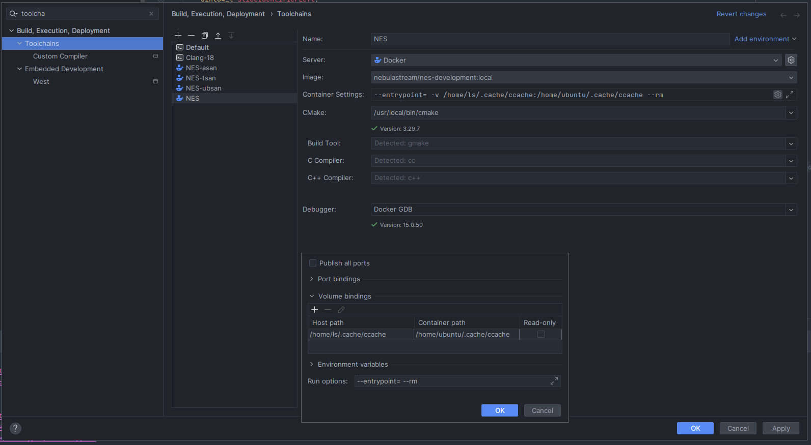
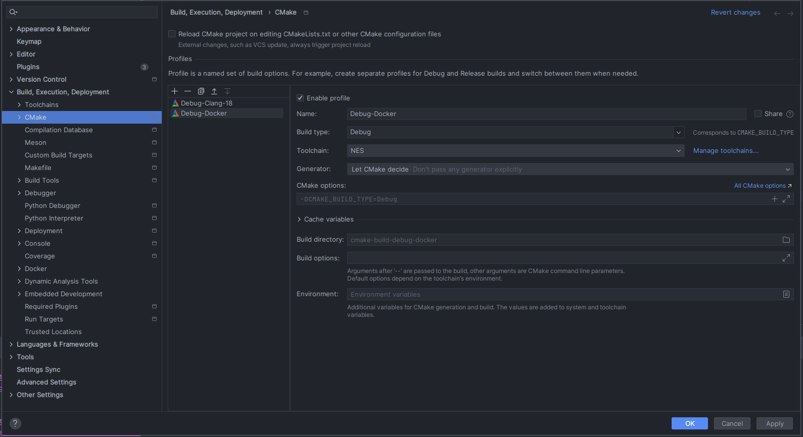

# Development

This document explains how to set up the development environment for NebulaStream.
We distribute a development container image to enable anyone interested hacking on the system as quickly as possible.
Additionally, for long-term developers or developers
disliking developing in a containerized environment, this document explains how to set up and build NebulaStream in a
non-containerized environment.

## Development Container

The recent (based on the main branch) development image can be pulled from

```shell
docker pull nebulastream/nes-development:latest
```

However, it is recommended to build a local development image, because it also installs the current user into the
docker container, which prevents permission issues. Building a local image will fall back to a pre-built development
image which matches the current set of dependencies (based on a hash). If you are using docker in rootless mode the
user inside the container will be root.

If no development image matches the current dependency hash, you can build the development environment locally (using
the `-l` flag). If you want to use `libstdc++` instead of the default libc++, you can use the `--libstdcxx` flag.

```shell
./scripts/install-local-docker-environment.sh
```

**Note**: All commands need to be run from the **root of the git repository**!

The image contains an LLVM-based toolchain (with libc++), a recent CMake version, the mold linker and a pre-built
development sdk based on the vcpkg manifest.

This container image can be integrated into, e.g., CLion via a docker-based toolchain or used via the command line.

To configure the cmake build into a `build-docker` directory, you have to mount the current working directory `pwd` into
the container. Additional cmake flags can be appended to the command.

```shell
docker run \
    --workdir $(pwd) \
    -v $(pwd):$(pwd) \
    nebulastream/nes-development:local \
    cmake -B build-docker
```

The command to execute the build also requires, the current directory to be mounted into the container.

```shell
docker run \
    --workdir $(pwd) \
    -v $(pwd):$(pwd) \
    nebulastream/nes-development:local \
    cmake --build build-docker -j
```

To run all tests you have to run ctest inside the docker container. The '-j' flag will run all tests in parallel. We
refer to the [ctest guide](https://cmake.org/cmake/help/latest/manual/ctest.1.html) for further instruction.

```shell
docker run \
    --workdir $(pwd) \
    -v $(pwd):$(pwd) \
     nebulastream/nes-development:local \
     ctest --test-dir build-docker -j
```

### Modifying dependencies

When using the docker images, it is not straightforward to edit the dependencies, as a new docker image would need to be
created. Currently, the simplest solution is to create a pull request which would run the docker build on the
nebulastream
CI and provide a branch specific version of the development image. The development image with changed dependencies is
available via:

```shell
docker pull nebulastream/nes-development:branch-name
```

### Dependencies via VCPKG

The development container has an environment variable `NES_PREBUILT_VCPKG_ROOT`, which, once detected by the CMake build
system, will
configure the correct toolchain to use.

Since the development environment only provides a pre-built set of dependencies, changing the dependencies in the
containerized mode is impossible. If desired, a new development image can be built locally or via the CI.

### CCache

If you want to use `CCache`, you need to mount your host machines' CCache directory (`ccache -p`) into the docker
containers CCache directory.

```shell
docker run \
    --workdir $(pwd) \
    -v $(pwd):$(pwd) \
    -v $(ccache -k cache_dir):$(ccache -k cache_dir) \
    -e CCACHE_DIR=$(ccache -k cache_dir) \
    nebulastream/nes-development:local \
    cmake -B build-docker
```

### CLion Integration

To integrate the container-based development environment you need to create a new docker-based toolchain. With the
following settings:



This configuration assumes ccache is using the default directory of `$HOME/.cache/ccache`. You can create additional
docker-based toolchains if you plan to experiment with different sanitizer.

Lastly, you need to create a new CMake profile which uses the newly created docker-based toolchain:



## Non-Container Development Environment

The relevant CI Jobs will be executed in the development container. This means in order to reproduce CI results, it is
essential to replicate the development environment built into the base docker image. Note that NebulaStream uses llvm
for its query compilation, which will take a while to build locally. You can follow the instructions of the instructions
of the [base.dockerfile](../docker/dependency/Base.dockerfile) to replicate on Ubuntu or Debian systems.

The compiler toolchain is based on `llvm-19` and libc++-19, and we use the mold linker for its better performance.
Follow the [llvm documentation](https://apt.llvm.org/) to install a recent toolchain via your package manager.

### Local VCPKG with DCMAKE_TOOLCHAIN_FILE

A local vcpkg repository should be created, which could be shared between different projects. To instruct the CMake
build to use a local vcpkg repository, pass the vcpkg CMake toolchain file to the CMake configuration command.

```shell
cmake -B build -DCMAKE_TOOLCHAIN_FILE=/home/user/vcpkg/scripts/buildsystems/vcpkg.cmake
```

The first time building NebulaStream, VCPKG will build all dependencies specified in the vcpkg/vcpkg.json manifest,
subsequent builds can rely on the VCPKGs internal caching mechanisms even if you delete the build folder.

To set the CMake configuration via CLion you have to add them to your CMake profile which can be found in the CMake
settings.

### Local VCPKG without DCMAKE_TOOLCHAIN_FILE

If you omit the toolchain file, the CMake system will create a local vcpkg-repository inside the project directory
and pursue building the dependencies in there. If you later wish to migrate the vcpkg-repository you can move it
elsewhere on your system and specify the `-DCMAKE_TOOLCHAIN_FILE` flag.

### Using a local installation of MLIR

Building LLVM and `MLIR` locally can be both time and disk-space consuming. The cmake option `-DUSE_LOCAL_MLIR=ON` will
remove the vcpkg feature responsible for building `MLIR`. Unless the `MLIR` backend is also disabled via
`-DNES_ENABLE_EXPERIMENTAL_EXECUTION_MLIR=OFF`,
CMake expects to be able to locate `MLIR` somewhere on the system.

The current recommendation is to use the
legacy [pre-built llvm archive](https://github.com/nebulastream/clang-binaries/releases/tag/vmlir-sanitized)
and pass the `-DCMAKE_PREFIX_PATH=/path/to/nes-clang-18-ubuntu-22.04-X64/clang`

```bash
cmake -B build \
-DCMAKE_TOOLCHAIN_FILE=/path/to/vcpkg/scripts/buildsystems/vcpkg.cmake \
-DUSE_LOCAL_MLIR=ON \
-DCMAKE_PREFIX_PATH=/path/to/nes-clang-18-libc++-x64-None/clang 
```

Ensure your locally installed version of MLIR uses the correct standard library and sanitizers. The default build uses
libc++ and no sanitizers. Mismatches between the standard library will appear as linker errors during the build, while
mismatched sanitizers might cause them not to work or produce false positives.

## Standard Libraries

In its current state, NebulaStream supports both libstdc++ and libc++. Both libraries offer compelling reasons to use
one over the other. For local debugging, CLion offers custom type renderers for stl types (e.g., vector and maps).
Libc++
frees us from being tied to a hard-to-change libstdc++ distributed with GCC. Additionally, libc++ enables the use
of a hardened library version.

Effectively using both libraries makes NebulaStream more robust by enabling tooling for both libraries. This flexibility
means we are not locked into a specific standard library, allowing us to take advantage of tools and debugging features
for both libstdc++ and libc++. It also reduces the likelihood of encountering undefined behavior or
implementation-specific details, which can complicate development and hinder portability. By leveraging both libraries,
we improve the potential for porting NebulaStream to smaller embedded IoT devices.

However, using both libraries comes with trade-offs. It limits us to the intersection of the features and behavior
supported by both libraries. Additionally, the CI ensures that
code compiles and runs successfully with libstdc++ and libc++ to maintain this dual compatibility.

### Compiling with Libstdc++

By default, NebulaStream attempts to build with libc++ if it is available on the host system (which is the case for all
docker images).
Using the cmake flag `-DUSE_LIBCXX_IF_AVAILABLE=OFF` disables the check and fallback to the default standard library on
the system.

If you intend to use the docker image with libstdc++ you can get the development image by pulling

```shell
docker pull nebulastream/nes-development:latest-libstdcxx
```
