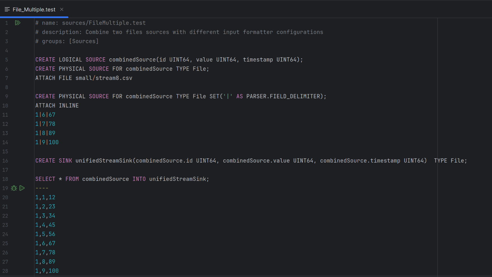

# How to Systest


## Requirements
This document assumes that you already have a working development setup for the nebulastream repository, as described in [development.md](./development.md).

## Setup
1. To set up the syntax highlighting in CLion, follow the [Syntax Highlighting Documentation](../../nes-systests/utils/SyntaxHighlighting/README.md).
2. To set up the Clion plugin for manually executing systests, follow the [Systest Plugin Documentation](../../nes-systests/utils/SystestPlugin/README.md).


## Write tests
All tests are written in custom test files of type `.test`.
These test files contain meta information about the test suite, define all required sinks and sources, provide, if necessary, the test input data, and define the actual test cases.
You can see an example test file at the top of this page.
The file begins with a brief documentation, followed by the definition of sources, sinks, and test cases via SQL statements.
Following, the individual parts are described.
Please refer to the existing `.test` files for additional examples.

### Comments
Lines that start with a hashtag (`#`) are comments and are mostly ignored by the systest. The only exception is the [documentation prefix](#documentation-prefix) at the beginning of the file.

### Documentation Prefix
Each test file starts with three lines with the following pattern:
```
# name: sources/FileMultiple.test
# description: Combine two files sources with different input formatter configurations
# groups: [Sources, Example]
```
All lines start with a hashtag indicating a [Comment](#comments).
The first line (starting with `# name:`) defines the name of the test suit, usually the relative path to the file from within the `nes-systest` folder.
The second line (staring with `#description:`) is a text that describes what the given test suit tests.
The third line (starting with `# groups:`) lists in brackets groups to which the given test suite belongs, such as "Sources", "Aggregation", or "Union". 
Groups are used to select all test cases from this group for testing, or exclude test cased from within this group when executing all other tests.   

### Sources
Sources are created via SQL statements.
These statements may be written across multiple lines, but must be concluded with a semicolon or a trailing empty line.
You need to define logical and physical sources.

Logical sources define their schema, but no data input. A query to create a logical source can look like the following:

`CREATE LOGICAL SOURCE input(id UTIN64, data FLOAT64);`.

Physical sources define concrete data inputs for logical sources. 
These can be of different types, such as file sources, TCP sources, or generator sources. 
Identical to the NES repl parser, you can optionally define parameters for the physical source. 
You can provide input data for the physical source inline (via the `ATTACH INLINE` statement directly following the physical source definition), or using a file that lies in `nes-systesst/testdata/` (via the `ATTACH FILE [path]` statement directly following the physical source definition). 
For both methods, white spaces in the tuples are not trimmed.

Examples:
```sql
# A plain file source with inline data 
CREATE PHYSICAL SOURCE FOR input TYPE File;
ATTACH INLINE
1,1.5
2,2.5
3,3.5

# A file source with a non-standard field delimiter and inline data
CREATE PHYSICAL SOURCE FOR input TYPE File SET('|' AS PARSER.FIELD_DELIMITER);
ATTACH INLINE
1|1.5
2|2.5
3|3.5

# A plain file source with input data provided by a test file
CREATE PHYSICAL SOURCE FOR input TYPE File;
ATTACH FILE testdata.csv

# A generator source with no additional input data because it generates its data automatically.
CREATE PHYSICAL SOURCE FOR input TYPE Generator SET(
       'ONE' as `SOURCE`.STOP_GENERATOR_WHEN_SEQUENCE_FINISHES,
       1 AS `SOURCE`.SEED,
# Avoid using timeouts for the generator sources, it can cause flakey tests. 
#      1000000 AS `SOURCE`.MAX_RUNTIME_MS,
# Instead rely on self-terminating sequences
       'SEQUENCE UINT64 0 100 1, SEQUENCE FLOAT64 0 200 1' AS `SOURCE`.GENERATOR_SCHEMA
);
```

#### Inline Sources

Additionally, a source can be defined inline within a SQL query.
Instead of naming a source, you can create an inline source by writing `[TYPE]([OPTIONS])` (cmp. the example below).
The accepted options are mostly the same as when creating a source via a `CREATE SOURCE` statement. 
The only difference is that a schema must be given via the options `SOURCE.SCHEMA` using the `SCHEMA` function.

You cannot use the `ATTACH` statement to pipe a file or inline data into the source. 
To use a file input, use the `SOURCE.FILE_PATH` option. If no absolut path is given, the sytests framework will assume 
the test data directory of the systest as the root directory.

Example:
```sql
SELECT ID, VALUE, TIMESTAMP
FROM File(
	'small/stream8.csv' AS `SOURCE`.FILE_PATH,
	'CSV' AS PARSER.`TYPE`,
	SCHEMA(id UINT64, value UINT64, timestamp UINT64) AS `SOURCE`.`SCHEMA`)
INTO output;
```

### Sinks
Sinks are also defined via SQL statements, can be written over multiple lines, and must be concluded with a semicolon or a trailing empty line.
When creating a sink, the exact expected schema and the type of the sink must be provided.

Examples:
```sql
CREATE SINK output(input.id UINT64, input.data FLOAT64) TYPE File;

CREATE SINK output2(input.id UINT64) TYPE File;

CREATE SINK output3(new_column UINT64) TYPE Checksum;
```

#### Inline Sinks
Additionally, sinks can be defined inline within a SQL query. 
Instead of naming the sink, you can create the inline sink by writing `[TYPE]([options])` (cmp. example below).
The accepted options are mostly the same as when creating a sink via a `CREATE SINK` statement.
The only difference is that a schema CAN OPTIONALLY be given via the options `SINK.SCHEMA` using the `SCHEMA` function.
If no schema is given, the schema is inferred automatically.

Because the systest framework automatically sets the sink file paths, `File` and `Generator` sinks can be created
without any options. 

Examples: 
```sql

SELECT ID, VALUE, TIMESTAMP
FROM input_source
INTO File();

SELECT ID, VALUE, TIMESTAMP
FROM input_source
INTO File(SCHEMA(ID UINT64, VALUE VARSIZE, TIMESTAMP UINT64) AS `SINK`.`SCHEMA`);

SELECT ID, VALUE, TIMESTAMP
FROM input_source
INTO Checksum();
```

### Test Cases

The test cases consist of SQL statements executed by NebulaStream, along with the expected results. 
The expected results can either be provided inline (separated from the test query via `----`) or via another SQL statement that is executed by NebulaStream (separated from the test query via `====`).
The provided inline data can be either the expected tabular results, or the expected error code. 

Examples:
```sql
SELECT input.id, input.data 
FROM input
INTO output1
----
1,1.5
2,2.5
3,3.5

SELECT invalid_field 
FROM input 
INTO output;
----
ERROR 2003

SELECT input.id * 1, input.data * 1 
FROM input
INTO output1
====
SELECT input.id / 1, input.data / 1
FROM input
INTO output1; 
```

## Run tests

### Via Plugin

The easiest way to run systest is the CLion Plugin.
When you have installed the plugin and open a systest file (with the ending `.test`), you see green bugs and triangles next to the test queries, and a double triangle next to very first line.
If you click the green arrow next to a test query, that specific test is automatically run, and the results are shown in a window pane below.
Clicking the green bug works similarly, but starts the query in debug mode. In debug mode, the system will pause at all breakpoints.
Alternatively, you can click the double triangle in the first line to run all test queries in the selected file.

### Systest Executable

You can also run the systest via the CMake `systest` executable either in the terminal or via your IDE such as CLion.
The executable can run individual tests, all tests in a given file, or all test files that belong to a defined group.
You can select the test cases and define the behaviour via command line arguments. 
The executable can run individual tests (`-t /path/to/test.test:1`), all tests in a given file (`-t /path/to/test.test`), or all test files that belong to a defined group (`-g group1 group2`, `-e excludedGroup`).
Tests can be run with specific configuration settings (`-- --worker.number_of_buffers_in_global_buffer_manager=10000`).
Permanent exclusions can be configured via `--disableConfigFile` (defaulting to `${TEST_CONFIGURATION_DIR}/systest-disable.yaml`) and can be ignored per run with `--ignoreDisableConfigFile`. The disable config file understands `exclude_groups` and `disabled_test_files`.
To measure the execution time of tests use the benchmark mode (`-b`).
To send queries on a remote worker use the remote mode (`-s`).
The endless mode runs tests in an infinite loop i.e. for regression testing (`--endless`).


To show all currently supported command line arguments, execute the `systest` executable with the `--help` flag.
