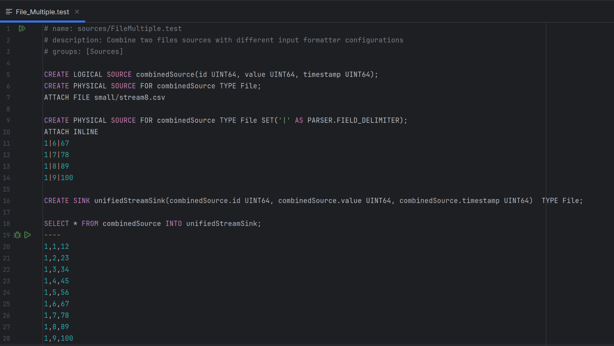

# How to Systest


## Requirements
This document assumes that you already have a working development setup for the nebulastream repository, as described in [development.md](./development.md).

## Setup
1. To set up the syntax highlighting in CLion, follow the [Syntax Highlighting Documentation](../../nes-systests/utils/SyntaxHighlighting/README.md).
2. To set up the Clion plugin for manually executing systests, follow the [Systest Plugin Documentation](../../nes-systests/utils/SystestPlugin/README.md).


## Write tests
All tests are written in custom test files of type `.test`.
These test files contain meta information about the test suite, define all required sinks and sources, provide, if necessary, the test input data, and define the actual test cases.
You can see an example test file at the top of this page.
The file begins with a brief documentation, followed by the definition of sources, sinks, and test cases via SQL statements.
Following, the individual parts are described.
Please refer to the existing `.test` files for additional examples.

### Comments
Lines that start with a hashtag (`#`) are comments and are mostly ignored by the systest. The only exception is the [documentation prefix](#documentation-prefix) at the beginning of the file.

### Documentation Prefix
Each test file starts with three lines with the following pattern:
```
# name: sources/FileMultiple.test
# description: Combine two files sources with different input formatter configurations
# groups: [Sources, Example]
```
All lines start with a hashtag indicating a [Comment](#comments).
The first line (starting with `# name:`) defines the name of the test suit, usually the relative path to the file from within the `nes-systest` folder.
The second line (staring with `#description:`) is a text that describes what the given test suit tests.
The third line (starting with `# groups:`) lists in brackets groups to which the given test suite belongs, such as "Sources", "Aggregation", or "Union". 
Groups are used to select all test cases from this group for testing, or exclude test cased from within this group when executing all other tests.   

### Sources
Sources are created via SQL statements.
These statements may be written across multiple lines, but must be concluded with a semicolon or a trailing empty line.
You need to define logical and physical sources.

Logical sources define their schema, but no data input. A query to create a logical source can look like the following:

`CREATE LOGICAL SOURCE input(id UTIN64, data FLOAT64);`.

Physical sources define concrete data inputs for logical sources. 
These can be of different types, such as file sources, TCP sources, or generator sources. 
Identical to the NES repl parser, you can optionally define parameters for the physical source. 
You can provide input data for the physical source inline (via the `ATTACH INLINE` statement directly following the physical source definition), or using a file that lies in `nes-systesst/testdata/` (via the `ATTACH FILE [path]` statement directly following the physical source definition). 
For both methods, white spaces in the tuples are not trimmed.

Examples:
```sql
# A plain file source with inline data 
CREATE PHYSICAL SOURCE FOR input TYPE File;
ATTACH INLINE
1,1.5
2,2.5
3,3.5

# A file source with a non-standard field delimiter and inline data
CREATE PHYSICAL SOURCE FOR input TYPE File SET('|' AS INPUT_FORMATTER.FIELD_DELIMITER);
ATTACH INLINE
1|1.5
2|2.5
3|3.5

# A plain file source with input data provided by a test file
CREATE PHYSICAL SOURCE FOR input TYPE File;
ATTACH FILE testdata.csv

# A generator source with no additional input data because it generates its data automatically.
CREATE PHYSICAL SOURCE FOR input TYPE Generator SET(
       'ONE' as `SOURCE`.STOP_GENERATOR_WHEN_SEQUENCE_FINISHES,
       1 AS `SOURCE`.SEED,
# Avoid using timeouts for the generator sources, it can cause flakey tests. 
#      1000000 AS `SOURCE`.MAX_RUNTIME_MS,
# Instead rely on self-terminating sequences
       'SEQUENCE UINT64 0 100 1, SEQUENCE FLOAT64 0 200 1' AS `SOURCE`.GENERATOR_SCHEMA
);
```

#### Inline Sources

Additionally, a source can be defined inline within a SQL query.
Instead of naming a source, you can create an inline source by writing `[TYPE]([OPTIONS])` (cmp. the example below).
The accepted options are mostly the same as when creating a source via a `CREATE SOURCE` statement. 
The only difference is that a schema must be given via the options `SOURCE.SCHEMA` using the `SCHEMA` function.

You cannot use the `ATTACH` statement to pipe a file or inline data into the source. 
To use a file input, use the `SOURCE.FILE_PATH` option. If no absolut path is given, the sytests framework will assume 
the test data directory of the systest as the root directory.

Example:
```sql
SELECT ID, VALUE, TIMESTAMP
FROM File(
	'small/stream8.csv' AS `SOURCE`.FILE_PATH,
	'CSV' AS INPUT_FORMATTER.`TYPE`,
	SCHEMA(id UINT64, value UINT64, timestamp UINT64) AS `SOURCE`.`SCHEMA`)
INTO output;
```

### Sinks
Sinks are also defined via SQL statements, can be written over multiple lines, and must be concluded with a semicolon or a trailing empty line.
When creating a sink, the exact expected schema and the type of the sink must be provided.

Examples:
```sql
CREATE SINK output(input.id UINT64, input.data FLOAT64) TYPE File;

CREATE SINK output2(input.id UINT64) TYPE File;

CREATE SINK output3(new_column UINT64) TYPE Checksum;
```

#### Inline Sinks
Additionally, sinks can be defined inline within a SQL query. 
Instead of naming the sink, you can create the inline sink by writing `[TYPE]([options])` (cmp. example below).
The accepted options are mostly the same as when creating a sink via a `CREATE SINK` statement.
The only difference is that a schema CAN OPTIONALLY be given via the options `SINK.SCHEMA` using the `SCHEMA` function.
If no schema is given, the schema is inferred automatically.
Inline sinks are also able to configure the output formatter via `OUTPUT_FORMATTER.*` parameters.

Because the systest framework automatically sets the sink file paths, `File` and `Generator` sinks can be created
without any options. 

Examples: 
```sql

SELECT ID, VALUE, TIMESTAMP
FROM input_source
INTO File();

SELECT ID, VALUE, TIMESTAMP
FROM input_source
INTO File(SCHEMA(ID UINT64, VALUE VARSIZE, TIMESTAMP UINT64) AS `SINK`.`SCHEMA`, FALSE AS `OUTPUT_FORMATTER`.QUOTE_STRINGS);

SELECT ID, VALUE, TIMESTAMP
FROM input_source
INTO Checksum();
```

### Test Cases

The test cases consist of SQL statements executed by NebulaStream, along with the expected results. 
The expected results can either be provided inline (separated from the test query via `----`) or via another SQL statement that is executed by NebulaStream (separated from the test query via `====`).
The provided inline data can be either the expected tabular results, or the expected error code. 

Examples:
```sql
SELECT input.id, input.data 
FROM input
INTO output1
----
1,1.5
2,2.5
3,3.5

SELECT invalid_field 
FROM input 
INTO output;
----
ERROR 2003

SELECT input.id * 1, input.data * 1 
FROM input
INTO output1
====
SELECT input.id / 1, input.data / 1
FROM input
INTO output1; 
```

## External-Dependency Tests

Some sources, sinks, and plugins need to talk to real external systems
(MQTT brokers, databases, etc.) to be exercised meaningfully. Those tests
declare an external **profile** in their header and live in the plugin's
own directory tree. The systest binary brings the profile's docker-compose
stack up before the test runs and tears it down on exit; the test itself
still runs in-process, so the CLion debug button hits breakpoints exactly
as it does for any other systest.

### When to use `# requires:`

If a test cannot pass without an external system process running, declare
the profile it needs in the test header:

```
# name: MQTTSource/MQTT.test
# description: …
# requires: mqtt
```

Exactly one `# requires:` directive is allowed per test (`mqtt`, `postgres`,
…). A test with this directive is excluded from broad discovery
(`-g <group>`, directory runs) unless the caller has already brought up the
profile and passes `--accept-requires <profile>`. Direct
`--testLocation <file>` invocations let the dispatcher bring the profile
up itself — see below.

### Co-located layout

Each plugin keeps its `.test` files and its profile next to the source
code. The MQTT plugin is the reference layout:

```
nes-plugins/Sources/MQTTSource/
├── CMakeLists.txt
├── MQTTSource.cpp
├── systest-profile/
│   ├── profile.yaml          # endpoints + profile name
│   ├── compose.snippet.yaml  # docker compose stack the dispatcher drives
│   └── mosquitto.conf        # any aux config the snippet references
└── systests/
    ├── MQTT.test             # `# requires: mqtt`
    ├── MQTT_YSB_100K.test
    └── …
```

The dispatcher locates the profile by convention (`<plugin>/systest-profile`
relative to the `.test` file). A non-standard layout can override this
with a `# profile-dir: <relative or absolute path>` directive in the test
header.

### `profile.yaml`

Declares the profile name (must match the `.test` files' `# requires:`
value) and the list of named endpoints the dispatcher allocates host
ports for. Example:

```yaml
name: mqtt
endpoints:
  - name: broker
    container_port: 1883
```

Endpoint names and the profile name must match `[A-Za-z][A-Za-z0-9_]*` —
they become env-var suffixes. `container_port` is the port the service
listens on inside its container; the dispatcher exports it as
`<NAME>_CONTAINER_PORT` so `compose.snippet.yaml` can reference it without
duplicating the number.

### Generated env vars

When dispatch fires, the following are exported into the compose stack's
environment and into the in-process test:

| Variable | Meaning |
| --- | --- |
| `PROFILE_VOLUME` | Name of a docker-managed volume populated with `systest-profile/*` (mounted into the broker container at `/profile`). |
| `NES_EXTERNAL_HOST` | Host the in-process test reaches the profile's services at — `127.0.0.1` on the host, `host.docker.internal` inside the dev-container toolchain. |
| `<NAME>_PORT` | Free host port the dispatcher allocated for the `<NAME>` endpoint (use on the host side of `compose.snippet.yaml`'s `ports:` mapping). |
| `<NAME>_CONTAINER_PORT` | Container-side port from `profile.yaml`. |
| `NES_EXTERNAL_ENDPOINT_<NAME>` | Pre-joined `<NES_EXTERNAL_HOST>:<<NAME>_PORT>` pair. Plugin registrars read this and rewrite their source's connection URI. |

### `compose.snippet.yaml`

A standalone docker-compose file: services, volumes, etc. The dispatcher
spawns it with `docker compose -p nes-systest-<profile>-<pid> -f
<snippet> up -d --wait` and tears it down on exit. The profile dir is
mounted into the broker container at `/profile`, populated from a docker
volume the dispatcher stages — this sidesteps the host-vs-dev-container
path mismatch a bind mount would hit. A minimal MQTT snippet:

```yaml
services:
  mqtt_broker:
    image: eclipse-mosquitto:2.0
    command: ["/usr/sbin/mosquitto", "-c", "/profile/mosquitto.conf"]
    volumes:
      - profile:/profile:ro
    ports:
      - "${BROKER_PORT}:${BROKER_CONTAINER_PORT}"
    healthcheck:
      test: ["CMD", "mosquitto_pub", "-h", "localhost", "-t", "healthcheck", "-m", "ok", "-q", "1"]
      interval: 5s
      timeout: 3s
      retries: 5
      start_period: 5s
      start_interval: 200ms
volumes:
  profile:
    external: true
    name: ${PROFILE_VOLUME}
```

### Registering with CTest

Add the macro to the plugin's `CMakeLists.txt` once per profile dir:

```cmake
add_external_systest_profile(
    PROFILE_DIR ${CMAKE_CURRENT_SOURCE_DIR}/systest-profile
)
```

The macro globs every `*.test` file under `<PROFILE_DIR>/../systests` (or
the optional `TEST_DIR` argument), validates each header declares the
matching `# requires: <profile-name>`, and registers one CTest entry per
file: `<profile>-<test-stem>-systest-external`. Adding a new test file
under `systests/` is automatically picked up by CI; nothing else needs
editing.

The macro is gated on `ENABLE_DOCKER_TESTS` and is a no-op otherwise, so
the call needs no `if()` guard.

### Three ways to run

| How | What happens |
| --- | --- |
| CLion gutter / `systest --testLocation <file>` | The dispatcher detects `# requires:`, brings up the profile's compose stack on a free host port, runs the test in-process, and tears the stack down. CLion's debug button hits source breakpoints normally. |
| `ctest -R '<profile>-.*-systest-external'` | Same path, driven by the macro-generated CTest entries. This is what CI runs. |
| Broad discovery (`-g <group>`, directory runs) | External tests are **filtered out** by default — they need their profile to be brought up first. Use `systest --list <dir>` to see them surfaced separately, or pass `--accept-requires <profile>` if you have already started the compose stack yourself. |

### Dev-container networking

When the systest binary runs inside the CLion docker toolchain, it
reaches the broker via `host.docker.internal` rather than `127.0.0.1`.
This requires the dev container to be started with
`--add-host=host.docker.internal:host-gateway`. The
`install-local-docker-environment.sh` script prints the exact line and
the `.claude/skills/nes-build/in-docker.sh` helper already includes the
flag. The dispatcher's post-up reachability probe fails fast with a
targeted diagnostic if the flag is missing.

## Run tests

### Via Plugin

The easiest way to run systest is the CLion Plugin.
When you have installed the plugin and open a systest file (with the ending `.test`), you see green bugs and triangles next to the test queries, and a double triangle next to very first line.
If you click the green arrow next to a test query, that specific test is automatically run, and the results are shown in a window pane below.
Clicking the green bug works similarly, but starts the query in debug mode. In debug mode, the system will pause at all breakpoints.
Alternatively, you can click the double triangle in the first line to run all test queries in the selected file.

### Systest Executable

You can also run the systest via the CMake `systest` executable either in the terminal or via your IDE such as CLion.
The executable can run individual tests, all tests in a given file, or all test files that belong to a defined group.
You can select the test cases and define the behaviour via command line arguments. 
The executable can run individual tests (`-t /path/to/test.test:1`), all tests in a given file (`-t /path/to/test.test`), or all test files that belong to a defined group (`-g group1 group2`, `-e excludedGroup`).
Tests can be run with specific configuration settings (`-- --worker.number_of_buffers_in_global_buffer_manager=10000`).
Permanent exclusions can be configured via `--disableConfigFile` (defaulting to `${TEST_CONFIGURATION_DIR}/systest-disable.yaml`) and can be ignored per run with `--ignoreDisableConfigFile`. The disable config file understands `exclude_groups` and `disabled_test_files`.
To measure the execution time of tests use the benchmark mode (`-b`).
To send queries on a remote worker use the remote mode (`-s`).
The endless mode runs tests in an infinite loop i.e. for regression testing (`--endless`).


To show all currently supported command line arguments, execute the `systest` executable with the `--help` flag.

### Topologies

The systest framework supports configurable multi-worker topologies. By default, it uses the [2-node topology](../../nes-systests/configs/topologies/two-node.yaml).

#### Specifying a Topology

Use the `--clusterConfig` flag to specify a different topology configuration:

```bash
systest --clusterConfig /path/to/config/single-node.yaml
```

#### Topology Configuration Format

Topology files are YAML documents that define the worker network structure and source/sink placement policies.

**Example: Two-Node Topology**

```yaml
workers:
  - host: "sink-node:9090"      # gRPC control-plane address; used as worker identity (format: hostname:port)
    max_operators: 10000         # Maximum concurrent operator slots on this worker; use Unlimited for no cap
  - host: "source-node:9090"    # gRPC control-plane address of this source worker
    max_operators: 100           # Smaller capacity for edge/source nodes with limited resources
    downstream:
      - "sink-node:9090"         # gRPC address of the downstream worker for data routing

allow_source_placement:
  - "source-node:9090"           # Workers eligible for source operator placement (gRPC addresses)

allow_sink_placement:
  - "sink-node:9090"             # Workers eligible for sink operator placement
  - "source-node:9090"
```

**Configuration Fields:**

| Field | Description |
|-------|-------------|
| `workers[].host` | Worker data plane address (format: `hostname:port`) |
| `workers[].grpc` | Worker control plane address (format: `hostname:port`) |
| `workers[].max_operators` | Maximum concurrent operator slots on this worker (integer or Unlimited) |
| `workers[].downstream` | Optional list of downstream workers for data routing |
| `allow_source_placement` | Workers eligible for source placement (defaults to all workers if omitted) |
| `allow_sink_placement` | Workers eligible for sink placement (defaults to all workers if omitted) |

#### Automatic Source/Sink Placement

To keep tests portable across topologies, the systest framework automatically assigns physical sources and sinks to workers based on the topology configuration.

**Placement Strategy:**
- Sources are placed on workers listed in `allow_source_placement`
- Sinks are placed on workers listed in `allow_sink_placement`

This allows tests to be topology-agnostic and run on both single-node and distributed configurations without modification.

#### Explicit Worker Assignment

For tests that require specific worker placement, use the `SOURCE.HOST` and `SINK.HOST` options:

**Named Sources and Sinks:**

```sql
CREATE LOGICAL SOURCE nameStream(firstName VARSIZED, lastName VARSIZED);

CREATE PHYSICAL SOURCE FOR nameStream
TYPE File
SET("sink-node:9090" AS `SOURCE`.`HOST`);
ATTACH INLINE
Alice,Smith
Bob,Jones

CREATE SINK firstNameLastNameSink(firstNameLastName VARSIZED)
TYPE File
SET("sink-node:9090" AS `SINK`.`HOST`);

SELECT CONCAT(firstName, lastName) AS firstNameLastName
FROM nameStream
INTO firstNameLastNameSink;
----
AliceSmith
BobJones
```

**Inline Sources and Sinks:**

```sql
SELECT id, value, timestamp
FROM File(
    'small/stream8.csv' AS `SOURCE`.FILE_PATH,
    'source-node:9090' AS `SOURCE`.`HOST`,
    'CSV' AS INPUT_FORMATTER.`TYPE`,
    SCHEMA(id UINT64, value UINT64, timestamp UINT64) AS `SOURCE`.`SCHEMA`)
INTO File(
    'sink-node:9090' AS `SINK`.`HOST`,
    'CSV' AS `SINK`.`INPUT_FORMAT`);
----
1,100,1000
2,200,2000
3,300,3000
```

> [!NOTE]
> Explicit worker assignment overrides the automatic placement strategy. Use this for tests that specifically validate distributed query execution or data routing.

### Remote Tests

By default, systest runs all workers embedded within a single process, using in-memory communication channels for multi-worker topologies. Compared to remote tests with real network overhead, this provides faster test execution and simplified debugging.

#### Running Against Remote Workers

To test against actual distributed workers, use the `--remote` flag. The systest framework will connect to workers at the gRPC addresses specified in the topology configuration.

**Example: Single Remote Worker**

```bash
# Terminal 1: Start a worker
cmake-build-debug/nes-single-node-worker/nes-single-node-worker --grpc=localhost:8080

# Terminal 2: Run systest against the remote worker
cmake-build-debug/nes-systest/nes-systest \
    --clusterConfig nes-systests/configs/topologies/single-node.yaml \
    --remote
```

> [!NOTE]
> When using remote mode, ensure:
> - All workers are reachable at the addresses specified in the topology config
> - Workers are started with the correct `--grpc` addresses
> - Network connectivity exists between systest and all workers
> - If using Docker, workers must be in the same network or properly exposed

#### Docker-Based Remote Testing

For complex multi-worker topologies, use Docker Compose to orchestrate the cluster. The [systest-remote-test](../../nes-systests/systest/remote-test/systest_remote_test.bats) demonstrates this approach:

1. The test generates a `docker-compose.yaml` from the topology configuration
2. Docker Compose starts all workers in containers
3. Systest runs in remote mode against the containerized cluster
4. Cleanup happens automatically after test completion

**Requirements:**
- Enable Docker tests during build: `-DENABLE_DOCKER_TESTS=ON`
- Docker and Docker Compose must be installed
- Sufficient system resources for multiple worker containers

**Example Test Invocation:**

```bash
# Build with Docker support
cmake -B build -DENABLE_DOCKER_TESTS=ON
cmake --build build

# Run Docker-based remote tests
cd build
ctest -R systest-remote-test -V
```

The Docker approach provides the most realistic testing environment for distributed deployments, validating network communication, serialization, and multi-node query execution.

> [!NOTE]
> If you are using a Docker-based development environment, you must provide access to the Docker daemon (e.g., by mounting the Docker socket). Otherwise, Docker-based tests are disabled.
