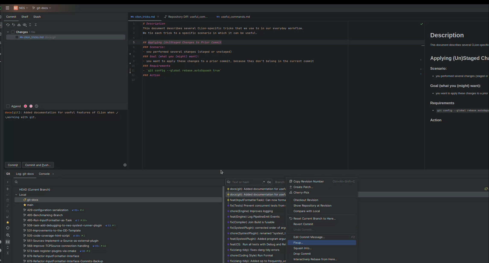
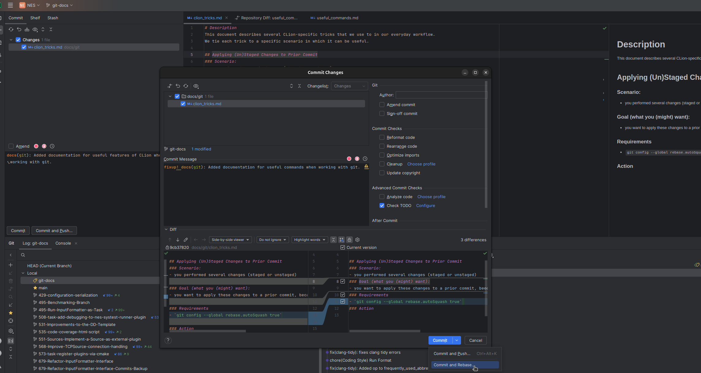
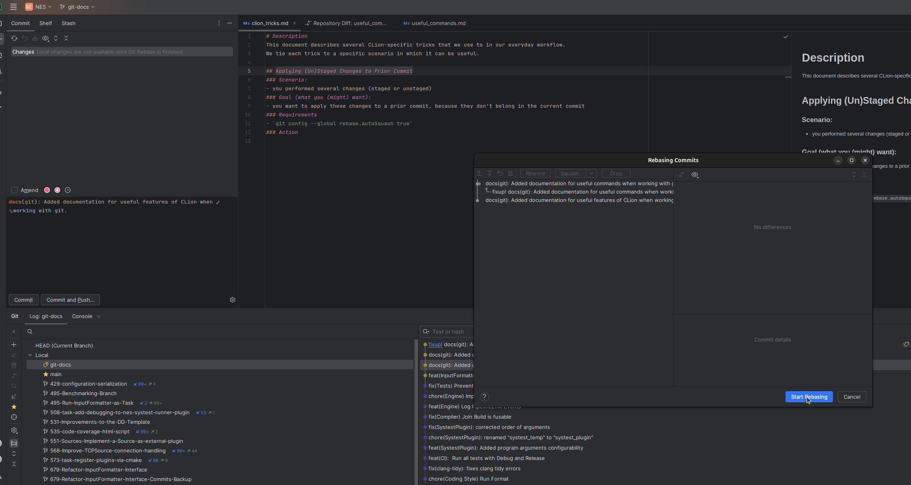

# Description
This document describes several CLion-specific tricks that we use in our everyday workflow. 
We tie each trick to a specific scenario in which it can be useful.

## Applying (Un)Staged Changes to Prior Commit
### Scenario:
- you performed several changes (staged or unstaged)
### Goal (what you (might) want):
- you want to apply these changes to one of your prior commits, because they don't belong in the current commit (HEAD)
### Requirements
- `git config --global rebase.autoSquash true`
### Action
- in the git-menu (branch symbol bottom-left) make sure you selected your active branch
- right click the commit that you want to apply your changes to and choose `Fixup..`

- make sure to change from `Commit (and Push..)` to `Commit and Rebase..`

- click on `Start Rebasing`

