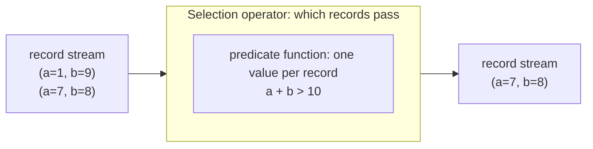

# How to add a `Function`

## 1. What is a Function

A function computes a single value from a record.
It reads field values and constants, applies some logic, and returns one value.
Examples are `a + b`, `CHAR_LENGTH(name)`, and the CASE WHEN expression used as the example in this guide.

Functions appear inside operators.
The predicate of a Selection is a function that returns a boolean.
Each output column of a Projection is a function.
A join or aggregation uses functions to express keys and aggregated values.
Without functions an operator could only pass fields through unchanged, so functions are how a query expresses computation over the data.

### Function versus Operator

An operator and a function work at different levels.

- An operator transforms a stream of records. It decides which records pass, and how they are grouped, joined, filtered, or combined. Its input and output are records.
- A function transforms values inside a single record. Its input is one or more values and its output is one value. It has no view of the stream.

Operators contain functions.
A Selection operator holds one predicate function.
A Projection operator holds one function per output field.
When you add arithmetic, a comparison, or a string operation to the system, you add a function, not an operator.



The operator sees the stream, the function sees one record and produces one value.

## 2. Logical and Physical Functions

A function has two representations, and you implement both.

The logical function is used during query planning and optimization.
It knows its child functions and its result data type.
Given the schema of the input, it infers the result type of the expression, which is how the enclosing operator computes its own output schema.
The logical function answers two questions: what is the type of this expression, and is the expression valid.

The physical function is used during query compilation and execution.
It defines the execution semantics: given a record at runtime, produce the result value.
It is lowered from the logical function and compiled by nautilus into executable code.
The physical function answers one question: how is the value computed.

Two representations exist because planning and execution need different information.
Planning works on types and structure and never touches record values.
Execution works on record values and never reasons about schemas.
Keeping them apart means the optimizer stays independent of the runtime, and the runtime stays free of planning concerns.
The two connect by name: lowering looks up the physical function using the logical function's registry key, so the names must match.

## 3. Overview

Function plugins are implemented in the `nes-plugins/Functions/` directory.
For each new function, create a new directory, such as `nes-plugins/Functions/Conditional/`.
This directory contains both the logical and the physical function.
For our example, we use the following structure:

```
nes-plugins/
├── Functions/
│   ├── Conditional/
│   │   ├── CMakeLists.txt
│   │   ├── ConditionalLogicalFunction.cpp
│   │   ├── ConditionalPhysicalFunction.cpp
│   │   ├── ConditionalLogicalFunctionTest.cpp
│   │   └── include/
│   │       └── Functions/
│   │           ├── ConditionalLogicalFunction.hpp
│   │           └── ConditionalPhysicalFunction.hpp
│   └── ...
├── Rules/
├── Sinks/
├── Sources/
└── ...
```

## 4. Plugin Registration

Registering a function plugin consists of:
1) The registration of the logical function
2) The registration of the logical function unreflection, which rebuilds the function from a serialized plan
3) The registration of the physical function
4) The registration of the defined unit tests
5) The activation of the function plugin

The following is the commented `CMakeLists.txt` file for the Conditional function plugin.

```cmake
# Load Plugin Registry Utils
include(${PROJECT_SOURCE_DIR}/cmake/PluginRegistrationUtil.cmake)
include(${PROJECT_SOURCE_DIR}/cmake/UnreflectionRegistrationUtil.cmake)

# 1) Register the logical function with the LogicalFunction registry owned by nes-logical-operators.
add_plugin_as_library(
        Conditional                         # Plugin name, also the name used in a query and for lowering
        LogicalFunction                     # Registry name
        ConditionalLogicalFunctionPlugin    # Plugin library name
        ConditionalLogicalFunction.cpp)     # List of source files
target_include_directories(ConditionalLogicalFunctionPlugin PUBLIC include PRIVATE .)

# The logical function serializes itself through reflectcpp, so link the library.
find_package(reflectcpp CONFIG REQUIRED)
target_link_libraries(ConditionalLogicalFunctionPlugin PRIVATE reflectcpp::reflectcpp)

# 2) Register unreflection, which reconstructs the logical function from a serialized plan.
# The generated glue includes the concrete header by its base name, so the header directory
# is added to the shared unreflection glue library include path.
add_unreflection_plugin(LogicalFunction Conditional)
get_property(logical_function_unreflection_glue GLOBAL PROPERTY "LogicalFunction_UNREFLECTION_GLUE_LIB")
target_include_directories(${logical_function_unreflection_glue} PRIVATE ${CMAKE_CURRENT_SOURCE_DIR}/include/Functions)

# 3) Register the physical function with the PhysicalFunction registry owned by nes-physical-operators.
add_plugin_as_library(
        Conditional                         # Plugin name, must match the logical function name
        PhysicalFunction                    # Registry name
        ConditionalPhysicalFunctionPlugin   # Plugin library name
        ConditionalPhysicalFunction.cpp)    # List of source files
target_include_directories(ConditionalPhysicalFunctionPlugin PUBLIC include PRIVATE .)

# 4) Register Tests
if (NES_ENABLES_TESTS)
    add_nes_unit_test(conditional-logical-function-test ConditionalLogicalFunctionTest.cpp)
    target_link_libraries(conditional-logical-function-test ConditionalLogicalFunctionPlugin nes-logical-operators nes-test-util reflectcpp::reflectcpp)
    target_include_directories(conditional-logical-function-test PRIVATE include)
endif ()
```

To activate the plugin, add the line `activate_optional_plugin("Functions/Conditional" ON)` to `nes-plugins/CMakeLists.txt`.

For a detailed explanation of the plugin system, CMake macros, and how registries work, see [guide/extensibility.md](extensibility.md).

## 5. Interface

A logical function can be any object that defines the following constant and methods:

```cpp
/// Name of the function, used as the registry key in a query and during lowering
static constexpr std::string_view NAME = "NameOfFunction";

/// Textual representation of the function
std::string explain(ExplainVerbosity verbosity) const;

/// Child functions of this function
std::vector<LogicalFunction> getChildren() const;

/// Result data type of the function
DataType getDataType() const;

/// New function with the given children
T withChildren(const std::vector<LogicalFunction>& children) const;

/// New function with the result type inferred from the input schema.
/// This is the place to validate argument types and report invalid user input.
LogicalFunction withInferredDataType(const Schema<Field, Unordered>& schema) const;

/// The registry key of the function, usually NAME
std::string_view getType() const;

/// Equality operator
bool operator==(const T& other) const;
```

To confirm the interface, add `static_assert(LogicalFunctionConcept<T>);`.

The logical function also needs a `Reflector<T>` and an `Unreflector<T>` so a plan can be serialized and read back.
See `ConditionalLogicalFunction.hpp` and `ConditionalLogicalFunction.cpp` for the reflection code.

A physical function can be any object that defines the following method:

```cpp
/// Evaluate the function on a record and return the result
VarVal execute(const Record& record, ArenaRef& arena) const;
```

To confirm the interface, add `static_assert(PhysicalFunctionConcept<T>);`.

## 6. Type Inference in the Logical Function

`withInferredDataType` receives the input schema, which lists the fields available to the function together with their types.
It returns a copy of the function with a known result type, and it validates the arguments along the way.

For the Conditional function it works in three steps.
First it infers the type of the default result, which is the type of the whole expression.
A field access child resolves its type from the schema, and a nested function infers its own type.
Second it infers the type of every condition and every branch result the same way.
Third it checks that every condition is BOOLEAN and every branch result has the same type as the default.
A mismatch comes from the user's query, so it throws a query error rather than an assertion.

```cpp
LogicalFunction ConditionalLogicalFunction::withInferredDataType(const Schema<Field, Unordered>& schema) const
{
    /// The default result carries the type of the whole expression.
    const auto inferredElseCase = elseCase.withInferredDataType(schema);
    const auto& resultType = inferredElseCase.getDataType();

    std::vector<WhenThenLogicalFunction> inferredWhenThens;
    inferredWhenThens.reserve(whenThens.size());
    for (const auto& [when, then] : whenThens)
    {
        auto inferredWhen = when.withInferredDataType(schema);
        auto inferredThen = then.withInferredDataType(schema);
        if (not inferredWhen.getDataType().isType(DataType::Type::BOOLEAN))
        {
            throw DifferentFieldTypeExpected("CASE WHEN condition must be BOOLEAN, but got {}", inferredWhen.getDataType());
        }
        if (inferredThen.getDataType() != resultType)
        {
            throw DifferentFieldTypeExpected(
                "CASE WHEN results must all share the default result's type {}, but got {}", resultType, inferredThen.getDataType());
        }
        inferredWhenThens.push_back(WhenThenLogicalFunction{.when = std::move(inferredWhen), .then = std::move(inferredThen)});
    }

    auto inferred = ConditionalLogicalFunction{std::move(inferredWhenThens), inferredElseCase};
    inferred.dataType = resultType;
    return inferred;
}
```

Type inference is the only place that assigns the result type.
A constructor leaves it alone, because before a schema is known there is nothing to infer from, so `getDataType()` reports a usable type only after inference has run.
The enclosing operator reads that type to build its output schema.
For example a Projection that outputs this function as a column needs to know the column's type, and it gets it from here.

## 7. Execution in the Physical Function

`execute` defines the runtime semantics of the function.
It receives one record and an arena for allocations, and returns the computed value as a `VarVal`.
nautilus traces this method to compile it into executable code, so the control flow you write becomes the control flow of the compiled query.

For the Conditional function, `execute` evaluates the conditions in order and returns the result of the first condition that holds, or the default if none hold.
`when.execute(record, arena)` returns a `VarVal` that serves as the branch condition.
`nautilus::static_iterable` walks the pairs at compile time, because the number of pairs is fixed once the function has been lowered, so the loop becomes a straight sequence of branches in the compiled code.

```cpp
VarVal ConditionalPhysicalFunction::execute(const Record& record, ArenaRef& arena) const
{
    for (const auto& [when, then] : nautilus::static_iterable(whenThens))
    {
        if (when.execute(record, arena))
        {
            return then.execute(record, arena);
        }
    }
    return elseCase.execute(record, arena);
}
```

The child functions are themselves physical functions, so calling `execute` on a child evaluates a nested expression.
This is how a function such as `a + CHAR_LENGTH(name)` composes at runtime.

## 8. Registration Functions

Each part needs a registration function so NebulaStream can instantiate it.

The logical registration function follows the pattern
`LogicalFunctionRegistryReturnType LogicalFunctionGeneratedRegistrar::Register<PLUGIN_NAME>LogicalFunction(LogicalFunctionRegistryArguments)`,
where `<PLUGIN_NAME>` equals the plugin name defined in the plugin's CMakeLists.txt file.
The arguments carry the child functions parsed from the query.
Argument count and other user input reach this function directly, so report a bad count as a query error rather than an assertion.

```cpp
LogicalFunctionRegistryReturnType
LogicalFunctionGeneratedRegistrar::RegisterConditionalLogicalFunction(LogicalFunctionRegistryArguments arguments)
{
    if (arguments.children.size() < 3 or arguments.children.size() % 2 == 0)
    {
        throw CannotDeserialize(
            "Conditional requires an odd number of arguments >= 3 (condition/result pairs plus a default), but got {}",
            arguments.children.size());
    }
    return ConditionalLogicalFunction{arguments.children};
}
```

The physical registration function follows the pattern
`PhysicalFunctionRegistryReturnType PhysicalFunctionGeneratedRegistrar::Register<PLUGIN_NAME>PhysicalFunction(PhysicalFunctionRegistryArguments)`.
The plugin name must match the logical function name, because lowering looks up the physical function by the logical function's registry key.
The logical function already validated the argument shape, so a bad shape here is a lowering bug and a precondition fits.

```cpp
PhysicalFunctionRegistryReturnType
PhysicalFunctionGeneratedRegistrar::RegisterConditionalPhysicalFunction(PhysicalFunctionRegistryArguments arguments)
{
    PRECONDITION(
        arguments.childFunctions.size() >= 3 and arguments.childFunctions.size() % 2 == 1,
        "ConditionalPhysicalFunction requires an odd number of child functions >= 3, but got {}",
        arguments.childFunctions.size());
    return ConditionalPhysicalFunction{std::move(arguments.childFunctions)};
}
```

## 9. Example and Tests

The `Conditional` function used throughout this guide implements a CASE WHEN expression.
It evaluates condition and result pairs in order and returns the first matching result, or a trailing default.
Both representations store the branches as (condition, result) pairs plus the default result, so the shape is correct by construction.
The generic child list interface flattens them into `[condition1, result1, ..., default]` and regroups them on the way back, which the type inference and the execution sections above show in full.

Last, it is good practice to define tests for the function.
See `ConditionalLogicalFunctionTest.cpp` for unit tests, and `nes-systests/function/Conditional.test` for end to end tests that run queries against the function.
Which layer a given test belongs in, and what each layer is expected to cover, is described in [standards/testing_guidelines.md](../standards/testing_guidelines.md).
