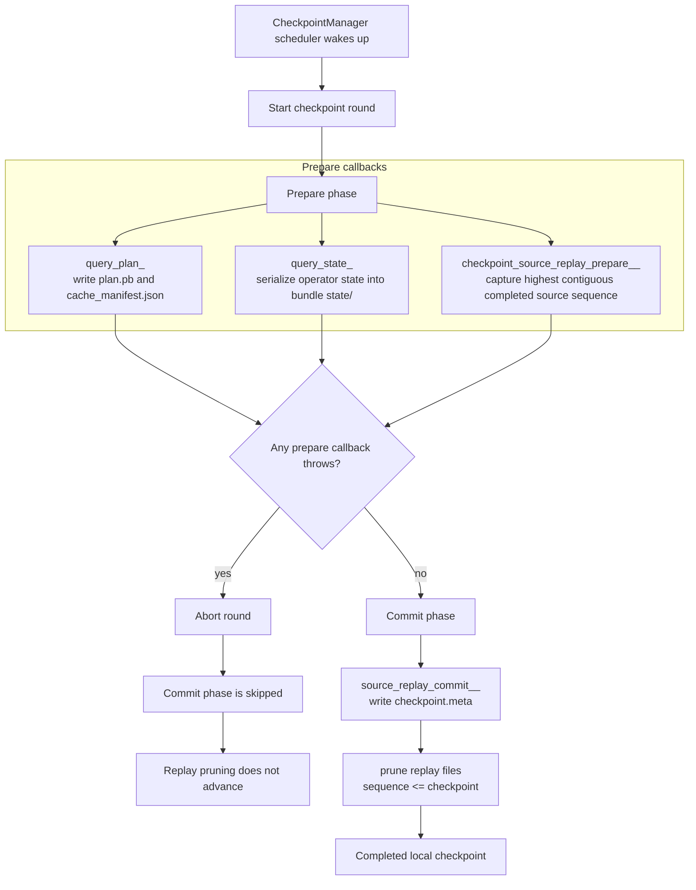
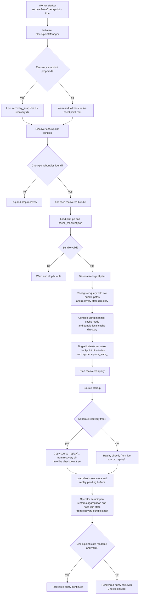

# Checkpointing and Recovery

This document describes the current checkpointing and recovery design in NebulaStream as implemented in the codebase today.
It is intentionally implementation-oriented and focuses on the single-node worker path, local filesystem state, and the interaction between source replay, query metadata, and operator-local state.

## Scope

The current mechanism is designed to recover a worker after a restart by reconstructing:

- query plans and query-local compilation cache state
- source replay progress and uncommitted source buffers
- operator state for stateful operators that explicitly serialize their internal state

The implementation is process-local. It is not a distributed checkpoint protocol and does not coordinate durable commit with external sinks.

## Core Idea

The system persists two different kinds of runtime state:

1. Global source replay state under the checkpoint root. This allows sources to replay buffers that were emitted before a crash but not yet covered by a completed checkpoint.
2. Query-local state inside a per-query checkpoint bundle. This stores the serialized query plan, compilation-cache metadata, and operator state for aggregation and hash join handlers.

Periodic checkpoints are driven by `CheckpointManager`, which executes a two-phase callback round:

1. `Prepare`: persist query metadata, serialize operator state, and capture source progress.
2. `Commit`: advance the source replay checkpoint and prune replay files that are now covered.

That split is important. Operator state is written before source replay files are pruned.

## High-Level Components

### `CheckpointManager`

`CheckpointManager` owns:

- the live checkpoint root directory
- the startup recovery snapshot directory `.recovery_snapshot/`
- the periodic checkpoint scheduler
- the registry of `Prepare` and `Commit` callbacks

All registered callbacks are process-local. On each checkpoint interval, the manager snapshots the callback lists, runs all prepare callbacks, then runs all commit callbacks.
Within each phase, callbacks currently execute in stable identifier order because the registries are stored in `std::map`.

Callback replacement and unregistration are cancellation-aware: removing or replacing a callback waits for any active invocation to finish and prevents later invocations of the cancelled entry, even if that entry was already copied into the current round snapshot.

Files written through `CheckpointManager::persistFile(...)` use a temp file plus atomic rename.

Callback failures are not isolated. If any callback throws, the current round stops immediately. In particular, a throwing prepare callback prevents the commit phase from running at all. The periodic scheduler thread does not catch callback exceptions today, so an uncaught exception in a scheduled round can currently terminate the worker process.

### `SingleNodeWorker`

`SingleNodeWorker` is responsible for query bundle management:

- creating a bundle name `plan_<queryId>_<fingerprint>`
- computing the bundle fingerprint from a canonical deterministic serialization of the query plan that ignores `queryId`
- persisting `plan.pb`
- persisting `cache_manifest.json`
- selecting the bundle-local compilation-cache directory for reuse (default `cache/`, but stored in the manifest as a relative bundle path)
- wiring bundle-local `state/` and recovery `state/` directories into stateful operator handlers
- registering the query-level prepare callback `query_state_<queryId>`
- scanning and recovering checkpoint bundles during worker startup
- preserving recovered query IDs and advancing the fresh-query allocator past the recovered range

Recovery is done at startup when `recoverFromCheckpoint=true`.

### `NodeEngine`

`NodeEngine` registers compiled query plans, tracks query lifecycle, and starts executable plans. It is no longer responsible for checkpoint-specific handler wiring or callback registration.

### Query Compiler and `PipelinedQueryPlan`

The query compiler gives operator handlers stable IDs so that checkpoint filenames remain stable across recompilation of the same query.
Concretely, if a physical plan already contains handler IDs, the compiler preserves their namespace and continues allocation after the highest existing ordinal.
Otherwise it seeds a stable namespace from the query's original SQL text and allocates monotonically increasing ordinals within that namespace.

The current `PipelinedQueryPlan` implementation recursively traverses each root pipeline's successor graph and collects stateful handlers from all reachable pipelines, not only the root pipelines. This is required because aggregation build pipelines and hash-join build pipelines are often non-root successor pipelines.

### Sources and `ReplayableSourceStorage`

Each source uses `ReplayableSourceStorage` when checkpointing or recovery is enabled.

It persists replayable tuple buffers under a source-specific directory and keeps a `checkpoint.meta` file with the highest checkpointed sequence number. During recovery, the source restores replay storage from the configured recovery directory and replays files whose sequence number is greater than the checkpointed sequence.
Unlike bundle metadata persisted through `CheckpointManager::persistFile(...)`, replay files and `checkpoint.meta` are written directly by `ReplayableSourceStorage`.

### Stateful Operators

Today, the explicit operator-state checkpoint implementations are:

- aggregation
- hash join

Both operators:

- restore from `getCheckpointRecoveryDirectory()`
- serialize to `getCheckpointDirectory()`
- protect checkpointed state with the `OperatorHandler` checkpoint state lock
- fail recovery if the checkpoint file exists but cannot be read or validated

Aggregation and hash join also serialize once during operator termination when checkpointing is enabled, in addition to the periodic query-level prepare callback.

That failure mode is deliberate: once source replay has pruned buffers covered by a completed checkpoint, silently replaying from an earlier point would lose state. In the current implementation, that failure is fatal for the affected query, but not for the whole worker.

## On-Disk Layout

The checkpoint root contains global replay state and one directory per query bundle.

```text
<checkpoint-root>/
  .recovery_snapshot/
    source_replay/
    plan_<queryId>_<fingerprint>/
      plan.pb
      cache_manifest.json
      cache/
      state/
  source_replay/
    origin_<originId>_ps_<physicalSourceId>/
      checkpoint.meta
      00000000000000000001.bin
      00000000000000000002.bin
      ...
  plan_<queryId>_<fingerprint>/
    plan.pb
    cache_manifest.json
    cache/
    state/
      aggregation_hashmap_<handlerId>.bin
      hash_join_checkpoint_<handlerId>_left.bin
      hash_join_checkpoint_<handlerId>_right.bin
```

The cache directory shown above is the default layout. The manifest can point recovery at a different relative cache directory inside the bundle.

### Bundle Contents

`plan.pb`

- serialized query plan used for re-registration during recovery

`cache_manifest.json`

- bundle format version
- compilation cache mode
- relative cache directory name
- deterministic plan fingerprint

Recovery requires all of those fields to be present in the current manifest schema. Bundles with incomplete manifests are treated as invalid and skipped.

`cache/` (default) or another manifest-selected relative cache directory

- optional compilation cache artifacts for the query

`state/`

- serialized operator state for stateful handlers in the query

### Source Replay Layout

Replay files live outside query bundles in the global `source_replay/` tree because replay is source-based rather than query-bundle-based.

Each persisted replay buffer stores:

- sequence number
- chunk number
- `lastChunk`
- payload size
- raw buffer bytes

`checkpoint.meta` stores the highest sequence number covered by the last committed checkpoint for that source.

## Registration and Checkpoint Flow

### 1. Worker initialization

When a `SingleNodeWorker` starts, it initializes `CheckpointManager` with:

- the checkpoint root directory
- the checkpoint interval
- whether recovery is enabled

If recovery is enabled, `CheckpointManager` first tries to create a full copy of the current checkpoint root into:

```text
<checkpoint-root>/.recovery_snapshot
```

Recovery normally reads from this snapshot, not from the live directory. This isolates startup recovery from new writes performed by the restarted worker.

Snapshot creation is best-effort. If preparing `.recovery_snapshot/` fails, `CheckpointManager` logs a warning and `getCheckpointRecoveryDirectory()` falls back to the live checkpoint directory. Recovery still proceeds, but without snapshot isolation.

### 2. Query registration

When a query is registered:

1. The query is serialized to `plan.pb`.
2. If the logical plan already has a `queryId`, that `queryId` is stored in `plan.pb`.
3. A deterministic plan fingerprint is computed from the canonicalized serialized plan while ignoring `queryId`.
4. A bundle directory `plan_<queryId>_<fingerprint>` is chosen if checkpointing is enabled.
5. The query compiler optionally uses the bundle-local compilation-cache directory (normally `cache/`) as compilation cache.
6. `SingleNodeWorker` wires the live bundle `state/` directory and the recovery bundle `state/` directory into every collected stateful handler.
7. `SingleNodeWorker` registers `query_state_<queryId>` as a prepare callback.
8. `NodeEngine` registers the compiled query plan.
9. If periodic checkpointing is enabled and a checkpoint bundle exists, `SingleNodeWorker` persists `plan.pb` and `cache_manifest.json` immediately and also registers `query_plan_<queryId>` as a prepare callback so they are refreshed on each checkpoint round.
10. During recovery-only startup without periodic checkpointing, the existing bundle files are reused as-is; they are not rewritten during registration.

### 3. Source startup

When a source starts with checkpointing or recovery enabled:

1. It derives its replay directory `source_replay/origin_<originId>_ps_<physicalSourceId>`.
2. During recovery, if a separate recovery snapshot tree is available, it restores that directory from the recovery copy.
3. It loads `checkpoint.meta` to find the last checkpointed sequence number.
4. It replays any persisted files whose sequence number is newer than that checkpoint.
5. It resumes fresh sequence generation after the largest restored or replayed sequence.

Replay files are written continuously as source buffers are emitted. The periodic checkpoint controls when those replay files become durable checkpoint coverage and can be pruned.

### 4. Periodic checkpoint round

Every interval, `CheckpointManager` runs:

1. All prepare callbacks.
2. All commit callbacks.

The important prepare callbacks are:

- `query_plan_<queryId>`
  - writes `plan.pb` and `cache_manifest.json`
- `query_state_<queryId>`
  - serializes each stateful handler into the bundle-local `state/`
- `checkpoint_source_replay_prepare_<originId>_<physicalSourceId>`
  - stores the highest contiguous completed sequence number from `SourceCheckpointProgress`

The important commit callbacks are:

- `source_replay_commit_<originId>_<physicalSourceId>`
  - writes `checkpoint.meta`
  - prunes replay files with `sequence <= checkpoint`



### 5. Operator-state serialization

Aggregation and hash join serialize with a write lock on the handler checkpoint state.
Normal execution uses the corresponding shared lock when accessing checkpoint-protected state.

Current file granularity is:

- aggregation: one file per handler, containing one merged hash map snapshot per active slice
- hash join: one file per handler and build side, containing per-slice and per-worker hash map state

Both implementations write to a temp file and then atomically rename it into place.
If there is no active state to persist, the operator removes the existing checkpoint file.

## Recovery Flow

Startup recovery is handled entirely by `SingleNodeWorker::recoverCheckpointBundles(...)`.

### 1. Discover bundles

The worker scans:

- directories in `<recovery-dir>/` that contain both `plan.pb` and `cache_manifest.json` for current-format bundles

`<recovery-dir>` is usually `.recovery_snapshot/`, but may be the live checkpoint root if snapshot preparation failed.
Current-format bundles are expected to be named `plan_<queryId>_<fingerprint>`. Recovery parses that directory name to recover the stable bundle query ID and skips bundles whose names do not match the expected format.

Recovery supports multiple queries in one startup pass. Bundles are processed sequentially. Bundles with a missing or invalid `plan.pb` or `cache_manifest.json` are skipped with warnings rather than aborting the whole startup recovery pass.

### 2. Re-register each recovered query

For each recovered bundle:

1. Load `plan.pb` from the recovery bundle.
2. Deserialize it back into a logical plan.
3. Determine the recovered query ID:
   - prefer the `queryId` stored in `plan.pb`
   - fall back to the `<queryId>` parsed from the bundle directory name for older bundles that predate `queryId` persistence
4. Re-register the query with:
   - live bundle paths for `plan.pb`, `cache_manifest.json`, the manifest-selected cache directory, and live `state/`
   - recovery bundle paths for read-only recovery state
5. Recompile the query using the manifest's stored compilation-cache mode and bundle-local cache directory.
6. Register the compiled query with `NodeEngine` under that recovered query ID.
7. Advance the fresh-query allocator to at least `max(recovered query id) + 1` so newly registered queries do not collide with recovered ones.
8. Start the recovered query.

If the manifest fingerprint differs from the fingerprint recomputed from the recovered serialized plan, recovery logs a warning and continues to reuse the manifest fingerprint for the existing bundle.

Recovered queries keep their stable persisted query IDs. The existing bundle directory is reused as-is and is not renamed during recovery.

If registration or startup of one recovered bundle fails, the worker logs a warning and continues with the remaining bundles.

This means recovery reads from recovery state and writes new checkpoints back into the live checkpoint tree.

### 3. Restore source replay state

Before sources emit fresh data, each source:

1. If recovery reads from a separate snapshot tree, it copies its replay directory from `<recovery-dir>/source_replay/...` into the live `source_replay/...`.
2. It loads the checkpointed sequence number from `checkpoint.meta`.
3. It replays persisted buffers newer than the checkpoint.

If snapshot preparation failed and recovery falls back to the live checkpoint root, the source replays directly from the live replay directory without a copy step.

This reconstructs the post-checkpoint, pre-crash tail of source input.

### 4. Restore operator state

Aggregation and hash join restore their internal state from the recovery bundle `state/` directory during operator setup/open.

Restore is keyed by stable `OperatorHandlerId`, which is why deterministic handler IDs matter.

If a checkpoint file does not exist, the operator simply starts from empty state.
If a checkpoint file exists but is unreadable, has the wrong format, or is otherwise inconsistent, recovery fails with `CheckpointError`, and the recovered query transitions to failed state rather than silently replaying past the last committed checkpoint.



## Consistency Model

On a successful checkpoint round, the current design gives a local consistency point with two guarantees:

1. All prepare callbacks finish before any commit callback runs.
2. Replay pruning only happens in the commit phase.

Within the prepare phase, the implementation does not rely on a specific ordering between query metadata persistence, operator-state serialization, and source-progress capture, even though callbacks currently execute in stable identifier order.

Failure handling is coarse-grained rather than per-callback: an exception aborts the round immediately. A prepare-phase exception means no commit callbacks run, so replay pruning does not advance for that round.

The design intent is that the system never prunes replay files for data that is not yet represented either in:

- serialized operator state, or
- replay files newer than the committed checkpoint

This is not a transactional, cross-process protocol. It is a best-effort local consistency mechanism built around ordered callbacks and atomic file replacement.

## Important Current Properties

- Recovery normally uses a startup snapshot `.recovery_snapshot/` so reads are isolated from live rewrites.
- Query state is bundle-local under `<bundle>/state/`.
- Source replay state is global under `<checkpoint-root>/source_replay/`.
- Multiple queries can be recovered in one worker startup.
- Stateful handler collection is recursive across the full pipeline graph, so non-root aggregation and hash-join pipelines participate in checkpointing.
- Checkpoint-enabled query registrations persist plans and manifests immediately and refresh them during checkpoint rounds.
- Startup recovery is best-effort per bundle: invalid bundles are skipped, while corrupt operator-state checkpoints fail the affected query.
- Recovered queries keep their persisted query IDs, with a bundle-name fallback for older checkpoints that do not yet store `queryId` in `plan.pb`.

## Current Limitations

- The mechanism is single-node and process-local. There is no distributed barrier or cluster-wide recovery protocol.
- Recovery is sequential across bundles, not parallel.
- Only operators with explicit serialization support participate in operator-state checkpointing.
- A corrupt aggregation or hash-join checkpoint is treated as fatal for that query's recovery path because replay fallback may already be impossible after pruning.
- If recovery snapshot preparation fails, recovery falls back to the live checkpoint root and loses isolation from concurrent rewrites.
- Replayable source buffers and `checkpoint.meta` are written directly rather than via temp-file atomic rename, so their write-path durability semantics are weaker than `plan.pb`, `cache_manifest.json`, and operator checkpoint files.
- Source replay stores raw buffer bytes plus sequence metadata, so schema and operator compatibility across software changes still matter.
- Scheduled checkpoint callback failures are not sandboxed from the runtime today; an uncaught exception can abort the checkpoint round and terminate the worker process.

## Existing Test Coverage

The current design is exercised by tests that cover:

- checkpoint manager callback behavior
- callback unregister/replacement behavior during checkpoint rounds
- source replay checkpoint progress
- compilation-cache-aware recovery
- recovery of multiple checkpointed queries in one restart
- failure on corrupted aggregation checkpoints
- failure on corrupted hash-join checkpoints

These tests validate the intended split between source replay recovery and bundle-local operator-state recovery.
