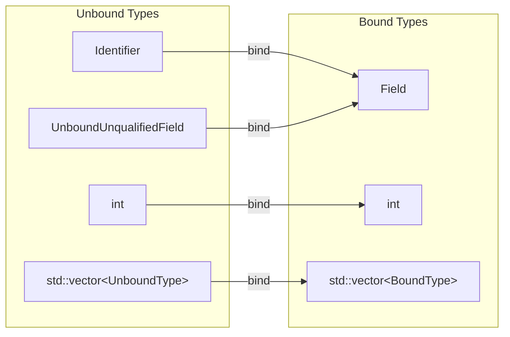
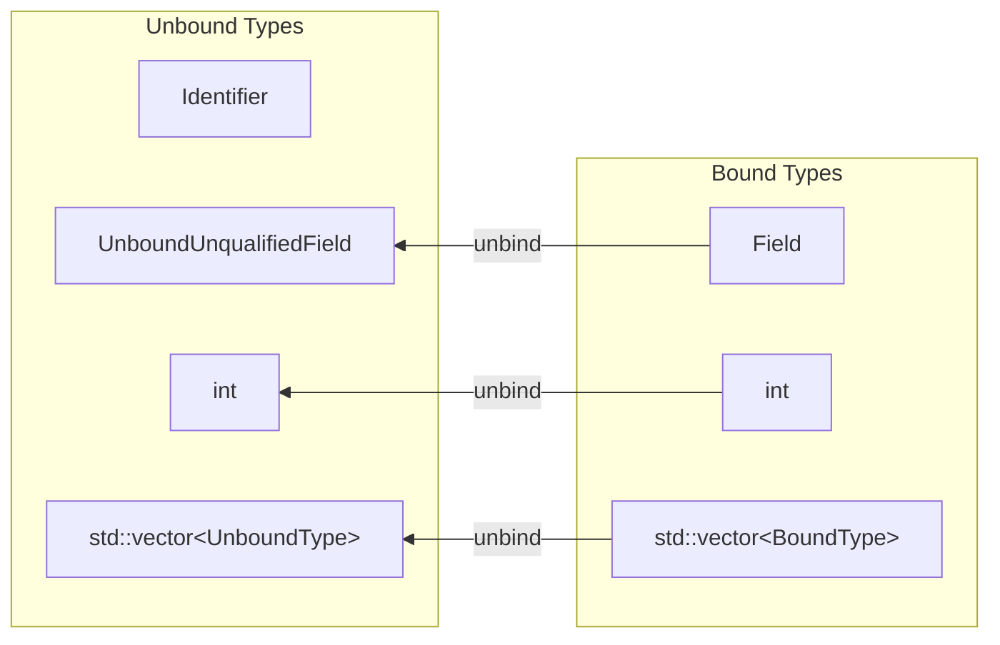

# The Problem

Currently, we have no clear way to reason about where attributes/fields come from.
To differentiate fields from different input operators, we prefix fields with source names or combined source prefixes after joins.

This is problematic for multiple reasons:

1. We are leaking our inability to reason about field provenance to the user, as you will need to know how and when the concatenated prefixes are created and need to be used (**P1**)
2. We cannot clearly define the scope of symbols, neither lexical nor per operator. Rather, we always have a not-quite-per-query-scope, which also means we cannot reason about renamed or aliased relations (**P2**)
3. It's difficult to write optimization passes that reorder operators, since we don't have a reliable mechanism to identify the fields in the used `LogicalFunctions` that refer to the reordered operators (**P3**).

Case in point, the query `SELECT a + 1 as a, a + b FROM (SELECT a as a, b as b FROM source)` currently produces the wrong result,
since there is a read-write conflict in the outer projection, which we cannot detect, and is just masked in the current state through the source prefixing.


# Key Concepts

We use `Identifier` and `IdentifierList` as strong types for SQL-compliant identifiers.

Any representation of a field also contains a reference (as in a pointer) to the `LogicalOperator` that produced it.
This allows us to fully resolve any names or aliases during query binding.

Inside the concrete operators, we need to store *unbound* fields to avoid reference cycles over instances of `LogicalOperator`.
We use a function pair, bind/unbind, to facilitate automatic binding/unbinding of fields and compound types that contain them.

We use a `Schema` class that is a wrapper around a container that calculates for each given field the unambiguous names by which they are identifiable.

We explicitly handle the order of fields through `CalcTargetOrderRule`, `DecideFieldOrder`, and the `FieldOrderTrait`.
In the rest of the logical optimization, the schema order is not accessible, preventing accidental changes to the order or introduction of transitive dependencies.

We use a `FieldMapping` trait along with `DecideFieldMappings` to address read-write conflicts in projections.

# Identifiers

SQL is the only remaining popular language that uses case-insensitive identifiers.
There are many articles arguing that case-insensitive identifiers are a bad idea, but we have to support them.
The SQL standard requires that non-quoted identifiers be automatically uppercased.
But not every system follows this convention; Postgres, for example, lowers non-quoted identifiers.
Since we will have to interface with other systems often, we will require people to use excessive quoting

```SQL
-- In Postgres
CREATE TABLE My_Table(Attribute_a INT, attribute_b VARCHAR);

-- In NES
SELECT "attribute_a"
FROM "my_table" 
INTO VoidSink()

-- Better
SELECT attribute_a
FROM my_table
INTO VoidSink()
```

For interaction between NES and other systems, this is already annoying, but it straight-up becomes impossible to make two other systems interact with each other.
Also, since case-insensitivity is such a bad design decision, if we define our own non-SQL programming language, we would probably want this language to be case-sensitive, but our system would still need to work with both.

Therefore, the identifier strong types to not store the uppercased identifier, but rather the original string and a flag for quotation, and uppercase it on demand.
This allows us to add other comparison strategies on demand.

As with most strong types, we guarantee that an instance of it is always valid.
For this, to create an identifier or a list of identifiers, use

```C++
auto id1 = Identifier::parse("my_identifier")
auto id2 = Identifier::parse("My_Identifier")
EXPECT_EQ(fmt::format("{}", id1), "MY_IDENTIFIER");
EXPECT_EQ(id1, id2);

auto idlist1 = IdentifierList::tryParse("Source.\"TesT\"")
auto idlist2 = IdentifierList::create(Identifier::parse("source"), Identifier::parse("\"TesT\""))
EXPECT_EQ(*idlist1, idlist2);
EXPECT_EQ(fmt::format("{}", idlist1), "SOURCE.\"TesT\"")
```

Internally, `Identifier::parse` will detect if it's a compile-time string literal and internally use an appropriately sized array to store the value, avoiding static heap allocation.

# Fields & Binding & Schemas

We use the class `Field`, whenever a logical operator returns something that should refer to one of its output fields.
It's a triplet of an unqualified identifier, a data type, and a `LogicalOperator`.

Schema inference needs to calculate an output schema for an operator, but it cannot store the fields directly, since that would cause a reference cycle.

Instead, we store an *unbound* version of output fields or anything containing them.
We provide `NES::bind(LogicalOperator producedBy, UnboundType unbound)`, `NES::unbind(BoundType)` as a wrapper around `NES::Binder<UnboundType>` and `NES::Unbinder<BoundType>`.

Binding is a surjective function that is by default reflexive, unbinding is injective-only and by default as well reflexive.





Since we need to store inside an operator a schema of unbound fields, but return a schema of bound fields, we provide the `Schema` class as a template
over a `FieldType` and a flag `IsOrdered`.
For `FieldType`, any type can be used that has a `getFullyQualifiedName()` function that returns an `IdentifierList`.
Currently, we use it with three `FieldTypes`: `Field`, `UnqualifiedUnboundField`, and `QualifiedUnboundField`.
Fields are used as return values of logical operators and inside `FieldAccessLogicalFunction`, `UnqualifiedUnboundFields` in source and sink schemas, and internally in the operators.
The physical operators work on `QualifiedUnboundFields`.

In the future, we will move more parts of the IR to use qualified field names to permit identification of subattributes in compound types.

The schema is a wrapper around a `std::vector` or `std::unordered_set` for the field type, that, in addition, maintains a mapping of unambiguously resolvable field names to fields.
Since our grammar and binder don't support relation aliasing, we currently restrict schema inference in praxis so that all fields must be addressable by exactly one unambiguous name. In the future, this will change, and the `Schema` class already provides a mechanism for resolving name conflicts.

As with binding, we try to make working with `Schema` as easy as possible, so they can be used like any other collection.

For example, the core part of calculating the "input schema" of a join can be expressed as

```C++
auto inputSchema = children 
                | std::views::transform([](const auto& child){ return child.getOutputSchema(); }) 
                | std::views::join 
                | std::ranges::to<Schema<Field, Unordered>>();

auto newPredicate = predicate.withInferredDataType(inputSchema)
```

At the moment, we always use `Schema<Field, Unordered>::tryCreateCollisionFree(inputFields)` instead of the range constructor to catch unintended collisions early, but this will change in the future.

This solves the outlined problems:

- **P1**: No prefixes are used or leaked to the user
- **P2**: One schema is one scope. In the IR, we build them per operator, but in a new binder, we can build one schema per lexical scope.
- **P3**: `LogicalFunctions` contain unambiguous references to the logical operators they were created for, allowing us to verify whether they are still up to date or update them with mappings that don't have prefix-caused edge cases.

# Field Mappings

Since we don't have source prefixes anymore, we cannot sweep the read-write conflicts in projections caused by the sequential in-place application of `MapPhysicalOperators` under the rug anymore.
Of course, we also don't want to break pipelines unnecessarily; the projections in the example query should still run in one pipeline.
But this means we cannot just materialize the new field under the intended name; we need to either redirect reads to, or writes to, the field where there is a conflict between the old and new versions.
I found it much easier to reason about and implement redirecting the write.

Once we have identified such a conflict, we store in the `FieldMappingTrait` a mapping of `oldfieldname` to `oldfieldname.new`, and propagate it upwards (towards the sink) along every operator that outputs a field of the same name.
During lowering, this mapping is used both to create the schemas for physical operators and to lower logical functions.

To let `DecideFieldMappings` calculate this mapping for an operator, the operator must implement the `Reprojecter` interface.
Of our operators, Projection and WindowedAggregation do so.

# Field Orders

We are given the user-specified field orders in the sources, and in some cases, also the expected order in the sinks.
We need to respect these orders, and if no order is specified in the sink, we need to determine the attribute order deterministically.
Before, each operator defined an ad hoc order via schema inference.

Now, in `CalcTargetOrderRule`, by default, we propagate the fields' order from the children in the order defined for the child operators.
Additional attributes are ordered lexicographically.

If an operator wants to override this behavior, they can implement the `Reorderer` interface to output a custom field order.
Of our operators, Source, Projection, WindowedAggregation, and Union do so.

Then, towards the end of physical optimization, we set a `FieldOrderingTrait` in `DecideFieldOrder` using similar logic, and use it during lowering to calculate the lowered schemas.
While the logic of the two stages is nearly identical at the moment, they serve different purposes.
One could pick arbitrary strategies for `DecidingFieldOrder`, as with memory layouts, but not for calculating the target order.
