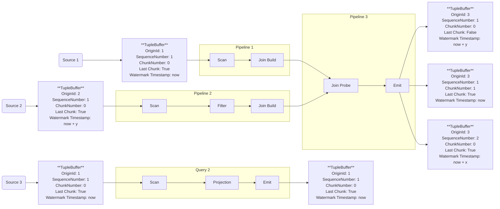

# Watermarking and Progress
In any streaming system, it is crucial to reason about the progress of the stream to trigger windows and to ensure correctness, c.f., https://www.oreilly.com/radar/the-world-beyond-batch-streaming-102/.
NebulaStream uses a task-based execution engine that is designed to cope with data skew and load imbalances dynamically.
Therefore, our operators are executed in parallel on different worker threads, and each worker thread processes one tuple buffer at a time.
This introduces out-of-orderness among tasks and a non-deterministic order of execution. 
To ensure correctness, stateful operators need to reason about the progress of tasks to progress deterministically.
NebulaStream uses the general idea of punctuations [1] and rely on four identifiers to reason about progress that are attached to a tuple buffer:
- `OriginId`
- `SequenceNumber`
- `ChunkNumber`
- `Watermark timestamp`

In the following, we will discuss each identifier in detail and then show how they are used to reason about progress.
The following mermaid diagram shows an example flow of tuple buffers through our engine with the four identifiers attached to each tuple buffer.
Each pipeline is a task. NebulaStream executes tasks in parallel on different worker threads.


## OriginId
NebulaStream can combine multiple sources in a stream, for example, NebulaStream can combine the sources `trucks` and `cars` in a stream called `vehicles`.
To differentiate between sources, NebulaStream uses the `OriginId` that is unique for each source or stateful operator in a query plan.
This means that different query plans share `OriginId` values. 
For example, the origin id `1` exists in all query plans as shown in the diagram above for the two sources `Source 1` and `Source 3`.
The `OriginId` is set in each tuple buffer for each data emitter so that every operator knows from what data emitter the data originates.
During the query registration, NebulaStream iterates over all sources and assigns a unique `OriginId` to each source, starting from `1`.


## Watermark Timestamp
Typically streaming systems use watermark timestamps to reason about progress, especially for event time [2].
A user can use two different types of timestamps for watermarks. 
First, `event time`, which means that the user chooses a field (that represents time) from the input schema of the stream as the `event time`. 
NebulaStream then uses the values of that field to reason about progress concerning time. 
Second, `ingestion time`, which is useful if a schema does not contain a field that represents time and/or that is well suited to reason about progress concerning time. 
In this case sources set the timestamps when receiving data, i.e., NebulaStream generates timestamps during data ingestion.

Watermarks are timestamps that ensure all data with a timestamp smaller than the watermark has arrived.
As NebulaStream assumes that the data arrives in-order at the source, the largest timestamp in the tuple buffer becomes the watermark timestamp.
For ingestion time, this is the buffer creation time, i.e., the time set by the source when the first data is received.
For event time, NebulaStream has to iterate over all tuples in the tuple buffer to find the largest timestamp.
NebulaStream sets the `Watermark timestamp` in each tuple buffer, as shown in the diagram above.


## SequenceNumber
Most sources receive continuous data and fill new tuple buffers with the incoming data.
NebulaStream assumes that the data arrives in-order at the source.
Each source sets a `SequenceNumber` for each tuple buffer that is strong monotonically increasing and must not have any gaps.
Hence, the `SequenceNumber` is unique for each tuple buffer and is set by each source independently of other sources.
The `SequenceNumber` is set in each tuple buffer for each individual `OriginId`/source.
This means that the sequence numbers are unique for each source and are not shared between sources, resulting in the same sequence number for different sources.
For example, the sequence number `1` exists in multiple tuple buffers for different sources, as shown in the diagram above.
This way, each downstream operator can keep track of the seen sequence numbers and can reason about the progress of the data.
The `SequenceNumber` is set to 1 for the first tuple buffer of each source and is incremented by 1 for each new tuple buffer.
```markdown
| Sequence Numbers | Longest consecutive sequence |
|------------------|------------------------------|
| 1, 2, 3, 4, 5    | 5 (Seen all)                 |
| 1, 2, 3, 5, 6    | 3 (Missing 4)                |
| 1, 3, 4, 6       | 1 (Missing 2)                |
```

## ChunkNumber
As a default, sources write as many tuples to tuple buffers as possible.
During the execution of a pipeline, it might happen that the output size of an operator is larger than the input size.
For example, a projection operator adds a new field to each tuple or stateful operators, such as joins.
Every operator that creates new sequence numbers must be a blocking operator as it requires a global view of all tuple buffers. It can only assign new sequence numbers up to the largest seen consecutive sequence number.
Therefore, NebulaStream needs a mechanism that tracks the number of buffers that have the same sequence number.
Since blocking is expensive, NebulaStream needs a mechanism that tracks the number of buffers that have the same sequence number. 
As each operator receives a single tuple buffer, NebulaStream also needs to know if this is the last buffer for the current sequence number.
Thus, NebulaStream adds a `ChunkNumber` and a `lastChunk` flag to each tuple buffer, as shown in the diagram above.
In each pipeline, the `ChunkNumber` is set to 0 for the first tuple buffer of each sequence number and is incremented by 1 for each new tuple buffer.
The `lastChunk` flag is set to false for each tuple buffer, except for the last tuple buffer.
To detect if we have seen all chunks for a given sequence number, NebulaStream keeps track of the `ChunkNumber` and the `lastChunk` flag for each sequence number.
The following code snippet shows how NebulaStream reasons about if all chunks have been seen for a given sequence number.
```c++
bool seenAllChunks(OriginId seqNumber, ChunkNumber chunkNumber, bool isLastChunk)
    /// Gets a reference to the last chunk number and the number of seen chunks for the given sequence number
    auto& [lastChunkNumber, numSeenChunks] = getLastChunkNumberAndNumSeenChunks(seqNumber);
    /// If the current chunk is the last chunk, assign its chunkNumber as the lastChunkNumber
    if (isLastChunk)
    {
        lastChunkNumber = chunkNumber
    }
    ++numSeenChunks;
    
    /// if we have seen all chunks, 'numSeenChunks' equals lastChunkNumber
    /// example: ChunkNumbers{1,2,3,4}, then #(ChunkNumbers) == 4 == lastChunkNumber
    return numSeenChunks == lastChunkNumber;
```


# Reasoning about progress / Triggering windows
After any stateful operator has iterated over all tuples in a tuple buffer, it checks if it can trigger windows.
For this, the operator uses the quadruplet of identifiers, `OriginId`, `SequenceNumber`, `ChunkNumber`, `Watermark timestamp`. 
The only thing NebulaStream requires is to know the `watermark` over all incoming sources, called `global watermark`.
NebulaStream calculates this watermark by determining the minimum of all `local watermarks`, i.e., the watermarks assigned by the individual sources.
The result is a timestamp-barrier after which no tuples with a timestamp smaller than the `global watermark` will arrive.

NebulaStream uses the `OriginId` of a tuple buffer to map the other three identifiers, i.e., `SequenceNumber`, `ChunkNumber`, and `Watermark timestamp` to the source that produced the specific tuple buffer.
For each source, NebulaStream tracks whether it saw all `SequenceNumbers` and all `ChunkNumbers` belonging to the `SequenceNumbers`.
NebulaStream knows that the `SequenceNumber`s are strong monotonically increasing because they have been produced by an operator within a single thread and are created from a single input tuple buffer in order.
Since NebulaStream knows that the `SequenceNumbers` are strongly monotonically increasing, NebulaStream can reason about the progress of the stream coming from a specific source with a specific `OriginId`.
Let us assume that `Seq_i` is the `SequenceNumber` of the i-th tuple buffer of a source.
NebulaStream infers the `local watermark` by yielding the `watermark timestamp` of maximum `Seq_i`, for which it saw all `ChunkNumbers` of all `Seq_i-1`.
Couple examples of seen sequence numbers and what the longest consecutive sequence of `SequenceNumbers` is:

# Appendix
- [1] P.A. Tucker, D. Maier, T. Sheard, and L. Fegaras. 2003. Exploiting punctuation semantics in continuous data streams. IEEE Transactions on Knowledge and Data Engineering 15, 3 (May 2003), 555–568. https://doi.org/10.1109/TKDE.2003.1198390
- [2] https://nightlies.apache.org/flink/flink-docs-release-1.13/docs/dev/datastream/event-time/generating_watermarks/
