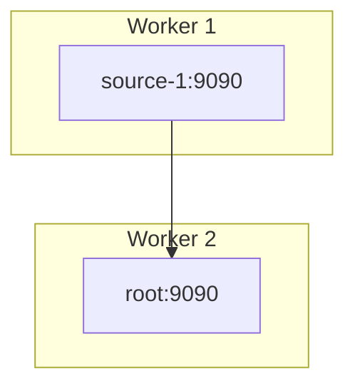

In this section, we describe how NebulaStream operates in a distributed environment, supporting cloud-edge infrastructures and geo-distributed deployments.

## Overview of Distributed Architecture
The distributed implementation of NebulaStream is currently experimental, and we are actively working on Kubernetes integration. The distributed version of NebulaStream can be used, but it is currently on a specific branch (e.g., `ls-distributed-poc`, though this may change).

Fundamentally, the distributed architecture still works with a stateless optimizer, namely `nebuli`.

## Topology Configuration with `topology.yaml`
When starting `nebuli` in distributed mode, you need to supply a `topology.yaml` file which describes the workers in the topology.

Here is an example `topology.yaml`:

```yaml
logical:
  - name: stream
    schema:
      - type: UINT64
        name: id
      - type: UINT64
        name: value
      - type: UINT64
        name: timestamp
nodes:
  - connection: source-1:9090
    grpc: source-1:8080
    capacity: 10
    physical:
      - logical: stream
        parserConfig:
          type: CSV
        sourceConfig:
          filePath: '/sources/Map_Add_stream.csv'
          type: File
  - connection: root:9090
    grpc: root:8080
    capacity: 10
    links:
      upstreams: [ source-1:9090 ]
    sinks:
      - name: sink
        type: Print
        config:
          ingestion: 100
          inputFormat: CSV
```

Workers are named in the system, and `upstreams` and `downstreams` establish connections between workers. Additionally, the topology places sources and sinks within the topology. Logical Sources are globally defined for all workers, but each worker can choose its own physical sources and attach them to the logical source. Currently, there is no concept of logical sinks, thus sinks are directly registered at a worker. The `capacity` parameter is used to steer the bottom-up placement for testing purposes. Since `nebuli` in its current state is stateless, each invocation will use all capacities available.

### Two-Node Topology Example



## `nebuli` Command-Line Usage
`nebuli` loads the topology via the `-t` parameter.

Here is the help message for the `nebuli` command-line tool:

```
Usage: nebuli [-d | --debug] [-t <topology>] <command> [<args>]

NebulaStream Command Line Interface

Options:
  -d, --debug      Dump the Query plan and enable debug logging
  -t, --topology   Enables distributed deployment, based on a topology

Commands:
  register         Register a query
    Usage: nebuli register <query> [-i <config>] [-s <address>] [-x]
      <query>        Query Statement (default: "")
      -i             Legacy SingleNodeQuery configuration
      -s             Legacy SingleNode server address
      -x             (flag)

  start            Start a query
    Usage: nebuli start <queryId>
      <queryId>      ID of the query to start

  stop             Stop a query
    Usage: nebuli stop <queryId>
      <queryId>      ID of the query to stop

  unregister       Unregister a query
    Usage: nebuli unregister <queryId>
      <queryId>      ID of the query to unregister

  dump             Dump the DecomposedQueryPlan
    Usage: nebuli dump [-o <output>] [-i <config>] [-s <address>] <query>
      -o, --output   Write the DecomposedQueryPlan to file. Use - for stdout (default: "-")
      -i             Legacy SingleNode query configuration
      -s             Legacy SingleNode server address
      <query>        Query Statement (default: "")

  status           Observe the state of individual queries
    Usage: nebuli status [-i <config>] [-s <address>] [--after <timestamp>]
      -i             Legacy SingleNodeQuery configuration
      -s             Legacy SingleNode server address
      --after        Request only status updates that happens after this unix timestamp.
```

Example command to register a query:
`nebuli -t topology.yaml register -x "SELECT * FROM stream INTO sink"`

Just like the non-distributed implementation, `nebuli` will perform parsing and logical optimization. Additionally, it will perform placement of each logical operator and decompose the single query plan into multiple query plans. The decomposed query plans are stitched together using network sources and sinks, making them effectively their own queries.

`nebuli` will then deploy each partial query plan to the relevant workers, returning a distributed ID.

You can observe the state of the individual queries with:
`nebuli status ID`

To stop all queries:
`nebuli unregister ID`

The design document for distributed processing contains additional information and can be found at [20250120_Distributed.md](https://github.com/nebulastream/nebulastream/blob/ls-distributed-poc/docs/design/20250120_Distributed.md). It describes the data channel implementation as well as the algorithm used for placement decomposition.

## Starting Workers in Distributed Mode
By default, NebulaStream workers are not configured for distributed mode. To enable distributed operation, you need to pass two specific arguments when starting a worker:

*   `--bind=<address>:<port>`: This argument specifies the address and port the worker will listen on. Use `0.0.0.0:<port>` to bind to all available network interfaces.
*   `--connection=<connection-name>:<port>`: This argument specifies the name the worker will use when reaching out to other workers in the distributed topology.

Example:
`nes-single-node-worker --bind=0.0.0.0:9090 --connection=dns-name:9090 --query...`
