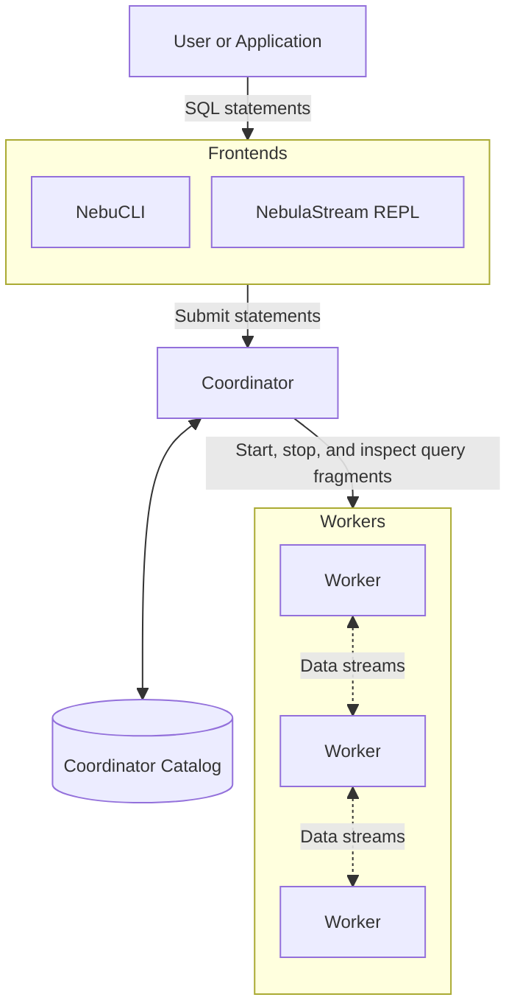
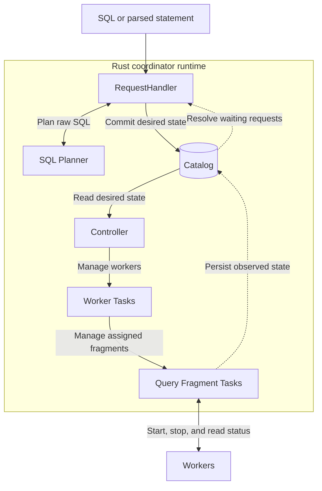

# NebulaStream Coordinator
     
The coordinator manages the control flow of a NebulaStream deployment.
     
It accepts statements from frontends, plans queries, stores the requested state in the coordinator catalog, and coordinates query execution on workers.  
Workers execute query fragments and exchange data directly with each other.
     
The coordinator controls their lifecycle and records their state, but it does not process the data stream.
     
## Role in the System
   
The coordinator connects NebulaStream frontends to the workers that execute queries.  
Frontends submit coordinator statements, and the coordinator records their effects in the catalog.  
The catalog stores workers and queries.  
It also stores the sources, sinks, and models used by those queries.  
The coordinator uses this state to control query fragments on the workers.  
The workers execute these fragments and exchange stream data directly with each other.

## Internal Architecture
 
The Rust runtime separates request processing from reconciliation, with the catalog acting as their shared source of truth.

The request handler accepts raw SQL or an already parsed coordinator statement.  
For raw SQL, it invokes the SQL planner, which uses catalog information to produce a typed statement and its placed query fragments.  
The request handler applies the result in one catalog transaction and records the desired state.  
It then returns immediately or waits for the catalog to satisfy the requested condition.

The controller starts the reconciliation process by reading the desired state from the catalog and managing the corresponding worker tasks.  
Each worker task manages the query fragments assigned to its worker.  
The fragment tasks drive the fragment lifecycle and persist observed state changes in the catalog.  
These changes allow the request handler to resolve waiting requests.
The catalog derives the overall query state from the observed states of its fragments.

## Reconciliation

Reconciliation continues until the state observed on the workers matches the desired state stored in the catalog.  
Notifications allow the controller to react quickly when the catalog changes.  
Periodic reads ensure that reconciliation continues even when a notification is missed.  
Storing catalog state durably allows the coordinator to continue reconciliation after a restart.

Dropping a query changes the desired state of its fragments.  
Reconciliation then stops active fragments and records their terminal state.

The same reconciliation process supports remote and embedded workers.  
The controller communicates with remote workers through gRPC and with embedded workers through the language bridge.

## Components

### [Coordinator](coordinator/)

The `coordinator` crate runs the request handler and controller together.
It defines the request entry point, the SQL planner interface, and the rules for immediate and waiting responses.

### [Controller](controller/)

The `controller` crate reconciles the catalog with the workers.
It manages the task hierarchy for workers and query fragments and supports remote and embedded worker transports.

### [Model](model/)

The `model` crate defines the coordinator catalog and the Rust interfaces used to read and modify it.
It contains catalog entities for workers, sources, sinks, models, queries, and query fragments.
It also defines the desired and observed states used to manage workers and query fragments.

### [Migration](migration/)

The `migration` crate defines and applies the catalog schema.
Its migrations create the tables, indexes, and triggers that enforce catalog invariants and derive state across related rows.

### [Bridge](bridge/)

The `bridge` crate connects the Rust coordinator with the C++ frontends, SQL planner, and embedded worker implementation.
It translates requests, results, plans, worker calls, and errors across the language boundary.

### [SQL Planner](sql-planner/)

The `sql-planner` component parses SQL and converts it into a coordinator statement.
For queries, it also produces the distributed fragments assigned to workers.