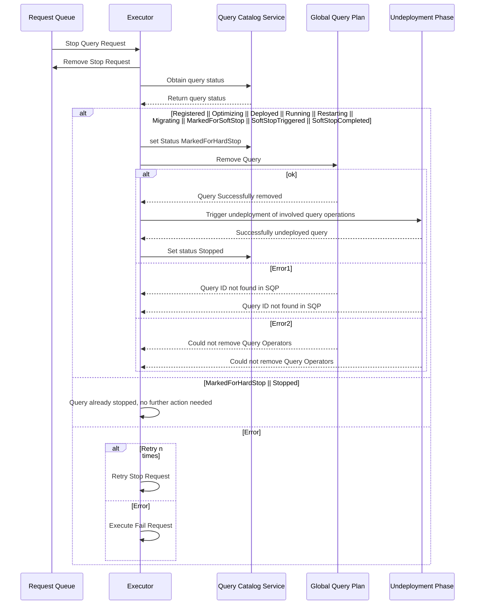
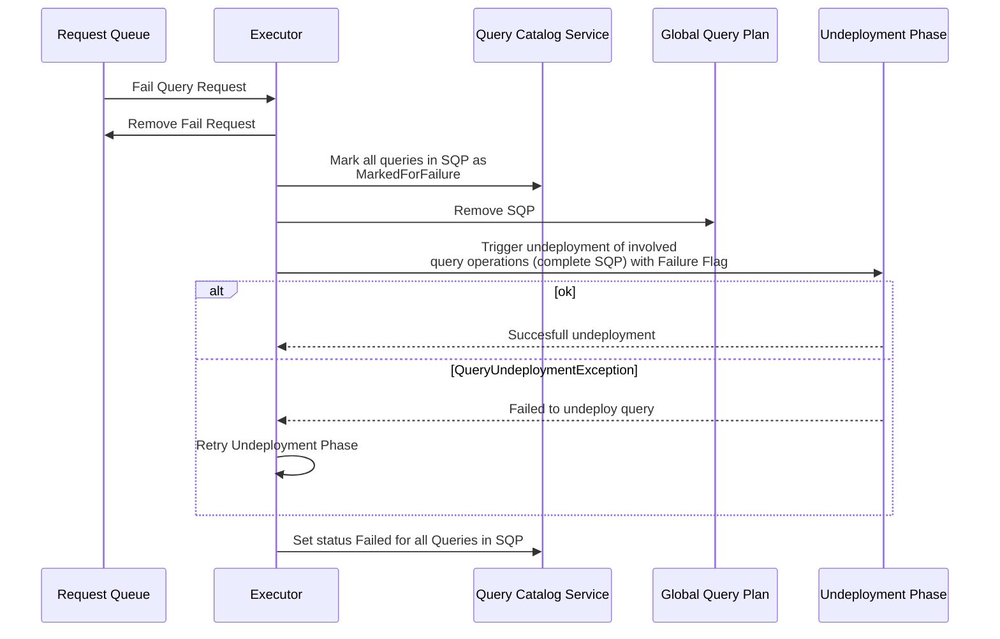
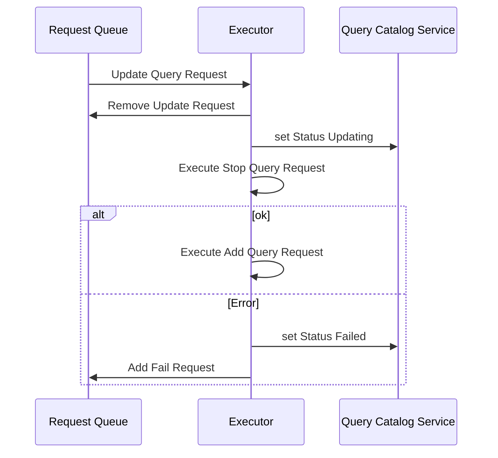
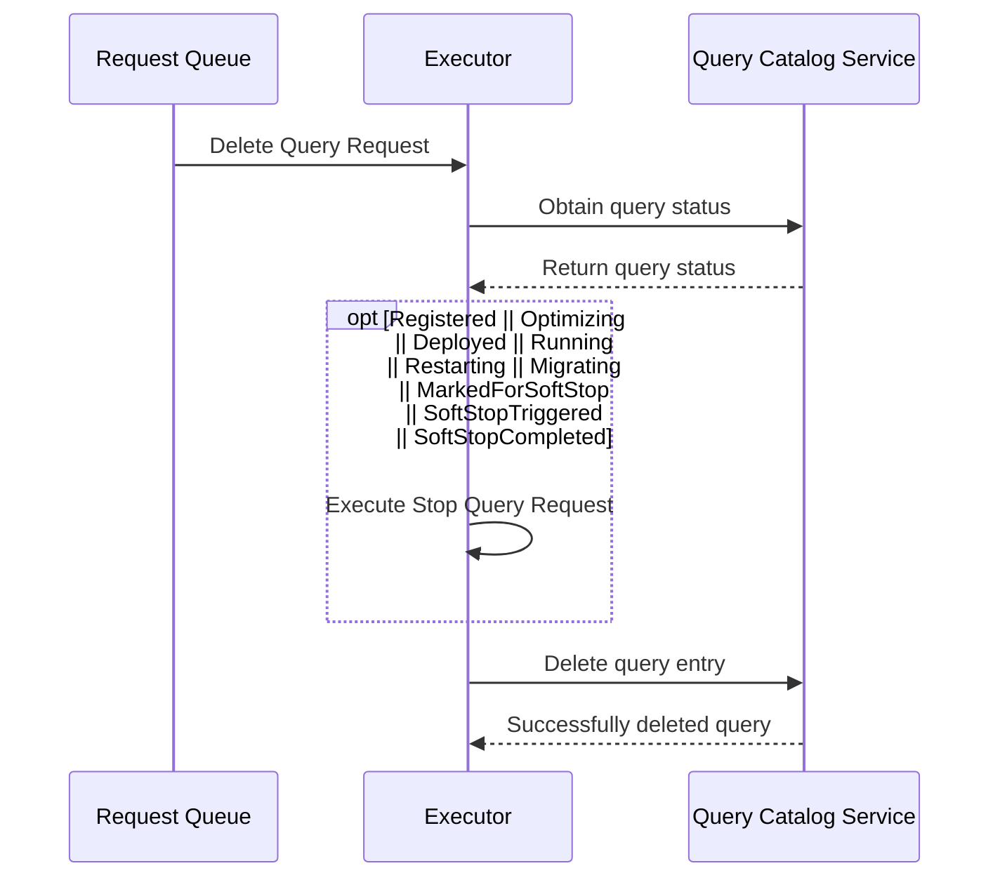
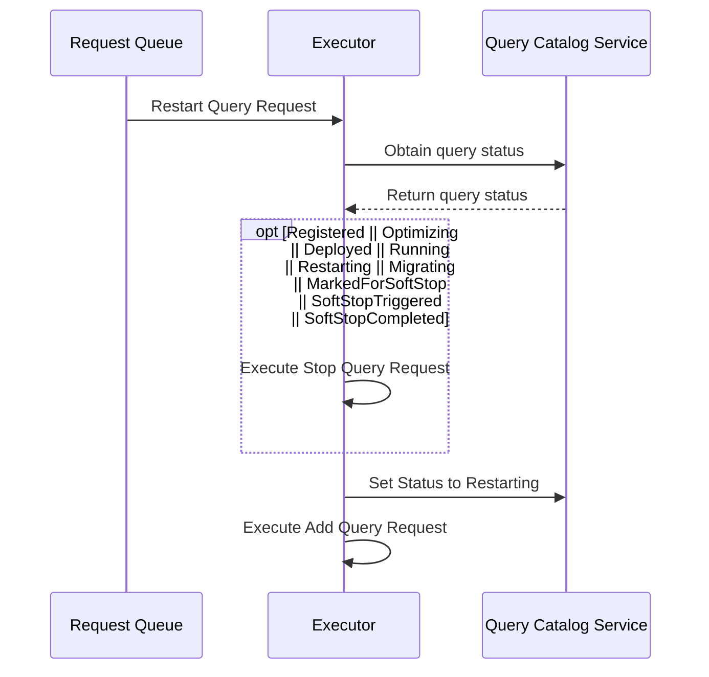
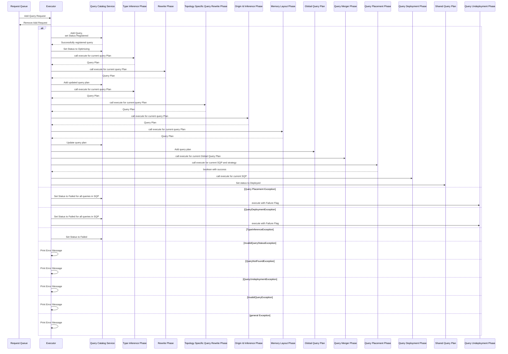

|                                              | Current Status                                                                                                                                                                                                                                                                                                                                                                                                                                                                                                                                                                                                            | Processes that should happen                                                                                                                                                                                                                                                                                                                                                                                                              |
|----------------------------------------------|---------------------------------------------------------------------------------------------------------------------------------------------------------------------------------------------------------------------------------------------------------------------------------------------------------------------------------------------------------------------------------------------------------------------------------------------------------------------------------------------------------------------------------------------------------------------------------------------------------------------------|-------------------------------------------------------------------------------------------------------------------------------------------------------------------------------------------------------------------------------------------------------------------------------------------------------------------------------------------------------------------------------------------------------------------------------------------|
| <b>Stop</b> Query Request                    | Remove Query from Global Query Plan                                                                                                                                                                                                                                                                                                                                                                                                                                                                                                                                                                                       | Remove query from global query plan   Retain query for <b>Restart</b>                                                                                                                                                                                                                                                                                                                                                                  |
| <b>Fail</b> Query Request                    | Remove Query from Global Query Plan                                                                                                                                                                                                                                                                                                                                                                                                                                                                                                                                                                                       | Remove query from global query plan   Retain query for <b>Restart</b>                                                                                                                                                                                                                                                                                                                                                                  |
| Run Query Request (<b>Add</b> Query Request) | Add Updated Query Plan (Input Query Plan)   Update Query Status (Optimizing)  Type Inference Phase for Query Plan  Memory Layout Phase for Query Plan Query Rewrite Phase for Query Plan Add Updated Query Plan (Query Rewrite Phase) Type Inference Phase for Query Plan   Signature Inference Phase   Topology specific query rewrite phase   Add updated Query Plan (Topology Specific Query Rewrite Phase)   Type Inference Phase   Origin Id Inference Phase   Memory Layout Phase   Add Update Query Plan (Execute Query Plan)   Add Query Plan to Global Query Plan   | Add query to Global Query Plan   Go through query optimization steps:   Set Query Status to Optimizing,   Type Inference Phase,   Memory Layout Phase,   Query Rewrite Phase,   Signature Inference Phase,   Topology specific Query Rewrite Phase,   Origin Id Inference Phase,   Add Updated Query Plan (Execute Query Plan)   Add final Query Plan to Global Query Plan   Set Query Status to Running |
| <b>Update</b> Query Request                  |                                                                                                                                                                                                                                                                                                                                                                                                                                                                                                                                                                                                                           | Check if query is running   <b>Stop</b> Query Request   <b>Add</b> Query to Global Query Plan                                                                                                                                                                                                                                                                                                                                       |
| <b>Delete</b> Query Request                  |                                                                                                                                                                                                                                                                                                                                                                                                                                                                                                                                                                                                                           | If running, trigger <b>Stop</b> Query Request   Remove query entry from query Catalog                                                                                                                                                                                                                                                                                                                                                  |
| <b>Restart</b> Query Request                 |                                                                                                                                                                                                                                                                                                                                                                                                                                                                                                                                                                                                                           | Check if query is not running   Trigger <b>Add</b> Query Request                                                                                                                                                                                                                                                                                                                                                                       |

<b>Stop Request</b>

Currently, failure to remove a query just throws errors. 

<b>Fail Request</b>

<b>Update Request</b>

<b>Delete Request</b>

<b>Restart Request</b>

<b>Add Request</b>

