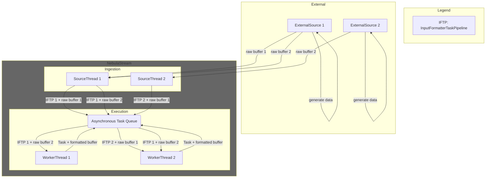
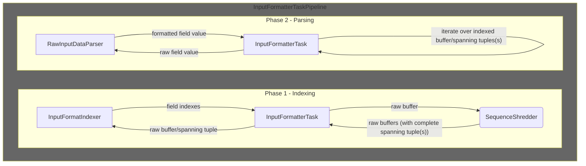
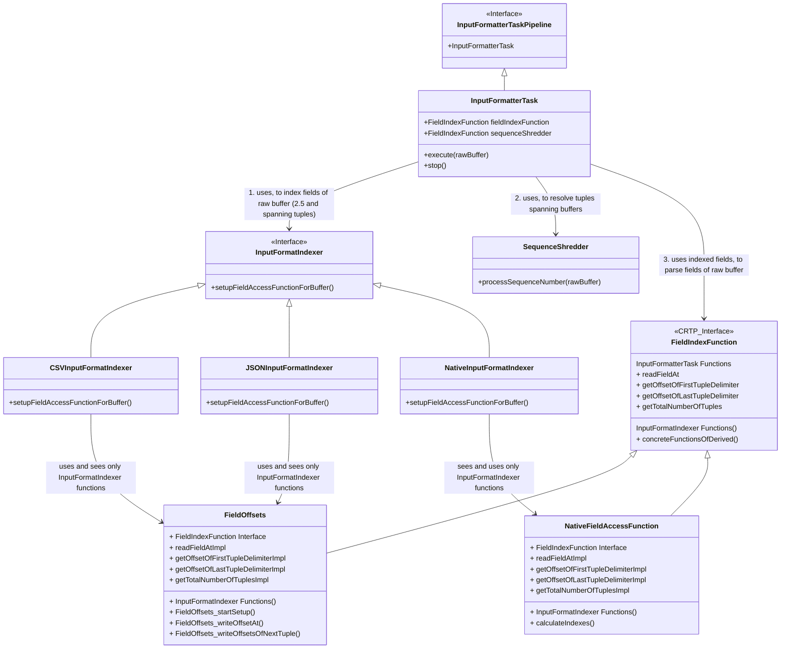

# Input Formatters
The input formatter takes (raw) buffers that sources produce and converts the data in the buffers to a format that all subsequent operators of the query can work with. Usually this is our internal format.
## List of Sections
- [Assumptions](#assumptions)
- [Architecture](#architecture)
- [Important Classes](#important-classes)
- [Open Challenges](#open-challenges)

## Assumptions
- **A1**: The vast majority of data that NebulaStream processes is raw (often text) data from external sources. This is in-line with [industry observations](https://www.vldb.org/pvldb/vol17/p3694-saxena.pdf) and even more so true, since NebulaStream aims to process data close to sources. 
- **A2**: The vast majority of data must pass through the input formatter before we can apply other operators to it.
- **A3**: Different formats share value-specific parsing functions. For example, different formats parse integer values in the same way. Additionally, different formats may share challenges, such as how to determine tuple delimiters in random chunks of raw data.
## Design Goals
### Scale-In
In contrast to cloud-oriented systems, NebulaStream aims to scale with a large number of sources without adding resources. A single machine must suffice to handle a large number of sources and queries.

To that end, we plan to implement a source runtime that uses *Epoll* and/or *io_uring* to asynchronously ingest data from many sources using minimal resources, similar to a webserver. If sources only do (fast) IO, a source runtime with a single thread can efficiently handle a large number of sources. This opens up resources to query processing.\
(**Note:** We plan to provide dedicated source/formatter threads for sources that only support synchronous I/O, for high-priority sources and if there are enough resources available. See the [open challenges](#open-challenges) section.)
#### Asynchronous Execution
Slow sources and queries with light-weight formatting should not hog resources that we can use for more demanding processing tasks.

NebulaStream's query engine operates on an (internal) task queue. Each 'Task' is a pair of a buffer (data) and work (pipeline) to apply to the buffer. Worker threads asynchronously pick tasks from the task queue, executing them in non-deterministic order (see [architecture](#architecture)).\
Asynchronous sources that only do I/O don't format the data. Instead, they put the (raw) buffers in the (admission) task queue. Ultimately, worker threads pick up and execute the format-tasks(InputFormatterTaskPipeline) only if there is data that requires formatting. Otherwise, worker threads are free to process other tasks. 
### Simple Sources
We aim to make implementing sources as simple as possible, shifting complexity towards input formatters.

We expect that there are more sources than formats, i.e., a higher number of (different) ways to ingest data into NebulaStream than formats in which the data arrives. Looking at the [plugins of Influx Telegraf](https://github.com/influxdata/telegraf/tree/master/plugins), an open source system similar to NebulaStream, there are roughly 20 parsers(formats) and 230+ inputs(sources).

### Efficient (Asynchronous) Input Formatting
Given **A2**, a slow input formatter bottlenecks the entire query. We aim to avoid input formatting bottle-necking query processing.

The Synchronization overhead between threads that process InputFormatterPipelineTasks must be kept low.
Asynchronous input formatting of raw buffers, where tuples may start in one buffer and end in another (spanning tuples), requires some kind of synchronization. The higher the synchronization overhead, the less time worker threads spent on processing data. The [SequenceShredder](#sequence-shredder) addresses this problem.\
Furthermore, indexing fields and parsing field values can slow down the entire query (**A2**). We split up field indexing and parsing into two phases (see [architecture](#architecture)). We aim to utilize existing algorithms/libraries that utilize SIMD instructions to speed up indexing. Additionally, we aim to fuse parsing with the rest of the first compiled pipeline of our query plan. As a result, we could hardcode filters, projections and functions into the input formatter pipeline, only touching the raw indexed data if we need to.

### Extensible Input Formatting
We aim to break down input formatting into general challenges shared by subsets of input formatters and format-specific challenges. Implementing support for a new format should only require overcoming format-specific challenges.

In general, we aim towards a config-based design. When implementing a new format, a developer should be able to configure the format so that solutions for challenges that it shares with other formats, e.g., parsing floating point data (**A3**), are handled by automatically. As a result, the developer can focus only on the format-specific challenges. Possible configuration options are: does the format need to handle spanning tuples, parsing data types (including array and nested data types), handling null values, handling delimiters that span across buffers, handling uncertainty when dealing with escape sequences.

## Architecture
Input formatters are represented by InputFormatterTaskPipelines that, coupled with a buffer containing (raw) data makes up a *Task*. Worker threads asynchronously execute Tasks from the task queue, including tasks with InputFormatterTaskPipelines. (We aim to replace the dedicated source threads with a more light-weight source runtime.)


### InputFormatterTaskPipeline
The InputFormatterTaskPipeline essentially consists of two phases. In the first phase, the InputFormatterTaskPipeline uses the **InputFormatIndexer** to determine the indexes of all fields in the raw buffer similar to the approach taken by [simd-json](https://arxiv.org/abs/1902.08318). Additionally, the InputFormatterTaskPipeline resolves tuples spanning over buffers using the **SequenceShredder** and indexes these spanning tuples using the InputFormatIndexer.\
In the second phase, the InputFormatterTaskPipeline iterates over the indexed fields of the raw buffer and converts the raw values to tuples with values of our internal representation. (We aim to implement this second phase heavily relying on Nautilus. Using Nautilus, we generate code for the field traversal that skips fields that we don't need to touch. Additionally, we aim to implement a registry of parsing functions that input formatters can leverage.)


### Class Hierarchy
The InputFormatterTask implements the InputFormatterTaskPipeline and executes the two phases outlined above. First, it uses the InputFormatIndexer to determine the indexes of all fields in the raw buffer. Second, it uses the SequenceShredder to determine whether the indexed raw buffer completes any spanning tuples (potentially one that starts in an earlier buffer and ends in the raw buffer and one that starts in the raw buffer and ends in a later buffer). It uses the InputFormatIndexer to index the spanning tuples. Finally, it iterates over the indexed raw buffer and spanning tuple(s) and parses all values into the internal representation of NebulaStream.


## Important Classes
### FieldIndexFunction
The FieldIndexFunction ties the indexing and the parsing phases together (see [architecture](#architecture)). It has two 'interfaces', one for each phase. 

The first interface is for indexing raw buffers. The concrete InputFormatIndexers, e.g., the CSVInputFormatIndexer, implement this phase. Each InputFormatIndexer chooses a concrete FieldIndexFunction. For a text based format like JSON, it is necessary to determine the start and the end of each field. For a format with fixed-size values, e.g., the Native format, it is sufficient to determine the offset of the first field of the first tuple, the rest can be calculated.

The second interface is for accessing specific fields in a raw data buffer. Only InputFormatterTask has access to that interface. It uses it when iterating over indexed raw buffers and passes the fields to the RawDataParser, to convert the raw values into our internal representation.
### Sequence Shredder
The SequenceShredder is a thread-safe data structure that assigns responsibilities to threads that
concurrently process input formatter tasks (buffers with raw data) originating from the same source.

#### The Problem
Sources produce unformatted buffers containing raw bytes. Commonly, tuples span over at least two, but possibly many buffers. Example (A tuple is just one string, each buffer contains 4 bytes, TN means thread with id N, and Xms means the offset in milliseconds that a thread checks for spanning tuples in comparison to the thread that performs the check first)
```
       1     2     3     4     5     6     7     (<-- sequence numbers (SNs))
     ["Thi][s is][ a s][pann][ing ][tupl][e!"\n] (<-- '\n' is a tuple delimiter (ASCII))
       |     |     |     |     |     |     |
      T3(0ms)|    T2(7ms)|    T3(5ms)|    T1(14ms)
            T1(10ms)      T4(9ms)  T3(16ms)
```
 A single tuple may span over multiple buffers. Threads may process each of the buffers that forms the tuple in arbitrary order.
 If a thread processes the first sequence number (T3(0ms)) or sees a tuple delimiter, it knows that
 it starts a tuple, but it does not necessarily know where it ends.
 If a thread sees a tuple delimiter (T1(14ms)), it knows that it terminates a tuple, but it does not necessarily know where it starts.
 If a thread sees no tuple delimiter in its buffer, it does neither know where the tuple that the buffer belongs to starts, nor where it ends.
 Thus, we need to synchronize between threads. At least one thread must see the start and the end of the spanning tuple.
 Exactly one thread must format the tuple and pass it to the next operator to avoid duplication.

#### The Solution
Given that NebulaStream must perform the above synchronization for every single source and that a fundamental design goal of NebulaStream is to support as many sources as possible on a single node, we opt for a design that:
1. has a small memory footprint
2. can handle arbitrary many sequence numbers,
3. does not bottleneck the entire query due to synchronization
##### Memory Footprint
Fundamentally, a buffer may either contain a tuple delimiter or not. A spanning tuple is a tuple that starts in a buffer with a tuple delimiter, spans over an arbitrary number of buffers without a tuple delimiter and ends in buffer with a tuple delimiter. Thus, it is sufficient to remember for each buffer, whether it has a tuple delimiter and whether we saw and used it already. We can achieve this using two bitmaps. One denotes whether a tuple buffer contains a delimiter with a '1', the other denotes whether we saw a buffer and made use of it with a '1'. If a buffer does not contain a tuple delimiter, we immediately set a '1' in this 'seenAndUsed' bitmap. If a buffer contains a tuple delimiter we set a '1' only when we complete the tuple that starts in the buffer.
```
     1000001 <--- (15ms) tupleDelimiter bitmap for the example above
     0111100 <--- (15ms) seenAndUsed bitmap for the example above (buffer 6 is still missing)
     1000001 <--- (16ms) tuple delimiters for example above
     1111110 <--- (16ms) T3 processes buffer 6, it sees that it can reach buffer 1 and 7, which both have tuple delimiters)
```
A buffer can reach a tuple delimiter (both directions), if all buffers between the buffer and the buffer containing the tuple delimiter were seen and used already, but do not contain a tuple delimiter. That is, there is a sequence of 0s in the tuple delimiter bitmap, exactly contrasted by a sequence of 1s in the corresponding seen and used bitmap. This representation allows us to find all spanning tuples using just 2 bits per buffer. Two bitmaps of size 64 bit represent 64 buffers. The default size of buffers in NebulaStream is the page size (4096 bytes). A single pair of bitmaps (128 bit) can therefore represent 64 * 4096 bytes = 262144 bytes worth of buffer data, meaning the bitmaps are cache friendly. The SequenceShredder starts with 8 pairs of bitmaps. That is, 8 * 128 = 1024 bits. These 1024 bits represent 512 buffers, which means 512 * 4096KB = 2097152KB ~= 2GB. Representing 1 million sources (with 8 bitmaps each), takes 1.000.000 * 1024 bits ~= 500KB. 
##### Handling Arbitrary Sequence Numbers
To address the concern of arbitrarily increasing sequence numbers, the SequenceShredder implements a dynamically increasing ring buffer. Each slot in the ring buffer represents two bitmaps. If a thread requests to process a sequence number that is not in the range of the ring buffer, the thread puts its task back into the queue (rarely the case). The SequenceShredder keeps track of these events and increases the size of the ring buffer if an 'out of range' sequence number occurred often enough. The SequenceShredder can also handle sequence numbers that wrap back to the initial value of 1.
##### Avoiding Bottleneck
 The SequenceShredder needs to synchronize between concurrently executing threads. Every buffer, produced by the source that the SequenceShredder belongs to, must pass through the sequence shredder. The SequenceShredder may slow down an entire query, if synchronization takes too long. Additionally, the design should be robust, since it affects (almost) every single value processed by NebulaStream. We use 3 locks for synchronization, aiming to minimize the number of instructions in each protected section. The first lock is to safely read (avoiding torn-reads) the current tail and determine whether the sequence number is in range. The second lock is the first lock in 'processSequenceNumber()'. In its protected section, the thread first denotes in the bitmaps, whether it found a tuple delimiter in its buffer or not. Second, it determines if it is sufficient to just look at the bitmap that its sequence number maps to, or whether it may find a spanning tuple that spans to another bitmap (back or forward). It then either takes a snapshot(copy) of only its own bitmap, or of all bitmaps (copying all bitmaps is the uncommon case, but still fast). This snapshot has two major advantages. First, all bits set in the bitmap were set by threads that arrived in the lock-protected section earlier and that consequently did not see the bit just set by the thread.
```
 T1   T2        T1   T2
 X    |    or   |    X   <--- T1/T2 is first, sets its bit, and does not see the bit set by the other thread
 |    X         X    |   <--- T2/T1 then comes second, sets its bit, and sees the bit of the other thread
```
Thus, if a thread sees that it just added the last bit which completes a spanning tuple, it knows that no other thread that came before saw this last bit (bits correspond to sequence numbers and sequence numbers are unique) and since all sequence numbers belonging to that spanning tuple were seen already, it knows that no later thread will find the same spanning tuple. Thus, the thread knows that it is the only thread that was able to find the spanning tuple and can therefore safely process it. The second major advantage is that the thread can search for spanning tuples using its snapshot, without the need for locking. When a thread finds a spanning tuple, it requires a third lock. It sets a bit in the seen and used bitmap to tell the other threads that the tuple delimiter that started the bitmap was now used. It then determines whether it just completed the tail bitmap and therefore has to move the tail. A thread completes a bitmap if it flips the last non-'1' bit in the seen and used bitmap to '1'. It means that no more spanning tuple can start in this bitmap. If the bitmap happens to be the tail bitmap, it means that no prior bitmap can still start a spanning tuple, which means that no more spanning tuples can end in the bitmap. It is safe to reset it and move the tail. If a thread detects that it completed the tail bitmap, it keeps the lock and increases the tail, until it finds a bitmap that is not yet complete (not all bits in the seen and used bitmap are '1's). If enough threads requested an increase of the ring buffer, and the thread can safely increase the capacity of the ring buffer (see incrementTail function), the thread doubles the size of the ring buffer.

## Open Challenges
The following is a list of challenges that might each (or in groups) warrant design documents that explore alternative ways to solve them.
### Escape Sequences
Escape sequences allow for control symbols, e.g., a new line delimiter, to appear outside their function as control symbols. Given a random chunk of raw data from a stream, the goal is to determine whether the chunk starts in an escaped sequence or not. If it does, the first escape symbol ends the sequence, if not, it starts it. 
Possible alternatives to handle this problem include:
- A1: synchronous execution (enables of the shelf formatters), but requires dedicated thread/overhead
- A2: asynchronous, but skip a buffer, if not all prior buffers were seen (A2 of synchronous challenge)
- A3: asynchronous with speculate execution, similar to [this paper](https://dl.acm.org/doi/pdf/10.1145/3299869.3319898?casa_token=Xm0oFyemMtUAAAAA:-787P2eu4fHOvYibXXUNP6Q_7CQZThvU8dQbzUVtzK_PodexzskoYk4k4dmhkqRoc35VJlCBBa9eCw). For some(most?) formats it may be possible to determine sequences of symbols that allow to safely determine the escape sequence state. If a formatter is unsure, it determines two/multiple versions for the indexes and returns as 'unsure'. Later threads that process surrounding buffers will be able to safely determine the correct indexes. 
### Optional/NULL Fields
Some Formats may indicate a null field with a reserved keyword such as 'null'. However, in a JSON object, the key-value pair representing a field might simply be missing. How to then represent a null field with indexes? Given nested data and potential null values on multiple level, the problem becomes trickier. A simple way to deal with nested data is to explicitly mark all child fields as null.
- A1: Either there is a null keyword, or two indexes with an absolute distance of 1 represent a null field
- A2: create a bitmap that marks fields that are null, skip the indexes of null fields, propagate the null bitmap to subsequent operators
### Repeated Fields/Arrays
If the size of the repeated field is known, the formatter can determine all indexes and the InputFormatterTask can utilize the size to read the correct number of indexes (and potentially perform validation). Repeated fields that may appear zero times share the optional/null problem.

If the size is not fixed, determining the indexes becomes more complex, which probably needs to be handled by the concrete InputFormatIndexers. Furthermore, parsing the raw fields becomes more complex, since it is not clear who determines how many fields to parse.
- A1: the InputFormatIndexers determines the size of the repeated fields and conveys them
    - A1.1 as a special field offset
    - A1.2 via an extra vector/data structure
- A2: repeated/array/varsized as a datatype with special parsing function(s) for the datatype. The InputFormatIndexer determines the indexes, and the parsing function the determines the size (and therefore handles additional complexity)
### Nested Data
By flattening the nested data structures, cases without optional and repeated data can be handled that we handle flat data.

[Dremel paper](https://dl.acm.org/doi/pdf/10.14778/1920841.1920886?casa_token=HXpkmowS1bwAAAAA:7imGEIHqv3138hR8uKEwrmXfFewQe7f0iJtry95I4-0Ypa5ob10aK3S9PqePqPl1n27IBiZtbPIQiw)
- without optional:
    - complexity should be on indexer-side
    - provide indexes into buffer
    - Task uses indexes to access specific (nested) fields
    - complex and array (and varsized) must provide logic for parser that dictates how to iterate over indexes
- with optional:
    - (use Dremel approach?) Store info about nestedness, repeatedness and nullness. Do we need nestedness info?
        - just store info on nullness and repeatedness and together with Schema info, the ITask can exactly determine how to interpret the indexes
### Delimiters Larger Than a Byte
- somehow tell ITask about potential delimiter(s) and mark start/stop
- either add second bitmap to SequenceShredder to highlight candidates or check for all buffers that not lead to spanning tuples, whether there is a candidate
- is it possible to combine with escape sequences
### Formats without delimiters
### UTF8 support
### formats that don't require parsing, but potentially re-arranging of data (columnar to row)
### Codecs
- compressed data (different codecs, different formats)
### Optimizing Queries for Compilation
- compiling the parsing functions (that iterate over the offsets of the first phase)
- optimizing query plans (e.g., filter pushdown) to profit from compiled parsing
### Memory Layouts
- supporting complex memory layouts as the target of the input formatter
### [fix] Multi-Part Sequence Numbers
- correctly outputting sequence numbers (when we merge multiple input buffers that hold data for one varsized field into a child buffer, we 'loose' all but one SequenceNumber)
### synch mode
#### A1: Notify Mechanism
- Adv: pipelined execution, no synch/wait on the workerThread Side
- DAdv: source needs to wait, notify between two sources and queryEngine (but admissionQueue is similar), new interface?
#### A2: SourceThread with Attached InputFormatterTaskPipeline
- Adv: no syncing, sourceThread simply does two things
- DAdv: ingestion bottle-necked by formatting, requires new kind of interface
#### A3: Synch SequenceShredder Mode
- Adv: no additional syncing, uses existing mechanisms, same Interfaces
- DAdv: worker threads probably mostly do syncing on the SequenceShredder
#### Validation