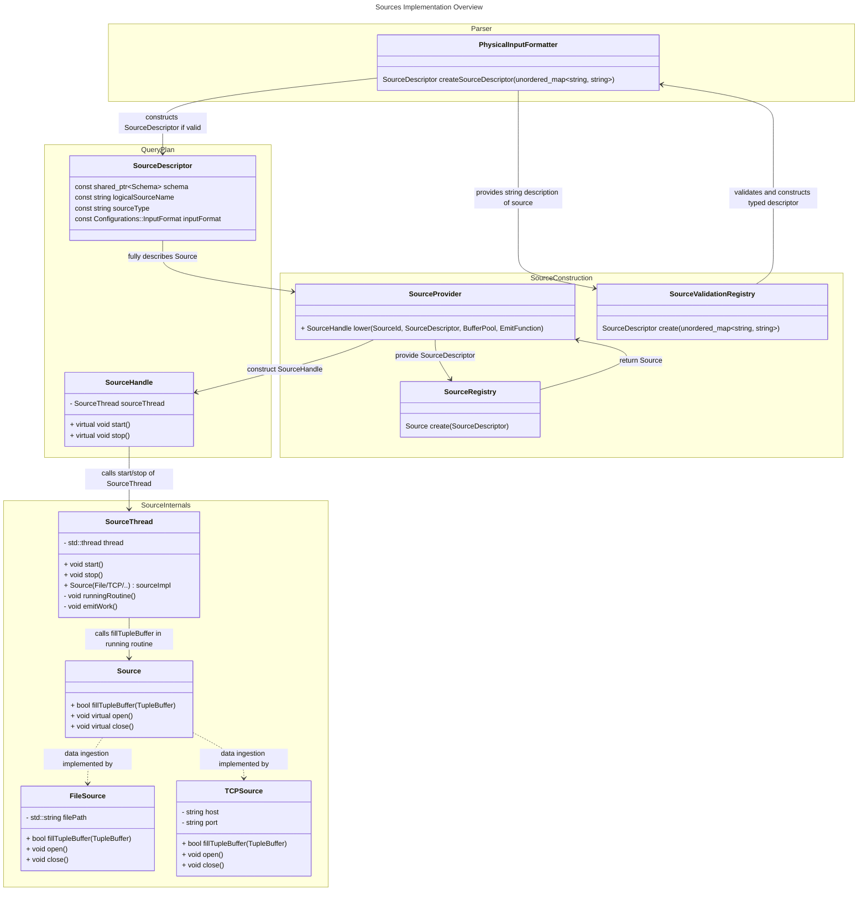

# Overview of nes-sources module 
We propose the following solution. Users describe sources by providing the type of the Source, e.g. File or TCP,
the schema and name of the logical source and the input format, e.g. CSV or JSON. During parsing, we create a validated and strongly types **SourceDescriptor**
from the description of the user and attach it to the query plan. During lowering, we give the *SourceDescriptor* to the **SourceProvider**, which constructs
the described **Source** using the **SourceRegistry** and, using the constructed Source, constructs and returns a **SourceHandle** which
becomes part of an executable query plan. The SourceHandel offers a very slim interface, `start()` and `stop()` and thereby hides all the
implementation details from users of sources. Internally, the SourceHandle constructs a **SourceThread** and delegates the start and stop
calls to the *SourceThread*. The SourceThread starts a thread, so one thread per source, which runs the `runningRoutine()`. In the running routine,
the SourceThread repeatedly calls the `fillTupleBuffer` function of the specific *Source* implementation, e.g., of the **TCPSource**.
If `fillTupleBuffer` succeeds, the *SourceThread* returns a TupleBuffer to the runtime via the *EmitFunction*, if not, it returns an
error using the *EmitFunction*.

