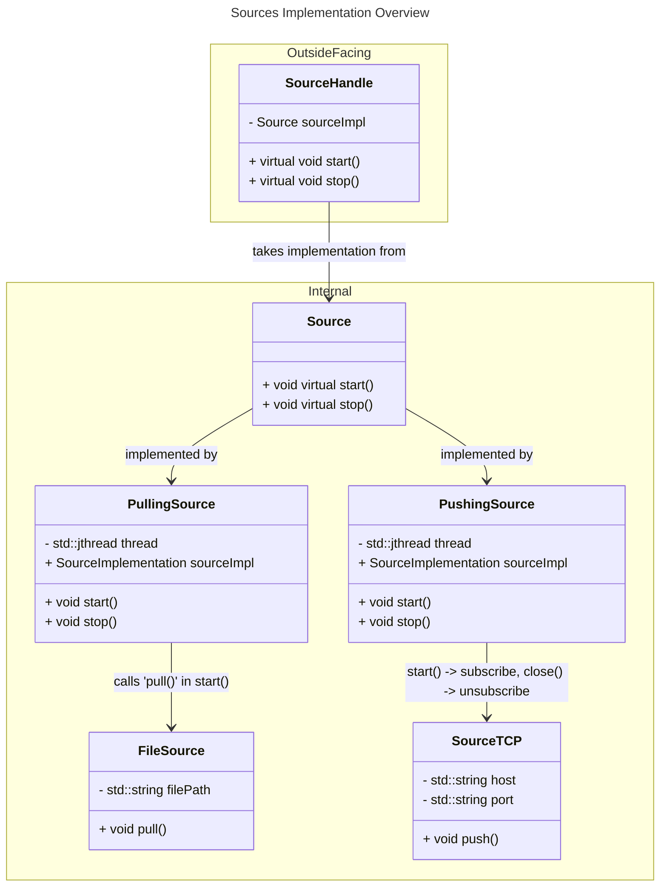

# Todo: remove in #75, when completing #69
# Description
This document accompanies the epic issue #69. Upon completing #69 in #75, which is a clean up task,
we convert this document to the final documentation of sources and sinks (after refactoring).

# Version 1

(G3): FileSource/SourceTCP should implement a common 'SourceInterface' to reside in the same registry
---
# Version 2

---
# Version 2.5

TODO #237: Still uses old threading logic.
---
# Version (Vision) 3

